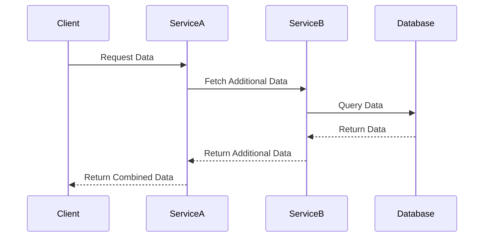

## 12.6 Service-Oriented Architecture (SOA)

In the ever-evolving landscape of software development, Service-Oriented Architecture (SOA) stands as a pivotal paradigm that promotes the design and implementation of software as a collection of interoperable services. This section delves into the core principles of SOA, its implementation in C#, and the standards that ensure interoperability and reusability.

### Understanding Service-Oriented Architecture (SOA)

Service-Oriented Architecture (SOA) is an architectural pattern in software design where services are provided to other components by application components, through a communication protocol over a network. The basic principles of SOA are independent of vendors, products, and technologies.

#### Key Concepts of SOA

- **Service**: A service is a discrete unit of functionality that can be accessed remotely and acted upon and updated independently, such as retrieving a credit card statement online.
- **Interoperability**: Services should be able to work across different platforms and languages.
- **Reusability**: Services should be designed to be reused in different contexts.
- **Loose Coupling**: Services maintain a relationship that minimizes dependencies and only requires that they maintain an awareness of each other.
- **Abstraction**: Services hide the logic they encapsulate from the outside world.

### Designing Services with Well-Defined Interfaces

In SOA, designing services with well-defined interfaces is crucial. These interfaces define how services communicate with each other and with clients. The interfaces should be designed to be platform-independent and should use standard protocols to ensure interoperability.

#### Steps to Design Well-Defined Interfaces

1. **Identify Service Boundaries**: Determine the functionality that should be exposed as a service.
2. **Define Service Contracts**: Specify the operations that the service will provide, the data types it will use, and the protocols it will support.
3. **Use Standard Protocols**: Implement interfaces using standard protocols like SOAP or REST to ensure compatibility across different platforms.
4. **Ensure Loose Coupling**: Design interfaces that minimize dependencies between services.

### Implementing SOA in C#

C# provides robust support for implementing SOA through technologies like Windows Communication Foundation (WCF). WCF is a framework for building service-oriented applications. With WCF, you can send data as asynchronous messages from one service endpoint to another.

#### Using WCF (Windows Communication Foundation)

WCF is a flexible platform for building service-oriented applications. It allows developers to build secure, reliable, and transacted services that can be composed into service-oriented applications.

##### Key Features of WCF

- **Interoperability**: WCF supports multiple protocols, including HTTP, TCP, and named pipes, making it highly interoperable.
- **Security**: WCF provides a comprehensive security model that includes authentication, authorization, confidentiality, and integrity.
- **Transaction Support**: WCF supports distributed transactions, allowing multiple operations to be treated as a single unit of work.

##### Implementing a Simple WCF Service

Let's walk through the implementation of a simple WCF service in C#.

```csharp
using System;
using System.ServiceModel;

// Define a service contract.
[ServiceContract]
public interface ICalculator
{
    [OperationContract]
    double Add(double a, double b);

    [OperationContract]
    double Subtract(double a, double b);
}

// Implement the ICalculator service contract in a service class.
public class CalculatorService : ICalculator
{
    public double Add(double a, double b)
    {
        return a + b;
    }

    public double Subtract(double a, double b)
    {
        return a - b;
    }
}

class Program
{
    static void Main(string[] args)
    {
        // Create a ServiceHost for the CalculatorService type.
        using (ServiceHost host = new ServiceHost(typeof(CalculatorService)))
        {
            // Open the ServiceHost to start listening for messages.
            host.Open();

            Console.WriteLine("The service is ready at {0}", host.BaseAddresses[0]);
            Console.WriteLine("Press <Enter> to stop the service.");
            Console.ReadLine();

            // Close the ServiceHost.
            host.Close();
        }
    }
}
```

In this example, we define a simple calculator service with two operations: `Add` and `Subtract`. The service is hosted using `ServiceHost`, which listens for incoming requests.

### Interoperability and Reusability

One of the main goals of SOA is to ensure that services can work across different platforms and can be reused in various applications. This is achieved through the use of standard protocols and data formats.

#### Standards Like SOAP and REST

- **SOAP (Simple Object Access Protocol)**: A protocol for exchanging structured information in web services. It uses XML for message format and relies on application layer protocols, most commonly HTTP or SMTP, for message negotiation and transmission.
- **REST (Representational State Transfer)**: An architectural style that uses HTTP requests to access and use data. REST is stateless, and it uses standard HTTP methods like GET, POST, PUT, and DELETE.

##### SOAP vs. REST

| Feature       | SOAP                                  | REST                                  |
|---------------|---------------------------------------|---------------------------------------|
| Protocol      | Protocol-based                        | Architectural style                   |
| Message Format| XML                                   | JSON, XML, HTML, plain text           |
| Statefulness  | Stateless or Stateful                 | Stateless                             |
| Security      | WS-Security                           | HTTPS, OAuth                          |
| Performance   | Slower due to XML parsing             | Faster due to JSON and HTTP caching   |

#### Ensuring Services Can Work Across Platforms

To ensure that services can work across platforms, it's essential to adhere to the following practices:

- **Use Platform-Independent Protocols**: Implement services using protocols like SOAP and REST that are supported by multiple platforms.
- **Adopt Standard Data Formats**: Use standard data formats like JSON and XML to ensure that data can be easily consumed by different systems.
- **Implement Versioning**: Design services with versioning in mind to ensure backward compatibility and smooth transitions between service updates.

### Try It Yourself

To deepen your understanding of SOA in C#, try modifying the WCF service example provided above:

- **Add New Operations**: Extend the `ICalculator` interface to include multiplication and division operations.
- **Implement RESTful Services**: Convert the WCF service to a RESTful service using ASP.NET Core.
- **Experiment with Security**: Implement security features in your WCF service, such as authentication and encryption.

### Visualizing SOA in C#

To better understand the architecture of SOA, let's visualize a simple SOA implementation using a Mermaid.js diagram.



**Diagram Description**: This sequence diagram illustrates a client making a request to `ServiceA`, which in turn communicates with `ServiceB` to fetch additional data from a database. The combined data is then returned to the client.

### Design Considerations

When implementing SOA, consider the following:

- **Scalability**: Design services to handle increased load by distributing requests across multiple instances.
- **Security**: Implement robust security measures to protect sensitive data and ensure secure communication.
- **Error Handling**: Design services to gracefully handle errors and provide meaningful error messages to clients.
- **Monitoring and Logging**: Implement monitoring and logging to track service performance and diagnose issues.

### Differences and Similarities with Other Patterns

SOA is often compared with Microservices Architecture. While both promote the use of services, they differ in scale and scope:

- **SOA**: Focuses on integrating large, enterprise-level applications with reusable services.
- **Microservices**: Emphasizes small, independently deployable services that focus on specific business capabilities.

### Knowledge Check

- **Question**: What are the key principles of SOA?
- **Question**: How does WCF support SOA in C#?
- **Question**: What are the differences between SOAP and REST?

### Embrace the Journey

Remember, mastering SOA is a journey. As you continue to explore and implement SOA in your projects, you'll gain a deeper understanding of its principles and benefits. Keep experimenting, stay curious, and enjoy the journey!

### References and Links

For further reading, consider the following resources:

- [Microsoft Docs on WCF](https://docs.microsoft.com/en-us/dotnet/framework/wcf/)
- [SOAP vs. REST](https://www.soapui.org/learn/api/soap-vs-rest-api/)

## Quiz Time!



### What is a key principle of SOA?

- [x] Loose Coupling
- [ ] Tight Coupling
- [ ] Monolithic Design
- [ ] Stateful Services

> **Explanation:** Loose coupling is a key principle of SOA, allowing services to interact with minimal dependencies.

### Which protocol is commonly used in SOA for message exchange?

- [x] SOAP
- [ ] FTP
- [ ] SMTP
- [ ] POP3

> **Explanation:** SOAP is a protocol used for exchanging structured information in web services.

### What is a benefit of using WCF in C#?

- [x] Interoperability
- [ ] Platform Dependency
- [ ] Lack of Security
- [ ] Monolithic Architecture

> **Explanation:** WCF provides interoperability by supporting multiple protocols and platforms.

### What is the main difference between SOAP and REST?

- [x] SOAP is protocol-based, REST is an architectural style
- [ ] SOAP uses JSON, REST uses XML
- [ ] SOAP is stateless, REST is stateful
- [ ] SOAP is faster than REST

> **Explanation:** SOAP is a protocol, while REST is an architectural style that uses standard HTTP methods.

### What is a common data format used in RESTful services?

- [x] JSON
- [ ] CSV
- [ ] Binary
- [ ] YAML

> **Explanation:** JSON is commonly used in RESTful services for data exchange.

### What is a key feature of WCF?

- [x] Security
- [ ] Lack of Protocol Support
- [ ] Incompatibility
- [ ] Monolithic Design

> **Explanation:** WCF provides a comprehensive security model for service-oriented applications.

### How can services ensure interoperability?

- [x] Use standard protocols like SOAP and REST
- [ ] Use proprietary protocols
- [ ] Avoid using protocols
- [ ] Use platform-specific protocols

> **Explanation:** Using standard protocols like SOAP and REST ensures interoperability across platforms.

### What is a characteristic of REST?

- [x] Stateless
- [ ] Stateful
- [ ] Protocol-based
- [ ] XML-only

> **Explanation:** REST is stateless, meaning each request from a client contains all the information needed to process the request.

### What is a benefit of designing services with well-defined interfaces?

- [x] Reusability
- [ ] Increased Complexity
- [ ] Tight Coupling
- [ ] Platform Dependency

> **Explanation:** Well-defined interfaces promote reusability by allowing services to be used in different contexts.

### True or False: SOA and Microservices are the same.

- [ ] True
- [x] False

> **Explanation:** SOA and Microservices are different; SOA focuses on integrating large applications, while Microservices emphasize small, independently deployable services.


