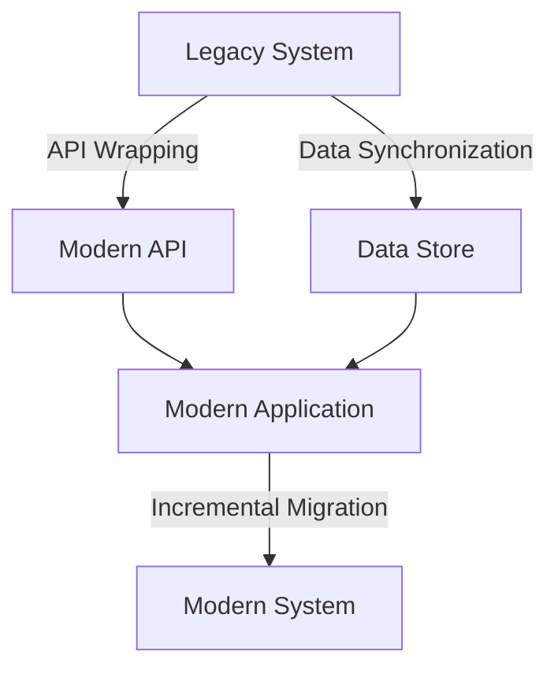

## 12.7 Legacy System Integration

In the ever-evolving landscape of software development, integrating modern applications with legacy systems remains a critical challenge for enterprise architects and expert software engineers. Legacy systems, often built on outdated technologies, continue to play a vital role in many organizations due to their stability, reliability, and the significant investment they represent. However, these systems can become bottlenecks, hindering innovation and agility. This section explores strategies for integrating modern applications with legacy systems, focusing on wrapping legacy code with modern interfaces, data synchronization techniques, and incremental migration paths.

### Understanding Legacy Systems

Before diving into integration strategies, it's essential to understand what constitutes a legacy system. Legacy systems are often characterized by:

- **Outdated Technology**: Built on older programming languages, frameworks, or hardware.
- **Lack of Documentation**: Often poorly documented, making it difficult to understand their inner workings.
- **Critical Business Functionality**: Despite their age, they often perform essential business functions.
- **Limited Scalability**: Struggle to meet modern scalability and performance demands.
- **High Maintenance Costs**: Require significant resources to maintain and support.

### Strategies for Integrating with Legacy Systems

Integrating modern applications with legacy systems requires a careful approach to ensure business continuity while enabling modernization. Here are some strategies to consider:

#### Wrapping Legacy Code with Modern Interfaces

One of the most effective ways to integrate legacy systems is by wrapping them with modern interfaces. This approach involves creating a layer that abstracts the legacy system's complexity and exposes its functionality through modern APIs or services.

- **API Wrapping**: Develop RESTful or SOAP APIs that interact with the legacy system, allowing new applications to communicate with it using standard protocols.
- **Service-Oriented Architecture (SOA)**: Implement a service layer that encapsulates legacy functionality, enabling it to be consumed as services in a broader SOA ecosystem.
- **Microservices**: Break down legacy system functionalities into microservices, providing a more modular and scalable integration approach.

##### Code Example: Wrapping a Legacy System with a RESTful API

```csharp
using System;
using System.Web.Http;

namespace LegacyIntegration
{
    public class LegacyService
    {
        public string GetData()
        {
            // Simulate fetching data from a legacy system
            return "Legacy Data";
        }
    }

    public class LegacyController : ApiController
    {
        private readonly LegacyService _legacyService;

        public LegacyController()
        {
            _legacyService = new LegacyService();
        }

        [HttpGet]
        [Route("api/legacy/data")]
        public IHttpActionResult GetLegacyData()
        {
            var data = _legacyService.GetData();
            return Ok(data);
        }
    }
}
```

In this example, we wrap a legacy system's functionality with a RESTful API, allowing modern applications to access legacy data through HTTP requests.

#### Data Synchronization Techniques

Data synchronization is crucial when integrating legacy systems with modern applications. It ensures that data remains consistent across systems, enabling seamless operation.

- **Batch Processing**: Periodically transfer data between systems in batches. This approach is suitable for non-time-sensitive data.
- **Real-Time Synchronization**: Use message queues or event-driven architectures to synchronize data in real-time, ensuring immediate consistency.
- **Data Transformation**: Implement data transformation layers to convert legacy data formats into modern formats, facilitating integration.

##### Code Example: Real-Time Data Synchronization with Message Queues

```csharp
using System;
using System.Text;
using RabbitMQ.Client;
using RabbitMQ.Client.Events;

namespace LegacyIntegration
{
    public class DataSynchronizer
    {
        private readonly IConnection _connection;
        private readonly IModel _channel;

        public DataSynchronizer()
        {
            var factory = new ConnectionFactory() { HostName = "localhost" };
            _connection = factory.CreateConnection();
            _channel = _connection.CreateModel();
            _channel.QueueDeclare(queue: "data_sync", durable: false, exclusive: false, autoDelete: false, arguments: null);
        }

        public void SynchronizeData(string data)
        {
            var body = Encoding.UTF8.GetBytes(data);
            _channel.BasicPublish(exchange: "", routingKey: "data_sync", basicProperties: null, body: body);
            Console.WriteLine(" [x] Sent {0}", data);
        }

        public void StartListening()
        {
            var consumer = new EventingBasicConsumer(_channel);
            consumer.Received += (model, ea) =>
            {
                var body = ea.Body.ToArray();
                var message = Encoding.UTF8.GetString(body);
                Console.WriteLine(" [x] Received {0}", message);
                // Process the synchronized data
            };
            _channel.BasicConsume(queue: "data_sync", autoAck: true, consumer: consumer);
        }
    }
}
```

In this example, we use RabbitMQ to synchronize data between a legacy system and a modern application in real-time.

#### Incremental Migration Paths

Incremental migration involves gradually transitioning from a legacy system to a modern architecture. This approach minimizes risk and allows for continuous improvement.

- **Strangler Fig Pattern**: Gradually replace legacy components with new ones, eventually phasing out the legacy system.
- **Parallel Running**: Run the legacy and new systems in parallel, allowing for testing and validation before fully transitioning.
- **Feature Toggle**: Use feature toggles to switch between legacy and new functionalities, enabling controlled rollout.

##### Code Example: Implementing the Strangler Fig Pattern

```csharp
using System;

namespace LegacyIntegration
{
    public class LegacyComponent
    {
        public void Execute()
        {
            Console.WriteLine("Executing legacy component...");
        }
    }

    public class ModernComponent
    {
        public void Execute()
        {
            Console.WriteLine("Executing modern component...");
        }
    }

    public class Application
    {
        private readonly LegacyComponent _legacyComponent;
        private readonly ModernComponent _modernComponent;
        private readonly bool _useModernComponent;

        public Application(bool useModernComponent)
        {
            _legacyComponent = new LegacyComponent();
            _modernComponent = new ModernComponent();
            _useModernComponent = useModernComponent;
        }

        public void Run()
        {
            if (_useModernComponent)
            {
                _modernComponent.Execute();
            }
            else
            {
                _legacyComponent.Execute();
            }
        }
    }
}
```

In this example, we demonstrate the Strangler Fig Pattern by conditionally executing either the legacy or modern component based on a feature toggle.

### Use Cases and Examples

#### Modernizing Without Rewriting

Many organizations face the challenge of modernizing legacy systems without a complete rewrite. This approach involves enhancing existing systems with modern capabilities while preserving their core functionality.

- **User Interface Modernization**: Update the user interface to improve user experience without altering the underlying system.
- **Integration with Modern Tools**: Connect legacy systems with modern analytics, reporting, or monitoring tools to enhance their capabilities.

#### Incremental Migration Paths

Incremental migration paths offer a pragmatic approach to transitioning from legacy systems to modern architectures. By gradually replacing legacy components, organizations can minimize disruption and ensure a smooth transition.

- **Phased Rollout**: Implement new features or components in phases, allowing for testing and validation at each stage.
- **Coexistence Strategy**: Allow legacy and modern systems to coexist, enabling a gradual shift without disrupting business operations.

### Visualizing Legacy System Integration

To better understand the integration process, let's visualize the architecture of a legacy system wrapped with modern interfaces and synchronized with a modern application.



**Diagram Description**: This diagram illustrates a legacy system wrapped with a modern API, enabling communication with a modern application. Data synchronization ensures consistency between the legacy system and the modern application. Incremental migration gradually transitions functionalities to a modern system.

### Design Considerations

When integrating legacy systems, consider the following design considerations:

- **Performance**: Ensure that the integration layer does not introduce significant latency or performance bottlenecks.
- **Security**: Implement robust security measures to protect sensitive data and prevent unauthorized access.
- **Scalability**: Design the integration architecture to scale with increasing data volumes and user demands.
- **Maintainability**: Ensure that the integration solution is maintainable and can adapt to future changes in both legacy and modern systems.

### Differences and Similarities

Legacy system integration often involves patterns that are commonly confused with one another. It's essential to understand the differences and similarities between these patterns:

- **Adapter vs. Wrapper**: While both patterns involve creating an interface for existing code, an adapter focuses on compatibility, whereas a wrapper provides a new interface for existing functionality.
- **Data Synchronization vs. Data Transformation**: Synchronization ensures data consistency across systems, while transformation converts data formats for compatibility.

### Try It Yourself

To deepen your understanding of legacy system integration, try modifying the code examples provided:

- **Experiment with Different APIs**: Wrap additional legacy functionalities with RESTful or SOAP APIs.
- **Implement Real-Time Synchronization**: Use different message queues or event-driven architectures for real-time data synchronization.
- **Explore Incremental Migration**: Implement feature toggles to switch between legacy and modern components.

### Knowledge Check

- **What are the key characteristics of a legacy system?**
- **How can wrapping legacy code with modern interfaces facilitate integration?**
- **What are the benefits of real-time data synchronization?**
- **How does the Strangler Fig Pattern support incremental migration?**

### Embrace the Journey

Remember, integrating legacy systems is a journey that requires patience, creativity, and a strategic approach. As you progress, you'll unlock new opportunities for modernization and innovation. Keep experimenting, stay curious, and enjoy the journey!

### References and Links

- [Microsoft Docs: Legacy System Integration](https://docs.microsoft.com/en-us/azure/architecture/patterns/legacy-integration)
- [Martin Fowler: Strangler Fig Pattern](https://martinfowler.com/bliki/StranglerFigApplication.html)
- [RabbitMQ: Messaging for Applications](https://www.rabbitmq.com/)

## Quiz Time!



### What is a key characteristic of a legacy system?

- [x] Outdated technology
- [ ] Modern architecture
- [ ] High scalability
- [ ] Low maintenance costs

> **Explanation:** Legacy systems are often characterized by outdated technology, which can hinder modernization efforts.

### Which pattern involves creating a new interface for existing functionality?

- [x] Wrapper
- [ ] Adapter
- [ ] Observer
- [ ] Singleton

> **Explanation:** A wrapper provides a new interface for existing functionality, facilitating integration with modern systems.

### What is the primary benefit of real-time data synchronization?

- [x] Immediate data consistency
- [ ] Reduced latency
- [ ] Simplified architecture
- [ ] Lower costs

> **Explanation:** Real-time data synchronization ensures immediate data consistency across systems, enabling seamless operation.

### How does the Strangler Fig Pattern support incremental migration?

- [x] Gradually replaces legacy components
- [ ] Completely rewrites the system
- [ ] Runs legacy and modern systems in parallel
- [ ] Uses feature toggles

> **Explanation:** The Strangler Fig Pattern gradually replaces legacy components with modern ones, minimizing disruption.

### What is a common challenge when integrating legacy systems?

- [x] Lack of documentation
- [ ] High scalability
- [ ] Modern architecture
- [ ] Low maintenance costs

> **Explanation:** Legacy systems often lack documentation, making it challenging to understand and integrate them with modern applications.

### Which technique is suitable for non-time-sensitive data synchronization?

- [x] Batch processing
- [ ] Real-time synchronization
- [ ] Data transformation
- [ ] Microservices

> **Explanation:** Batch processing is suitable for non-time-sensitive data synchronization, as it transfers data periodically.

### What is the role of a service layer in legacy system integration?

- [x] Encapsulates legacy functionality
- [ ] Provides real-time data synchronization
- [ ] Implements feature toggles
- [ ] Rewrites the legacy system

> **Explanation:** A service layer encapsulates legacy functionality, enabling it to be consumed as services in a broader ecosystem.

### What is a benefit of using feature toggles in incremental migration?

- [x] Controlled rollout of new functionalities
- [ ] Immediate data consistency
- [ ] Simplified architecture
- [ ] Lower costs

> **Explanation:** Feature toggles allow for controlled rollout of new functionalities, enabling a smooth transition from legacy to modern systems.

### What is a common pitfall when integrating legacy systems?

- [x] Introducing performance bottlenecks
- [ ] High scalability
- [ ] Modern architecture
- [ ] Low maintenance costs

> **Explanation:** Integration layers can introduce performance bottlenecks if not designed carefully, affecting system performance.

### True or False: Legacy systems are always easy to integrate with modern applications.

- [ ] True
- [x] False

> **Explanation:** Legacy systems can be challenging to integrate with modern applications due to outdated technology, lack of documentation, and other factors.


