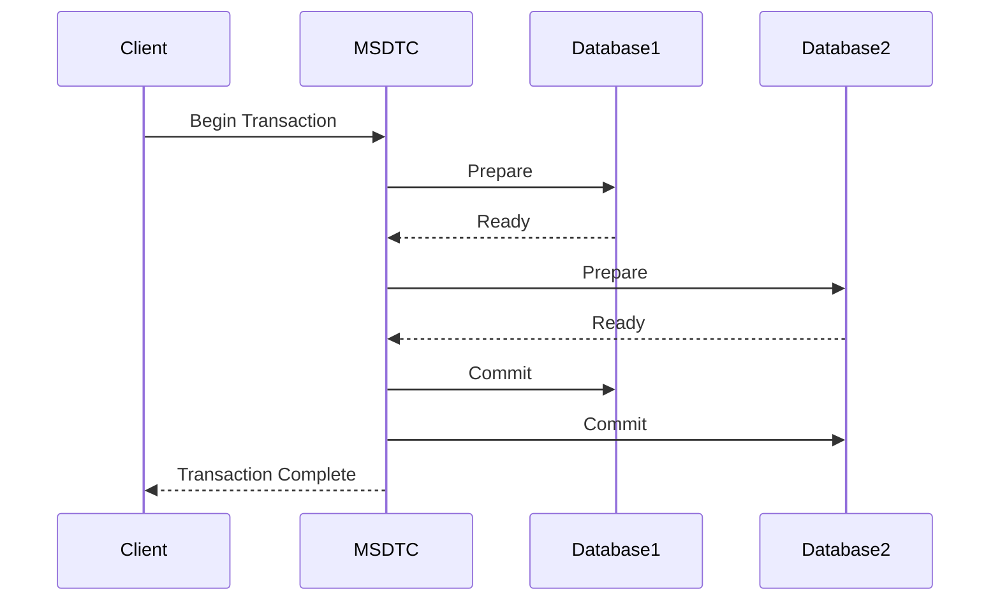

## 12.8 Transaction Management

In the realm of enterprise software development, transaction management plays a pivotal role in ensuring data integrity and consistency across multiple systems. As software engineers and architects, understanding the intricacies of transaction management in C# is crucial for building robust and reliable applications. This section delves into the concepts of distributed transactions, compensation, and recovery strategies, providing you with the knowledge to manage transactions effectively in complex systems.

### Introduction to Transaction Management

Transaction management is the process of ensuring that a series of operations on a database or across multiple systems are completed successfully and consistently. If any operation within a transaction fails, the entire transaction is rolled back to maintain data integrity. This is often referred to as the ACID properties of transactions: Atomicity, Consistency, Isolation, and Durability.

#### Key Concepts

- **Atomicity**: Ensures that all operations within a transaction are completed; if not, the transaction is aborted.
- **Consistency**: Guarantees that a transaction transforms the system from one valid state to another.
- **Isolation**: Ensures that concurrent transactions do not interfere with each other.
- **Durability**: Once a transaction is committed, it remains so, even in the event of a system failure.

### Distributed Transactions

Distributed transactions involve coordinating transactions across multiple systems or databases. This is particularly important in microservices architectures, where different services may interact with separate databases.

#### Coordinating Transactions Over Multiple Systems

Coordinating transactions over multiple systems requires a mechanism to ensure that all involved systems either commit or roll back their changes. This is typically achieved through a two-phase commit protocol:

1. **Prepare Phase**: Each system involved in the transaction prepares to commit and notifies the transaction coordinator.
2. **Commit Phase**: Once all systems are ready, the transaction coordinator instructs them to commit the transaction.

#### Using MSDTC (Microsoft Distributed Transaction Coordinator)

MSDTC is a component of Windows that provides transaction management for distributed systems. It allows applications to perform distributed transactions across multiple resource managers, such as databases and message queues.

**Example: Using MSDTC in C#**

```csharp
using System;
using System.Transactions;
using System.Data.SqlClient;

class DistributedTransactionExample
{
    static void Main()
    {
        string connectionString1 = "Data Source=Server1;Initial Catalog=Database1;Integrated Security=True;";
        string connectionString2 = "Data Source=Server2;Initial Catalog=Database2;Integrated Security=True;";

        using (TransactionScope scope = new TransactionScope())
        {
            using (SqlConnection connection1 = new SqlConnection(connectionString1))
            {
                connection1.Open();
                SqlCommand command1 = new SqlCommand("INSERT INTO Table1 (Column1) VALUES ('Value1')", connection1);
                command1.ExecuteNonQuery();
            }

            using (SqlConnection connection2 = new SqlConnection(connectionString2))
            {
                connection2.Open();
                SqlCommand command2 = new SqlCommand("INSERT INTO Table2 (Column2) VALUES ('Value2')", connection2);
                command2.ExecuteNonQuery();
            }

            // Complete the transaction
            scope.Complete();
        }
    }
}
```

In this example, we use the `TransactionScope` class to manage a distributed transaction across two databases. MSDTC ensures that both inserts are either committed or rolled back together.

### Compensation and Recovery Strategies

In distributed systems, it is not always feasible to use traditional transactions due to their blocking nature and performance overhead. Instead, we may need to implement compensation and recovery strategies to maintain data integrity.

#### Implementing Compensating Actions

Compensating actions are operations that undo the effects of a previously completed operation. They are used when a transaction cannot be rolled back in the traditional sense.

**Example: Compensating Actions in a Booking System**

Consider a booking system where a flight booking and a hotel reservation are part of a single business transaction. If the hotel reservation fails after the flight booking is confirmed, a compensating action would be to cancel the flight booking.

```csharp
class BookingSystem
{
    public void BookTrip()
    {
        bool flightBooked = false;
        bool hotelBooked = false;

        try
        {
            flightBooked = BookFlight();
            hotelBooked = BookHotel();

            if (!hotelBooked)
            {
                throw new Exception("Hotel booking failed.");
            }
        }
        catch (Exception ex)
        {
            if (flightBooked)
            {
                CancelFlight();
            }
            Console.WriteLine($"Transaction failed: {ex.Message}");
        }
    }

    private bool BookFlight()
    {
        // Logic to book flight
        return true;
    }

    private bool BookHotel()
    {
        // Logic to book hotel
        return false; // Simulate failure
    }

    private void CancelFlight()
    {
        // Logic to cancel flight
        Console.WriteLine("Flight booking canceled.");
    }
}
```

In this example, if the hotel booking fails, the flight booking is canceled as a compensating action.

#### Ensuring Data Integrity

Ensuring data integrity in distributed systems involves designing systems that can gracefully handle failures and maintain consistency. This often requires a combination of techniques, including:

- **Idempotency**: Ensuring that operations can be safely retried without unintended side effects.
- **Eventual Consistency**: Allowing systems to become consistent over time, rather than immediately.
- **Saga Pattern**: A design pattern that manages long-lived transactions by breaking them into a series of smaller, compensatable transactions.

### Visualizing Transaction Management

To better understand transaction management, let's visualize the process using a sequence diagram. This diagram illustrates the flow of a distributed transaction using MSDTC.



In this sequence diagram, the client initiates a transaction, and MSDTC coordinates the prepare and commit phases across two databases.

### Design Considerations

When implementing transaction management, consider the following:

- **Performance**: Distributed transactions can introduce latency and reduce throughput. Use them judiciously.
- **Scalability**: Traditional transactions may not scale well in distributed systems. Consider alternative patterns like the Saga pattern.
- **Reliability**: Ensure that compensating actions are reliable and can handle failures gracefully.

### Differences and Similarities

Transaction management can be confused with other patterns and concepts. Here are some distinctions:

- **Transactions vs. Compensation**: Transactions ensure atomicity, while compensation provides a way to handle failures when atomicity is not feasible.
- **Distributed Transactions vs. Sagas**: Distributed transactions use a coordinator to manage consistency, while Sagas rely on compensating actions to achieve eventual consistency.

### Try It Yourself

To deepen your understanding, try modifying the code examples provided:

- **Experiment with MSDTC**: Modify the distributed transaction example to include additional operations or databases.
- **Implement Compensating Actions**: Create a new scenario where compensating actions are necessary, such as a multi-step order processing system.

### References and Links

For further reading on transaction management, consider the following resources:

- [Microsoft Docs: TransactionScope Class](https://docs.microsoft.com/en-us/dotnet/api/system.transactions.transactionscope)
- [MSDTC Overview](https://docs.microsoft.com/en-us/windows/win32/cossdk/transaction-management)
- [Saga Pattern](https://microservices.io/patterns/data/saga.html)

### Knowledge Check

To reinforce your learning, consider these questions:

- What are the ACID properties of transactions?
- How does MSDTC coordinate distributed transactions?
- What is the purpose of compensating actions?
- How can you ensure data integrity in distributed systems?

### Embrace the Journey

Remember, mastering transaction management is a journey. As you progress, you'll encounter more complex scenarios and systems. Keep experimenting, stay curious, and enjoy the journey!

## Quiz Time!



### What are the ACID properties of transactions?

- [x] Atomicity, Consistency, Isolation, Durability
- [ ] Availability, Consistency, Isolation, Durability
- [ ] Atomicity, Consistency, Integration, Durability
- [ ] Atomicity, Consistency, Isolation, Distribution

> **Explanation:** The ACID properties are Atomicity, Consistency, Isolation, and Durability, which ensure reliable transaction processing.

### What is the role of MSDTC in distributed transactions?

- [x] It coordinates transactions across multiple systems.
- [ ] It manages local transactions within a single database.
- [ ] It provides a user interface for transaction management.
- [ ] It is a database management system.

> **Explanation:** MSDTC (Microsoft Distributed Transaction Coordinator) is responsible for coordinating distributed transactions across multiple systems.

### How do compensating actions help in transaction management?

- [x] They undo the effects of a previously completed operation.
- [ ] They enhance the performance of transactions.
- [ ] They provide a user interface for transaction management.
- [ ] They ensure immediate consistency across systems.

> **Explanation:** Compensating actions are used to undo the effects of operations when a transaction cannot be rolled back traditionally.

### What is the two-phase commit protocol?

- [x] A protocol to ensure all systems commit or roll back changes in a distributed transaction.
- [ ] A method for optimizing transaction performance.
- [ ] A user interface for managing transactions.
- [ ] A protocol for managing local transactions.

> **Explanation:** The two-phase commit protocol ensures that all systems involved in a distributed transaction either commit or roll back their changes.

### What is the Saga pattern?

- [x] A design pattern that manages long-lived transactions with compensating actions.
- [ ] A method for optimizing transaction performance.
- [ ] A protocol for managing local transactions.
- [ ] A user interface for transaction management.

> **Explanation:** The Saga pattern manages long-lived transactions by breaking them into smaller, compensatable transactions.

### What is the main challenge of using distributed transactions?

- [x] They can introduce latency and reduce throughput.
- [ ] They provide immediate consistency across systems.
- [ ] They are easy to implement in all systems.
- [ ] They enhance the performance of transactions.

> **Explanation:** Distributed transactions can introduce latency and reduce throughput, making them challenging to use in high-performance systems.

### What is eventual consistency?

- [x] Allowing systems to become consistent over time.
- [ ] Ensuring immediate consistency across systems.
- [ ] A method for optimizing transaction performance.
- [ ] A protocol for managing local transactions.

> **Explanation:** Eventual consistency allows systems to become consistent over time, rather than immediately.

### What is idempotency in transaction management?

- [x] Ensuring operations can be safely retried without unintended side effects.
- [ ] A method for optimizing transaction performance.
- [ ] A protocol for managing local transactions.
- [ ] Ensuring immediate consistency across systems.

> **Explanation:** Idempotency ensures that operations can be safely retried without unintended side effects, which is crucial in distributed systems.

### How can you ensure data integrity in distributed systems?

- [x] By designing systems that handle failures gracefully and maintain consistency.
- [ ] By using only local transactions.
- [ ] By providing a user interface for transaction management.
- [ ] By ensuring immediate consistency across systems.

> **Explanation:** Ensuring data integrity in distributed systems involves designing systems that can gracefully handle failures and maintain consistency.

### True or False: Compensating actions are always necessary in transaction management.

- [ ] True
- [x] False

> **Explanation:** Compensating actions are used when traditional rollback is not feasible, but they are not always necessary.


