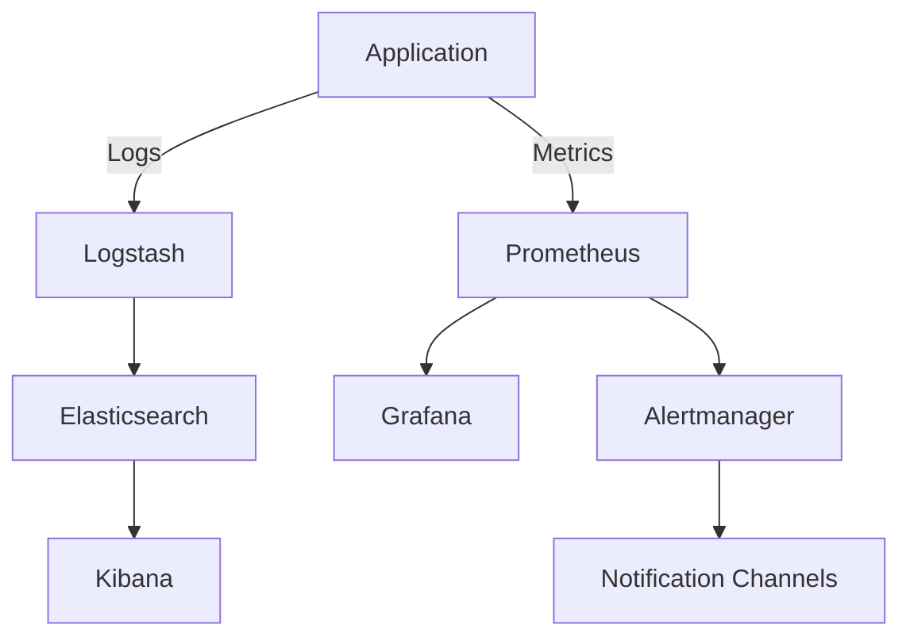

## 12.9 Logging and Monitoring

In the realm of enterprise systems, logging and monitoring are indispensable components that ensure the smooth operation and maintenance of applications. They provide insights into system behavior, help diagnose issues, and enable proactive management of resources. In this section, we will delve into the intricacies of centralized logging and monitoring, focusing on best practices and tools that can be leveraged to enhance system reliability and performance.

### Introduction to Logging and Monitoring

Logging and monitoring are often discussed together, but they serve distinct purposes:

- **Logging** involves recording information about the system's operation, such as errors, warnings, and informational messages. Logs are crucial for debugging, auditing, and understanding system behavior.
- **Monitoring** involves observing the system's performance and health in real-time. It includes tracking metrics, setting up alerts, and visualizing data to ensure the system operates within expected parameters.

Together, logging and monitoring form the backbone of observability in enterprise systems, allowing developers and operators to gain insights into application performance and user behavior.

### Implementing Centralized Logging

Centralized logging is the practice of aggregating logs from multiple sources into a single, unified system. This approach simplifies log management, enhances searchability, and provides a comprehensive view of the system's operation.

#### Benefits of Centralized Logging

1. **Unified View**: Centralized logging provides a single pane of glass for viewing logs from different components, making it easier to correlate events across the system.
2. **Improved Searchability**: With all logs in one place, searching and filtering become more efficient, enabling faster troubleshooting.
3. **Enhanced Security**: Centralized logging can improve security by ensuring that logs are stored in a secure, tamper-proof location.
4. **Scalability**: As systems grow, centralized logging can scale to handle increased log volume without significant performance degradation.

#### Tools for Centralized Logging

One of the most popular tools for centralized logging is the **ELK Stack**, which consists of Elasticsearch, Logstash, and Kibana.

- **Elasticsearch**: A powerful search and analytics engine that stores and indexes logs.
- **Logstash**: A data processing pipeline that ingests logs from various sources, transforms them, and sends them to Elasticsearch.
- **Kibana**: A visualization tool that provides dashboards and reports based on the data stored in Elasticsearch.

##### Example: Setting Up ELK Stack

To set up an ELK stack, follow these steps:

1. **Install Elasticsearch**: Download and install Elasticsearch on your server. Configure it to start automatically and listen on the appropriate ports.

2. **Install Logstash**: Download and install Logstash. Configure it to read logs from your application and send them to Elasticsearch.

   ```bash
   input {
     file {
       path => "/var/log/myapp/*.log"
       start_position => "beginning"
     }
   }
   output {
     elasticsearch {
       hosts => ["localhost:9200"]
     }
   }
   ```

3. **Install Kibana**: Download and install Kibana. Configure it to connect to your Elasticsearch instance and start the service.

4. **Visualize Logs**: Use Kibana to create dashboards and visualize your logs.

#### Structured Logging Practices

Structured logging involves formatting log messages in a consistent, machine-readable format, such as JSON. This practice enhances log analysis and enables more sophisticated querying.

##### Benefits of Structured Logging

- **Consistency**: Structured logs have a consistent format, making them easier to parse and analyze.
- **Rich Context**: Structured logs can include additional context, such as user IDs or transaction IDs, which aids in troubleshooting.
- **Enhanced Automation**: Tools can automatically process structured logs to generate alerts or reports.

##### Example: Implementing Structured Logging in C#

In C#, you can implement structured logging using libraries like Serilog or NLog.

```csharp
using Serilog;

class Program
{
    static void Main(string[] args)
    {
        Log.Logger = new LoggerConfiguration()
            .WriteTo.Console()
            .WriteTo.File("logs/myapp.txt", rollingInterval: RollingInterval.Day)
            .CreateLogger();

        Log.Information("Starting up");

        try
        {
            // Application code here
        }
        catch (Exception ex)
        {
            Log.Error(ex, "An error occurred");
        }
        finally
        {
            Log.CloseAndFlush();
        }
    }
}
```

### Monitoring Tools

Monitoring tools are essential for maintaining the health and performance of enterprise systems. They provide real-time insights into system metrics and enable proactive management.

#### Using Application Insights

**Azure Application Insights** is a powerful monitoring tool that provides deep insights into application performance and user behavior. It integrates seamlessly with .NET applications and offers features such as:

- **Automatic Instrumentation**: Automatically collects telemetry data from your application.
- **Custom Metrics**: Allows you to define and track custom metrics specific to your application.
- **Alerts and Dashboards**: Provides customizable alerts and dashboards to monitor application health.

##### Example: Integrating Application Insights with a .NET Application

To integrate Application Insights with a .NET application, follow these steps:

1. **Install the SDK**: Add the Application Insights SDK to your project via NuGet.

   ```bash
   dotnet add package Microsoft.ApplicationInsights.AspNetCore
   ```

2. **Configure Telemetry**: In your `Startup.cs`, configure Application Insights telemetry.

   ```csharp
   public void ConfigureServices(IServiceCollection services)
   {
       services.AddApplicationInsightsTelemetry(Configuration["ApplicationInsights:InstrumentationKey"]);
   }
   ```

3. **Monitor Performance**: Use the Azure portal to view telemetry data, set up alerts, and create dashboards.

#### Using Prometheus

**Prometheus** is an open-source monitoring and alerting toolkit that is widely used for monitoring microservices and cloud-native applications. It features:

- **Time-Series Database**: Stores metrics as time-series data, allowing for efficient querying and analysis.
- **Alerting**: Provides a flexible alerting system that can trigger alerts based on metric thresholds.
- **Visualization**: Integrates with Grafana for creating rich, interactive dashboards.

##### Example: Setting Up Prometheus for Monitoring

To set up Prometheus, follow these steps:

1. **Install Prometheus**: Download and install Prometheus on your server.

2. **Configure Targets**: Define the targets (applications) you want to monitor in the `prometheus.yml` configuration file.

   ```yaml
   scrape_configs:
     - job_name: 'myapp'
       static_configs:
         - targets: ['localhost:9090']
   ```

3. **Visualize Metrics**: Use Grafana to create dashboards and visualize metrics collected by Prometheus.

### Setting Up Alerts and Dashboards

Alerts and dashboards are critical components of a monitoring strategy. They provide real-time notifications of issues and offer a visual representation of system performance.

#### Setting Up Alerts

Alerts notify you of potential issues in your system, allowing you to take corrective action before they impact users. When setting up alerts, consider the following:

- **Thresholds**: Define thresholds for critical metrics that, when exceeded, trigger alerts.
- **Channels**: Configure alert channels (e.g., email, SMS, Slack) to ensure timely notifications.
- **Escalation Policies**: Establish escalation policies to ensure alerts are addressed promptly.

#### Creating Dashboards

Dashboards provide a visual representation of system metrics, making it easier to monitor performance and identify trends. When creating dashboards, consider the following:

- **Key Metrics**: Identify the key metrics that are most important for your application.
- **Visualization Types**: Use appropriate visualization types (e.g., line charts, bar charts) to represent data effectively.
- **Customization**: Customize dashboards to meet the specific needs of different stakeholders.

### Visualizing Logging and Monitoring Architecture

To better understand how logging and monitoring fit into an enterprise system, let's visualize the architecture using a Mermaid.js diagram.



**Diagram Description**: This diagram illustrates a typical logging and monitoring architecture. The application generates logs and metrics, which are processed by Logstash and Prometheus, respectively. Logs are stored in Elasticsearch and visualized using Kibana, while metrics are visualized using Grafana. Alerts are managed by Alertmanager and sent to notification channels.

### Knowledge Check

Before we conclude, let's reinforce our understanding with a few questions:

1. What are the key differences between logging and monitoring?
2. How does centralized logging improve security?
3. What are the benefits of structured logging?
4. How can Application Insights enhance application performance monitoring?
5. What role does Prometheus play in monitoring microservices?

### Conclusion

Logging and monitoring are critical components of enterprise systems, providing the insights needed to maintain performance and reliability. By implementing centralized logging, adopting structured logging practices, and leveraging powerful monitoring tools like Application Insights and Prometheus, organizations can gain a comprehensive view of their systems and proactively address issues.

Remember, this is just the beginning. As you progress, you'll build more complex logging and monitoring solutions tailored to your specific needs. Keep experimenting, stay curious, and enjoy the journey!

## Quiz Time!



### What is the primary purpose of logging in enterprise systems?

- [x] To record information about the system's operation
- [ ] To visualize system performance
- [ ] To send alerts to administrators
- [ ] To manage user authentication

> **Explanation:** Logging is primarily used to record information about the system's operation, such as errors, warnings, and informational messages.

### Which tool is part of the ELK stack for visualizing logs?

- [ ] Logstash
- [ ] Elasticsearch
- [x] Kibana
- [ ] Prometheus

> **Explanation:** Kibana is the visualization tool in the ELK stack, used to create dashboards and reports based on data stored in Elasticsearch.

### What is a benefit of structured logging?

- [x] Consistent format for easier parsing
- [ ] Reduced storage requirements
- [ ] Faster log generation
- [ ] Automatic error correction

> **Explanation:** Structured logging provides a consistent format, making logs easier to parse and analyze.

### Which monitoring tool is integrated with Azure for .NET applications?

- [ ] Prometheus
- [x] Application Insights
- [ ] Grafana
- [ ] Logstash

> **Explanation:** Application Insights is integrated with Azure and provides deep insights into .NET application performance and user behavior.

### What is the role of Prometheus in monitoring?

- [ ] To store logs in a centralized location
- [x] To collect and store metrics as time-series data
- [ ] To visualize logs in dashboards
- [ ] To manage user authentication

> **Explanation:** Prometheus collects and stores metrics as time-series data, allowing for efficient querying and analysis.

### What is a key feature of Application Insights?

- [x] Automatic instrumentation
- [ ] Log aggregation
- [ ] Time-series database
- [ ] Alertmanager integration

> **Explanation:** Application Insights provides automatic instrumentation, collecting telemetry data from applications without requiring manual configuration.

### What is the purpose of setting up alerts in monitoring?

- [ ] To visualize system performance
- [x] To notify administrators of potential issues
- [ ] To reduce system load
- [ ] To enhance user authentication

> **Explanation:** Alerts notify administrators of potential issues, allowing them to take corrective action before they impact users.

### Which tool is used to create dashboards for visualizing metrics collected by Prometheus?

- [ ] Kibana
- [ ] Logstash
- [x] Grafana
- [ ] Elasticsearch

> **Explanation:** Grafana is used to create dashboards for visualizing metrics collected by Prometheus.

### What is a benefit of centralized logging?

- [x] Unified view of logs from different components
- [ ] Reduced log generation time
- [ ] Automatic error correction
- [ ] Enhanced user authentication

> **Explanation:** Centralized logging provides a unified view of logs from different components, making it easier to correlate events across the system.

### True or False: Monitoring and logging serve the same purpose in enterprise systems.

- [ ] True
- [x] False

> **Explanation:** Monitoring and logging serve different purposes. Logging records information about system operation, while monitoring observes system performance and health in real-time.


