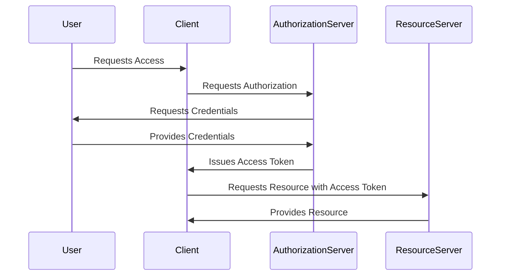
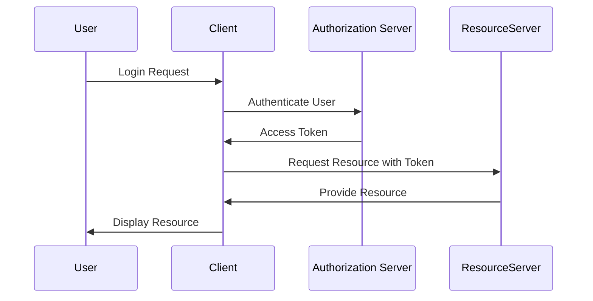

## 13.1 Authentication and Authorization Strategies

In the realm of software development, especially when dealing with enterprise-level applications, securing access to applications and services is paramount. Authentication and authorization are two critical components of this security framework. In this section, we will delve into various strategies and technologies that can be employed in C# to ensure robust security. We will explore OAuth and OpenID Connect for securing APIs, JSON Web Tokens (JWT) for stateless authentication, and Role-Based Access Control (RBAC) for managing user permissions.

### Understanding Authentication and Authorization

Before diving into specific strategies, let's clarify the distinction between authentication and authorization:

- **Authentication** is the process of verifying the identity of a user or system. It answers the question, "Who are you?"
- **Authorization** determines what an authenticated user or system is allowed to do. It answers the question, "What are you allowed to do?"

### Implementing OAuth and OpenID Connect

OAuth and OpenID Connect are open standards for access delegation and identity verification, respectively. They are widely used for securing APIs and enabling single sign-on (SSO) capabilities.

#### OAuth: Securing APIs with Tokens

OAuth 2.0 is a protocol that allows third-party applications to grant limited access to an HTTP service. It is commonly used to secure APIs by issuing access tokens that clients must present when making requests.

**Key Concepts of OAuth 2.0:**

- **Resource Owner**: The entity that can grant access to a protected resource.
- **Client**: The application requesting access to the resource on behalf of the resource owner.
- **Authorization Server**: The server issuing access tokens to the client after successfully authenticating the resource owner.
- **Resource Server**: The server hosting the protected resources, capable of accepting and responding to protected resource requests using access tokens.

**OAuth 2.0 Flow:**



#### OpenID Connect: Identity Verification

OpenID Connect is an identity layer on top of OAuth 2.0, providing a standardized way to verify the identity of the end-user based on the authentication performed by an authorization server.

**Implementing OpenID Connect with IdentityServer4:**

IdentityServer4 is a popular open-source framework for implementing OAuth 2.0 and OpenID Connect in .NET applications. It provides comprehensive support for securing APIs and enabling SSO.

**Setting Up IdentityServer4:**

1. **Install IdentityServer4**: Add the IdentityServer4 NuGet package to your ASP.NET Core project.
2. **Configure IdentityServer4**: Define clients, resources, and scopes in the `Startup.cs` file.
3. **Implement Authentication**: Use middleware to handle authentication requests and token issuance.

**Sample Code for IdentityServer4 Configuration:**

```csharp
public void ConfigureServices(IServiceCollection services)
{
    services.AddIdentityServer()
        .AddInMemoryClients(Config.GetClients())
        .AddInMemoryApiResources(Config.GetApiResources())
        .AddInMemoryIdentityResources(Config.GetIdentityResources())
        .AddDeveloperSigningCredential();
}

public void Configure(IApplicationBuilder app)
{
    app.UseIdentityServer();
}
```

**Try It Yourself:**

- Modify the client configuration to add new scopes or resources.
- Implement a custom user store for managing user credentials.

### JSON Web Tokens (JWT)

JSON Web Tokens (JWT) are a compact, URL-safe means of representing claims to be transferred between two parties. They are commonly used for stateless authentication in modern web applications.

#### Stateless Authentication with JWT

JWTs are self-contained tokens that include all the information needed for authentication and authorization. They are signed using a secret or a public/private key pair, ensuring their integrity and authenticity.

**Structure of a JWT:**

A JWT consists of three parts: Header, Payload, and Signature.

- **Header**: Contains metadata about the token, such as the type of token and the signing algorithm.
- **Payload**: Contains the claims, which are statements about an entity (typically, the user) and additional data.
- **Signature**: Used to verify the token's integrity and authenticity.

**JWT Creation and Validation:**

```csharp
var securityKey = new SymmetricSecurityKey(Encoding.UTF8.GetBytes("your-256-bit-secret"));
var credentials = new SigningCredentials(securityKey, SecurityAlgorithms.HmacSha256);

var token = new JwtSecurityToken(
    issuer: "yourdomain.com",
    audience: "yourdomain.com",
    claims: claims,
    expires: DateTime.Now.AddMinutes(30),
    signingCredentials: credentials);

var tokenHandler = new JwtSecurityTokenHandler();
string jwt = tokenHandler.WriteToken(token);

// Validate JWT
var tokenValidationParameters = new TokenValidationParameters
{
    ValidateIssuer = true,
    ValidateAudience = true,
    ValidateLifetime = true,
    ValidateIssuerSigningKey = true,
    ValidIssuer = "yourdomain.com",
    ValidAudience = "yourdomain.com",
    IssuerSigningKey = securityKey
};

SecurityToken validatedToken;
var principal = tokenHandler.ValidateToken(jwt, tokenValidationParameters, out validatedToken);
```

**Try It Yourself:**

- Experiment with different signing algorithms.
- Add custom claims to the JWT payload.

### Role-Based Access Control (RBAC)

Role-Based Access Control (RBAC) is a method of regulating access to resources based on the roles of individual users within an organization. It simplifies the management of user permissions by associating roles with specific access rights.

#### Defining User Roles and Permissions

In RBAC, roles are defined based on job functions, and permissions are assigned to these roles. Users are then assigned roles, granting them the associated permissions.

**Implementing RBAC in C#:**

```csharp
public class Role
{
    public string Name { get; set; }
    public List<Permission> Permissions { get; set; }
}

public class User
{
    public string Username { get; set; }
    public List<Role> Roles { get; set; }
}

public class Permission
{
    public string Name { get; set; }
}

public class AccessControlService
{
    public bool HasPermission(User user, string permissionName)
    {
        return user.Roles.Any(role => role.Permissions.Any(p => p.Name == permissionName));
    }
}
```

**Enforcing Access Controls in Applications:**

- Define roles and permissions in a configuration file or database.
- Use middleware to enforce access controls based on user roles and permissions.

**Try It Yourself:**

- Create a custom attribute to enforce role-based access control on specific actions.
- Implement dynamic role assignment based on user attributes.

### Visualizing Authentication and Authorization Strategies

To better understand the flow of authentication and authorization, let's visualize the process using a sequence diagram.



### References and Further Reading

- [OAuth 2.0 Specification](https://oauth.net/2/)
- [OpenID Connect Specification](https://openid.net/connect/)
- [IdentityServer4 Documentation](https://identityserver4.readthedocs.io/en/latest/)
- [JWT.io](https://jwt.io/)
- [Microsoft Docs on Role-Based Access Control](https://docs.microsoft.com/en-us/azure/role-based-access-control/)

### Knowledge Check

- Explain the difference between authentication and authorization.
- Describe the role of an authorization server in OAuth 2.0.
- What are the three parts of a JWT?
- How does RBAC simplify permission management?

### Embrace the Journey

Remember, mastering authentication and authorization strategies is a journey. As you progress, you'll build more secure and robust applications. Keep experimenting, stay curious, and enjoy the journey!

## Quiz Time!



### What is the primary purpose of OAuth 2.0?

- [x] To allow third-party applications to access user data without exposing credentials
- [ ] To encrypt data in transit
- [ ] To provide a user interface for authentication
- [ ] To store user passwords securely

> **Explanation:** OAuth 2.0 is designed to allow third-party applications to access user data without exposing user credentials.

### Which component of a JWT contains the claims?

- [ ] Header
- [x] Payload
- [ ] Signature
- [ ] Footer

> **Explanation:** The payload of a JWT contains the claims, which are statements about an entity and additional data.

### What does RBAC stand for?

- [ ] Resource-Based Access Control
- [x] Role-Based Access Control
- [ ] Rule-Based Access Control
- [ ] Rights-Based Access Control

> **Explanation:** RBAC stands for Role-Based Access Control, which regulates access based on user roles.

### In OAuth 2.0, what is the role of the Resource Server?

- [ ] To issue access tokens
- [x] To host protected resources
- [ ] To authenticate users
- [ ] To manage user roles

> **Explanation:** The Resource Server hosts protected resources and accepts requests using access tokens.

### What is a key advantage of using JWT for authentication?

- [x] Stateless authentication
- [ ] Requires server-side session storage
- [ ] Provides encryption by default
- [ ] Supports only symmetric key signing

> **Explanation:** JWTs enable stateless authentication, meaning the server does not need to store session information.

### Which of the following is a common use case for OpenID Connect?

- [x] Single Sign-On (SSO)
- [ ] Data encryption
- [ ] API rate limiting
- [ ] Load balancing

> **Explanation:** OpenID Connect is commonly used for Single Sign-On (SSO) to verify user identity.

### What is the purpose of the Signature in a JWT?

- [ ] To store user roles
- [ ] To encrypt the payload
- [x] To verify the token's integrity
- [ ] To define the token's expiration

> **Explanation:** The Signature in a JWT is used to verify the token's integrity and authenticity.

### How does RBAC simplify permission management?

- [x] By associating roles with specific access rights
- [ ] By storing permissions in a flat file
- [ ] By encrypting user credentials
- [ ] By using a single role for all users

> **Explanation:** RBAC simplifies permission management by associating roles with specific access rights, reducing complexity.

### What is the role of the Authorization Server in OAuth 2.0?

- [x] To issue access tokens after authenticating the resource owner
- [ ] To host protected resources
- [ ] To manage user roles
- [ ] To encrypt data

> **Explanation:** The Authorization Server issues access tokens after successfully authenticating the resource owner.

### True or False: JWTs are always encrypted.

- [ ] True
- [x] False

> **Explanation:** JWTs are not always encrypted; they are signed to ensure integrity but can be encrypted if needed.


