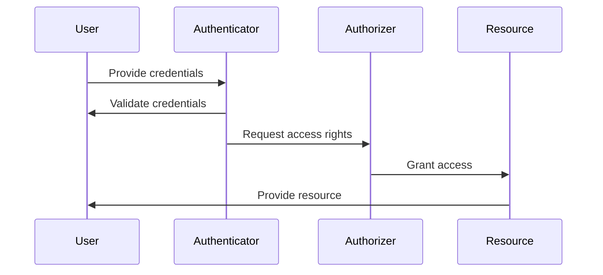
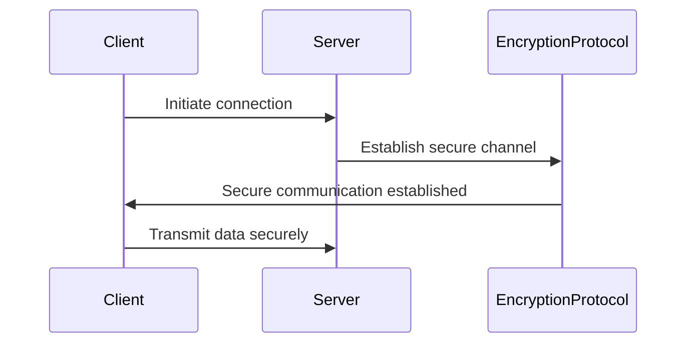

## 13.10 Security Patterns Summary

In the ever-evolving landscape of software development, security remains a paramount concern. As expert software engineers and enterprise architects, understanding and implementing security patterns in C# is crucial for building robust, secure applications. This section consolidates the key security strategies and resources, providing a comprehensive summary of best practices and guidance on staying updated with security trends.

### Introduction to Security Patterns

Security patterns are design solutions that address recurring security problems in software architecture. They provide a structured approach to identifying and mitigating vulnerabilities, ensuring that applications are resilient against potential threats. In C#, security patterns leverage the language's features to enhance application security, making them an essential component of any developer's toolkit.

### Key Security Patterns in C#

Let's explore some of the most critical security patterns relevant to C# development:

#### 1. Authentication and Authorization Patterns

**Intent:** Ensure that only authorized users can access specific resources or perform certain actions within an application.

**Key Participants:**
- **User:** The entity attempting to access the system.
- **Authenticator:** Validates the user's identity.
- **Authorizer:** Determines the user's access rights.

**Applicability:** Use these patterns when you need to control access to resources based on user identity and roles.

**Sample Code Snippet:**

```csharp
public class Authenticator
{
    public bool Authenticate(string username, string password)
    {
        // Validate credentials against a secure store
        return SecureStore.ValidateCredentials(username, password);
    }
}

public class Authorizer
{
    public bool Authorize(User user, string resource)
    {
        // Check if the user has access to the resource
        return user.HasPermission(resource);
    }
}
```

**Design Considerations:** Implement strong password policies, use multi-factor authentication, and ensure secure storage of credentials.

#### 2. Input Validation and Sanitization

**Intent:** Prevent injection attacks by validating and sanitizing user input.

**Key Participants:**
- **Input Validator:** Ensures input meets expected criteria.
- **Sanitizer:** Removes or escapes harmful characters.

**Applicability:** Use this pattern whenever your application accepts input from external sources.

**Sample Code Snippet:**

```csharp
public class InputValidator
{
    public bool IsValidEmail(string email)
    {
        // Use regex to validate email format
        return Regex.IsMatch(email, @"^[^@\s]+@[^@\s]+\.[^@\s]+$");
    }
}

public class Sanitizer
{
    public string SanitizeInput(string input)
    {
        // Escape harmful characters
        return HttpUtility.HtmlEncode(input);
    }
}
```

**Design Considerations:** Always validate input on the server side, and use parameterized queries to prevent SQL injection.

#### 3. Secure Communication

**Intent:** Protect data in transit by encrypting communications between clients and servers.

**Key Participants:**
- **Client:** Initiates the secure communication.
- **Server:** Responds to the client's requests.
- **Encryption Protocol:** Secures the data exchange.

**Applicability:** Use this pattern when transmitting sensitive data over networks.

**Sample Code Snippet:**

```csharp
public class SecureCommunicator
{
    public void EstablishSecureConnection()
    {
        // Use TLS to secure the connection
        var client = new TcpClient("server.com", 443);
        var sslStream = new SslStream(client.GetStream());
        sslStream.AuthenticateAsClient("server.com");
    }
}
```

**Design Considerations:** Use up-to-date encryption protocols like TLS 1.2 or higher, and regularly update certificates.

#### 4. Secure Singleton Implementation

**Intent:** Ensure that a class has only one instance, and provide a global point of access to it, while securing its initialization.

**Key Participants:**
- **Singleton:** The single instance of the class.
- **Lock:** Ensures thread-safe initialization.

**Applicability:** Use this pattern when a single instance of a class is needed, and its initialization must be secure.

**Sample Code Snippet:**

```csharp
public class SecureSingleton
{
    private static SecureSingleton instance;
    private static readonly object lockObject = new object();

    private SecureSingleton() { }

    public static SecureSingleton Instance
    {
        get
        {
            lock (lockObject)
            {
                if (instance == null)
                {
                    instance = new SecureSingleton();
                }
                return instance;
            }
        }
    }
}
```

**Design Considerations:** Ensure thread safety and prevent unauthorized access to the singleton instance.

#### 5. Rate Limiting and Throttling

**Intent:** Protect resources from being overwhelmed by limiting the number of requests a user can make in a given time frame.

**Key Participants:**
- **Rate Limiter:** Monitors and controls the request rate.
- **User:** The entity making requests.

**Applicability:** Use this pattern to prevent abuse and ensure fair resource usage.

**Sample Code Snippet:**

```csharp
public class RateLimiter
{
    private readonly int maxRequests;
    private readonly TimeSpan timeWindow;
    private readonly Dictionary<string, List<DateTime>> userRequests = new Dictionary<string, List<DateTime>>();

    public RateLimiter(int maxRequests, TimeSpan timeWindow)
    {
        this.maxRequests = maxRequests;
        this.timeWindow = timeWindow;
    }

    public bool IsRequestAllowed(string userId)
    {
        if (!userRequests.ContainsKey(userId))
        {
            userRequests[userId] = new List<DateTime>();
        }

        var requests = userRequests[userId];
        requests.RemoveAll(r => r < DateTime.UtcNow - timeWindow);

        if (requests.Count >= maxRequests)
        {
            return false;
        }

        requests.Add(DateTime.UtcNow);
        return true;
    }
}
```

**Design Considerations:** Implement rate limiting at both the application and network levels, and provide meaningful feedback to users when limits are reached.

### Best Practices for Implementing Security Patterns

1. **Adopt a Defense-in-Depth Strategy:** Layer multiple security measures to protect against different types of threats.

2. **Regularly Update and Patch Systems:** Keep your software and dependencies up to date to mitigate vulnerabilities.

3. **Conduct Security Audits and Penetration Testing:** Regularly assess your application's security posture to identify and address weaknesses.

4. **Educate and Train Your Team:** Ensure that all team members are aware of security best practices and understand the importance of secure coding.

5. **Use Secure Development Tools:** Leverage tools that help identify and fix security issues during development.

### Staying Updated with Security Trends

The field of cybersecurity is dynamic, with new threats and solutions emerging regularly. To stay ahead, consider the following:

- **Follow Reputable Security Blogs and News Sites:** Stay informed about the latest security trends and vulnerabilities.
- **Participate in Security Conferences and Workshops:** Engage with the security community to learn from experts and peers.
- **Join Security-Focused Communities:** Collaborate with other professionals to share knowledge and experiences.
- **Continuously Improve Your Skills:** Pursue certifications and training to enhance your security expertise.

### Visualizing Security Patterns

To better understand the relationships and workflows involved in security patterns, let's visualize some key concepts using Mermaid.js diagrams.

#### Diagram: Authentication and Authorization Workflow



**Description:** This diagram illustrates the process of authenticating a user and authorizing access to a resource.

#### Diagram: Secure Communication Flow



**Description:** This diagram shows the steps involved in establishing a secure communication channel between a client and a server.

### Conclusion

Security patterns are an essential aspect of building secure applications in C#. By understanding and implementing these patterns, you can protect your applications from a wide range of threats. Remember to stay informed about the latest security trends and continuously improve your skills to keep your applications secure.

### Knowledge Check

To reinforce your understanding of security patterns, consider the following questions and exercises:

1. **What is the primary purpose of authentication and authorization patterns?**
2. **Explain the importance of input validation and sanitization.**
3. **Describe a scenario where secure communication is critical.**
4. **How does the secure singleton pattern ensure thread safety?**
5. **What are the benefits of implementing rate limiting and throttling?**

### Quiz Time!



### What is the primary purpose of authentication and authorization patterns?

- [x] To ensure only authorized users can access specific resources
- [ ] To encrypt data in transit
- [ ] To validate user input
- [ ] To manage application performance

> **Explanation:** Authentication and authorization patterns are used to control access to resources based on user identity and roles.

### Why is input validation and sanitization important?

- [x] To prevent injection attacks
- [ ] To enhance application performance
- [ ] To improve user experience
- [ ] To manage application state

> **Explanation:** Input validation and sanitization are crucial for preventing injection attacks by ensuring that user input meets expected criteria and harmful characters are removed or escaped.

### In which scenario is secure communication critical?

- [x] When transmitting sensitive data over networks
- [ ] When performing local file operations
- [ ] When rendering UI components
- [ ] When logging application events

> **Explanation:** Secure communication is essential when transmitting sensitive data over networks to protect it from interception and unauthorized access.

### How does the secure singleton pattern ensure thread safety?

- [x] By using a lock to control access to the singleton instance
- [ ] By encrypting the singleton instance
- [ ] By validating user input
- [ ] By using parameterized queries

> **Explanation:** The secure singleton pattern uses a lock to ensure that only one thread can access the singleton instance at a time, preventing race conditions.

### What are the benefits of implementing rate limiting and throttling?

- [x] To prevent abuse and ensure fair resource usage
- [ ] To enhance user interface design
- [ ] To improve code readability
- [ ] To manage application state

> **Explanation:** Rate limiting and throttling help prevent abuse by limiting the number of requests a user can make in a given time frame, ensuring fair resource usage.

### Which of the following is a key participant in the secure communication pattern?

- [x] Encryption Protocol
- [ ] Input Validator
- [ ] Rate Limiter
- [ ] User Interface

> **Explanation:** The encryption protocol is a key participant in the secure communication pattern, securing the data exchange between clients and servers.

### What is a best practice for implementing security patterns?

- [x] Adopt a defense-in-depth strategy
- [ ] Use outdated encryption protocols
- [ ] Ignore security audits
- [ ] Avoid educating the development team

> **Explanation:** Adopting a defense-in-depth strategy involves layering multiple security measures to protect against different types of threats.

### How can developers stay updated with security trends?

- [x] Follow reputable security blogs and news sites
- [ ] Ignore security updates
- [ ] Avoid security conferences
- [ ] Disregard community collaboration

> **Explanation:** Developers can stay updated with security trends by following reputable security blogs and news sites, participating in conferences, and collaborating with the security community.

### What is the role of the sanitizer in input validation?

- [x] To remove or escape harmful characters
- [ ] To encrypt data
- [ ] To manage application state
- [ ] To render UI components

> **Explanation:** The sanitizer's role in input validation is to remove or escape harmful characters, preventing injection attacks.

### True or False: Regularly updating and patching systems is a best practice for maintaining application security.

- [x] True
- [ ] False

> **Explanation:** Regularly updating and patching systems is a best practice for maintaining application security, as it helps mitigate vulnerabilities.



Remember, mastering security patterns is an ongoing journey. As you continue to develop your skills, you'll be better equipped to build secure, resilient applications. Keep experimenting, stay curious, and enjoy the journey!
