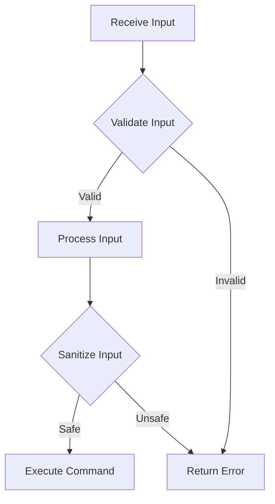

## 13.2 Input Validation and Sanitization

In the realm of software development, ensuring data integrity and protecting against malicious attacks is paramount. Input validation and sanitization are critical components of a robust security strategy. They help prevent injection attacks, such as SQL injection and cross-site scripting (XSS), which can compromise the security of an application. In this section, we will delve into the best practices for implementing input validation and sanitization in C#, focusing on techniques to ensure data integrity and protect against various types of injection attacks.

### Introduction to Input Validation and Sanitization

Input validation is the process of verifying that the data provided by users or external systems meets the expected format, type, and constraints before processing it. Sanitization, on the other hand, involves cleaning or escaping input data to remove or neutralize any potentially harmful content. Together, these practices form a defensive barrier against security vulnerabilities.

#### Why Input Validation and Sanitization Matter

- **Data Integrity**: Ensures that the data entering your system is accurate and consistent.
- **Security**: Protects against injection attacks, which can lead to data breaches and unauthorized access.
- **Reliability**: Prevents application crashes and unexpected behavior due to malformed input.
- **User Experience**: Provides feedback to users when their input does not meet the required criteria.

### Implementing Validation

Implementing effective input validation involves using various techniques and tools to ensure that data conforms to expected standards. In C#, there are several approaches to achieve this.

#### Using Data Annotations

Data annotations in C# provide a simple way to enforce validation rules on model properties. They are attributes that can be applied to class properties to specify validation criteria.

```csharp
using System.ComponentModel.DataAnnotations;

public class User
{
    [Required(ErrorMessage = "Username is required.")]
    [StringLength(50, ErrorMessage = "Username cannot be longer than 50 characters.")]
    public string Username { get; set; }

    [Required(ErrorMessage = "Email is required.")]
    [EmailAddress(ErrorMessage = "Invalid email address.")]
    public string Email { get; set; }

    [Range(18, 100, ErrorMessage = "Age must be between 18 and 100.")]
    public int Age { get; set; }
}
```

In this example, we use data annotations to ensure that the `Username` and `Email` fields are required and that the `Email` field contains a valid email address. The `Age` field is constrained to a range between 18 and 100.

#### Employing FluentValidation

FluentValidation is a popular library for building strongly-typed validation rules in C#. It provides a more flexible and expressive way to define validation logic compared to data annotations.

```csharp
using FluentValidation;

public class UserValidator : AbstractValidator<User>
{
    public UserValidator()
    {
        RuleFor(user => user.Username)
            .NotEmpty().WithMessage("Username is required.")
            .Length(1, 50).WithMessage("Username cannot be longer than 50 characters.");

        RuleFor(user => user.Email)
            .NotEmpty().WithMessage("Email is required.")
            .EmailAddress().WithMessage("Invalid email address.");

        RuleFor(user => user.Age)
            .InclusiveBetween(18, 100).WithMessage("Age must be between 18 and 100.");
    }
}
```

FluentValidation allows for more complex validation scenarios and supports conditional validation, custom validators, and more.

### Protecting Against Injections

Injection attacks occur when untrusted data is sent to an interpreter as part of a command or query. The attacker's hostile data can trick the interpreter into executing unintended commands or accessing unauthorized data. Let's explore how to protect against common injection attacks.

#### SQL Injection Prevention with Parameterized Queries

SQL injection is a type of attack where malicious SQL statements are inserted into an entry field for execution. To prevent this, always use parameterized queries or stored procedures.

```csharp
using System.Data.SqlClient;

public void GetUserById(int userId)
{
    string connectionString = "YourConnectionStringHere";
    string query = "SELECT * FROM Users WHERE UserId = @UserId";

    using (SqlConnection connection = new SqlConnection(connectionString))
    {
        SqlCommand command = new SqlCommand(query, connection);
        command.Parameters.AddWithValue("@UserId", userId);

        connection.Open();
        SqlDataReader reader = command.ExecuteReader();
        while (reader.Read())
        {
            // Process data
        }
    }
}
```

In this example, we use a parameterized query to safely insert the `userId` into the SQL statement, preventing SQL injection.

#### Command Injection Mitigation

Command injection occurs when an attacker is able to execute arbitrary commands on the host operating system via a vulnerable application. To mitigate this, avoid using shell commands with user input. If necessary, validate and sanitize the input thoroughly.

```csharp
using System.Diagnostics;

public void ExecuteCommand(string input)
{
    // Validate and sanitize input
    if (string.IsNullOrWhiteSpace(input) || input.Contains(";") || input.Contains("&"))
    {
        throw new ArgumentException("Invalid input.");
    }

    ProcessStartInfo startInfo = new ProcessStartInfo("cmd.exe", $"/c {input}");
    Process process = new Process { StartInfo = startInfo };
    process.Start();
}
```

In this example, we check for potentially harmful characters like `;` and `&` before executing the command.

### Cross-Site Scripting (XSS) Prevention

Cross-site scripting (XSS) is a vulnerability that allows attackers to inject malicious scripts into web pages viewed by other users. To prevent XSS, focus on encoding outputs and implementing a Content Security Policy (CSP).

#### Encoding Outputs

Encoding is the process of converting data into a format that prevents the execution of malicious scripts. Always encode data before rendering it in a web page.

```csharp
using System.Web;

public string EncodeForHtml(string input)
{
    return HttpUtility.HtmlEncode(input);
}
```

In this example, we use `HttpUtility.HtmlEncode` to encode input data before displaying it in HTML.

#### Content Security Policy (CSP) Implementation

A Content Security Policy (CSP) is a security feature that helps prevent XSS attacks by specifying which sources of content are allowed to be loaded on a web page.

```html
<meta http-equiv="Content-Security-Policy" content="default-src 'self'; script-src 'self' https://trusted.cdn.com;">
```

In this example, the CSP allows scripts to be loaded only from the same origin (`'self'`) and a trusted CDN.

### Visualizing Input Validation and Sanitization

To better understand the flow of input validation and sanitization, let's visualize the process using a flowchart.



This flowchart illustrates the steps involved in validating and sanitizing input before processing it. The input is first validated, and if it passes, it is sanitized before execution. If any step fails, an error is returned.

### Try It Yourself

Experiment with the code examples provided by modifying the validation rules or input data. Try introducing invalid data to see how the application responds. This hands-on approach will help reinforce your understanding of input validation and sanitization techniques.

### References and Links

- [OWASP Input Validation Cheat Sheet](https://cheatsheetseries.owasp.org/cheatsheets/Input_Validation_Cheat_Sheet.html)
- [Microsoft Docs: Data Annotations](https://docs.microsoft.com/en-us/dotnet/api/system.componentmodel.dataannotations)
- [FluentValidation Documentation](https://docs.fluentvalidation.net/en/latest/)

### Knowledge Check

- What is the difference between input validation and sanitization?
- Why is it important to use parameterized queries?
- How does encoding help prevent XSS attacks?
- What role does a Content Security Policy play in web security?

### Embrace the Journey

Remember, mastering input validation and sanitization is a crucial step in building secure applications. As you continue to develop your skills, keep experimenting with different techniques and stay updated with the latest security practices. Enjoy the journey of becoming a more proficient and security-conscious developer!

## Quiz Time!



### What is the primary purpose of input validation?

- [x] To ensure data meets expected format and constraints
- [ ] To execute commands on the server
- [ ] To display data on the web page
- [ ] To store data in the database

> **Explanation:** Input validation ensures that data meets expected format and constraints before processing.

### Which library provides a more flexible way to define validation logic in C#?

- [ ] Data Annotations
- [x] FluentValidation
- [ ] Entity Framework
- [ ] LINQ

> **Explanation:** FluentValidation is a library that provides a more flexible and expressive way to define validation logic compared to data annotations.

### How can SQL injection be prevented in C#?

- [ ] By using string concatenation
- [x] By using parameterized queries
- [ ] By using HTML encoding
- [ ] By using regular expressions

> **Explanation:** SQL injection can be prevented by using parameterized queries, which safely insert user input into SQL statements.

### What is the purpose of encoding outputs in web applications?

- [ ] To increase performance
- [x] To prevent XSS attacks
- [ ] To improve user experience
- [ ] To reduce server load

> **Explanation:** Encoding outputs prevents XSS attacks by converting data into a format that prevents the execution of malicious scripts.

### What does CSP stand for in web security?

- [ ] Content Security Platform
- [x] Content Security Policy
- [ ] Cross-Site Protection
- [ ] Cyber Security Protocol

> **Explanation:** CSP stands for Content Security Policy, a security feature that helps prevent XSS attacks by specifying allowed content sources.

### Which of the following is a common injection attack?

- [x] SQL injection
- [ ] Buffer overflow
- [ ] Man-in-the-middle
- [ ] Denial of service

> **Explanation:** SQL injection is a common injection attack where malicious SQL statements are inserted into an entry field for execution.

### What is the role of data annotations in C#?

- [x] To enforce validation rules on model properties
- [ ] To execute SQL queries
- [ ] To manage database connections
- [ ] To handle exceptions

> **Explanation:** Data annotations are attributes that enforce validation rules on model properties in C#.

### How does a Content Security Policy enhance web security?

- [ ] By encrypting data
- [x] By specifying allowed content sources
- [ ] By blocking all scripts
- [ ] By improving performance

> **Explanation:** A Content Security Policy enhances web security by specifying which sources of content are allowed to be loaded on a web page.

### What is a key benefit of using FluentValidation over data annotations?

- [ ] It is faster
- [x] It allows for more complex validation scenarios
- [ ] It is easier to use
- [ ] It is built into the .NET framework

> **Explanation:** FluentValidation allows for more complex validation scenarios and supports conditional validation, custom validators, and more.

### True or False: Input sanitization is the process of verifying that data meets expected format and constraints.

- [ ] True
- [x] False

> **Explanation:** Input sanitization involves cleaning or escaping input data to remove or neutralize any potentially harmful content, while validation verifies that data meets expected format and constraints.


