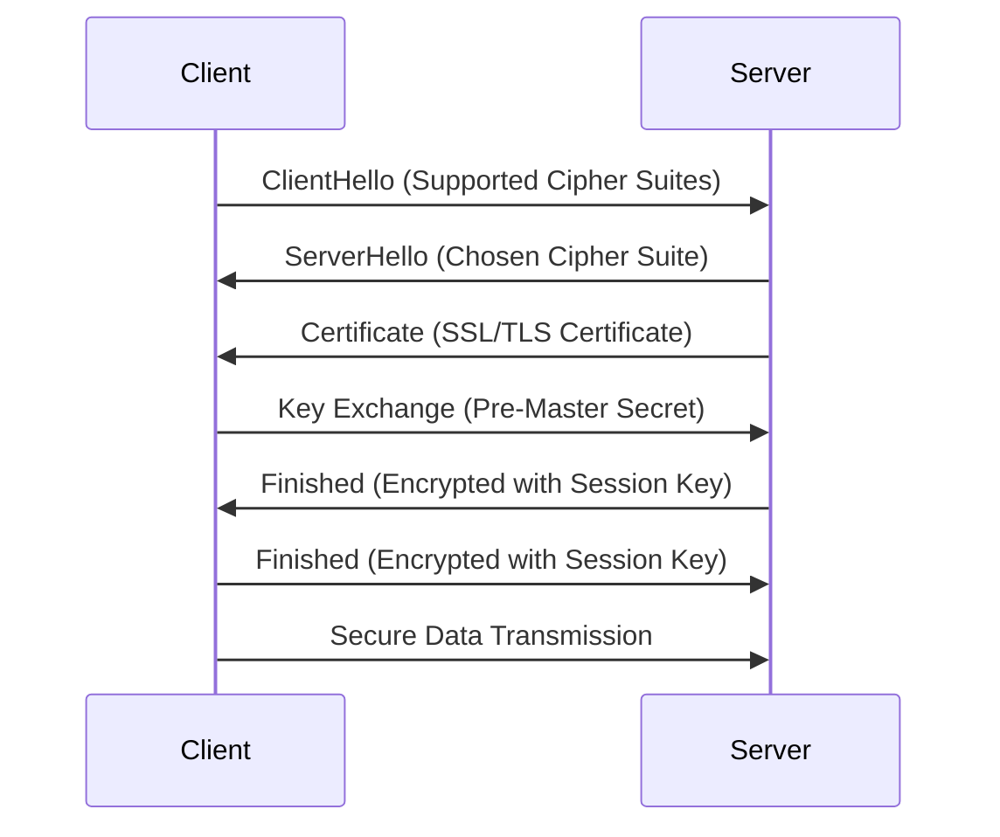

## 13.3 Secure Communication

In today's digital landscape, secure communication is paramount to protect sensitive data from unauthorized access and tampering. As expert software engineers and enterprise architects, it is crucial to implement robust security measures to safeguard data both in transit and at rest. This section delves into the essential aspects of secure communication in C#, focusing on using HTTPS and TLS, configuring SSL/TLS certificates, enforcing secure protocols, and implementing encryption with .NET Cryptography libraries.

### Protecting Data in Transit and at Rest

Data security involves protecting information from unauthorized access, disclosure, alteration, and destruction. It encompasses two primary states: data in transit and data at rest.

- **Data in Transit**: This refers to data actively moving from one location to another, such as across the internet or through a private network. Protecting data in transit is crucial to prevent interception and unauthorized access.
- **Data at Rest**: This refers to data stored on a device or backup medium. Protecting data at rest ensures that even if physical access is gained, the data remains secure.

### Using HTTPS and TLS

#### Understanding HTTPS and TLS

**HTTPS (Hypertext Transfer Protocol Secure)** is an extension of HTTP that uses encryption to secure data transmitted over the internet. It ensures that the communication between the client and server is encrypted, preventing eavesdropping and tampering.

**TLS (Transport Layer Security)** is a cryptographic protocol that provides secure communication over a computer network. It is the successor to SSL (Secure Sockets Layer) and is widely used to secure web traffic, email, and other data exchanges.

#### Configuring SSL/TLS Certificates

To enable HTTPS, you need an SSL/TLS certificate, which verifies the identity of the website and encrypts the data exchanged between the client and server. Here's how to configure SSL/TLS certificates in C#:

1. **Obtain a Certificate**: Purchase an SSL/TLS certificate from a trusted Certificate Authority (CA) or use a free service like Let's Encrypt.
2. **Install the Certificate**: Install the certificate on your web server. This process varies depending on the server software (e.g., IIS, Apache, Nginx).
3. **Configure the Server**: Update the server configuration to use the installed certificate for HTTPS connections.

#### Enforcing Secure Protocols

To ensure secure communication, enforce the use of secure protocols and disable outdated or vulnerable ones. For example, disable SSL 2.0 and SSL 3.0, and use TLS 1.2 or higher.

Here's an example of configuring a .NET application to use TLS 1.2:

```csharp
ServicePointManager.SecurityProtocol = SecurityProtocolType.Tls12;
```

This line of code ensures that your application uses TLS 1.2 for secure communication.

### Implementing Encryption

#### Data Encryption at Rest

Encrypting data at rest is crucial to protect sensitive information stored on devices or backup media. In C#, you can use the .NET Cryptography libraries to implement encryption.

Here's an example of encrypting and decrypting data using the `Aes` class:

```csharp
using System;
using System.IO;
using System.Security.Cryptography;
using System.Text;

public class EncryptionExample
{
    public static void Main()
    {
        string original = "Sensitive data to encrypt";
        using (Aes aes = Aes.Create())
        {
            byte[] encrypted = EncryptStringToBytes_Aes(original, aes.Key, aes.IV);
            string decrypted = DecryptStringFromBytes_Aes(encrypted, aes.Key, aes.IV);

            Console.WriteLine($"Original: {original}");
            Console.WriteLine($"Encrypted: {Convert.ToBase64String(encrypted)}");
            Console.WriteLine($"Decrypted: {decrypted}");
        }
    }

    static byte[] EncryptStringToBytes_Aes(string plainText, byte[] Key, byte[] IV)
    {
        if (plainText == null || plainText.Length <= 0)
            throw new ArgumentNullException(nameof(plainText));
        if (Key == null || Key.Length <= 0)
            throw new ArgumentNullException(nameof(Key));
        if (IV == null || IV.Length <= 0)
            throw new ArgumentNullException(nameof(IV));

        byte[] encrypted;

        using (Aes aesAlg = Aes.Create())
        {
            aesAlg.Key = Key;
            aesAlg.IV = IV;

            ICryptoTransform encryptor = aesAlg.CreateEncryptor(aesAlg.Key, aesAlg.IV);

            using (MemoryStream msEncrypt = new MemoryStream())
            {
                using (CryptoStream csEncrypt = new CryptoStream(msEncrypt, encryptor, CryptoStreamMode.Write))
                {
                    using (StreamWriter swEncrypt = new StreamWriter(csEncrypt))
                    {
                        swEncrypt.Write(plainText);
                    }
                    encrypted = msEncrypt.ToArray();
                }
            }
        }

        return encrypted;
    }

    static string DecryptStringFromBytes_Aes(byte[] cipherText, byte[] Key, byte[] IV)
    {
        if (cipherText == null || cipherText.Length <= 0)
            throw new ArgumentNullException(nameof(cipherText));
        if (Key == null || Key.Length <= 0)
            throw new ArgumentNullException(nameof(Key));
        if (IV == null || IV.Length <= 0)
            throw new ArgumentNullException(nameof(IV));

        string plaintext = null;

        using (Aes aesAlg = Aes.Create())
        {
            aesAlg.Key = Key;
            aesAlg.IV = IV;

            ICryptoTransform decryptor = aesAlg.CreateDecryptor(aesAlg.Key, aesAlg.IV);

            using (MemoryStream msDecrypt = new MemoryStream(cipherText))
            {
                using (CryptoStream csDecrypt = new CryptoStream(msDecrypt, decryptor, CryptoStreamMode.Read))
                {
                    using (StreamReader srDecrypt = new StreamReader(csDecrypt))
                    {
                        plaintext = srDecrypt.ReadToEnd();
                    }
                }
            }
        }

        return plaintext;
    }
}
```

In this example, we use the `Aes` class to encrypt and decrypt a string. The `EncryptStringToBytes_Aes` method encrypts the input string using a specified key and initialization vector (IV), while the `DecryptStringFromBytes_Aes` method decrypts the encrypted data back to the original string.

#### Using .NET Cryptography Libraries

The .NET Framework provides a comprehensive set of cryptography libraries that support various encryption algorithms, including AES, RSA, and SHA. These libraries offer a range of cryptographic operations, such as hashing, encryption, and digital signatures.

**Key Classes in .NET Cryptography:**

- **`Aes`**: Provides methods for symmetric encryption using the Advanced Encryption Standard (AES).
- **`RSA`**: Provides methods for asymmetric encryption using the RSA algorithm.
- **`SHA256`**: Provides methods for computing the SHA-256 hash value.

Here's an example of using the `RSA` class for asymmetric encryption:

```csharp
using System;
using System.Security.Cryptography;
using System.Text;

public class RSAExample
{
    public static void Main()
    {
        using (RSA rsa = RSA.Create())
        {
            string original = "Sensitive data to encrypt";
            byte[] encrypted = EncryptData(rsa, original);
            string decrypted = DecryptData(rsa, encrypted);

            Console.WriteLine($"Original: {original}");
            Console.WriteLine($"Encrypted: {Convert.ToBase64String(encrypted)}");
            Console.WriteLine($"Decrypted: {decrypted}");
        }
    }

    static byte[] EncryptData(RSA rsa, string data)
    {
        byte[] dataBytes = Encoding.UTF8.GetBytes(data);
        return rsa.Encrypt(dataBytes, RSAEncryptionPadding.OaepSHA256);
    }

    static string DecryptData(RSA rsa, byte[] encryptedData)
    {
        byte[] decryptedBytes = rsa.Decrypt(encryptedData, RSAEncryptionPadding.OaepSHA256);
        return Encoding.UTF8.GetString(decryptedBytes);
    }
}
```

In this example, we use the `RSA` class to encrypt and decrypt data. The `EncryptData` method encrypts the input string using RSA encryption, while the `DecryptData` method decrypts the encrypted data back to the original string.

### Visualizing Secure Communication

To better understand secure communication, let's visualize the process of establishing a secure connection using HTTPS and TLS.



**Diagram Description**: This sequence diagram illustrates the process of establishing a secure connection using HTTPS and TLS. The client initiates the connection with a `ClientHello` message, indicating supported cipher suites. The server responds with a `ServerHello` message, selecting a cipher suite, and provides its SSL/TLS certificate. The client and server then perform a key exchange to establish a session key, which is used to encrypt subsequent data transmissions.

### Try It Yourself

Experiment with the provided code examples to gain a deeper understanding of secure communication in C#. Try modifying the encryption algorithms, key sizes, and initialization vectors to see how they affect the security and performance of your application. Additionally, explore the .NET Cryptography libraries to implement other cryptographic operations, such as hashing and digital signatures.

### Knowledge Check

- Explain the difference between data in transit and data at rest.
- Describe the role of SSL/TLS certificates in secure communication.
- Demonstrate how to configure a .NET application to use TLS 1.2.
- Provide an example of encrypting data at rest using the `Aes` class.
- Explain the difference between symmetric and asymmetric encryption.

### Embrace the Journey

Remember, mastering secure communication is an ongoing journey. As you progress, you'll encounter new challenges and opportunities to enhance your skills. Keep experimenting, stay curious, and enjoy the journey!

### References and Links

- [MDN Web Docs: HTTPS](https://developer.mozilla.org/en-US/docs/Web/HTTP/Overview)
- [Microsoft Docs: Cryptography in .NET](https://docs.microsoft.com/en-us/dotnet/standard/security/cryptography-model)
- [Let's Encrypt](https://letsencrypt.org/)

## Quiz Time!



### What is the primary purpose of HTTPS?

- [x] To encrypt data transmitted over the internet
- [ ] To compress data for faster transmission
- [ ] To authenticate users
- [ ] To cache web pages

> **Explanation:** HTTPS encrypts data transmitted over the internet to prevent eavesdropping and tampering.

### Which protocol is the successor to SSL?

- [ ] HTTP
- [x] TLS
- [ ] FTP
- [ ] SMTP

> **Explanation:** TLS (Transport Layer Security) is the successor to SSL (Secure Sockets Layer).

### What is the role of an SSL/TLS certificate?

- [x] To verify the identity of a website and encrypt data
- [ ] To store user credentials
- [ ] To manage server resources
- [ ] To log user activity

> **Explanation:** An SSL/TLS certificate verifies the identity of a website and encrypts data exchanged between the client and server.

### Which .NET class is used for symmetric encryption?

- [ ] RSA
- [x] Aes
- [ ] SHA256
- [ ] MD5

> **Explanation:** The `Aes` class is used for symmetric encryption in .NET.

### How can you enforce the use of TLS 1.2 in a .NET application?

- [x] By setting `ServicePointManager.SecurityProtocol = SecurityProtocolType.Tls12;`
- [ ] By installing a firewall
- [ ] By using a VPN
- [ ] By disabling HTTP

> **Explanation:** Setting `ServicePointManager.SecurityProtocol = SecurityProtocolType.Tls12;` enforces the use of TLS 1.2.

### What is the difference between symmetric and asymmetric encryption?

- [x] Symmetric encryption uses the same key for encryption and decryption, while asymmetric encryption uses different keys.
- [ ] Symmetric encryption is slower than asymmetric encryption.
- [ ] Asymmetric encryption is less secure than symmetric encryption.
- [ ] Symmetric encryption requires more computational power.

> **Explanation:** Symmetric encryption uses the same key for both encryption and decryption, whereas asymmetric encryption uses a pair of keys (public and private).

### Which .NET class provides methods for computing the SHA-256 hash value?

- [ ] RSA
- [ ] Aes
- [x] SHA256
- [ ] MD5

> **Explanation:** The `SHA256` class provides methods for computing the SHA-256 hash value.

### What is the purpose of the `EncryptStringToBytes_Aes` method in the provided code example?

- [x] To encrypt a string using the AES algorithm
- [ ] To decrypt a string using the AES algorithm
- [ ] To hash a string using SHA-256
- [ ] To compress a string for storage

> **Explanation:** The `EncryptStringToBytes_Aes` method encrypts a string using the AES algorithm.

### What is the purpose of the `DecryptStringFromBytes_Aes` method in the provided code example?

- [x] To decrypt encrypted data back to the original string
- [ ] To encrypt a string using the AES algorithm
- [ ] To hash a string using SHA-256
- [ ] To compress a string for storage

> **Explanation:** The `DecryptStringFromBytes_Aes` method decrypts encrypted data back to the original string.

### True or False: HTTPS is an extension of HTTP that uses encryption to secure data transmitted over the internet.

- [x] True
- [ ] False

> **Explanation:** True. HTTPS is an extension of HTTP that uses encryption to secure data transmitted over the internet.


