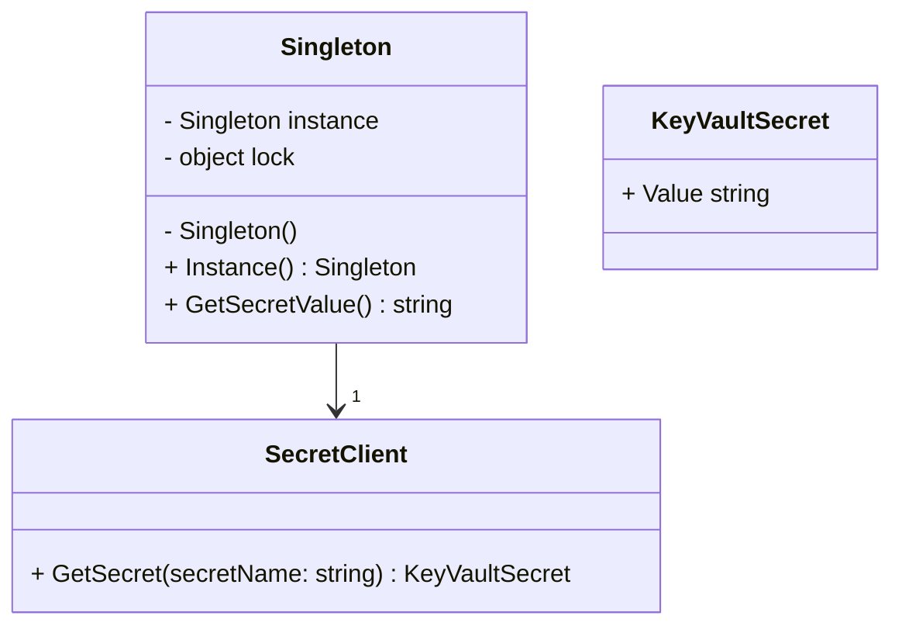

## 13.4 Secure Singleton Implementation

In the realm of software design patterns, the Singleton pattern is a well-known creational pattern that ensures a class has only one instance and provides a global point of access to it. While the Singleton pattern is straightforward in its basic form, implementing it securely, especially when dealing with sensitive data, requires careful consideration. This section delves into the intricacies of secure singleton implementation in C#, focusing on handling secrets and protecting configuration data.

### Understanding the Singleton Pattern

#### Design Pattern Name
**Singleton Pattern**

#### Category
Creational Design Pattern

#### Intent
Ensure a class has only one instance and provide a global point of access to it.

#### Key Participants
- **Singleton**: The class that maintains a static reference to the single instance and returns that instance from a static method.

#### Applicability
Use the Singleton pattern when:
- There must be exactly one instance of a class, and it must be accessible from a well-known access point.
- The sole instance should be extensible by subclassing, and clients should be able to use an extended instance without modifying their code.

#### Sample Code Snippet

```csharp
public sealed class Singleton
{
    private static Singleton _instance = null;
    private static readonly object _lock = new object();

    // Private constructor to prevent instantiation
    private Singleton() { }

    public static Singleton Instance
    {
        get
        {
            lock (_lock)
            {
                if (_instance == null)
                {
                    _instance = new Singleton();
                }
                return _instance;
            }
        }
    }
}
```

### Secure Singleton Implementation

When implementing a Singleton pattern in C#, especially in applications that handle sensitive data, security becomes paramount. The following sections explore best practices for ensuring that singleton instances handle sensitive data securely.

#### Handling Secrets

Handling secrets securely is crucial in any application. Secrets can include API keys, database credentials, encryption keys, and other sensitive information. Here are some strategies for managing secrets securely within a Singleton pattern.

##### Storing Secrets Securely

1. **Environment Variables**: Store secrets in environment variables rather than hardcoding them into your application. This approach ensures that sensitive information is not exposed in your source code.

2. **Secure Storage Solutions**: Utilize secure storage solutions such as Azure Key Vault or AWS Secrets Manager to manage secrets. These services provide secure, centralized storage for sensitive information and allow you to access secrets programmatically.

3. **Encryption**: Encrypt sensitive data before storing it. Use strong encryption algorithms and manage encryption keys securely.

##### Using Azure Key Vault or AWS Secrets Manager

Both Azure Key Vault and AWS Secrets Manager offer robust solutions for managing secrets securely. They provide features such as:

- **Access Control**: Define who or what can access your secrets using fine-grained access control policies.
- **Automatic Rotation**: Automatically rotate secrets to reduce the risk of exposure.
- **Audit Logging**: Track access and changes to secrets for auditing and compliance purposes.

###### Example: Accessing Secrets with Azure Key Vault

```csharp
using Azure.Identity;
using Azure.Security.KeyVault.Secrets;

public class SecureSingleton
{
    private static SecureSingleton _instance = null;
    private static readonly object _lock = new object();
    private string _secretValue;

    private SecureSingleton()
    {
        var client = new SecretClient(new Uri("https://<YourKeyVaultName>.vault.azure.net/"), new DefaultAzureCredential());
        KeyVaultSecret secret = client.GetSecret("<YourSecretName>");
        _secretValue = secret.Value;
    }

    public static SecureSingleton Instance
    {
        get
        {
            lock (_lock)
            {
                if (_instance == null)
                {
                    _instance = new SecureSingleton();
                }
                return _instance;
            }
        }
    }

    public string GetSecretValue()
    {
        return _secretValue;
    }
}
```

### Protecting Configuration Data

Configuration data often contains sensitive information that should be protected. Here are some strategies for securing configuration data in your applications.

#### Externalizing Configurations

1. **Configuration Files**: Store configuration data in external files (e.g., JSON, XML) rather than embedding it in your code. This approach allows you to manage configurations separately from your application logic.

2. **Environment-Specific Configurations**: Use different configuration files for different environments (e.g., development, testing, production) to ensure that sensitive data is only available in the appropriate context.

3. **Configuration Management Tools**: Leverage configuration management tools like Consul, etcd, or Spring Cloud Config to manage configurations centrally and securely.

#### Avoiding Sensitive Data in Code Repositories

1. **Git Ignore**: Use `.gitignore` files to exclude configuration files containing sensitive data from your version control system.

2. **Secrets Management**: Use secrets management tools to inject sensitive data into your application at runtime, rather than storing it in your code repository.

3. **Code Reviews**: Conduct regular code reviews to ensure that sensitive data is not inadvertently committed to your code repository.

### Design Considerations

When implementing a secure Singleton pattern, consider the following design considerations:

- **Thread Safety**: Ensure that your Singleton implementation is thread-safe to prevent race conditions and ensure consistent access to sensitive data.
- **Lazy Initialization**: Use lazy initialization to defer the creation of the Singleton instance until it is needed, reducing resource consumption.
- **Dependency Injection**: Consider using dependency injection to manage the lifecycle of your Singleton instance and inject dependencies securely.
- **Immutable Data**: Use immutable data structures to prevent accidental modification of sensitive data.

### Differences and Similarities

The Singleton pattern is often confused with other creational patterns such as Factory Method or Abstract Factory. Here are some key differences and similarities:

- **Singleton vs. Factory Method**: The Singleton pattern ensures a single instance, while the Factory Method pattern provides a way to create objects without specifying the exact class of object that will be created.
- **Singleton vs. Abstract Factory**: The Abstract Factory pattern provides an interface for creating families of related or dependent objects, while the Singleton pattern ensures a single instance of a class.

### Visualizing Secure Singleton Implementation

To better understand the secure Singleton implementation, let's visualize the process using a class diagram.



**Diagram Description**: This class diagram illustrates the relationship between the `Singleton` class and the `SecretClient` class, which is used to retrieve secrets from Azure Key Vault. The `Singleton` class maintains a single instance and provides a method to access the secret value.

### Try It Yourself

To deepen your understanding of secure Singleton implementation, try modifying the code examples provided. Here are some suggestions:

- **Experiment with Different Secrets Providers**: Modify the code to use AWS Secrets Manager instead of Azure Key Vault.
- **Implement Lazy Initialization**: Refactor the Singleton implementation to use lazy initialization.
- **Add Logging**: Implement logging to track access to the Singleton instance and secret values.

### Knowledge Check

Before we conclude, let's reinforce our understanding of secure Singleton implementation with a few questions:

1. Why is it important to handle secrets securely in a Singleton pattern?
2. What are some benefits of using Azure Key Vault or AWS Secrets Manager for managing secrets?
3. How can you ensure that sensitive configuration data is not exposed in your code repository?

### Embrace the Journey

Remember, mastering secure Singleton implementation is just one step in your journey to becoming an expert in C# design patterns. As you continue to explore and experiment, you'll gain a deeper understanding of how to design secure, scalable, and maintainable applications. Keep pushing the boundaries, stay curious, and enjoy the journey!

## Quiz Time!



### Why is it important to handle secrets securely in a Singleton pattern?

- [x] To prevent unauthorized access to sensitive data
- [ ] To improve application performance
- [ ] To reduce code complexity
- [ ] To enhance user experience

> **Explanation:** Handling secrets securely is crucial to prevent unauthorized access to sensitive data, which could lead to security breaches.

### What is a benefit of using Azure Key Vault for managing secrets?

- [x] Provides centralized and secure storage for secrets
- [ ] Increases application speed
- [ ] Reduces the need for encryption
- [ ] Simplifies code structure

> **Explanation:** Azure Key Vault provides centralized and secure storage for secrets, ensuring they are managed and accessed securely.

### How can you ensure that sensitive configuration data is not exposed in your code repository?

- [x] Use `.gitignore` to exclude sensitive files
- [ ] Hardcode sensitive data in the application
- [ ] Store sensitive data in public repositories
- [ ] Avoid using configuration files

> **Explanation:** Using `.gitignore` to exclude sensitive files from version control helps prevent exposure of sensitive data.

### What is the primary purpose of the Singleton pattern?

- [x] Ensure a class has only one instance
- [ ] Create multiple instances of a class
- [ ] Provide a way to create objects without specifying the class
- [ ] Define an interface for creating families of related objects

> **Explanation:** The Singleton pattern ensures a class has only one instance and provides a global point of access to it.

### Which of the following is a secure storage solution for secrets?

- [x] AWS Secrets Manager
- [ ] Local text files
- [ ] Hardcoded values
- [ ] Public databases

> **Explanation:** AWS Secrets Manager is a secure storage solution for managing secrets.

### What is lazy initialization in the context of Singleton pattern?

- [x] Deferring the creation of the Singleton instance until it is needed
- [ ] Creating the Singleton instance at application startup
- [ ] Initializing all class members at once
- [ ] Using static methods for initialization

> **Explanation:** Lazy initialization defers the creation of the Singleton instance until it is needed, reducing resource consumption.

### What is a key difference between Singleton and Factory Method patterns?

- [x] Singleton ensures a single instance, Factory Method creates objects without specifying the class
- [ ] Singleton creates multiple instances, Factory Method ensures a single instance
- [ ] Singleton is a structural pattern, Factory Method is a behavioral pattern
- [ ] Singleton is used for object creation, Factory Method is used for object destruction

> **Explanation:** Singleton ensures a single instance, while Factory Method provides a way to create objects without specifying the exact class.

### What is the role of the `SecretClient` class in the secure Singleton implementation example?

- [x] Retrieve secrets from Azure Key Vault
- [ ] Manage Singleton instance lifecycle
- [ ] Encrypt sensitive data
- [ ] Provide logging functionality

> **Explanation:** The `SecretClient` class is used to retrieve secrets from Azure Key Vault in the secure Singleton implementation example.

### How can you enhance the security of a Singleton pattern handling sensitive data?

- [x] Use encryption and secure storage solutions
- [ ] Hardcode sensitive data in the Singleton class
- [ ] Store sensitive data in public repositories
- [ ] Avoid using access control mechanisms

> **Explanation:** Enhancing security involves using encryption and secure storage solutions to protect sensitive data.

### True or False: The Singleton pattern is often confused with the Abstract Factory pattern.

- [x] True
- [ ] False

> **Explanation:** The Singleton pattern is often confused with the Abstract Factory pattern, but they serve different purposes.


