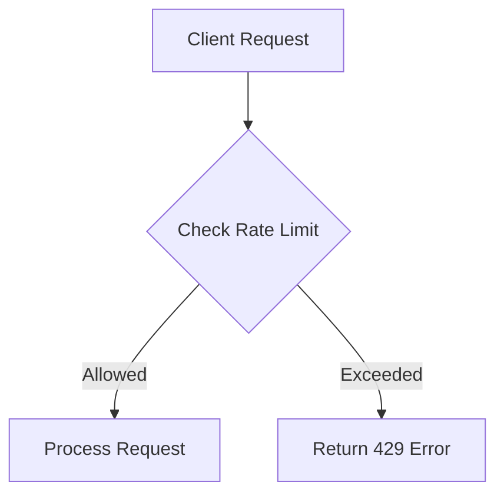
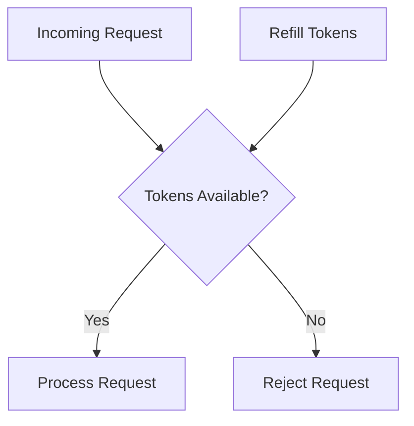

## 13.5 Rate Limiting and Throttling

In the modern software landscape, where applications are increasingly interconnected and reliant on APIs, managing resource consumption is crucial. Rate limiting and throttling are two strategies that help prevent abuse, ensure fair resource usage, and protect systems from being overwhelmed by excessive requests. In this section, we will delve into these concepts, explore their implementation in C#, and provide practical examples to illustrate their use.

### Understanding Rate Limiting and Throttling

**Rate Limiting** is a technique used to control the number of requests a client can make to a server within a specified time frame. It is essential for preventing abuse, such as denial-of-service (DoS) attacks, and ensuring that resources are fairly distributed among users.

**Throttling**, on the other hand, is the process of regulating the rate at which requests are processed. While rate limiting restricts the number of requests, throttling controls the speed of processing these requests to prevent system overload.

#### Key Differences

- **Rate Limiting**: Focuses on the number of requests over time.
- **Throttling**: Focuses on the speed of processing requests.

### Implementing Rate Limiting in C#

Implementing rate limiting in C# can be achieved through various methods, including using middleware, custom attributes, or third-party libraries. Let's explore these approaches in detail.

#### Using Middleware for Rate Limiting

Middleware is a powerful feature in ASP.NET Core that allows developers to handle requests and responses in a pipeline. By using middleware, we can intercept requests and apply rate limiting logic.

```csharp
public class RateLimitingMiddleware
{
    private readonly RequestDelegate _next;
    private static readonly Dictionary<string, DateTime> _requestTimestamps = new Dictionary<string, DateTime>();
    private static readonly int _requestLimit = 100;
    private static readonly TimeSpan _timeWindow = TimeSpan.FromMinutes(1);

    public RateLimitingMiddleware(RequestDelegate next)
    {
        _next = next;
    }

    public async Task InvokeAsync(HttpContext context)
    {
        var clientIp = context.Connection.RemoteIpAddress.ToString();
        if (_requestTimestamps.ContainsKey(clientIp))
        {
            var timeSinceLastRequest = DateTime.UtcNow - _requestTimestamps[clientIp];
            if (timeSinceLastRequest < _timeWindow)
            {
                context.Response.StatusCode = StatusCodes.Status429TooManyRequests;
                return;
            }
        }

        _requestTimestamps[clientIp] = DateTime.UtcNow;
        await _next(context);
    }
}
```

**Explanation**: This middleware tracks the timestamps of requests from each client IP address. If a client exceeds the request limit within the specified time window, a `429 Too Many Requests` status code is returned.

#### Protecting Against Denial-of-Service Attacks

Denial-of-service attacks aim to make a service unavailable by overwhelming it with requests. Rate limiting is an effective way to mitigate such attacks by restricting the number of requests a client can make.

**Example**: Implementing a rate limiter that blocks IP addresses after a certain number of failed login attempts.

```csharp
public class LoginRateLimiter
{
    private static readonly Dictionary<string, int> _failedAttempts = new Dictionary<string, int>();
    private static readonly int _maxAttempts = 5;
    private static readonly TimeSpan _blockDuration = TimeSpan.FromMinutes(15);

    public bool IsBlocked(string ipAddress)
    {
        if (_failedAttempts.ContainsKey(ipAddress) && _failedAttempts[ipAddress] >= _maxAttempts)
        {
            return true;
        }
        return false;
    }

    public void RegisterFailedAttempt(string ipAddress)
    {
        if (!_failedAttempts.ContainsKey(ipAddress))
        {
            _failedAttempts[ipAddress] = 0;
        }
        _failedAttempts[ipAddress]++;
    }

    public void ResetAttempts(string ipAddress)
    {
        if (_failedAttempts.ContainsKey(ipAddress))
        {
            _failedAttempts[ipAddress] = 0;
        }
    }
}
```

**Explanation**: This class tracks failed login attempts by IP address. If the number of failed attempts exceeds the maximum allowed, the IP address is blocked for a specified duration.

### Use Cases and Examples

Rate limiting and throttling are applicable in various scenarios, such as API usage policies and fair resource allocation.

#### API Usage Policies

APIs often have usage policies that define the maximum number of requests a client can make within a given period. This ensures that resources are not monopolized by a single client and that all users have fair access.

**Example**: Implementing API rate limiting using a third-party library like `AspNetCoreRateLimit`.

```csharp
public void ConfigureServices(IServiceCollection services)
{
    services.AddMemoryCache();
    services.Configure<IpRateLimitOptions>(options =>
    {
        options.GeneralRules = new List<RateLimitRule>
        {
            new RateLimitRule
            {
                Endpoint = "*",
                Limit = 1000,
                Period = "1h"
            }
        };
    });
    services.AddInMemoryRateLimiting();
    services.AddSingleton<IRateLimitConfiguration, RateLimitConfiguration>();
}

public void Configure(IApplicationBuilder app, IWebHostEnvironment env)
{
    app.UseIpRateLimiting();
    // Other middleware
}
```

**Explanation**: This configuration uses `AspNetCoreRateLimit` to apply rate limiting rules based on IP addresses. The example limits clients to 1000 requests per hour.

#### Fair Resource Allocation

In systems where resources are limited, such as cloud services or shared databases, rate limiting ensures that no single user consumes more than their fair share.

**Example**: Implementing a token bucket algorithm for rate limiting.

```csharp
public class TokenBucket
{
    private readonly int _capacity;
    private readonly int _tokensPerInterval;
    private readonly TimeSpan _interval;
    private int _tokens;
    private DateTime _lastRefill;

    public TokenBucket(int capacity, int tokensPerInterval, TimeSpan interval)
    {
        _capacity = capacity;
        _tokensPerInterval = tokensPerInterval;
        _interval = interval;
        _tokens = capacity;
        _lastRefill = DateTime.UtcNow;
    }

    public bool AllowRequest()
    {
        RefillTokens();
        if (_tokens > 0)
        {
            _tokens--;
            return true;
        }
        return false;
    }

    private void RefillTokens()
    {
        var now = DateTime.UtcNow;
        var timeSinceLastRefill = now - _lastRefill;
        if (timeSinceLastRefill > _interval)
        {
            var refillCount = (int)(timeSinceLastRefill.TotalMilliseconds / _interval.TotalMilliseconds);
            _tokens = Math.Min(_capacity, _tokens + refillCount * _tokensPerInterval);
            _lastRefill = now;
        }
    }
}
```

**Explanation**: The token bucket algorithm allows requests to be processed as long as there are tokens available. Tokens are refilled at a specified rate, ensuring that requests are spread out over time.

### Visualizing Rate Limiting and Throttling

To better understand the flow of rate limiting and throttling, let's visualize these concepts using Mermaid.js diagrams.

#### Rate Limiting Flow



**Description**: This flowchart illustrates the decision-making process in rate limiting. If the rate limit is exceeded, a `429 Too Many Requests` error is returned.

#### Token Bucket Algorithm



**Description**: This diagram represents the token bucket algorithm, where requests are processed if tokens are available. Tokens are refilled periodically.

### Design Considerations

When implementing rate limiting and throttling, consider the following:

- **Granularity**: Decide whether to apply limits globally, per user, or per IP address.
- **Persistence**: Determine if rate limiting data should be stored in memory or a persistent store.
- **Scalability**: Ensure that the rate limiting solution can scale with the number of users and requests.
- **Fairness**: Implement algorithms that ensure fair distribution of resources.

### Differences and Similarities

Rate limiting and throttling are often confused due to their overlapping goals. However, they serve distinct purposes:

- **Rate Limiting**: Focuses on the number of requests over time.
- **Throttling**: Focuses on the speed of processing requests.

Both strategies can be used together to provide comprehensive protection against abuse and ensure fair resource usage.

### Try It Yourself

To gain hands-on experience with rate limiting and throttling, try modifying the code examples provided:

- **Experiment with different time windows and request limits** in the middleware example.
- **Implement a leaky bucket algorithm** as an alternative to the token bucket.
- **Integrate rate limiting with a database** to persist request data across server restarts.

### Knowledge Check

- **What is the primary purpose of rate limiting?**
- **How does throttling differ from rate limiting?**
- **What are some common use cases for rate limiting?**

### Embrace the Journey

Remember, mastering rate limiting and throttling is just one step in building robust and secure applications. As you progress, you'll encounter more complex scenarios that require a combination of strategies. Keep experimenting, stay curious, and enjoy the journey!

## Quiz Time!



### What is the primary purpose of rate limiting?

- [x] To control the number of requests a client can make within a specified time frame.
- [ ] To increase the speed of processing requests.
- [ ] To enhance the user interface.
- [ ] To improve database performance.

> **Explanation:** Rate limiting is used to control the number of requests a client can make within a specified time frame, preventing abuse and ensuring fair resource usage.

### How does throttling differ from rate limiting?

- [x] Throttling controls the speed of processing requests, while rate limiting controls the number of requests.
- [ ] Throttling increases the number of requests, while rate limiting decreases them.
- [ ] Throttling is used for database optimization, while rate limiting is for UI enhancement.
- [ ] Throttling and rate limiting are the same.

> **Explanation:** Throttling controls the speed of processing requests, while rate limiting controls the number of requests a client can make.

### Which HTTP status code is commonly used to indicate that a rate limit has been exceeded?

- [x] 429
- [ ] 404
- [ ] 500
- [ ] 200

> **Explanation:** The HTTP status code 429 is used to indicate that a rate limit has been exceeded.

### What is a common algorithm used for rate limiting?

- [x] Token Bucket
- [ ] Bubble Sort
- [ ] Quick Sort
- [ ] Binary Search

> **Explanation:** The Token Bucket algorithm is commonly used for rate limiting to control the flow of requests.

### In the context of rate limiting, what does the term "granularity" refer to?

- [x] The level at which limits are applied, such as globally, per user, or per IP address.
- [ ] The speed of processing requests.
- [ ] The size of the database.
- [ ] The complexity of the user interface.

> **Explanation:** Granularity refers to the level at which rate limits are applied, such as globally, per user, or per IP address.

### What is the purpose of using middleware for rate limiting in ASP.NET Core?

- [x] To intercept requests and apply rate limiting logic.
- [ ] To enhance the user interface.
- [ ] To improve database performance.
- [ ] To increase the number of requests.

> **Explanation:** Middleware in ASP.NET Core is used to intercept requests and apply rate limiting logic.

### Which of the following is a benefit of implementing rate limiting?

- [x] Preventing abuse and ensuring fair resource usage.
- [ ] Increasing the number of requests.
- [ ] Enhancing the user interface.
- [ ] Improving database performance.

> **Explanation:** Rate limiting helps prevent abuse and ensures fair resource usage by controlling the number of requests.

### What is the primary goal of the token bucket algorithm?

- [x] To allow requests to be processed as long as there are tokens available.
- [ ] To increase the speed of processing requests.
- [ ] To enhance the user interface.
- [ ] To improve database performance.

> **Explanation:** The token bucket algorithm allows requests to be processed as long as there are tokens available, controlling the flow of requests.

### How can rate limiting help protect against denial-of-service attacks?

- [x] By restricting the number of requests a client can make, preventing system overload.
- [ ] By increasing the speed of processing requests.
- [ ] By enhancing the user interface.
- [ ] By improving database performance.

> **Explanation:** Rate limiting restricts the number of requests a client can make, preventing system overload and protecting against denial-of-service attacks.

### True or False: Rate limiting and throttling can be used together to provide comprehensive protection against abuse.

- [x] True
- [ ] False

> **Explanation:** Rate limiting and throttling can be used together to provide comprehensive protection against abuse and ensure fair resource usage.


