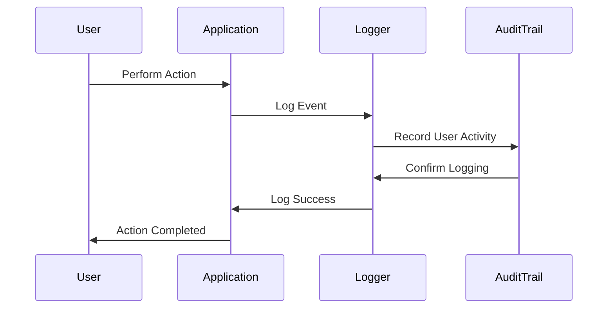

## 13.6 Logging and Auditing

In the realm of software engineering, logging and auditing are critical components for maintaining the security, reliability, and compliance of applications. They provide insights into application behavior, help diagnose issues, and ensure accountability by tracking user activities. In this section, we will delve into the best practices for implementing logging and auditing in C#, focusing on secure logging practices and audit trails for compliance.

### Introduction to Logging and Auditing

Logging and auditing serve different but complementary purposes in software systems:

- **Logging**: The process of recording information about the application's runtime behavior. Logs are primarily used for debugging, monitoring, and performance analysis.
- **Auditing**: The systematic process of tracking and recording user activities and system changes to ensure accountability and compliance with legal and regulatory standards.

### Secure Logging Practices

Secure logging is essential to protect sensitive information and ensure that logs themselves do not become a security vulnerability. Let's explore some key practices for secure logging in C#.

#### Logging Essential Information

When implementing logging, it is crucial to determine what information is essential and should be logged. Here are some guidelines:

- **Error and Exception Details**: Log errors and exceptions with sufficient detail to diagnose issues without exposing sensitive information.
- **Application Events**: Record significant application events, such as startup, shutdown, and configuration changes.
- **User Actions**: Log user actions that are critical for auditing purposes, such as login attempts, data modifications, and access to sensitive resources.

#### Avoiding Logging Sensitive Data

One of the most critical aspects of secure logging is ensuring that sensitive data is not inadvertently logged. This includes:

- **Personal Identifiable Information (PII)**: Avoid logging data such as social security numbers, credit card details, and passwords.
- **Authentication Credentials**: Never log passwords or security tokens. Use secure hash functions if you need to log authentication-related information.
- **Sensitive Business Data**: Be cautious about logging proprietary or sensitive business information.

#### Implementing Secure Logging in C#

To implement secure logging in C#, we can use libraries such as `NLog`, `Serilog`, or `log4net`. These libraries provide robust features for managing log levels, formatting, and output destinations.

Here's an example of using Serilog to implement secure logging:

```csharp
using Serilog;

public class LoggingExample
{
    public static void Main(string[] args)
    {
        // Configure Serilog
        Log.Logger = new LoggerConfiguration()
            .MinimumLevel.Information()
            .WriteTo.Console()
            .WriteTo.File("logs/log.txt", rollingInterval: RollingInterval.Day)
            .CreateLogger();

        try
        {
            Log.Information("Application started.");
            // Simulate application logic
            PerformSensitiveOperation();
        }
        catch (Exception ex)
        {
            Log.Error(ex, "An error occurred during operation.");
        }
        finally
        {
            Log.Information("Application ended.");
            Log.CloseAndFlush();
        }
    }

    private static void PerformSensitiveOperation()
    {
        // Simulate an operation that could throw an exception
        throw new InvalidOperationException("Simulated exception.");
    }
}
```

In this example, we configure Serilog to log information to both the console and a file, ensuring that sensitive operations are logged without exposing sensitive data.

### Audit Trails and Compliance

Audit trails are essential for tracking user activities and ensuring compliance with regulatory requirements. They provide a chronological record of events that can be used to verify the integrity and security of a system.

#### Tracking User Activities

To effectively track user activities, consider the following practices:

- **User Identification**: Ensure that each log entry related to user activity includes a unique identifier for the user, such as a user ID or username.
- **Timestamping**: Include precise timestamps for each log entry to facilitate chronological analysis.
- **Action Details**: Record the specific actions performed by users, including the context and outcome of each action.

#### Meeting Regulatory Requirements

Compliance with regulatory requirements, such as GDPR, HIPAA, and PCI-DSS, often mandates specific logging and auditing practices. Here are some considerations:

- **Data Retention**: Define and implement a data retention policy that complies with regulatory requirements, specifying how long logs should be retained and when they should be purged.
- **Access Controls**: Implement strict access controls to ensure that only authorized personnel can access logs and audit trails.
- **Integrity and Tamper-Proofing**: Use cryptographic techniques to ensure the integrity of logs and prevent tampering.

### Implementing Audit Trails in C#

To implement audit trails in C#, we can extend our logging framework to include additional metadata and ensure compliance with regulatory standards.

Here's an example of implementing audit trails using Serilog:

```csharp
using Serilog;
using System;

public class AuditTrailExample
{
    public static void Main(string[] args)
    {
        // Configure Serilog for audit logging
        Log.Logger = new LoggerConfiguration()
            .MinimumLevel.Information()
            .Enrich.WithProperty("Application", "AuditTrailExample")
            .WriteTo.Console()
            .WriteTo.File("logs/audit.txt", rollingInterval: RollingInterval.Day)
            .CreateLogger();

        // Simulate user actions
        LogUserAction("User123", "Login", "Success");
        LogUserAction("User123", "AccessSensitiveData", "Failure");

        Log.CloseAndFlush();
    }

    private static void LogUserAction(string userId, string action, string outcome)
    {
        Log.Information("User Action: {UserId} performed {Action} with outcome {Outcome}",
            userId, action, outcome);
    }
}
```

In this example, we enrich the log entries with additional metadata, such as the application name, and log user actions with specific details.

### Visualizing Logging and Auditing Processes

To better understand the flow of logging and auditing processes, let's visualize the architecture using a sequence diagram.



**Diagram Description**: This sequence diagram illustrates the interaction between a user, the application, the logging system, and the audit trail. It shows how user actions are logged and recorded in the audit trail, ensuring accountability and compliance.

### Best Practices for Logging and Auditing

To ensure effective logging and auditing, consider the following best practices:

- **Log Levels**: Use appropriate log levels (e.g., Debug, Information, Warning, Error, Critical) to categorize log entries based on their severity and importance.
- **Structured Logging**: Use structured logging to capture log data in a consistent format, making it easier to query and analyze.
- **Centralized Logging**: Implement centralized logging solutions, such as ELK Stack or Splunk, to aggregate and analyze logs from multiple sources.
- **Monitoring and Alerts**: Set up monitoring and alerting mechanisms to detect anomalies and potential security incidents in real-time.

### Knowledge Check

Before we conclude, let's reinforce our understanding with a few questions:

1. What is the primary purpose of logging in software systems?
2. Why is it important to avoid logging sensitive data?
3. How can audit trails help ensure compliance with regulatory requirements?
4. What are some best practices for implementing secure logging in C#?

### Conclusion

Logging and auditing are indispensable tools for maintaining the security, reliability, and compliance of software systems. By implementing secure logging practices and comprehensive audit trails, we can ensure accountability, diagnose issues, and meet regulatory requirements. As we continue to build and maintain complex applications, let's remember the importance of logging and auditing in safeguarding our systems and data.

### Embrace the Journey

Remember, this is just the beginning. As you progress, you'll build more secure and compliant applications. Keep experimenting, stay curious, and enjoy the journey!

## Quiz Time!



### What is the primary purpose of logging in software systems?

- [x] To record information about the application's runtime behavior.
- [ ] To store user credentials securely.
- [ ] To encrypt sensitive data.
- [ ] To manage user permissions.

> **Explanation:** Logging is primarily used to record information about the application's runtime behavior for debugging, monitoring, and performance analysis.

### Why is it important to avoid logging sensitive data?

- [x] To prevent unauthorized access to sensitive information.
- [ ] To reduce the size of log files.
- [ ] To improve application performance.
- [ ] To comply with open-source licensing.

> **Explanation:** Avoiding logging sensitive data is crucial to prevent unauthorized access and ensure compliance with privacy regulations.

### How can audit trails help ensure compliance with regulatory requirements?

- [x] By providing a chronological record of user activities and system changes.
- [ ] By encrypting all application data.
- [ ] By reducing application load times.
- [ ] By optimizing database queries.

> **Explanation:** Audit trails provide a chronological record of user activities and system changes, which is essential for verifying compliance with regulatory standards.

### What are some best practices for implementing secure logging in C#?

- [x] Use structured logging and appropriate log levels.
- [ ] Log all user passwords for security.
- [ ] Disable logging in production environments.
- [ ] Use unstructured text files for logs.

> **Explanation:** Best practices include using structured logging, appropriate log levels, and ensuring logs are secure and accessible for analysis.

### Which of the following is NOT a benefit of centralized logging?

- [ ] Easier aggregation of logs from multiple sources.
- [ ] Simplified analysis and querying of log data.
- [x] Increased complexity in log management.
- [ ] Enhanced monitoring and alerting capabilities.

> **Explanation:** Centralized logging simplifies log management, making it easier to aggregate, analyze, and monitor logs from multiple sources.

### What should be included in a log entry related to user activity?

- [x] User identifier, timestamp, and action details.
- [ ] User's password and security token.
- [ ] User's personal identifiable information.
- [ ] User's browsing history.

> **Explanation:** Log entries related to user activity should include a user identifier, timestamp, and action details to ensure accountability and traceability.

### What is the role of cryptographic techniques in logging?

- [x] To ensure the integrity and prevent tampering of logs.
- [ ] To compress log files for storage efficiency.
- [ ] To anonymize user data in logs.
- [ ] To enhance log readability.

> **Explanation:** Cryptographic techniques are used to ensure the integrity of logs and prevent unauthorized tampering.

### What is structured logging?

- [x] Capturing log data in a consistent format for easier querying and analysis.
- [ ] Logging data in plain text files.
- [ ] Logging only error messages.
- [ ] Logging data without timestamps.

> **Explanation:** Structured logging involves capturing log data in a consistent format, making it easier to query and analyze.

### What is the significance of log levels?

- [x] They categorize log entries based on severity and importance.
- [ ] They determine the encryption level of log files.
- [ ] They specify the storage location for logs.
- [ ] They define the user access permissions for logs.

> **Explanation:** Log levels categorize log entries based on their severity and importance, helping prioritize log analysis and response.

### True or False: Audit trails are only necessary for financial applications.

- [ ] True
- [x] False

> **Explanation:** Audit trails are necessary for any application that requires accountability and compliance, not just financial applications.


