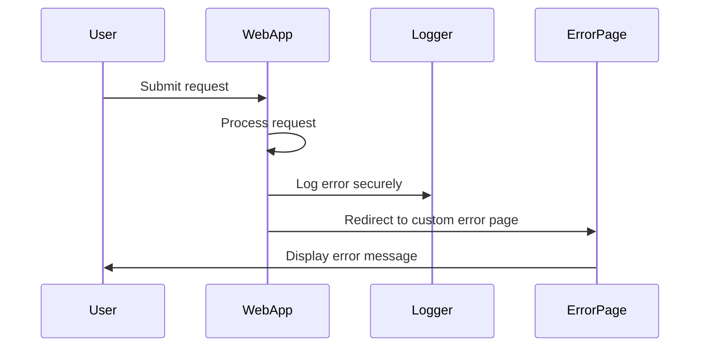

## 13.7 Error Handling and Secure Exception Management

In the realm of software development, especially in enterprise-level applications, error handling and secure exception management are paramount. Properly managing errors not only ensures the robustness and reliability of an application but also protects sensitive information from being exposed to unauthorized users. In this section, we will delve into the intricacies of error handling in C#, explore best practices for secure exception management, and provide guidance on avoiding information leakage through custom error pages and other techniques.

### Understanding Error Handling in C#

Error handling is a critical aspect of software development that involves anticipating, detecting, and responding to errors that occur during the execution of a program. In C#, error handling is primarily achieved through exceptions, which are objects that represent errors or unexpected events.

#### The Basics of Exceptions

An exception in C# is an object that encapsulates information about an error. When an error occurs, an exception is "thrown," and the normal flow of the program is interrupted. The program can then "catch" the exception and take appropriate action.

```csharp
try
{
    // Code that may throw an exception
    int result = Divide(10, 0);
}
catch (DivideByZeroException ex)
{
    // Handle the exception
    Console.WriteLine("Cannot divide by zero.");
}
finally
{
    // Code that runs regardless of whether an exception was thrown
    Console.WriteLine("Execution completed.");
}
```

In this example, the `try` block contains code that may throw an exception. The `catch` block handles the specific `DivideByZeroException`, and the `finally` block contains code that executes regardless of whether an exception was thrown.

#### Types of Exceptions

C# provides a rich hierarchy of exception classes, all of which derive from the base class `System.Exception`. Some common exceptions include:

- `System.Exception`: The base class for all exceptions.
- `System.SystemException`: The base class for system-related exceptions.
- `System.ApplicationException`: The base class for application-related exceptions.
- `System.IO.IOException`: Represents I/O errors.
- `System.NullReferenceException`: Thrown when there is an attempt to dereference a null object reference.

### Best Practices for Exception Handling

To effectively manage exceptions and ensure secure exception management, consider the following best practices:

#### 1. Catch Specific Exceptions

Always catch specific exceptions rather than using a general `catch` block. This approach allows you to handle different types of exceptions appropriately and avoid masking errors.

```csharp
try
{
    // Code that may throw multiple exceptions
}
catch (ArgumentNullException ex)
{
    // Handle ArgumentNullException
}
catch (InvalidOperationException ex)
{
    // Handle InvalidOperationException
}
```

#### 2. Avoid Swallowing Exceptions

Swallowing exceptions by catching them and doing nothing is a common anti-pattern. Always log exceptions or take corrective action to ensure that errors are not silently ignored.

```csharp
catch (Exception ex)
{
    // Log the exception
    Console.WriteLine(ex.Message);
    // Take corrective action
}
```

#### 3. Use Finally Blocks

Use `finally` blocks to release resources or perform cleanup operations, ensuring that these actions occur regardless of whether an exception is thrown.

```csharp
FileStream file = null;
try
{
    file = new FileStream("file.txt", FileMode.Open);
    // Perform file operations
}
finally
{
    if (file != null)
    {
        file.Close();
    }
}
```

#### 4. Rethrow Exceptions Correctly

When rethrowing exceptions, use the `throw` keyword without specifying the exception variable to preserve the original stack trace.

```csharp
catch (Exception ex)
{
    // Log the exception
    Console.WriteLine(ex.Message);
    // Rethrow the exception
    throw;
}
```

### Secure Exception Management

Secure exception management involves handling exceptions in a way that prevents sensitive information from being exposed. This is crucial for maintaining the security and integrity of an application.

#### Avoiding Information Leakage

Information leakage occurs when an application inadvertently exposes sensitive information, such as stack traces, database connection strings, or user data, to unauthorized users. To prevent information leakage, consider the following strategies:

##### Custom Error Pages

Custom error pages provide a user-friendly way to inform users of an error without revealing sensitive details. In ASP.NET, you can configure custom error pages in the `web.config` file.

```xml
<configuration>
  <system.web>
    <customErrors mode="On" defaultRedirect="ErrorPage.aspx">
      <error statusCode="404" redirect="NotFound.aspx" />
      <error statusCode="500" redirect="ServerError.aspx" />
    </customErrors>
  </system.web>
</configuration>
```

##### Logging Sensitive Information Securely

When logging exceptions, ensure that sensitive information is not included in the logs. Use secure logging frameworks that support encryption and access control.

```csharp
try
{
    // Code that may throw an exception
}
catch (Exception ex)
{
    // Log exception securely
    SecureLogger.Log(ex.Message);
}
```

##### Validate and Sanitize Input

Always validate and sanitize user input to prevent injection attacks and other vulnerabilities that could lead to information leakage.

```csharp
public void ProcessInput(string userInput)
{
    if (string.IsNullOrWhiteSpace(userInput))
    {
        throw new ArgumentException("Input cannot be empty.");
    }
    // Sanitize input
    string sanitizedInput = HttpUtility.HtmlEncode(userInput);
    // Process input
}
```

### Implementing Secure Exception Management in C#

Let's explore how to implement secure exception management in a C# application through a practical example.

#### Example: Secure Exception Management in a Web Application

Consider a simple ASP.NET Core web application that processes user input and interacts with a database. We'll implement secure exception management to handle errors gracefully and prevent information leakage.

##### Step 1: Configure Custom Error Pages

First, configure custom error pages in the `Startup.cs` file to handle different types of errors.

```csharp
public void Configure(IApplicationBuilder app, IWebHostEnvironment env)
{
    if (env.IsDevelopment())
    {
        app.UseDeveloperExceptionPage();
    }
    else
    {
        app.UseExceptionHandler("/Home/Error");
        app.UseHsts();
    }
    app.UseHttpsRedirection();
    app.UseStaticFiles();
    app.UseRouting();
    app.UseAuthorization();
    app.UseEndpoints(endpoints =>
    {
        endpoints.MapControllerRoute(
            name: "default",
            pattern: "{controller=Home}/{action=Index}/{id?}");
    });
}
```

Create a custom error page `Error.cshtml` in the `Views/Shared` folder to display a user-friendly error message.

```html
@{
    ViewData["Title"] = "Error";
}

<h1 class="text-danger">Oops! Something went wrong.</h1>
<p>Please try again later or contact support.</p>
```

##### Step 2: Implement Secure Logging

Use a secure logging framework, such as Serilog, to log exceptions without exposing sensitive information.

```csharp
public class HomeController : Controller
{
    private readonly ILogger<HomeController> _logger;

    public HomeController(ILogger<HomeController> logger)
    {
        _logger = logger;
    }

    public IActionResult Index()
    {
        try
        {
            // Simulate an error
            throw new InvalidOperationException("An error occurred.");
        }
        catch (Exception ex)
        {
            _logger.LogError(ex, "An error occurred while processing the request.");
            return RedirectToAction("Error");
        }
    }

    public IActionResult Error()
    {
        return View();
    }
}
```

##### Step 3: Validate and Sanitize User Input

Ensure that all user input is validated and sanitized to prevent injection attacks.

```csharp
[HttpPost]
public IActionResult SubmitForm(string userInput)
{
    if (string.IsNullOrWhiteSpace(userInput))
    {
        ModelState.AddModelError("userInput", "Input cannot be empty.");
        return View();
    }

    string sanitizedInput = HttpUtility.HtmlEncode(userInput);
    // Process sanitized input
    return RedirectToAction("Success");
}
```

### Visualizing Secure Exception Management

To better understand the flow of secure exception management, let's visualize the process using a sequence diagram.



This sequence diagram illustrates how a web application processes a request, logs an error securely, and redirects the user to a custom error page.

### Try It Yourself

To reinforce your understanding of secure exception management, try modifying the code examples provided. Experiment with different types of exceptions, custom error pages, and logging frameworks. Consider the following challenges:

- Implement a custom error page for a specific HTTP status code, such as 404 Not Found.
- Use a different logging framework, such as NLog, to log exceptions.
- Add input validation and sanitization for a different type of user input, such as email addresses.

### Knowledge Check

Before we conclude, let's summarize the key takeaways from this section:

- **Exception Handling**: Use specific catch blocks, avoid swallowing exceptions, and use finally blocks for cleanup.
- **Secure Exception Management**: Prevent information leakage through custom error pages, secure logging, and input validation.
- **Practical Implementation**: Implement secure exception management in web applications using ASP.NET Core.

### Embrace the Journey

Remember, mastering error handling and secure exception management is an ongoing journey. As you continue to develop your skills, you'll build more robust and secure applications. Keep experimenting, stay curious, and enjoy the process!

## Quiz Time!



### What is the primary purpose of exception handling in C#?

- [x] To manage errors and ensure the robustness of an application
- [ ] To increase the performance of an application
- [ ] To enhance the user interface design
- [ ] To simplify the code structure

> **Explanation:** Exception handling is used to manage errors and ensure the robustness and reliability of an application.

### Which of the following is a best practice for exception handling?

- [x] Catch specific exceptions
- [ ] Use a general catch block for all exceptions
- [ ] Swallow exceptions without logging
- [ ] Avoid using finally blocks

> **Explanation:** Catching specific exceptions allows you to handle different types of errors appropriately.

### What is information leakage in the context of secure exception management?

- [x] Exposing sensitive information to unauthorized users
- [ ] Logging errors to a secure location
- [ ] Using custom error pages
- [ ] Validating user input

> **Explanation:** Information leakage occurs when sensitive information is exposed to unauthorized users.

### How can custom error pages help prevent information leakage?

- [x] By displaying user-friendly error messages without revealing sensitive details
- [ ] By logging errors to a file
- [ ] By increasing application performance
- [ ] By simplifying the code structure

> **Explanation:** Custom error pages display user-friendly error messages without revealing sensitive details.

### What is the purpose of the finally block in exception handling?

- [x] To execute code regardless of whether an exception was thrown
- [ ] To catch specific exceptions
- [ ] To log errors securely
- [ ] To validate user input

> **Explanation:** The finally block is used to execute code regardless of whether an exception was thrown.

### Which logging framework is mentioned in the article for secure logging?

- [x] Serilog
- [ ] Log4Net
- [ ] NLog
- [ ] ELMAH

> **Explanation:** Serilog is mentioned in the article as a secure logging framework.

### What should you do when rethrowing an exception to preserve the original stack trace?

- [x] Use the throw keyword without specifying the exception variable
- [ ] Use the throw keyword with the exception variable
- [ ] Log the exception before rethrowing
- [ ] Catch the exception in a general catch block

> **Explanation:** Using the throw keyword without specifying the exception variable preserves the original stack trace.

### Why is input validation important in secure exception management?

- [x] To prevent injection attacks and other vulnerabilities
- [ ] To increase application performance
- [ ] To simplify the code structure
- [ ] To enhance the user interface design

> **Explanation:** Input validation is important to prevent injection attacks and other vulnerabilities.

### What is the role of secure logging in exception management?

- [x] To log exceptions without exposing sensitive information
- [ ] To increase application performance
- [ ] To simplify the code structure
- [ ] To enhance the user interface design

> **Explanation:** Secure logging ensures that exceptions are logged without exposing sensitive information.

### True or False: Swallowing exceptions is a recommended practice in exception handling.

- [ ] True
- [x] False

> **Explanation:** Swallowing exceptions is not recommended as it can lead to silent failures and unhandled errors.


