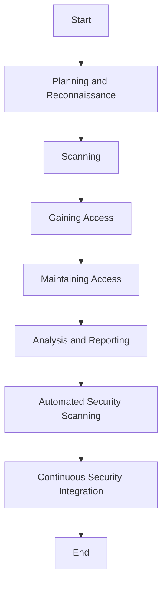

## 13.8 Security Testing

In today's digital landscape, ensuring the security of applications is paramount. As expert software engineers and enterprise architects, we must adopt a systematic approach to security testing to safeguard our applications against potential threats. This section delves into the intricacies of security testing, focusing on penetration testing, automated security scanning, and continuous security integration.

### Introduction to Security Testing

Security testing is a critical process that identifies vulnerabilities, threats, and risks in software applications. It ensures that the software is free from any loopholes that could be exploited by attackers. The primary goal of security testing is to uncover potential weaknesses in the system's security mechanisms and to ensure that data remains protected.

#### Key Objectives of Security Testing

- **Identify Vulnerabilities**: Detect security weaknesses in the application.
- **Assess Risk Levels**: Evaluate the potential impact of identified vulnerabilities.
- **Ensure Compliance**: Verify adherence to security standards and regulations.
- **Protect Data Integrity**: Safeguard sensitive information from unauthorized access.
- **Enhance Security Posture**: Strengthen the overall security framework of the application.

### Penetration Testing

Penetration testing, often referred to as "pen testing," is a simulated cyber attack against your application to check for exploitable vulnerabilities. It involves a comprehensive analysis of the system to identify security gaps that could be exploited by malicious actors.

#### The Penetration Testing Process

1. **Planning and Reconnaissance**: Define the scope and objectives of the test. Gather intelligence to understand how a target application works and its potential vulnerabilities.

2. **Scanning**: Use tools to identify how the application responds to various intrusion attempts. This includes static analysis (inspecting the code) and dynamic analysis (inspecting the running code).

3. **Gaining Access**: Attempt to exploit vulnerabilities to understand the damage they can cause. This phase involves web application attacks, such as cross-site scripting (XSS), SQL injection, and backdoors.

4. **Maintaining Access**: Determine if the vulnerability can be used to achieve a persistent presence in the exploited system. This step is used to mimic advanced persistent threats, which often remain in a system for months to steal sensitive data.

5. **Analysis and Reporting**: Compile a detailed report outlining the vulnerabilities discovered, data accessed, and the time the tester was able to remain in the system undetected. Provide recommendations for mitigating these vulnerabilities.

#### Tools and Methodologies for Penetration Testing

- **Metasploit**: A popular framework for developing and executing exploit code against a remote target machine.
- **Nmap**: A network scanner used to discover hosts and services on a computer network.
- **Burp Suite**: An integrated platform for performing security testing of web applications.
- **Wireshark**: A network protocol analyzer that captures and displays data packets for analysis.

#### Code Example: Simulating a SQL Injection Attack

```csharp
// Example of a vulnerable C# code snippet susceptible to SQL Injection
string userInput = "1 OR 1=1"; // Malicious input
string query = "SELECT * FROM Users WHERE UserId = " + userInput;

// Secure version using parameterized queries
using (SqlConnection connection = new SqlConnection(connectionString))
{
    SqlCommand command = new SqlCommand("SELECT * FROM Users WHERE UserId = @UserId", connection);
    command.Parameters.AddWithValue("@UserId", userInput);
    connection.Open();
    SqlDataReader reader = command.ExecuteReader();
    // Process data
}
```

In the above example, the initial query is vulnerable to SQL injection. By using parameterized queries, we can mitigate this risk.

### Automated Security Scanning

Automated security scanning involves using tools to automatically detect vulnerabilities in an application. These tools can be integrated into the development process to provide continuous feedback on security issues.

#### Benefits of Automated Security Scanning

- **Efficiency**: Quickly scans large codebases to identify vulnerabilities.
- **Consistency**: Provides consistent results, reducing human error.
- **Continuous Integration**: Easily integrates into CI/CD pipelines for ongoing security checks.
- **Comprehensive Coverage**: Scans for a wide range of vulnerabilities, including OWASP Top Ten.

#### Popular Automated Security Scanning Tools

- **OWASP ZAP (Zed Attack Proxy)**: An open-source tool for finding vulnerabilities in web applications.
- **Snyk**: A tool that finds and fixes vulnerabilities in open source dependencies.
- **SonarQube**: An open-source platform for continuous inspection of code quality.
- **Veracode**: A cloud-based platform for static and dynamic application security testing.

#### Implementing Automated Security Scanning in C#

Let's explore how to integrate OWASP ZAP into a C# application for automated security scanning.

1. **Set Up OWASP ZAP**: Download and install OWASP ZAP from the [official website](https://www.zaproxy.org/).

2. **Configure ZAP for Scanning**: Set up ZAP to scan your application by configuring the target URL and scan policies.

3. **Automate Scanning with Scripts**: Use scripts to automate the scanning process. Below is an example of a Python script to automate ZAP scanning.

```python
import requests

zap_url = 'http://localhost:8080'
zap_api_key = 'your_api_key'

target = 'http://yourapplication.com'

requests.get(f'{zap_url}/JSON/core/action/newSession/', params={'apikey': zap_api_key})

requests.get(f'{zap_url}/JSON/spider/action/scan/', params={'apikey': zap_api_key, 'url': target})

while int(requests.get(f'{zap_url}/JSON/spider/view/status/', params={'apikey': zap_api_key}).json()['status']) < 100:
    time.sleep(5)

requests.get(f'{zap_url}/JSON/ascan/action/scan/', params={'apikey': zap_api_key, 'url': target})

while int(requests.get(f'{zap_url}/JSON/ascan/view/status/', params={'apikey': zap_api_key}).json()['status']) < 100:
    time.sleep(5)

alerts = requests.get(f'{zap_url}/JSON/core/view/alerts/', params={'apikey': zap_api_key}).json()
print(alerts)
```

This script demonstrates how to automate security scanning using OWASP ZAP. It starts a new session, performs a spider scan, and then an active scan, finally retrieving the results.

### Continuous Security Integration

Continuous security integration involves embedding security testing into the CI/CD pipeline. This ensures that security checks are performed automatically with every code change, reducing the risk of vulnerabilities being introduced into production.

#### Steps to Implement Continuous Security Integration

1. **Integrate Security Tools**: Incorporate security scanning tools into your CI/CD pipeline. Tools like OWASP ZAP and Snyk can be integrated with Jenkins, GitLab CI, or Azure DevOps.

2. **Automate Security Tests**: Write automated tests for security features and integrate them into the pipeline. This includes tests for authentication, authorization, and input validation.

3. **Monitor and Report**: Set up monitoring and reporting mechanisms to track security issues. Use dashboards to visualize security metrics and trends.

4. **Respond to Security Alerts**: Establish a process for responding to security alerts. This includes triaging issues, assigning them to the appropriate team members, and tracking their resolution.

#### Example: Integrating Security Scanning into a Jenkins Pipeline

```groovy
pipeline {
    agent any

    stages {
        stage('Checkout') {
            steps {
                checkout scm
            }
        }

        stage('Build') {
            steps {
                sh 'dotnet build'
            }
        }

        stage('Security Scan') {
            steps {
                script {
                    def zap = docker.image('owasp/zap2docker-stable')
                    zap.inside {
                        sh 'zap-baseline.py -t http://yourapplication.com -r report.html'
                    }
                }
            }
        }

        stage('Test') {
            steps {
                sh 'dotnet test'
            }
        }

        stage('Deploy') {
            steps {
                sh 'dotnet publish'
            }
        }
    }
}
```

In this Jenkins pipeline, we integrate OWASP ZAP for security scanning. The `zap-baseline.py` script is used to perform a baseline scan of the application.

### Visualizing Security Testing Workflow

To better understand the security testing workflow, let's visualize the process using a Mermaid.js flowchart.



This flowchart illustrates the sequential steps involved in security testing, from planning to continuous integration.

### Knowledge Check

To reinforce your understanding of security testing, consider the following questions:

- What are the key objectives of security testing?
- How does penetration testing differ from automated security scanning?
- What are the benefits of integrating security testing into the CI/CD pipeline?

### Try It Yourself

Experiment with the code examples provided in this section. Modify the SQL injection example to test different types of vulnerabilities. Set up OWASP ZAP and automate a security scan for your own application. Integrate security scanning into your CI/CD pipeline and observe the results.

### Conclusion

Security testing is an essential component of software development, ensuring that applications remain secure and resilient against potential threats. By adopting a systematic approach to security testing, including penetration testing, automated security scanning, and continuous security integration, we can enhance the security posture of our applications and protect sensitive data.

Remember, this is just the beginning. As you progress, you'll build more secure and robust applications. Keep experimenting, stay curious, and enjoy the journey!

## Quiz Time!



### What is the primary goal of security testing?

- [x] To uncover potential weaknesses in the system's security mechanisms
- [ ] To improve application performance
- [ ] To enhance user interface design
- [ ] To increase application scalability

> **Explanation:** The primary goal of security testing is to uncover potential weaknesses in the system's security mechanisms and ensure data protection.

### Which phase of penetration testing involves attempting to exploit vulnerabilities?

- [ ] Planning and Reconnaissance
- [ ] Scanning
- [x] Gaining Access
- [ ] Analysis and Reporting

> **Explanation:** The "Gaining Access" phase involves attempting to exploit vulnerabilities to understand the damage they can cause.

### What is a benefit of automated security scanning?

- [x] Provides consistent results, reducing human error
- [ ] Requires manual intervention for each scan
- [ ] Only scans small codebases
- [ ] Cannot be integrated into CI/CD pipelines

> **Explanation:** Automated security scanning provides consistent results, reducing human error, and can be integrated into CI/CD pipelines.

### Which tool is commonly used for network scanning in penetration testing?

- [ ] Metasploit
- [x] Nmap
- [ ] Burp Suite
- [ ] Wireshark

> **Explanation:** Nmap is a network scanner used to discover hosts and services on a computer network.

### What is the purpose of continuous security integration?

- [ ] To perform security checks manually
- [x] To embed security testing into the CI/CD pipeline
- [ ] To enhance application aesthetics
- [ ] To increase application load time

> **Explanation:** Continuous security integration involves embedding security testing into the CI/CD pipeline to ensure ongoing security checks.

### Which tool is used for finding vulnerabilities in web applications?

- [x] OWASP ZAP
- [ ] SonarQube
- [ ] Veracode
- [ ] Snyk

> **Explanation:** OWASP ZAP is an open-source tool for finding vulnerabilities in web applications.

### What is the first step in the penetration testing process?

- [x] Planning and Reconnaissance
- [ ] Scanning
- [ ] Gaining Access
- [ ] Analysis and Reporting

> **Explanation:** The first step in the penetration testing process is Planning and Reconnaissance, where the scope and objectives of the test are defined.

### How can SQL injection vulnerabilities be mitigated?

- [ ] By using string concatenation
- [x] By using parameterized queries
- [ ] By ignoring user input
- [ ] By increasing server resources

> **Explanation:** SQL injection vulnerabilities can be mitigated by using parameterized queries, which prevent malicious input from being executed as SQL commands.

### What does OWASP stand for?

- [x] Open Web Application Security Project
- [ ] Online Web Application Security Program
- [ ] Open Web Application Safety Project
- [ ] Online Web Application Safety Program

> **Explanation:** OWASP stands for Open Web Application Security Project, which is a nonprofit foundation that works to improve the security of software.

### True or False: Automated security scanning can only be performed on completed applications.

- [ ] True
- [x] False

> **Explanation:** False. Automated security scanning can be performed at various stages of development, not just on completed applications.


