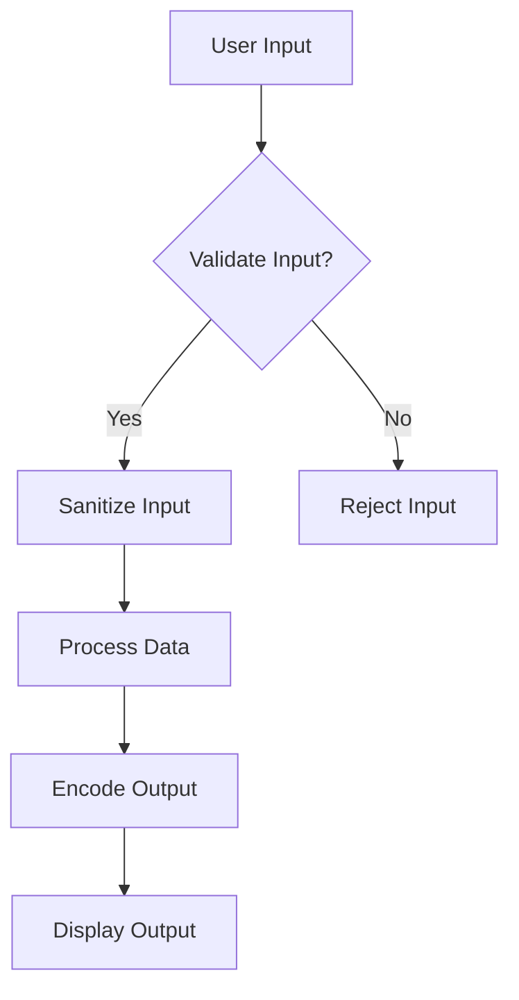

## 13.9 Secure Coding Practices

In today's digital landscape, security is paramount. As expert software engineers and enterprise architects, it is crucial to integrate secure coding practices into your development process. This section will guide you through essential secure coding practices in C#, focusing on adhering to security standards and guidelines, following OWASP guidelines, and incorporating security into code reviews. By mastering these practices, you can safeguard your applications against vulnerabilities and ensure robust security.

### Introduction to Secure Coding Practices

Secure coding practices are a set of guidelines and techniques that help developers write code that is resistant to vulnerabilities and attacks. These practices are essential for protecting sensitive data, maintaining user trust, and ensuring compliance with legal and regulatory requirements. In this section, we will explore key secure coding practices in C#, focusing on OWASP guidelines and code review strategies.

### Understanding OWASP Guidelines

The Open Web Application Security Project (OWASP) is a nonprofit organization dedicated to improving software security. OWASP provides a comprehensive set of guidelines and resources to help developers identify and mitigate security risks. One of the most well-known resources is the OWASP Top 10, which highlights the most critical security risks for web applications.

#### OWASP Top 10 Security Risks

The OWASP Top 10 is a list of the most common and critical security risks that developers should be aware of. Understanding these risks is the first step in implementing secure coding practices. Let's explore each risk and how it applies to C# development:

1. **Injection**: Injection flaws, such as SQL injection, occur when untrusted data is sent to an interpreter as part of a command or query. In C#, use parameterized queries and stored procedures to prevent injection attacks.

2. **Broken Authentication**: This risk involves vulnerabilities in authentication mechanisms. Implement strong password policies, use multi-factor authentication, and securely store credentials in C# applications.

3. **Sensitive Data Exposure**: Sensitive data, such as personal information and credit card numbers, must be protected. Use encryption and secure protocols (e.g., HTTPS) to protect data in transit and at rest.

4. **XML External Entities (XXE)**: XXE attacks occur when XML input containing a reference to an external entity is processed by a weakly configured XML parser. In C#, disable external entity processing in XML parsers to mitigate this risk.

5. **Broken Access Control**: This risk involves unauthorized access to resources. Implement role-based access control (RBAC) and validate user permissions in C# applications.

6. **Security Misconfiguration**: Security misconfigurations can occur at any level of an application stack. Regularly update libraries and frameworks, and use secure defaults in C# applications.

7. **Cross-Site Scripting (XSS)**: XSS attacks occur when untrusted data is included in web pages without proper validation or escaping. Use encoding libraries in C# to prevent XSS vulnerabilities.

8. **Insecure Deserialization**: Insecure deserialization can lead to remote code execution. Use secure serialization libraries in C# and validate deserialized data.

9. **Using Components with Known Vulnerabilities**: Ensure that all components, including libraries and frameworks, are up-to-date and free from known vulnerabilities.

10. **Insufficient Logging and Monitoring**: Implement comprehensive logging and monitoring in C# applications to detect and respond to security incidents.

#### Implementing Recommended Controls

To address the OWASP Top 10 security risks, developers should implement recommended controls in their C# applications. Here are some key controls to consider:

- **Input Validation**: Validate all user inputs to ensure they meet expected formats and constraints. Use regular expressions and data annotations in C# to enforce input validation.

- **Output Encoding**: Encode output data to prevent injection attacks. Use libraries such as `System.Web.HttpUtility` for HTML encoding in C#.

- **Secure Session Management**: Use secure session management practices, such as setting secure cookies and implementing session timeouts, to protect user sessions.

- **Error Handling**: Implement proper error handling to prevent information leakage. Use try-catch blocks in C# to handle exceptions gracefully.

- **Secure Configuration**: Use secure configuration settings, such as disabling unnecessary features and services, to reduce the attack surface of your application.

- **Access Control**: Implement fine-grained access control mechanisms to restrict access to sensitive resources. Use the `Authorize` attribute in ASP.NET Core to enforce access control in C# applications.

### Code Review for Security

Code reviews are an essential part of the software development process, providing an opportunity to identify and address security vulnerabilities before they reach production. Incorporating security into code reviews involves a collaborative approach to identifying and mitigating security risks.

#### Incorporating Security into Code Reviews

To effectively incorporate security into code reviews, consider the following strategies:

- **Security Checklists**: Use security checklists to guide code reviews and ensure that all security aspects are covered. Checklists can include items such as input validation, output encoding, and secure session management.

- **Automated Tools**: Use automated tools to scan code for security vulnerabilities. Tools such as SonarQube and Checkmarx can help identify common security issues in C# code.

- **Collaborative Mitigation Strategies**: Encourage collaboration among team members to develop mitigation strategies for identified vulnerabilities. This collaborative approach fosters a culture of security awareness and continuous improvement.

- **Threat Modeling**: Conduct threat modeling sessions to identify potential security threats and vulnerabilities. Use tools such as Microsoft Threat Modeling Tool to visualize and analyze security threats in C# applications.

#### Example Code Review Checklist

Here is an example code review checklist for C# applications:

- [ ] Are all user inputs validated and sanitized?
- [ ] Is output data properly encoded to prevent injection attacks?
- [ ] Are authentication and authorization mechanisms implemented securely?
- [ ] Are sensitive data and credentials stored securely?
- [ ] Are error messages and exceptions handled properly to prevent information leakage?
- [ ] Are third-party libraries and components up-to-date and free from known vulnerabilities?
- [ ] Is logging and monitoring implemented to detect and respond to security incidents?

### Secure Coding Practices in C#

Secure coding practices in C# involve a combination of techniques and strategies to protect applications from security vulnerabilities. Let's explore some key practices:

#### Input Validation and Sanitization

Input validation and sanitization are critical for preventing injection attacks and other security vulnerabilities. In C#, use data annotations and regular expressions to validate user inputs. Here's an example of input validation using data annotations:

```csharp
using System.ComponentModel.DataAnnotations;

public class User
{
    [Required]
    [StringLength(50, MinimumLength = 3)]
    public string Username { get; set; }

    [Required]
    [EmailAddress]
    public string Email { get; set; }

    [Required]
    [RegularExpression(@"^(?=.*[A-Za-z])(?=.*\d)[A-Za-z\d]{8,}$", ErrorMessage = "Password must be at least 8 characters long and contain both letters and numbers.")]
    public string Password { get; set; }
}
```

In this example, we use data annotations to enforce input validation rules for the `User` class. The `Username` property must be between 3 and 50 characters long, the `Email` property must be a valid email address, and the `Password` property must be at least 8 characters long and contain both letters and numbers.

#### Output Encoding

Output encoding is essential for preventing cross-site scripting (XSS) attacks. In C#, use the `System.Web.HttpUtility` class to encode output data. Here's an example of HTML encoding:

```csharp
using System.Web;

public class HtmlEncoder
{
    public string Encode(string input)
    {
        return HttpUtility.HtmlEncode(input);
    }
}
```

In this example, we use the `HtmlEncode` method to encode user input before displaying it on a web page. This prevents malicious scripts from being executed in the user's browser.

#### Secure Session Management

Secure session management involves protecting user sessions from hijacking and other attacks. In C#, use secure cookies and implement session timeouts to enhance session security. Here's an example of setting a secure cookie in ASP.NET Core:

```csharp
public void ConfigureServices(IServiceCollection services)
{
    services.ConfigureApplicationCookie(options =>
    {
        options.Cookie.HttpOnly = true;
        options.Cookie.SecurePolicy = CookieSecurePolicy.Always;
        options.Cookie.SameSite = SameSiteMode.Strict;
        options.ExpireTimeSpan = TimeSpan.FromMinutes(30);
    });
}
```

In this example, we configure the application cookie to be HTTP-only, secure, and have a strict same-site policy. We also set the cookie expiration time to 30 minutes to limit the duration of user sessions.

#### Error Handling and Logging

Proper error handling and logging are essential for preventing information leakage and detecting security incidents. In C#, use try-catch blocks to handle exceptions gracefully and implement logging to capture security-related events. Here's an example of error handling and logging using Serilog:

```csharp
using System;
using Serilog;

public class ErrorHandler
{
    private static readonly ILogger Logger = Log.ForContext<ErrorHandler>();

    public void ProcessData(string data)
    {
        try
        {
            // Process data
        }
        catch (Exception ex)
        {
            Logger.Error(ex, "An error occurred while processing data.");
            throw; // Re-throw the exception to maintain stack trace
        }
    }
}
```

In this example, we use Serilog to log errors that occur during data processing. The error message and exception details are captured in the log, providing valuable information for troubleshooting and incident response.

### Visualizing Secure Coding Practices

To enhance understanding of secure coding practices, let's visualize the process of secure input validation and output encoding using a flowchart.



**Figure 1: Secure Input Validation and Output Encoding Process**

In this flowchart, we start with user input, validate it, and sanitize it if valid. The sanitized input is then processed, and the output is encoded before being displayed. This process helps prevent injection attacks and XSS vulnerabilities.

### Try It Yourself

To reinforce your understanding of secure coding practices, try modifying the code examples provided in this section. Experiment with different input validation rules, output encoding techniques, and session management settings. By doing so, you'll gain hands-on experience in implementing secure coding practices in C#.

### Knowledge Check

Before we conclude, let's review some key takeaways from this section:

- Secure coding practices are essential for protecting applications from security vulnerabilities.
- The OWASP Top 10 highlights the most critical security risks for web applications.
- Input validation, output encoding, and secure session management are key practices in C#.
- Code reviews provide an opportunity to identify and address security vulnerabilities collaboratively.

### Embrace the Journey

Remember, mastering secure coding practices is an ongoing journey. As you continue to develop your skills, stay curious, keep experimenting, and embrace the challenge of building secure applications. By doing so, you'll contribute to a safer digital world and enhance your expertise as a software engineer or enterprise architect.

## Quiz Time!



### What is the primary purpose of secure coding practices?

- [x] To protect applications from security vulnerabilities
- [ ] To improve application performance
- [ ] To enhance user interface design
- [ ] To reduce development time

> **Explanation:** Secure coding practices are designed to protect applications from security vulnerabilities by implementing guidelines and techniques that resist attacks.

### Which organization provides the OWASP Top 10 security risks?

- [x] Open Web Application Security Project (OWASP)
- [ ] International Organization for Standardization (ISO)
- [ ] Institute of Electrical and Electronics Engineers (IEEE)
- [ ] World Wide Web Consortium (W3C)

> **Explanation:** The OWASP Top 10 is provided by the Open Web Application Security Project (OWASP), a nonprofit organization focused on improving software security.

### What is a common technique to prevent SQL injection attacks in C#?

- [x] Use parameterized queries
- [ ] Use inline SQL statements
- [ ] Disable input validation
- [ ] Use dynamic SQL

> **Explanation:** Parameterized queries are a common technique to prevent SQL injection attacks by ensuring that user inputs are treated as data, not executable code.

### What is the purpose of output encoding in secure coding practices?

- [x] To prevent cross-site scripting (XSS) attacks
- [ ] To improve application performance
- [ ] To enhance user interface design
- [ ] To reduce development time

> **Explanation:** Output encoding is used to prevent cross-site scripting (XSS) attacks by encoding data before it is displayed in a web page.

### Which of the following is a recommended practice for secure session management in C#?

- [x] Use secure cookies
- [ ] Use plain text cookies
- [ ] Disable session timeouts
- [ ] Store session data in local storage

> **Explanation:** Using secure cookies is a recommended practice for secure session management, as it helps protect user sessions from hijacking.

### What is the role of error handling in secure coding practices?

- [x] To prevent information leakage
- [ ] To improve application performance
- [ ] To enhance user interface design
- [ ] To reduce development time

> **Explanation:** Proper error handling prevents information leakage by ensuring that sensitive information is not exposed in error messages.

### Which tool can be used for automated code scanning in C#?

- [x] SonarQube
- [ ] Microsoft Word
- [ ] Adobe Photoshop
- [ ] Google Chrome

> **Explanation:** SonarQube is a tool that can be used for automated code scanning to identify security vulnerabilities in C# code.

### What is the purpose of threat modeling in secure coding practices?

- [x] To identify potential security threats and vulnerabilities
- [ ] To improve application performance
- [ ] To enhance user interface design
- [ ] To reduce development time

> **Explanation:** Threat modeling is used to identify potential security threats and vulnerabilities, helping developers design more secure applications.

### Which of the following is a key takeaway from secure coding practices?

- [x] Secure coding practices are essential for protecting applications from vulnerabilities
- [ ] Secure coding practices are optional for experienced developers
- [ ] Secure coding practices are only relevant for web applications
- [ ] Secure coding practices are primarily focused on user interface design

> **Explanation:** Secure coding practices are essential for protecting applications from vulnerabilities, regardless of the application type or developer experience.

### True or False: Secure coding practices are a one-time effort during the development process.

- [ ] True
- [x] False

> **Explanation:** Secure coding practices are an ongoing effort throughout the development process, requiring continuous attention and improvement.


