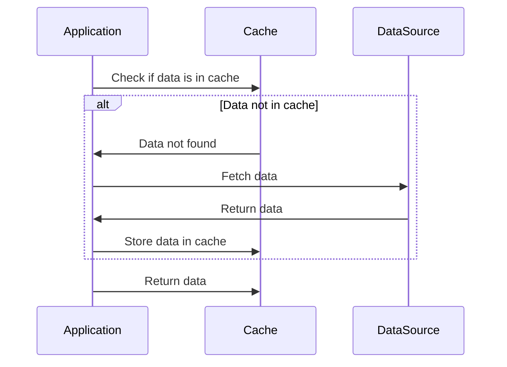

## 14.1 Caching Strategies

In the realm of software development, particularly when working with C#, caching is a pivotal strategy for enhancing performance by reducing latency and improving data retrieval efficiency. This section delves into various caching strategies, including in-memory caching, distributed caching, the cache-aside pattern, and cache invalidation strategies. By mastering these techniques, you can significantly boost the performance of your applications, ensuring they are both scalable and responsive.

### Introduction to Caching

Caching is a technique used to store copies of data in a temporary storage location, known as a cache, so that future requests for that data can be served faster. The primary goal of caching is to reduce the time it takes to access data, thereby improving the overall performance of an application. Caching is especially beneficial in scenarios where data retrieval is expensive, such as fetching data from a database or an external API.

#### Key Concepts

- **Latency Reduction**: Caching reduces the time it takes to retrieve data by storing frequently accessed data closer to the application.
- **Efficiency**: By avoiding repeated data retrieval operations, caching improves the efficiency of data access.
- **Scalability**: Caching helps applications handle increased loads by reducing the demand on backend systems.

### Implementing In-Memory Caching

In-memory caching involves storing data in the memory of the application server. This approach is fast and efficient because accessing data from memory is significantly quicker than retrieving it from a disk or a network.

#### Using `MemoryCache`

C# provides the `MemoryCache` class, which is part of the `System.Runtime.Caching` namespace, to implement in-memory caching. `MemoryCache` is a thread-safe, in-memory object cache that can be used to store frequently accessed data.

```csharp
using System;
using System.Runtime.Caching;

public class InMemoryCache
{
    private static readonly ObjectCache Cache = MemoryCache.Default;

    public static void AddItemToCache(string key, object value, int expirationInSeconds)
    {
        CacheItemPolicy policy = new CacheItemPolicy
        {
            AbsoluteExpiration = DateTimeOffset.Now.AddSeconds(expirationInSeconds)
        };
        Cache.Add(key, value, policy);
    }

    public static object GetItemFromCache(string key)
    {
        return Cache[key];
    }
}

// Usage
InMemoryCache.AddItemToCache("key1", "value1", 60);
var cachedValue = InMemoryCache.GetItemFromCache("key1");
Console.WriteLine(cachedValue); // Output: value1
```

**Explanation**: In this example, we define a simple in-memory cache using `MemoryCache`. We add items to the cache with a specified expiration time and retrieve them using a unique key.

#### Setting Cache Policies and Expirations

When using `MemoryCache`, it's crucial to define cache policies and expiration times to manage the lifecycle of cached items. This ensures that stale data is not served to users.

- **Absolute Expiration**: The cache entry expires at a specific time.
- **Sliding Expiration**: The cache entry expires if it hasn't been accessed for a specified duration.

### Distributed Caching

Distributed caching involves storing cache data across multiple servers or instances. This approach is suitable for applications that run on multiple servers or in cloud environments, where data consistency and availability are critical.

#### Using Redis for Caching

Redis is a popular in-memory data structure store that can be used as a distributed cache. It supports various data structures, including strings, hashes, lists, sets, and more.

```csharp
using StackExchange.Redis;
using System;

public class RedisCacheExample
{
    private static readonly ConnectionMultiplexer Redis = ConnectionMultiplexer.Connect("localhost");

    public static void SetCacheValue(string key, string value)
    {
        IDatabase db = Redis.GetDatabase();
        db.StringSet(key, value);
    }

    public static string GetCacheValue(string key)
    {
        IDatabase db = Redis.GetDatabase();
        return db.StringGet(key);
    }
}

// Usage
RedisCacheExample.SetCacheValue("key1", "value1");
var cachedValue = RedisCacheExample.GetCacheValue("key1");
Console.WriteLine(cachedValue); // Output: value1
```

**Explanation**: This example demonstrates how to use Redis as a distributed cache in C#. We connect to a Redis server, set a cache value, and retrieve it using a key.

#### Scaling Cache Across Multiple Instances

Distributed caching allows you to scale your cache across multiple instances, ensuring high availability and fault tolerance. By distributing the cache, you can handle larger datasets and more concurrent requests.

### Cache-Aside Pattern

The cache-aside pattern, also known as lazy loading, is a caching strategy where data is loaded into the cache only on demand. This pattern is useful when you want to cache data that is expensive to retrieve but not frequently accessed.

#### Implementing Cache-Aside Pattern

In the cache-aside pattern, the application is responsible for loading data into the cache and retrieving it when needed. If the data is not in the cache, the application fetches it from the data source and stores it in the cache for future use.

```csharp
public class CacheAsideExample
{
    private static readonly ObjectCache Cache = MemoryCache.Default;

    public static object GetData(string key)
    {
        var cachedData = Cache[key];
        if (cachedData == null)
        {
            // Simulate data retrieval from a data source
            cachedData = "FetchedData";
            CacheItemPolicy policy = new CacheItemPolicy
            {
                AbsoluteExpiration = DateTimeOffset.Now.AddMinutes(5)
            };
            Cache.Add(key, cachedData, policy);
        }
        return cachedData;
    }
}

// Usage
var data = CacheAsideExample.GetData("key1");
Console.WriteLine(data); // Output: FetchedData
```

**Explanation**: In this example, we implement the cache-aside pattern using `MemoryCache`. If the data is not found in the cache, it is fetched from the data source and added to the cache.

### Cache Invalidation Strategies

Cache invalidation is a critical aspect of caching strategies, ensuring that the cache remains consistent with the underlying data source. Without proper invalidation, stale data may be served to users, leading to inconsistencies.

#### Ensuring Data Consistency

To maintain data consistency, it's essential to implement cache invalidation strategies that align with your application's requirements. Common strategies include:

- **Time-Based Expiration**: Automatically invalidating cache entries after a specified duration.
- **Event-Based Invalidation**: Invalidating cache entries based on specific events, such as data updates or deletions.

#### Patterns like Cache-Aside, Read-Through

- **Cache-Aside**: As discussed earlier, this pattern involves loading data into the cache only when needed and invalidating it based on time or events.
- **Read-Through**: In this pattern, the cache sits between the application and the data source. The cache automatically loads data from the data source if it's not present in the cache.

```csharp
public class ReadThroughCache
{
    private static readonly ObjectCache Cache = MemoryCache.Default;

    public static object GetData(string key)
    {
        return Cache.Get(key, () =>
        {
            // Simulate data retrieval from a data source
            return "FetchedData";
        });
    }
}

// Usage
var data = ReadThroughCache.GetData("key1");
Console.WriteLine(data); // Output: FetchedData
```

**Explanation**: In this example, we implement a simple read-through cache. The cache automatically retrieves data from the data source if it's not present in the cache.

### Visualizing Caching Strategies

To better understand the flow of caching strategies, let's visualize the cache-aside pattern using a sequence diagram.



**Diagram Explanation**: This sequence diagram illustrates the cache-aside pattern. The application first checks if the data is in the cache. If not, it fetches the data from the data source and stores it in the cache for future use.

### Try It Yourself

To deepen your understanding of caching strategies, try modifying the code examples provided. Experiment with different cache expiration policies, implement a distributed cache using a different technology, or create a custom cache invalidation strategy.

### References and Links

For further reading on caching strategies and best practices, consider exploring the following resources:

- [Microsoft Docs: Caching in .NET](https://docs.microsoft.com/en-us/dotnet/core/extensions/caching)
- [Redis Documentation](https://redis.io/documentation)
- [StackExchange.Redis GitHub Repository](https://github.com/StackExchange/StackExchange.Redis)

### Knowledge Check

Before moving on, consider the following questions to reinforce your understanding of caching strategies:

- What are the benefits of using caching in an application?
- How does the cache-aside pattern differ from the read-through pattern?
- What are some common cache invalidation strategies?

### Embrace the Journey

Remember, mastering caching strategies is a journey. As you continue to explore and implement these techniques, you'll gain a deeper understanding of how to optimize your applications for performance and scalability. Keep experimenting, stay curious, and enjoy the journey!

## Quiz Time!



### What is the primary goal of caching in software applications?

- [x] To reduce latency and improve data retrieval efficiency
- [ ] To increase the complexity of the application
- [ ] To store data permanently
- [ ] To replace databases

> **Explanation:** The primary goal of caching is to reduce latency and improve data retrieval efficiency by storing copies of data in a temporary storage location.

### Which C# class is commonly used for in-memory caching?

- [x] MemoryCache
- [ ] FileCache
- [ ] DiskCache
- [ ] NetworkCache

> **Explanation:** The `MemoryCache` class, part of the `System.Runtime.Caching` namespace, is commonly used for in-memory caching in C#.

### What is a key feature of the cache-aside pattern?

- [x] Data is loaded into the cache only on demand
- [ ] Data is preloaded into the cache
- [ ] The cache is always empty
- [ ] The cache automatically updates itself

> **Explanation:** In the cache-aside pattern, data is loaded into the cache only on demand, meaning it is fetched from the data source when not present in the cache.

### Which caching strategy involves storing cache data across multiple servers?

- [x] Distributed Caching
- [ ] In-Memory Caching
- [ ] Local Caching
- [ ] Temporary Caching

> **Explanation:** Distributed caching involves storing cache data across multiple servers or instances, making it suitable for applications running in cloud environments.

### What is the purpose of cache invalidation?

- [x] To ensure data consistency between the cache and the data source
- [ ] To increase the size of the cache
- [ ] To make the cache permanent
- [ ] To delete all cache entries

> **Explanation:** Cache invalidation ensures data consistency between the cache and the data source by removing or updating stale data.

### Which pattern involves the cache automatically loading data from the data source if it's not present?

- [x] Read-Through Pattern
- [ ] Cache-Aside Pattern
- [ ] Write-Through Pattern
- [ ] Write-Behind Pattern

> **Explanation:** In the read-through pattern, the cache automatically loads data from the data source if it's not present in the cache.

### What is a common tool used for distributed caching in C#?

- [x] Redis
- [ ] SQLite
- [ ] XML
- [ ] JSON

> **Explanation:** Redis is a popular tool used for distributed caching in C#, known for its support of various data structures and high performance.

### How does sliding expiration differ from absolute expiration in caching?

- [x] Sliding expiration resets the expiration time each time the cache entry is accessed
- [ ] Sliding expiration sets a fixed expiration time
- [ ] Sliding expiration deletes the cache entry immediately
- [ ] Sliding expiration is not used in caching

> **Explanation:** Sliding expiration resets the expiration time each time the cache entry is accessed, whereas absolute expiration sets a fixed expiration time.

### What is the benefit of using in-memory caching?

- [x] Faster data retrieval compared to disk or network access
- [ ] Permanent data storage
- [ ] Increased application complexity
- [ ] Reduced application performance

> **Explanation:** In-memory caching provides faster data retrieval compared to disk or network access, improving application performance.

### True or False: Cache-aside pattern is also known as lazy loading.

- [x] True
- [ ] False

> **Explanation:** True. The cache-aside pattern is also known as lazy loading because data is loaded into the cache only when needed.


