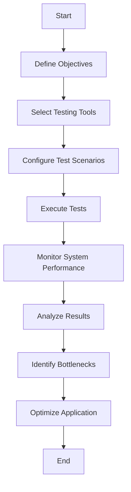

## 14.10 Performance Testing

In the realm of software development, ensuring that an application performs optimally under various conditions is crucial. Performance testing is a critical aspect of this process, helping developers understand how their applications behave under different loads and stress conditions. This section will delve into the essentials of performance testing, focusing on load testing and stress testing, and explore tools like JMeter that aid in simulating user loads and evaluating application limits.

### Introduction to Performance Testing

Performance testing is a non-functional testing technique used to determine how a system performs in terms of responsiveness and stability under a particular workload. It is crucial for identifying bottlenecks, ensuring scalability, and maintaining a high-quality user experience. Performance testing encompasses various testing types, including load testing, stress testing, endurance testing, spike testing, and more.

### Key Objectives of Performance Testing

- **Identify Performance Bottlenecks**: Detect areas where the application slows down or fails under load.
- **Ensure Scalability**: Verify that the application can handle increased loads as user demand grows.
- **Validate Stability**: Confirm that the application remains stable under prolonged usage.
- **Optimize Resource Usage**: Ensure efficient use of system resources like CPU, memory, and network bandwidth.

### Load Testing

Load testing is a type of performance testing that simulates real-world load conditions to evaluate how an application performs under expected user loads. The primary goal is to identify performance bottlenecks before the application goes live.

#### Simulating User Load with Tools like JMeter

Apache JMeter is a popular open-source tool for load testing. It allows developers to simulate multiple users accessing a web application simultaneously, thereby mimicking real-world usage scenarios.

**Setting Up JMeter for Load Testing**

1. **Install JMeter**: Download and install JMeter from the [official website](https://jmeter.apache.org/).
2. **Create a Test Plan**: A test plan in JMeter is a container for running tests. It includes elements like thread groups, samplers, listeners, and more.
3. **Configure Thread Groups**: Define the number of virtual users, ramp-up period, and loop count to simulate user load.
4. **Add Samplers**: Samplers define the actions that users will perform, such as HTTP requests to the application.
5. **Add Listeners**: Listeners collect and display test results, providing insights into application performance.

**Sample JMeter Test Plan**

```xml
<TestPlan>
  <ThreadGroup>
    <num_threads>100</num_threads>
    <ramp_time>60</ramp_time>
    <loop_count>10</loop_count>
    <HTTPSampler>
      <domain>example.com</domain>
      <path>/api/test</path>
      <method>GET</method>
    </HTTPSampler>
  </ThreadGroup>
  <Listener>
    <name>View Results Tree</name>
  </Listener>
</TestPlan>
```

#### Understanding Application Limits

Load testing helps in understanding the maximum number of concurrent users an application can handle before performance degrades. By gradually increasing the load, developers can pinpoint the threshold at which the application starts to falter.

**Key Metrics to Monitor During Load Testing**

- **Response Time**: The time taken to receive a response from the server.
- **Throughput**: The number of requests processed per second.
- **Error Rate**: The percentage of requests that result in errors.
- **Resource Utilization**: CPU, memory, and network usage.

### Stress Testing

Stress testing evaluates an application's behavior under extreme conditions, such as high user loads or limited resources. The goal is to determine the application's breaking point and ensure it can recover gracefully from failure.

#### Evaluating Behavior Under Extreme Conditions

Stress testing pushes the application beyond its normal operational capacity to identify potential weaknesses. This type of testing is crucial for planning for unexpected spikes in usage, such as during a major product launch or promotional event.

**Steps to Conduct Stress Testing**

1. **Define Stress Scenarios**: Identify scenarios that simulate extreme conditions, such as a sudden surge in user traffic.
2. **Configure Stress Tests**: Use tools like JMeter to simulate these scenarios by increasing the number of virtual users and reducing resource availability.
3. **Monitor System Behavior**: Observe how the application responds to stress, focusing on response times, error rates, and system stability.
4. **Analyze Results**: Identify any failures or bottlenecks and plan for improvements.

**Sample Stress Test Configuration in JMeter**

```xml
<TestPlan>
  <ThreadGroup>
    <num_threads>1000</num_threads>
    <ramp_time>30</ramp_time>
    <loop_count>1</loop_count>
    <HTTPSampler>
      <domain>example.com</domain>
      <path>/api/stress</path>
      <method>POST</method>
    </HTTPSampler>
  </ThreadGroup>
  <Listener>
    <name>Aggregate Report</name>
  </Listener>
</TestPlan>
```

#### Planning for Spikes in Usage

Stress testing helps in planning for unexpected spikes in usage by identifying potential failure points and ensuring that the application can handle sudden increases in load. This involves optimizing resource allocation, implementing load balancing, and ensuring redundancy.

### Tools and Techniques for Performance Testing

In addition to JMeter, several other tools and techniques can be used for performance testing in C# applications.

#### Visual Studio Load Test

Visual Studio provides a built-in load testing tool that integrates seamlessly with C# projects. It allows developers to create and run load tests directly from the IDE, providing detailed performance insights.

**Creating a Load Test in Visual Studio**

1. **Create a Load Test Project**: Add a new load test project to your solution.
2. **Define Scenarios**: Create scenarios that simulate user interactions with the application.
3. **Configure Load Patterns**: Specify the number of virtual users and the load pattern (constant, step, or goal-based).
4. **Run the Test**: Execute the load test and analyze the results using Visual Studio's reporting tools.

#### Performance Counters

Performance counters are a valuable tool for monitoring system performance during testing. They provide real-time data on various system metrics, such as CPU usage, memory consumption, and network activity.

**Using Performance Counters in C#**

```csharp
using System.Diagnostics;

class PerformanceCounterExample
{
    static void Main()
    {
        PerformanceCounter cpuCounter = new PerformanceCounter("Processor", "% Processor Time", "_Total");
        PerformanceCounter ramCounter = new PerformanceCounter("Memory", "Available MBytes");

        Console.WriteLine("CPU Usage: " + cpuCounter.NextValue() + "%");
        Console.WriteLine("Available RAM: " + ramCounter.NextValue() + "MB");
    }
}
```

### Best Practices for Performance Testing

To ensure effective performance testing, follow these best practices:

- **Define Clear Objectives**: Establish clear goals for what you want to achieve with performance testing.
- **Use Realistic Test Data**: Ensure that the test data used in performance tests closely resembles real-world data.
- **Automate Tests**: Automate performance tests to run regularly and catch performance regressions early.
- **Analyze Results Thoroughly**: Spend time analyzing test results to identify trends and potential issues.
- **Iterate and Improve**: Use the insights gained from performance testing to make continuous improvements to the application.

### Visualizing Performance Testing

To better understand the performance testing process, let's visualize the workflow using a flowchart.



**Diagram Description**: This flowchart illustrates the performance testing workflow, starting from defining objectives to optimizing the application based on test results.

### Try It Yourself

To gain hands-on experience with performance testing, try modifying the JMeter test plans provided in this section. Experiment with different load patterns, user counts, and test scenarios to see how your application responds. Additionally, explore using Visual Studio's load testing tools to create and run tests directly from your C# projects.

### Knowledge Check

- What are the key objectives of performance testing?
- How does load testing differ from stress testing?
- What are some common tools used for performance testing in C#?
- How can performance counters be used to monitor system performance?
- What are some best practices for conducting effective performance tests?

### Embrace the Journey

Remember, performance testing is an ongoing process. As your application evolves, so too should your performance testing strategies. Keep experimenting, stay curious, and enjoy the journey of optimizing your applications for peak performance.

## Quiz Time!



### What is the primary goal of load testing?

- [x] To identify performance bottlenecks before the application goes live.
- [ ] To evaluate the application's behavior under extreme conditions.
- [ ] To ensure the application remains stable under prolonged usage.
- [ ] To optimize resource usage.

> **Explanation:** Load testing aims to identify performance bottlenecks by simulating real-world load conditions.

### Which tool is commonly used for load testing?

- [x] Apache JMeter
- [ ] Selenium
- [ ] NUnit
- [ ] Postman

> **Explanation:** Apache JMeter is a popular open-source tool for load testing.

### What does stress testing evaluate?

- [ ] Application performance under expected user loads.
- [x] Application behavior under extreme conditions.
- [ ] Application stability under prolonged usage.
- [ ] Application resource usage efficiency.

> **Explanation:** Stress testing evaluates an application's behavior under extreme conditions to determine its breaking point.

### What is the purpose of using performance counters in C#?

- [x] To monitor system performance metrics like CPU and memory usage.
- [ ] To simulate user interactions with the application.
- [ ] To automate performance tests.
- [ ] To create load test scenarios.

> **Explanation:** Performance counters provide real-time data on system performance metrics.

### Which of the following is a best practice for performance testing?

- [x] Define clear objectives.
- [ ] Use unrealistic test data.
- [ ] Avoid automating tests.
- [ ] Ignore test results.

> **Explanation:** Defining clear objectives is crucial for effective performance testing.

### What is the role of listeners in a JMeter test plan?

- [x] To collect and display test results.
- [ ] To define user actions.
- [ ] To configure virtual users.
- [ ] To simulate network conditions.

> **Explanation:** Listeners in JMeter collect and display test results, providing insights into application performance.

### How can stress testing help in planning for spikes in usage?

- [x] By identifying potential failure points and ensuring the application can handle sudden increases in load.
- [ ] By optimizing resource allocation.
- [ ] By implementing load balancing.
- [ ] By ensuring redundancy.

> **Explanation:** Stress testing helps identify potential failure points and ensures the application can handle sudden increases in load.

### What is the difference between load testing and stress testing?

- [x] Load testing simulates expected user loads, while stress testing evaluates behavior under extreme conditions.
- [ ] Load testing evaluates behavior under extreme conditions, while stress testing simulates expected user loads.
- [ ] Load testing focuses on resource usage, while stress testing focuses on stability.
- [ ] Load testing is a type of stress testing.

> **Explanation:** Load testing simulates expected user loads, while stress testing evaluates behavior under extreme conditions.

### What is the significance of response time in performance testing?

- [x] It indicates the time taken to receive a response from the server.
- [ ] It measures the number of requests processed per second.
- [ ] It calculates the percentage of requests that result in errors.
- [ ] It monitors CPU and memory usage.

> **Explanation:** Response time indicates the time taken to receive a response from the server, which is crucial for assessing performance.

### True or False: Performance testing is only necessary during the initial development phase of an application.

- [ ] True
- [x] False

> **Explanation:** Performance testing is an ongoing process that should continue as the application evolves to ensure optimal performance.


