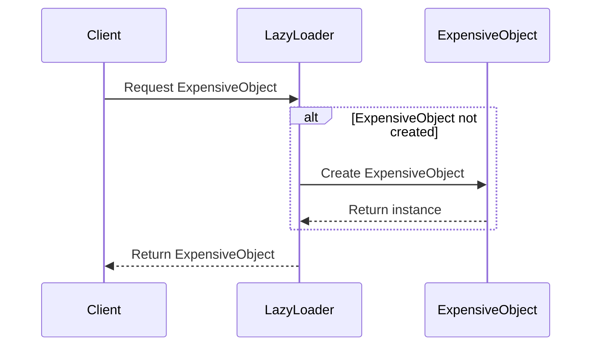

## 14.2 Lazy Loading

In the realm of software development, efficient resource management is paramount. One of the most effective strategies for optimizing resource usage is Lazy Loading. This design pattern defers the initialization of an object until it is actually needed, which can significantly enhance application performance by reducing memory consumption and improving response times. In this section, we will delve into the intricacies of Lazy Loading in C#, exploring its implementation, use cases, and practical examples.

### Understanding Lazy Loading

Lazy Loading is a design pattern that delays the creation of an object, the calculation of a value, or some other expensive process until the first time it is needed. This approach can be particularly beneficial in scenarios where the cost of object creation is high, or when the object might not be used at all during the execution of a program.

#### Key Concepts

- **Deferred Initialization**: The core idea behind Lazy Loading is to postpone the creation of an object until it is absolutely necessary.
- **Resource Optimization**: By deferring object creation, Lazy Loading helps in conserving system resources, such as memory and CPU time.
- **Improved Performance**: Applications can achieve better performance by avoiding unnecessary computations and data retrievals.

### Implementing Lazy Loading in C#

C# provides several mechanisms to implement Lazy Loading, ranging from manual implementations to built-in language features. Let's explore these methods in detail.

#### Manual Implementation

One of the simplest ways to implement Lazy Loading is through a manual approach, where you explicitly check if an object has been initialized before accessing it.

```csharp
public class LazyLoader
{
    private ExpensiveObject _expensiveObject;

    public ExpensiveObject GetExpensiveObject()
    {
        if (_expensiveObject == null)
        {
            _expensiveObject = new ExpensiveObject();
        }
        return _expensiveObject;
    }
}

public class ExpensiveObject
{
    public ExpensiveObject()
    {
        // Simulate an expensive operation
        Console.WriteLine("ExpensiveObject created.");
    }
}
```

In this example, the `ExpensiveObject` is only created when `GetExpensiveObject` is called for the first time.

#### Using Lazy<T> in C#

C# provides a built-in `Lazy<T>` class that simplifies the implementation of Lazy Loading. This class ensures that the object is created only once and provides thread-safety.

```csharp
public class LazyLoader
{
    private Lazy<ExpensiveObject> _expensiveObject = new Lazy<ExpensiveObject>(() => new ExpensiveObject());

    public ExpensiveObject GetExpensiveObject()
    {
        return _expensiveObject.Value;
    }
}

public class ExpensiveObject
{
    public ExpensiveObject()
    {
        // Simulate an expensive operation
        Console.WriteLine("ExpensiveObject created.");
    }
}
```

The `Lazy<T>` class handles the lazy initialization and ensures that the `ExpensiveObject` is created only when `Value` is accessed.

#### Lazy Initialization in Entity Framework

Entity Framework (EF) is a popular ORM (Object-Relational Mapper) for .NET that supports Lazy Loading out of the box. In EF, Lazy Loading is used to defer the loading of related entities until they are explicitly accessed.

To enable Lazy Loading in Entity Framework, you need to ensure that navigation properties are marked as `virtual`.

```csharp
public class Blog
{
    public int BlogId { get; set; }
    public string Name { get; set; }

    public virtual ICollection<Post> Posts { get; set; }
}

public class Post
{
    public int PostId { get; set; }
    public string Title { get; set; }
    public string Content { get; set; }
    public int BlogId { get; set; }

    public virtual Blog Blog { get; set; }
}
```

With Lazy Loading enabled, related entities such as `Posts` in the `Blog` class are loaded only when they are accessed.

### Use Cases and Examples

Lazy Loading is particularly useful in scenarios where resource optimization is critical. Let's explore some common use cases and examples.

#### Optimizing Resource Usage

Consider a scenario where you have a large collection of objects, but only a few of them are used during the execution of your application. By implementing Lazy Loading, you can defer the creation of these objects until they are actually needed, thereby conserving memory and CPU resources.

#### Avoiding Unnecessary Data Retrieval

In applications that interact with databases, retrieving large datasets can be expensive. Lazy Loading can help in avoiding unnecessary data retrieval by loading only the data that is required at runtime.

```csharp
public class Product
{
    public int ProductId { get; set; }
    public string Name { get; set; }

    private Lazy<List<Review>> _reviews = new Lazy<List<Review>>(() => LoadReviews());

    public List<Review> Reviews => _reviews.Value;

    private static List<Review> LoadReviews()
    {
        // Simulate data retrieval from a database
        Console.WriteLine("Loading reviews from database...");
        return new List<Review>
        {
            new Review { ReviewId = 1, Content = "Great product!" },
            new Review { ReviewId = 2, Content = "Very satisfied." }
        };
    }
}

public class Review
{
    public int ReviewId { get; set; }
    public string Content { get; set; }
}
```

In this example, the `Reviews` property is loaded only when it is accessed, simulating a database call.

### Design Considerations

When implementing Lazy Loading, there are several design considerations to keep in mind:

- **Thread Safety**: Ensure that your Lazy Loading implementation is thread-safe, especially in multi-threaded environments. The `Lazy<T>` class in C# provides built-in thread safety.
- **Performance Trade-offs**: While Lazy Loading can improve performance by deferring object creation, it can also introduce latency when the object is accessed for the first time.
- **Complexity**: Lazy Loading can add complexity to your codebase. Ensure that the benefits outweigh the added complexity.

### Differences and Similarities

Lazy Loading is often compared with other design patterns such as Eager Loading and Proxy Pattern. Let's explore the differences and similarities:

- **Lazy Loading vs. Eager Loading**: Eager Loading loads all related entities upfront, whereas Lazy Loading defers the loading until the entities are accessed. Eager Loading can be beneficial when you know that all related data will be used, while Lazy Loading is preferable when you want to optimize resource usage.
- **Lazy Loading vs. Proxy Pattern**: The Proxy Pattern involves creating a surrogate or placeholder for another object to control access to it. Lazy Loading can be implemented using the Proxy Pattern, where the proxy defers the creation of the actual object.

### Visualizing Lazy Loading

To better understand Lazy Loading, let's visualize the process using a sequence diagram.



**Diagram Description**: This sequence diagram illustrates the Lazy Loading process. The `Client` requests an `ExpensiveObject` from the `LazyLoader`. If the `ExpensiveObject` has not been created, the `LazyLoader` initializes it and returns the instance to the `Client`.

### Try It Yourself

To deepen your understanding of Lazy Loading, try modifying the code examples provided. Experiment with different scenarios, such as:

- Implementing Lazy Loading for different types of objects.
- Testing the performance impact of Lazy Loading in a multi-threaded environment.
- Combining Lazy Loading with other design patterns, such as the Proxy Pattern.

### Knowledge Check

Before we conclude, let's reinforce your understanding with a few questions:

- What are the key benefits of using Lazy Loading?
- How does the `Lazy<T>` class in C# simplify Lazy Loading implementation?
- What are some common use cases for Lazy Loading in software development?

### Summary

Lazy Loading is a powerful design pattern that can significantly enhance application performance by deferring object creation and optimizing resource usage. By understanding and implementing Lazy Loading in C#, you can build more efficient and responsive applications. Remember, this is just the beginning. As you progress, you'll discover more ways to optimize your applications. Keep experimenting, stay curious, and enjoy the journey!

## Quiz Time!



### What is the primary benefit of Lazy Loading?

- [x] Deferring object creation to optimize resource usage
- [ ] Loading all objects at once to improve speed
- [ ] Simplifying code by removing initialization logic
- [ ] Ensuring all objects are created in a specific order

> **Explanation:** Lazy Loading defers object creation until it is needed, optimizing resource usage.

### Which C# class simplifies the implementation of Lazy Loading?

- [x] Lazy<T>
- [ ] Task<T>
- [ ] Async<T>
- [ ] Thread<T>

> **Explanation:** The `Lazy<T>` class in C# provides built-in support for Lazy Loading, ensuring thread safety and deferred initialization.

### In Entity Framework, how is Lazy Loading enabled?

- [x] By marking navigation properties as virtual
- [ ] By using the `Lazy<T>` class
- [ ] By setting a configuration flag
- [ ] By creating a proxy class

> **Explanation:** In Entity Framework, navigation properties must be marked as `virtual` to enable Lazy Loading.

### What is a potential downside of Lazy Loading?

- [x] Increased latency on first access
- [ ] Higher memory consumption
- [ ] More complex initialization logic
- [ ] Reduced code readability

> **Explanation:** Lazy Loading can introduce latency when the object is accessed for the first time, as it needs to be initialized.

### How does Lazy Loading differ from Eager Loading?

- [x] Lazy Loading defers loading until needed, while Eager Loading loads upfront
- [ ] Lazy Loading loads all data at once, while Eager Loading defers loading
- [ ] Lazy Loading is faster than Eager Loading
- [ ] Lazy Loading is more memory-intensive than Eager Loading

> **Explanation:** Lazy Loading defers the loading of objects until they are accessed, whereas Eager Loading retrieves all related data upfront.

### Which pattern is often used in conjunction with Lazy Loading?

- [x] Proxy Pattern
- [ ] Singleton Pattern
- [ ] Factory Pattern
- [ ] Observer Pattern

> **Explanation:** The Proxy Pattern can be used to implement Lazy Loading by deferring the creation of the actual object.

### What is a common use case for Lazy Loading?

- [x] Avoiding unnecessary data retrieval
- [ ] Ensuring all objects are initialized at startup
- [ ] Simplifying object construction
- [ ] Reducing code complexity

> **Explanation:** Lazy Loading is often used to avoid unnecessary data retrieval, especially in database interactions.

### How can Lazy Loading affect multi-threaded applications?

- [x] It requires thread-safe implementation
- [ ] It simplifies thread management
- [ ] It increases thread contention
- [ ] It eliminates the need for synchronization

> **Explanation:** Lazy Loading in multi-threaded environments requires thread-safe implementation to avoid race conditions.

### What is a key consideration when implementing Lazy Loading?

- [x] Ensuring thread safety
- [ ] Reducing code size
- [ ] Increasing initialization speed
- [ ] Simplifying object interfaces

> **Explanation:** Ensuring thread safety is crucial when implementing Lazy Loading, especially in concurrent environments.

### True or False: Lazy Loading always improves application performance.

- [ ] True
- [x] False

> **Explanation:** While Lazy Loading can improve performance by deferring object creation, it may introduce latency on first access and add complexity to the codebase.


