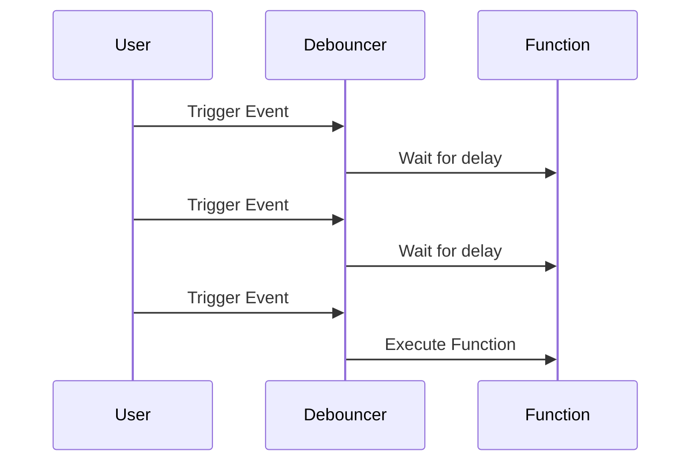
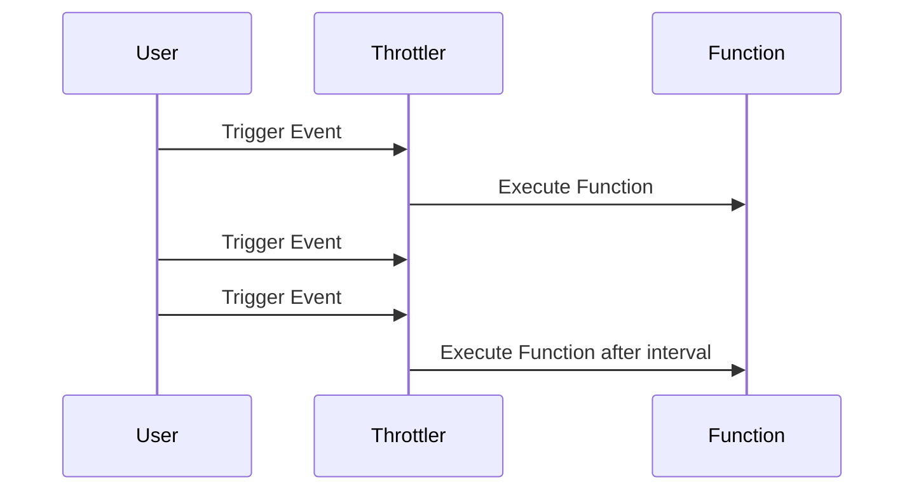

## 14.3 Debouncing and Throttling

In the realm of software development, particularly when dealing with user interfaces and event-driven programming, managing the frequency of function execution is crucial for maintaining optimal performance and responsiveness. Two essential techniques for controlling event firing rates are **debouncing** and **throttling**. These patterns help in enhancing UI performance by ensuring that functions are not executed more often than necessary, thereby reducing unnecessary computational load and improving user experience.

### Introduction to Debouncing and Throttling

Before diving into the implementation details, let's first understand what debouncing and throttling are and why they are important.

- **Debouncing**: This technique ensures that a function is executed only after a certain period has passed since the last time it was invoked. It is particularly useful for handling events that fire in rapid succession, such as keystrokes or window resizing.

- **Throttling**: This technique limits the number of times a function can be executed over a specified period. It ensures that a function is called at regular intervals, regardless of how many times the event is triggered.

Both techniques are vital for optimizing performance, especially in scenarios involving high-frequency events. They help in reducing the load on the system and preventing potential bottlenecks.

### Implementing Debouncing and Throttling in C#

Let's explore how to implement these patterns in C# to control event firing rates and enhance UI performance.

#### Debouncing in C#

Debouncing is particularly useful when you want to delay the execution of a function until a specified time has elapsed since the last event. This is commonly used in search input fields, where you want to wait for the user to stop typing before sending a request to the server.

**Example: Debouncing a Search Input**

```csharp
using System;
using System.Threading;
using System.Threading.Tasks;

public class Debouncer
{
    private readonly int _delay;
    private CancellationTokenSource _cancellationTokenSource;

    public Debouncer(int delay)
    {
        _delay = delay;
    }

    public void Debounce(Action action)
    {
        _cancellationTokenSource?.Cancel();
        _cancellationTokenSource = new CancellationTokenSource();

        Task.Delay(_delay, _cancellationTokenSource.Token)
            .ContinueWith(t =>
            {
                if (!t.IsCanceled)
                {
                    action();
                }
            }, TaskScheduler.Default);
    }
}

// Usage
public class SearchHandler
{
    private readonly Debouncer _debouncer = new Debouncer(300);

    public void OnSearchInputChanged(string query)
    {
        _debouncer.Debounce(() => PerformSearch(query));
    }

    private void PerformSearch(string query)
    {
        Console.WriteLine($"Searching for: {query}");
        // Simulate search operation
    }
}
```

In this example, the `Debouncer` class delays the execution of the `PerformSearch` method until 300 milliseconds have passed since the last keystroke. This prevents unnecessary search operations while the user is still typing.

#### Throttling in C#

Throttling ensures that a function is executed at most once in a specified time interval, regardless of how many times the event is triggered. This is useful for scenarios like window resizing or scrolling, where you want to limit the rate of function execution.

**Example: Throttling a Resize Event**

```csharp
using System;
using System.Timers;

public class Throttler
{
    private readonly Timer _timer;
    private bool _actionPending;

    public Throttler(int interval)
    {
        _timer = new Timer(interval);
        _timer.Elapsed += (sender, args) =>
        {
            if (_actionPending)
            {
                _actionPending = false;
                PerformAction();
            }
        };
        _timer.Start();
    }

    public void Throttle(Action action)
    {
        _actionPending = true;
    }

    private void PerformAction()
    {
        Console.WriteLine("Action performed at: " + DateTime.Now);
        // Simulate action
    }
}

// Usage
public class WindowResizer
{
    private readonly Throttler _throttler = new Throttler(500);

    public void OnWindowResize()
    {
        _throttler.Throttle(() => Console.WriteLine("Window resized"));
    }
}
```

In this example, the `Throttler` class ensures that the `PerformAction` method is executed at most once every 500 milliseconds, even if the resize event is triggered more frequently.

### Visualizing Debouncing and Throttling

To better understand how debouncing and throttling work, let's visualize these concepts using Mermaid.js diagrams.

#### Debouncing Diagram



**Description**: This diagram illustrates how debouncing works. The function is executed only after a delay period has passed since the last event.

#### Throttling Diagram



**Description**: This diagram shows how throttling works. The function is executed at regular intervals, regardless of how many times the event is triggered.

### Use Cases and Examples

Debouncing and throttling are applicable in various scenarios where controlling the rate of function execution is crucial.

#### Handling User Input

In applications with search functionality, debouncing can be used to delay the search operation until the user has finished typing. This reduces the number of requests sent to the server and improves performance.

#### Managing High-Frequency Events

Throttling is useful for handling events like window resizing, scrolling, or mouse movements, where frequent execution of functions can lead to performance issues.

### Design Considerations

When implementing debouncing and throttling, consider the following:

- **Latency**: Debouncing introduces a delay in function execution, which may not be suitable for real-time applications.
- **Interval Selection**: Choose appropriate delay and interval values based on the application's requirements and user experience.
- **Concurrency**: Ensure thread safety when implementing these patterns in a multi-threaded environment.

### Differences and Similarities

While both debouncing and throttling aim to control the rate of function execution, they differ in their approach:

- **Debouncing** delays function execution until a specified time has passed since the last event.
- **Throttling** limits the execution rate to a maximum number of times per interval.

Both techniques can be used together to achieve optimal performance in different scenarios.

### Try It Yourself

Experiment with the provided code examples by modifying the delay and interval values. Observe how these changes affect the behavior of the debounced and throttled functions. Try implementing these patterns in your own applications to manage high-frequency events effectively.

### References and Links

For further reading on debouncing and throttling, consider the following resources:

- [MDN Web Docs: Debounce and Throttle](https://developer.mozilla.org/en-US/docs/Web/Events/scroll)
- [W3Schools: JavaScript Debounce and Throttle](https://www.w3schools.com/js/js_function_closures.asp)

### Knowledge Check

To reinforce your understanding of debouncing and throttling, consider the following questions:

1. What is the primary difference between debouncing and throttling?
2. How can debouncing improve the performance of a search input field?
3. In what scenarios would throttling be more beneficial than debouncing?
4. What are some potential drawbacks of using debouncing in real-time applications?

### Embrace the Journey

Remember, mastering debouncing and throttling is just one step in optimizing application performance. As you continue to explore and implement these patterns, you'll gain a deeper understanding of how to manage high-frequency events effectively. Keep experimenting, stay curious, and enjoy the journey of becoming a more proficient software engineer!

## Quiz Time!



### What is the main purpose of debouncing in event handling?

- [x] To delay the execution of a function until a specified time has passed since the last event.
- [ ] To execute a function at regular intervals.
- [ ] To increase the frequency of function execution.
- [ ] To execute a function immediately after an event is triggered.

> **Explanation:** Debouncing delays the execution of a function until a certain period has passed since the last event, preventing unnecessary executions.

### How does throttling differ from debouncing?

- [x] Throttling limits the execution rate to a maximum number of times per interval.
- [ ] Throttling delays function execution until a specified time has passed.
- [ ] Throttling increases the execution frequency of a function.
- [ ] Throttling executes a function immediately after an event is triggered.

> **Explanation:** Throttling ensures a function is executed at most once in a specified time interval, unlike debouncing which delays execution.

### In which scenario is debouncing particularly useful?

- [x] Handling search input fields to reduce server requests.
- [ ] Executing functions at regular intervals.
- [ ] Handling real-time data updates.
- [ ] Increasing the frequency of function execution.

> **Explanation:** Debouncing is useful for search inputs to wait for the user to stop typing before executing a search operation.

### What is a potential drawback of using debouncing?

- [x] It introduces a delay in function execution.
- [ ] It increases the frequency of function execution.
- [ ] It executes functions immediately after an event.
- [ ] It limits the execution rate to a maximum number of times per interval.

> **Explanation:** Debouncing introduces a delay, which may not be suitable for real-time applications.

### Which pattern would you use to manage high-frequency events like window resizing?

- [x] Throttling
- [ ] Debouncing
- [ ] Immediate Execution
- [ ] Event Bubbling

> **Explanation:** Throttling is suitable for managing high-frequency events by limiting the execution rate.

### What is the role of the `CancellationTokenSource` in the debouncing example?

- [x] To cancel the previous task if a new event is triggered.
- [ ] To increase the delay time.
- [ ] To execute the function immediately.
- [ ] To limit the execution rate.

> **Explanation:** `CancellationTokenSource` is used to cancel the previous task if a new event occurs, ensuring only the latest event is processed.

### How can you experiment with the provided code examples?

- [x] By modifying the delay and interval values.
- [ ] By changing the function names.
- [ ] By removing the `CancellationTokenSource`.
- [ ] By executing the functions immediately.

> **Explanation:** Modifying delay and interval values helps observe changes in the behavior of debounced and throttled functions.

### What should you consider when implementing debouncing and throttling?

- [x] Latency and interval selection.
- [ ] Increasing execution frequency.
- [ ] Immediate function execution.
- [ ] Reducing delay time.

> **Explanation:** Consider latency and appropriate interval selection based on application requirements.

### Which technique is more suitable for real-time applications?

- [x] Throttling
- [ ] Debouncing
- [ ] Immediate Execution
- [ ] Event Bubbling

> **Explanation:** Throttling is more suitable for real-time applications as it limits execution without introducing delays.

### True or False: Debouncing and throttling can be used together for optimal performance.

- [x] True
- [ ] False

> **Explanation:** Both techniques can be combined to achieve optimal performance in different scenarios.


