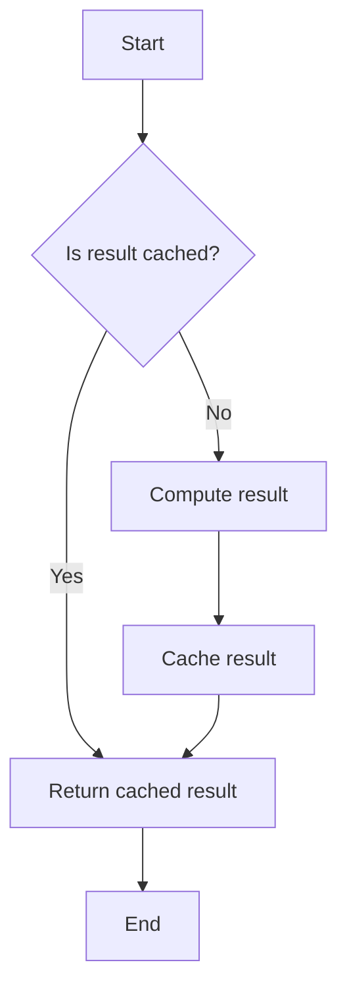

## 14.4 Memoization

Memoization is a powerful optimization technique used to improve the performance of applications by caching the results of expensive function calls and returning the cached result when the same inputs occur again. This technique is particularly useful in scenarios where functions are called repeatedly with the same parameters, allowing us to avoid redundant computations and significantly reduce execution time.

### Understanding Memoization

Memoization is a form of caching that involves storing the results of function calls and reusing them when the same inputs are encountered. This is especially beneficial for functions that are computationally expensive or have side effects that we want to avoid repeating. By caching the results, we can achieve faster execution times and improve the overall efficiency of our applications.

#### Key Concepts

- **Caching**: Storing the results of expensive function calls to avoid redundant computations.
- **Function Inputs**: The parameters passed to a function, which determine the output.
- **Idempotency**: A property of functions where repeated calls with the same inputs yield the same results.

### Implementing Memoization in C#

In C#, memoization can be implemented using various techniques, including dictionaries, custom classes, and higher-order functions. Let's explore how to create memoization utilities in C#.

#### Caching Function Results

The simplest way to implement memoization is by using a dictionary to store the results of function calls. The keys in the dictionary represent the function inputs, and the values represent the corresponding outputs.

```csharp
using System;
using System.Collections.Generic;

public class Memoizer<TInput, TOutput>
{
    private readonly Func<TInput, TOutput> _function;
    private readonly Dictionary<TInput, TOutput> _cache;

    public Memoizer(Func<TInput, TOutput> function)
    {
        _function = function;
        _cache = new Dictionary<TInput, TOutput>();
    }

    public TOutput Memoize(TInput input)
    {
        if (_cache.ContainsKey(input))
        {
            return _cache[input];
        }

        TOutput result = _function(input);
        _cache[input] = result;
        return result;
    }
}

// Usage
Func<int, int> fibonacci = null;
fibonacci = n => n <= 1 ? n : fibonacci(n - 1) + fibonacci(n - 2);

var memoizedFibonacci = new Memoizer<int, int>(fibonacci);

Console.WriteLine(memoizedFibonacci.Memoize(40)); // Efficiently computes the 40th Fibonacci number
```

In this example, we define a `Memoizer` class that takes a function as a parameter and caches its results. The `Memoize` method checks if the result for a given input is already cached; if not, it computes the result, stores it in the cache, and returns it.

#### Creating Memoization Utilities

To make memoization more reusable, we can create utility methods or classes that can be applied to any function. This involves creating a higher-order function that returns a memoized version of the input function.

```csharp
using System;
using System.Collections.Generic;

public static class MemoizationUtility
{
    public static Func<TInput, TOutput> Memoize<TInput, TOutput>(Func<TInput, TOutput> function)
    {
        var cache = new Dictionary<TInput, TOutput>();
        return input =>
        {
            if (cache.ContainsKey(input))
            {
                return cache[input];
            }

            TOutput result = function(input);
            cache[input] = result;
            return result;
        };
    }
}

// Usage
Func<int, int> factorial = null;
factorial = n => n <= 1 ? 1 : n * factorial(n - 1);

var memoizedFactorial = MemoizationUtility.Memoize(factorial);

Console.WriteLine(memoizedFactorial(10)); // Efficiently computes 10!
```

Here, the `Memoize` method is a static utility function that takes a function as input and returns a memoized version of it. This approach allows us to easily apply memoization to any function without modifying its original implementation.

### Use Cases and Examples

Memoization is particularly useful in scenarios where functions are called repeatedly with the same inputs. Let's explore some common use cases and examples.

#### Expensive Computations

Functions that perform complex calculations or access external resources can benefit greatly from memoization. By caching the results, we can avoid redundant computations and reduce the load on external systems.

**Example: Calculating Fibonacci Numbers**

The Fibonacci sequence is a classic example of a problem that can be optimized using memoization. Without memoization, calculating Fibonacci numbers involves redundant computations, as the same subproblems are solved multiple times.

```csharp
using System;
using System.Collections.Generic;

public static class FibonacciCalculator
{
    private static readonly Dictionary<int, long> _cache = new Dictionary<int, long>();

    public static long Calculate(int n)
    {
        if (n <= 1)
        {
            return n;
        }

        if (_cache.ContainsKey(n))
        {
            return _cache[n];
        }

        long result = Calculate(n - 1) + Calculate(n - 2);
        _cache[n] = result;
        return result;
    }
}

// Usage
Console.WriteLine(FibonacciCalculator.Calculate(50)); // Efficiently computes the 50th Fibonacci number
```

In this example, we use a static dictionary to cache the results of Fibonacci calculations. This approach significantly reduces the number of recursive calls and improves performance.

#### Repeated Function Calls with Same Inputs

Memoization is also useful in scenarios where functions are called repeatedly with the same inputs. By caching the results, we can avoid redundant computations and improve the efficiency of our applications.

**Example: Web API Requests**

Consider a scenario where a function makes a web API request to fetch data based on a specific parameter. If the same parameter is used multiple times, memoization can be used to cache the results and avoid redundant network calls.

```csharp
using System;
using System.Collections.Generic;
using System.Net.Http;
using System.Threading.Tasks;

public class ApiClient
{
    private readonly HttpClient _httpClient;
    private readonly Dictionary<string, string> _cache;

    public ApiClient()
    {
        _httpClient = new HttpClient();
        _cache = new Dictionary<string, string>();
    }

    public async Task<string> GetDataAsync(string parameter)
    {
        if (_cache.ContainsKey(parameter))
        {
            return _cache[parameter];
        }

        string url = $"https://api.example.com/data?param={parameter}";
        string response = await _httpClient.GetStringAsync(url);
        _cache[parameter] = response;
        return response;
    }
}

// Usage
var apiClient = new ApiClient();
string data = await apiClient.GetDataAsync("example"); // Caches the result for "example"
```

In this example, we use a dictionary to cache the results of web API requests. This approach reduces the number of network calls and improves the responsiveness of our application.

### Visualizing Memoization

To better understand how memoization works, let's visualize the process using a flowchart.



**Figure 1: Memoization Flowchart**

This flowchart illustrates the memoization process. When a function is called, we first check if the result is cached. If it is, we return the cached result. If not, we compute the result, cache it, and then return it.

### Design Considerations

When implementing memoization, there are several design considerations to keep in mind:

- **Cache Size**: Determine the appropriate size for the cache to balance memory usage and performance. A large cache can improve performance but may consume significant memory.
- **Cache Eviction**: Implement cache eviction strategies, such as Least Recently Used (LRU), to remove old or unused entries from the cache.
- **Thread Safety**: Ensure that the cache is thread-safe if the memoized function is called from multiple threads concurrently.
- **Input Types**: Consider the types of inputs that the function accepts. For complex input types, you may need to implement custom equality comparers or hash functions.

### Differences and Similarities

Memoization is often confused with other caching techniques. Let's clarify the differences and similarities:

- **Memoization vs. Caching**: Memoization is a specific form of caching that applies to function calls. General caching can be applied to any data, not just function results.
- **Memoization vs. Dynamic Programming**: Both techniques involve storing results to avoid redundant computations. However, dynamic programming is a broader algorithmic technique used to solve optimization problems, while memoization is a specific optimization technique.

### Try It Yourself

To gain a deeper understanding of memoization, try modifying the code examples provided in this section. Experiment with different functions and input types to see how memoization affects performance. Consider implementing cache eviction strategies or thread-safe memoization utilities.

### Knowledge Check

- What is memoization, and how does it improve performance?
- How can memoization be implemented in C#?
- What are some common use cases for memoization?
- What are the design considerations when implementing memoization?
- How does memoization differ from other caching techniques?

### Embrace the Journey

Remember, memoization is just one of many optimization techniques available to us as software engineers. As you continue your journey, explore other performance optimization patterns and techniques to build efficient and scalable applications. Keep experimenting, stay curious, and enjoy the process of learning and improving your skills.

## Quiz Time!



### What is the primary purpose of memoization?

- [x] To cache function results and avoid redundant computations
- [ ] To improve code readability
- [ ] To enhance security
- [ ] To simplify code structure

> **Explanation:** Memoization is used to cache the results of expensive function calls to avoid redundant computations and improve performance.

### Which data structure is commonly used to implement memoization in C#?

- [x] Dictionary
- [ ] List
- [ ] Stack
- [ ] Queue

> **Explanation:** A dictionary is commonly used to store function inputs as keys and their corresponding outputs as values in memoization.

### What is a key consideration when implementing memoization?

- [x] Cache size and eviction strategy
- [ ] Code indentation
- [ ] Variable naming conventions
- [ ] Use of comments

> **Explanation:** Cache size and eviction strategy are important considerations to balance memory usage and performance in memoization.

### How does memoization differ from general caching?

- [x] Memoization specifically caches function results
- [ ] Memoization is a broader concept than caching
- [ ] Memoization is unrelated to caching
- [ ] Memoization is only used in web development

> **Explanation:** Memoization is a specific form of caching that applies to function calls, while general caching can be applied to any data.

### Which of the following is a common use case for memoization?

- [x] Expensive computations
- [ ] Simple arithmetic operations
- [ ] String concatenation
- [ ] File I/O operations

> **Explanation:** Memoization is commonly used for expensive computations to avoid redundant calculations and improve performance.

### What is the role of a higher-order function in memoization?

- [x] To return a memoized version of a function
- [ ] To improve code readability
- [ ] To enhance security
- [ ] To simplify code structure

> **Explanation:** A higher-order function can take a function as input and return a memoized version of it, making memoization reusable.

### What is a potential drawback of using memoization?

- [x] Increased memory usage
- [ ] Slower execution time
- [ ] Reduced code readability
- [ ] Increased security risks

> **Explanation:** Memoization can increase memory usage due to the storage of cached results.

### How can thread safety be ensured in memoization?

- [x] By using thread-safe data structures
- [ ] By avoiding the use of dictionaries
- [ ] By using global variables
- [ ] By minimizing function calls

> **Explanation:** Thread-safe data structures can be used to ensure that the cache is accessed safely from multiple threads.

### What is the relationship between memoization and dynamic programming?

- [x] Both involve storing results to avoid redundant computations
- [ ] Memoization is unrelated to dynamic programming
- [ ] Memoization is a broader concept than dynamic programming
- [ ] Memoization is only used in web development

> **Explanation:** Both memoization and dynamic programming involve storing results to avoid redundant computations, but dynamic programming is a broader algorithmic technique.

### True or False: Memoization can be applied to any function without modifying its original implementation.

- [x] True
- [ ] False

> **Explanation:** Memoization can be applied to any function by using higher-order functions or utilities that return a memoized version of the function.


