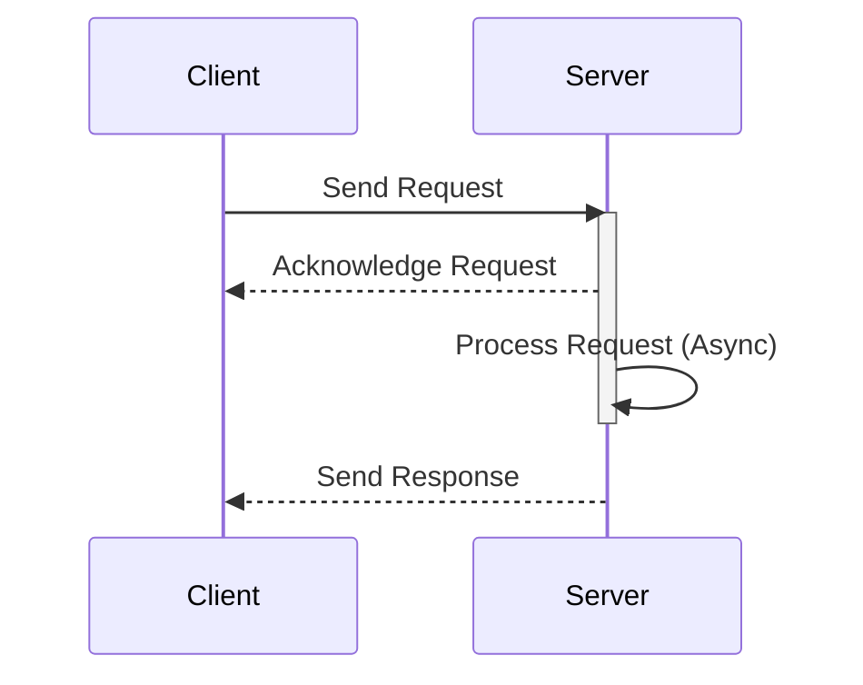

## 14.5 Asynchronous Programming for Performance

In the realm of modern software development, performance and scalability are paramount. Asynchronous programming in C# offers a powerful paradigm to enhance these aspects by allowing applications to perform non-blocking operations, thereby utilizing resources more efficiently. In this section, we will delve into the intricacies of asynchronous programming, explore its benefits, and provide practical guidance on implementing it effectively in your C# applications.

### Introduction to Asynchronous Programming

Asynchronous programming is a method of writing code that allows a program to perform tasks concurrently without waiting for each task to complete before moving on to the next. This approach is particularly beneficial in I/O-bound operations, where waiting for external resources like databases or web services can lead to inefficiencies.

#### Key Concepts

- **Concurrency vs. Parallelism**: Concurrency involves dealing with multiple tasks at once, while parallelism involves executing multiple tasks simultaneously. Asynchronous programming primarily focuses on concurrency.
- **Non-blocking Operations**: These operations allow a program to continue executing other tasks while waiting for an I/O operation to complete.
- **Event-driven Programming**: Asynchronous programming often relies on events and callbacks to handle the completion of tasks.

### Avoiding Blocking Operations

Blocking operations can severely impact the performance of an application by tying up resources that could be used for other tasks. Asynchronous programming provides mechanisms to avoid such bottlenecks.

#### Using Asynchronous I/O Operations

Asynchronous I/O operations are a cornerstone of non-blocking programming. They allow applications to initiate an I/O operation and continue executing other code while waiting for the operation to complete.

```csharp
public async Task<string> ReadFileAsync(string filePath)
{
    using (StreamReader reader = new StreamReader(filePath))
    {
        // Asynchronously read the file content
        string content = await reader.ReadToEndAsync();
        return content;
    }
}
```

In the example above, `ReadToEndAsync()` is an asynchronous method that reads the entire content of a file without blocking the calling thread. The `await` keyword is used to asynchronously wait for the operation to complete.

#### Freeing Up Threads for Better Scalability

By avoiding blocking operations, asynchronous programming frees up threads, allowing them to be used for other tasks. This is crucial for applications that need to handle a large number of concurrent requests.

```csharp
public async Task ProcessRequestsAsync(IEnumerable<string> urls)
{
    List<Task<string>> tasks = new List<Task<string>>();

    foreach (var url in urls)
    {
        // Start a new task for each URL
        tasks.Add(DownloadContentAsync(url));
    }

    // Wait for all tasks to complete
    string[] results = await Task.WhenAll(tasks);
}
```

In this example, `DownloadContentAsync(url)` is an asynchronous method that downloads content from a URL. By using `Task.WhenAll()`, we can initiate multiple download tasks concurrently and wait for all of them to complete without blocking the main thread.

### Scaling Applications

Asynchronous programming is a key enabler for scaling applications to handle high concurrency and leverage server resources efficiently.

#### Designing for High Concurrency

High concurrency involves designing applications to handle many simultaneous operations. Asynchronous programming allows you to achieve this by decoupling task initiation from task completion.

```csharp
public async Task HandleClientConnectionsAsync(TcpListener listener)
{
    while (true)
    {
        // Accept a client connection asynchronously
        TcpClient client = await listener.AcceptTcpClientAsync();
        // Handle the client connection in a separate task
        _ = Task.Run(() => ProcessClientAsync(client));
    }
}
```

In this example, `AcceptTcpClientAsync()` is used to accept client connections asynchronously. Each connection is then processed in a separate task, allowing the server to handle multiple clients concurrently.

#### Leveraging Server Resources Efficiently

Efficient resource utilization is critical for performance. Asynchronous programming helps achieve this by minimizing idle time and maximizing throughput.

```csharp
public async Task<string> FetchDataFromApiAsync(string apiUrl)
{
    using (HttpClient client = new HttpClient())
    {
        // Send an asynchronous GET request
        HttpResponseMessage response = await client.GetAsync(apiUrl);
        response.EnsureSuccessStatusCode();
        // Read the response content asynchronously
        return await response.Content.ReadAsStringAsync();
    }
}
```

In this example, `GetAsync()` and `ReadAsStringAsync()` are used to perform HTTP operations asynchronously, allowing the application to handle other tasks while waiting for the network response.

### Advanced Asynchronous Programming Techniques

As you become more comfortable with asynchronous programming, you can explore advanced techniques to further enhance performance and scalability.

#### Task Parallel Library (TPL)

The Task Parallel Library (TPL) is a set of APIs in .NET that simplifies the process of adding parallelism and concurrency to applications.

```csharp
public async Task ProcessDataInParallelAsync(IEnumerable<int> data)
{
    // Process data in parallel using TPL
    await Task.WhenAll(data.Select(async item =>
    {
        await ProcessItemAsync(item);
    }));
}
```

In this example, `Task.WhenAll()` is used to process a collection of data items in parallel, leveraging the power of TPL to maximize performance.

#### Asynchronous Streams

Asynchronous streams allow you to work with sequences of data asynchronously, providing a more efficient way to handle large datasets.

```csharp
public async IAsyncEnumerable<int> GenerateNumbersAsync(int count)
{
    for (int i = 0; i < count; i++)
    {
        await Task.Delay(100); // Simulate asynchronous work
        yield return i;
    }
}
```

In this example, `IAsyncEnumerable<int>` is used to generate a sequence of numbers asynchronously, allowing the consumer to process each number as it becomes available.

### Visualizing Asynchronous Programming

To better understand the flow of asynchronous operations, let's visualize the process using a sequence diagram.



This diagram illustrates the non-blocking nature of asynchronous programming, where the server acknowledges the request and processes it asynchronously, allowing it to handle other requests concurrently.

### Best Practices for Asynchronous Programming

To maximize the benefits of asynchronous programming, consider the following best practices:

- **Use Async/Await Appropriately**: Ensure that you use `async` and `await` keywords correctly to avoid deadlocks and ensure smooth execution.
- **Avoid Synchronous Blocking**: Refrain from using synchronous methods in asynchronous code, as this can negate the benefits of non-blocking operations.
- **Handle Exceptions Gracefully**: Implement proper exception handling to manage errors in asynchronous operations.
- **Optimize Resource Usage**: Use asynchronous programming to minimize resource consumption and maximize throughput.

### Try It Yourself

To solidify your understanding of asynchronous programming, try modifying the code examples provided. Experiment with different scenarios, such as increasing the number of concurrent tasks or introducing delays to simulate real-world conditions.

### Knowledge Check

- What is the primary benefit of asynchronous programming in terms of performance?
- How does asynchronous I/O differ from synchronous I/O?
- What role does the Task Parallel Library (TPL) play in asynchronous programming?

### Conclusion

Asynchronous programming is a powerful tool for enhancing the performance and scalability of C# applications. By avoiding blocking operations and leveraging concurrency, you can build applications that efficiently utilize resources and handle high levels of concurrency. Remember, mastering asynchronous programming is a journey. Keep experimenting, stay curious, and enjoy the process of building high-performance applications.

## Quiz Time!



### What is the primary benefit of asynchronous programming in terms of performance?

- [x] It allows for non-blocking operations, improving resource utilization.
- [ ] It simplifies code readability.
- [ ] It reduces the need for error handling.
- [ ] It eliminates the need for multithreading.

> **Explanation:** Asynchronous programming improves performance by allowing non-blocking operations, which enhances resource utilization and scalability.

### How does asynchronous I/O differ from synchronous I/O?

- [x] Asynchronous I/O allows other tasks to execute while waiting for I/O operations to complete.
- [ ] Asynchronous I/O is faster than synchronous I/O.
- [ ] Asynchronous I/O does not require error handling.
- [ ] Asynchronous I/O is only used in network operations.

> **Explanation:** Asynchronous I/O allows the program to continue executing other tasks while waiting for I/O operations to complete, unlike synchronous I/O, which blocks execution.

### What role does the Task Parallel Library (TPL) play in asynchronous programming?

- [x] It simplifies adding parallelism and concurrency to applications.
- [ ] It provides a graphical interface for debugging.
- [ ] It replaces the need for async/await keywords.
- [ ] It is used only for database operations.

> **Explanation:** The Task Parallel Library (TPL) simplifies the process of adding parallelism and concurrency to applications, enhancing performance.

### What is a key feature of asynchronous streams?

- [x] They allow processing of data sequences asynchronously.
- [ ] They eliminate the need for error handling.
- [ ] They are only used for file operations.
- [ ] They require synchronous methods for data retrieval.

> **Explanation:** Asynchronous streams allow processing of data sequences asynchronously, providing an efficient way to handle large datasets.

### Which keyword is used to wait for an asynchronous operation to complete?

- [x] await
- [ ] async
- [ ] task
- [ ] delay

> **Explanation:** The `await` keyword is used to asynchronously wait for an operation to complete.

### What is a common mistake to avoid in asynchronous programming?

- [x] Using synchronous methods in asynchronous code.
- [ ] Using too many async/await keywords.
- [ ] Handling exceptions.
- [ ] Using Task Parallel Library.

> **Explanation:** Using synchronous methods in asynchronous code can negate the benefits of non-blocking operations and should be avoided.

### How can you handle multiple asynchronous tasks concurrently?

- [x] Use Task.WhenAll() to wait for all tasks to complete.
- [ ] Use a for loop to iterate through tasks.
- [ ] Use synchronous methods to manage tasks.
- [ ] Use a single thread for all tasks.

> **Explanation:** `Task.WhenAll()` allows you to handle multiple asynchronous tasks concurrently by waiting for all of them to complete.

### What is the purpose of the async keyword in C#?

- [x] It indicates that a method is asynchronous and can use await.
- [ ] It makes a method run faster.
- [ ] It eliminates the need for error handling.
- [ ] It is used only for network operations.

> **Explanation:** The `async` keyword indicates that a method is asynchronous and can use `await` to perform non-blocking operations.

### What is a benefit of using asynchronous programming in server applications?

- [x] It allows handling of multiple client connections concurrently.
- [ ] It reduces the need for security measures.
- [ ] It simplifies database operations.
- [ ] It eliminates the need for error handling.

> **Explanation:** Asynchronous programming allows server applications to handle multiple client connections concurrently, improving scalability.

### True or False: Asynchronous programming can help improve the scalability of applications.

- [x] True
- [ ] False

> **Explanation:** True. Asynchronous programming can improve scalability by allowing applications to handle more concurrent operations efficiently.


