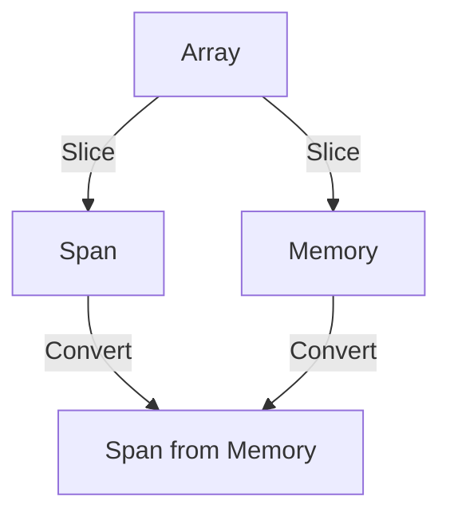

## 14.6 Span<T> and Memory<T>

In the realm of high-performance computing, efficient memory management is paramount. C# developers, especially those working on performance-critical applications, need tools that allow them to handle memory efficiently without sacrificing safety or simplicity. This is where `Span<T>` and `Memory<T>` come into play. These types provide a way to work with contiguous regions of memory, offering both performance benefits and safety features. In this section, we will delve into the intricacies of `Span<T>` and `Memory<T>`, exploring their use cases, benefits, and how they can be leveraged to optimize performance in your C# applications.

### High-Performance Memory Access

#### Reducing Allocations with `Span<T>`

`Span<T>` is a stack-only type that provides a type-safe and memory-safe representation of a contiguous region of arbitrary memory. It is designed to reduce heap allocations and improve performance by allowing developers to work with slices of arrays, strings, or unmanaged memory without copying data.

- **What is `Span<T>`?**

  `Span<T>` is a ref struct, meaning it can only be allocated on the stack. This restriction ensures that `Span<T>` instances are short-lived and do not contribute to heap fragmentation. `Span<T>` can represent a slice of an array, a segment of a string, or even a block of unmanaged memory.

- **Benefits of Using `Span<T>`**

  - **Reduced Allocations**: By working with slices of existing data, `Span<T>` minimizes the need for additional allocations.
  - **Improved Performance**: Accessing memory through `Span<T>` is often faster than traditional methods, as it avoids unnecessary copying.
  - **Safety**: `Span<T>` provides bounds checking, ensuring that operations do not exceed the allocated memory region.

- **Creating and Using `Span<T>`**

  Let's explore how to create and use `Span<T>` in a C# application:

  ```csharp
  using System;

  public class SpanExample
  {
      public static void Main()
      {
          int[] numbers = { 1, 2, 3, 4, 5, 6, 7, 8, 9, 10 };
          Span<int> slice = new Span<int>(numbers, 2, 5);

          Console.WriteLine("Slice of numbers:");
          foreach (var number in slice)
          {
              Console.WriteLine(number);
          }
      }
  }
  ```

  In this example, we create a `Span<int>` that represents a slice of the `numbers` array, starting at index 2 and spanning 5 elements. This allows us to work with a subset of the array without creating a new array.

#### Managing Memory More Efficiently

`Memory<T>` complements `Span<T>` by providing a way to represent memory that can be stored on the heap. Unlike `Span<T>`, `Memory<T>` is not a ref struct, which means it can be used in asynchronous methods and stored in fields.

- **What is `Memory<T>`?**

  `Memory<T>` is a type that represents a contiguous region of memory. It can be used to work with both managed and unmanaged memory and is particularly useful in scenarios where the memory needs to be stored or passed around.

- **Benefits of Using `Memory<T>`**

  - **Flexibility**: `Memory<T>` can be used in scenarios where `Span<T>` cannot, such as asynchronous methods.
  - **Safety**: Like `Span<T>`, `Memory<T>` provides bounds checking and type safety.
  - **Interoperability**: `Memory<T>` can be easily converted to `Span<T>` for performance-critical operations.

- **Creating and Using `Memory<T>`**

  Here's an example of how to use `Memory<T>` in a C# application:

  ```csharp
  using System;

  public class MemoryExample
  {
      public static void Main()
      {
          int[] numbers = { 1, 2, 3, 4, 5, 6, 7, 8, 9, 10 };
          Memory<int> memory = new Memory<int>(numbers, 2, 5);

          Console.WriteLine("Memory slice of numbers:");
          foreach (var number in memory.Span)
          {
              Console.WriteLine(number);
          }
      }
  }
  ```

  In this example, we create a `Memory<int>` that represents a slice of the `numbers` array. We then convert it to a `Span<int>` using the `Span` property to iterate over the elements.

### Use Cases and Examples

#### Processing Large Arrays

One of the primary use cases for `Span<T>` and `Memory<T>` is processing large arrays efficiently. By using these types, developers can work with slices of arrays without creating additional copies, reducing memory usage and improving performance.

- **Example: Processing Large Arrays with `Span<T>`**

  ```csharp
  using System;

  public class LargeArrayProcessing
  {
      public static void Main()
      {
          int[] largeArray = new int[1000000];
          // Initialize the array with some values
          for (int i = 0; i < largeArray.Length; i++)
          {
              largeArray[i] = i;
          }

          // Process a slice of the array
          Span<int> slice = new Span<int>(largeArray, 500000, 100000);
          ProcessSlice(slice);
      }

      private static void ProcessSlice(Span<int> slice)
      {
          for (int i = 0; i < slice.Length; i++)
          {
              slice[i] *= 2; // Example operation: double each element
          }
      }
  }
  ```

  In this example, we process a slice of a large array using `Span<T>`, doubling each element in the slice. This approach avoids creating a new array, reducing memory usage and improving performance.

#### Low-Level Performance-Critical Code

`Span<T>` and `Memory<T>` are also valuable in low-level performance-critical code, where minimizing allocations and maximizing memory access speed are crucial.

- **Example: Low-Level Performance with `Span<T>`**

  ```csharp
  using System;
  using System.Runtime.InteropServices;

  public class LowLevelPerformance
  {
      public static void Main()
      {
          byte[] buffer = new byte[1024];
          // Fill the buffer with some data
          for (int i = 0; i < buffer.Length; i++)
          {
              buffer[i] = (byte)i;
          }

          // Use Span<T> to access the buffer
          Span<byte> span = new Span<byte>(buffer);
          ProcessBuffer(span);
      }

      private static void ProcessBuffer(Span<byte> span)
      {
          for (int i = 0; i < span.Length; i++)
          {
              span[i] = (byte)(span[i] + 1); // Example operation: increment each byte
          }
      }
  }
  ```

  In this example, we use `Span<byte>` to process a buffer of bytes, incrementing each byte. This approach allows us to work with the buffer efficiently, minimizing allocations and maximizing performance.

### Visualizing Memory Access with `Span<T>` and `Memory<T>`

To better understand how `Span<T>` and `Memory<T>` work, let's visualize their memory access patterns using a diagram.



**Diagram Description:** This diagram illustrates how `Span<T>` and `Memory<T>` can be used to create slices of an array. `Span<T>` can be directly created from an array, while `Memory<T>` can be converted to `Span<T>` for performance-critical operations.

### Key Considerations and Best Practices

When using `Span<T>` and `Memory<T>`, there are several key considerations and best practices to keep in mind:

- **Use `Span<T>` for Performance-Critical Code**: `Span<T>` is ideal for scenarios where performance is critical, and the memory can be managed on the stack.
- **Use `Memory<T>` for Flexibility**: `Memory<T>` is suitable for scenarios where the memory needs to be stored or passed around, such as in asynchronous methods.
- **Avoid Long-Lived `Span<T>` Instances**: Since `Span<T>` is a stack-only type, it should not be used for long-lived data structures.
- **Be Mindful of Bounds Checking**: Both `Span<T>` and `Memory<T>` provide bounds checking, which can help prevent memory access errors but may introduce a slight performance overhead.
- **Leverage Interoperability**: Use the `Span` property of `Memory<T>` to convert it to `Span<T>` when performance is a concern.

### Differences and Similarities

`Span<T>` and `Memory<T>` are often used together, but they have distinct characteristics:

- **`Span<T>`**: A stack-only type that provides fast, type-safe access to contiguous memory. It cannot be stored on the heap or used in asynchronous methods.
- **`Memory<T>`**: A heap-allocatable type that provides flexible access to contiguous memory. It can be used in asynchronous methods and stored in fields.

Both types provide bounds checking and type safety, making them valuable tools for managing memory efficiently in C# applications.

### Try It Yourself

To deepen your understanding of `Span<T>` and `Memory<T>`, try modifying the code examples provided. Experiment with different array sizes, operations, and memory slices to see how these changes affect performance and memory usage.

### References and Further Reading

For more information on `Span<T>` and `Memory<T>`, consider exploring the following resources:

- [Microsoft Docs: Span<T>](https://docs.microsoft.com/en-us/dotnet/api/system.span-1)
- [Microsoft Docs: Memory<T>](https://docs.microsoft.com/en-us/dotnet/api/system.memory-1)
- [C# Programming Guide](https://docs.microsoft.com/en-us/dotnet/csharp/programming-guide/)

### Knowledge Check

Before moving on, take a moment to reflect on what you've learned about `Span<T>` and `Memory<T>`. Consider how these types can be applied in your own projects to optimize performance and manage memory efficiently.

### Embrace the Journey

Remember, mastering `Span<T>` and `Memory<T>` is just one step in your journey to becoming a C# expert. As you continue to explore and experiment with these types, you'll unlock new possibilities for optimizing performance and managing memory in your applications. Keep experimenting, stay curious, and enjoy the journey!

## Quiz Time!



### What is the primary benefit of using `Span<T>` in C#?

- [x] Reducing heap allocations
- [ ] Increasing heap allocations
- [ ] Simplifying asynchronous programming
- [ ] Enhancing garbage collection

> **Explanation:** `Span<T>` is designed to reduce heap allocations by allowing developers to work with slices of existing data without creating new arrays.

### Which type can be used in asynchronous methods?

- [ ] Span<T>
- [x] Memory<T>
- [ ] Both Span<T> and Memory<T>
- [ ] Neither Span<T> nor Memory<T>

> **Explanation:** `Memory<T>` can be used in asynchronous methods because it is not a ref struct, unlike `Span<T>`.

### How does `Span<T>` ensure memory safety?

- [x] By providing bounds checking
- [ ] By disabling bounds checking
- [ ] By allowing unmanaged memory access
- [ ] By increasing heap allocations

> **Explanation:** `Span<T>` provides bounds checking to ensure that operations do not exceed the allocated memory region, enhancing memory safety.

### What is a key difference between `Span<T>` and `Memory<T>`?

- [x] `Span<T>` is a stack-only type, while `Memory<T>` can be stored on the heap.
- [ ] `Memory<T>` is a stack-only type, while `Span<T>` can be stored on the heap.
- [ ] Both `Span<T>` and `Memory<T>` are stack-only types.
- [ ] Both `Span<T>` and `Memory<T>` can be stored on the heap.

> **Explanation:** `Span<T>` is a stack-only type, meaning it can only be allocated on the stack, while `Memory<T>` can be stored on the heap.

### Which type is suitable for long-lived data structures?

- [ ] Span<T>
- [x] Memory<T>
- [ ] Both Span<T> and Memory<T>
- [ ] Neither Span<T> nor Memory<T>

> **Explanation:** `Memory<T>` is suitable for long-lived data structures because it can be stored on the heap, unlike `Span<T>`.

### What is the purpose of the `Span` property in `Memory<T>`?

- [x] To convert `Memory<T>` to `Span<T>`
- [ ] To convert `Span<T>` to `Memory<T>`
- [ ] To allocate memory on the heap
- [ ] To disable bounds checking

> **Explanation:** The `Span` property in `Memory<T>` is used to convert `Memory<T>` to `Span<T>` for performance-critical operations.

### Which of the following is NOT a benefit of using `Span<T>`?

- [ ] Reduced allocations
- [ ] Improved performance
- [x] Simplified asynchronous programming
- [ ] Memory safety

> **Explanation:** `Span<T>` does not simplify asynchronous programming; it is a stack-only type and cannot be used in asynchronous methods.

### What is a common use case for `Span<T>`?

- [x] Processing large arrays efficiently
- [ ] Simplifying asynchronous programming
- [ ] Enhancing garbage collection
- [ ] Increasing heap allocations

> **Explanation:** `Span<T>` is commonly used for processing large arrays efficiently by working with slices of existing data without creating new arrays.

### Which type provides more flexibility for storing and passing memory?

- [ ] Span<T>
- [x] Memory<T>
- [ ] Both Span<T> and Memory<T>
- [ ] Neither Span<T> nor Memory<T>

> **Explanation:** `Memory<T>` provides more flexibility for storing and passing memory because it can be stored on the heap and used in asynchronous methods.

### True or False: `Span<T>` can be used for long-lived data structures.

- [ ] True
- [x] False

> **Explanation:** False. `Span<T>` is a stack-only type and should not be used for long-lived data structures.


