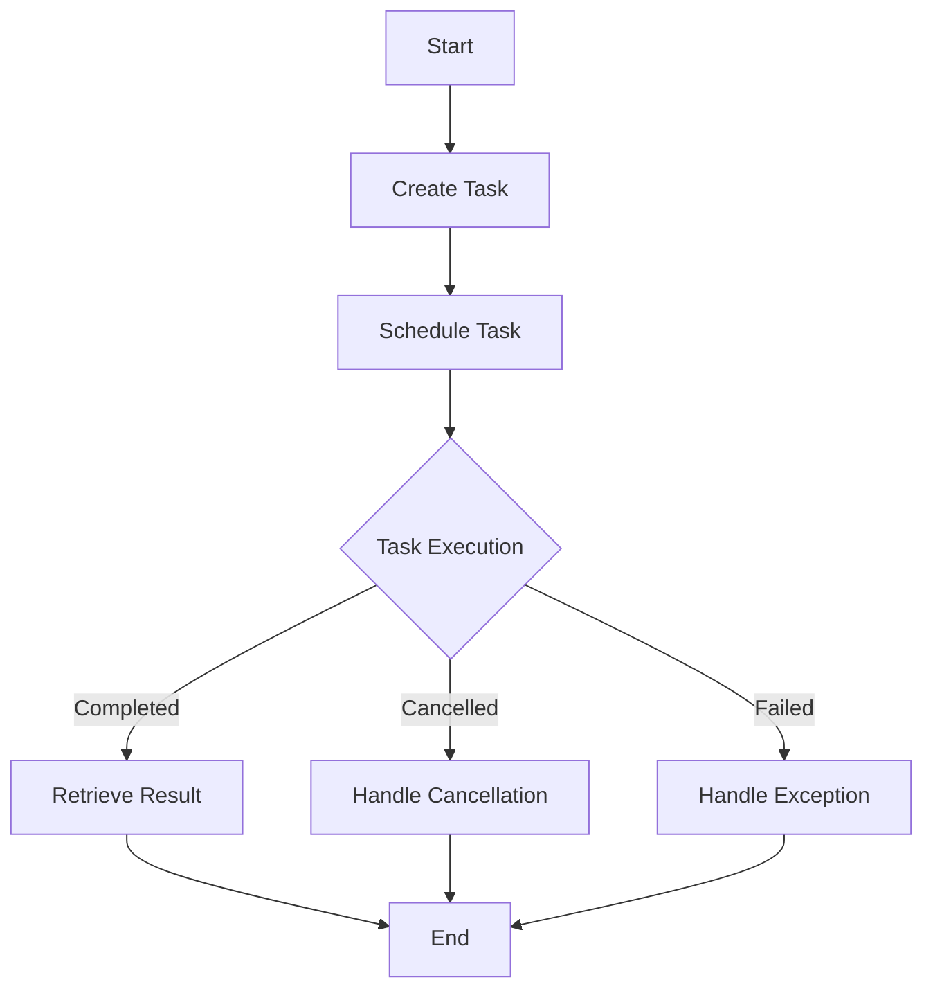

## 14.7 Parallel Processing

In the modern era of computing, leveraging the full potential of multi-core processors is crucial for building high-performance applications. Parallel processing in C# allows developers to execute multiple tasks concurrently, thereby optimizing resource utilization and improving application responsiveness. In this section, we will delve into the concepts of parallel processing, explore the tools and libraries available in C#, and discuss the trade-offs and considerations involved in parallelizing workloads.

### Leveraging Multiple Cores

Parallel processing involves dividing a task into smaller sub-tasks that can be executed simultaneously across multiple cores. This approach can significantly reduce execution time and improve application throughput. In C#, the Task Parallel Library (TPL) and Parallel LINQ (PLINQ) are two powerful tools that facilitate parallel processing.

#### Task Parallel Library (TPL)

The Task Parallel Library is a set of public types and APIs in the `System.Threading.Tasks` namespace that simplifies the process of adding parallelism and concurrency to applications. TPL abstracts the complexity of thread management and provides a higher-level programming model for parallel execution.

##### Key Features of TPL

- **Task-Based Programming Model**: TPL introduces the `Task` class, which represents an asynchronous operation. Tasks can be created, started, and managed easily.
- **Task Scheduling**: TPL uses a task scheduler to manage the execution of tasks, optimizing the use of available threads.
- **Cancellation and Continuations**: TPL supports task cancellation and chaining of tasks using continuations, allowing for more flexible and responsive applications.

##### Example: Parallelizing a Simple Task

Let's consider a simple example where we parallelize a computation-intensive task using TPL.

```csharp
using System;
using System.Threading.Tasks;

class ParallelProcessingExample
{
    static void Main()
    {
        // Define the number of iterations
        int iterations = 1000000;

        // Create a task to perform a computation-intensive operation
        Task<long> task = Task.Run(() => ComputeSum(iterations));

        // Wait for the task to complete and retrieve the result
        long result = task.Result;

        Console.WriteLine($"Sum of first {iterations} numbers is: {result}");
    }

    static long ComputeSum(int iterations)
    {
        long sum = 0;
        for (int i = 0; i < iterations; i++)
        {
            sum += i;
        }
        return sum;
    }
}
```

In this example, we use the `Task.Run` method to execute the `ComputeSum` method asynchronously. The task is scheduled for execution, and the main thread waits for its completion using the `Result` property.

#### Parallel LINQ (PLINQ)

PLINQ extends LINQ to Objects with parallel capabilities, allowing developers to perform parallel operations on collections. PLINQ automatically partitions the data source and distributes the workload across multiple threads.

##### Key Features of PLINQ

- **Automatic Parallelization**: PLINQ automatically determines the degree of parallelism based on the system's capabilities.
- **Query Syntax**: PLINQ queries resemble LINQ queries, making it easy for developers to transition from sequential to parallel execution.
- **Cancellation and Exception Handling**: PLINQ supports cancellation tokens and exception handling, providing robust control over query execution.

##### Example: Parallelizing a LINQ Query

Consider the following example where we use PLINQ to parallelize a LINQ query.

```csharp
using System;
using System.Linq;

class PLINQExample
{
    static void Main()
    {
        // Create a large data source
        int[] numbers = Enumerable.Range(1, 1000000).ToArray();

        // Use PLINQ to find all even numbers
        var evenNumbers = numbers.AsParallel()
                                 .Where(n => n % 2 == 0)
                                 .ToArray();

        Console.WriteLine($"Found {evenNumbers.Length} even numbers.");
    }
}
```

In this example, we use the `AsParallel` method to convert the data source into a parallel query. The `Where` clause is executed in parallel, and the results are aggregated into an array.

### Trade-offs and Considerations

While parallel processing can significantly improve performance, it also introduces complexity and potential pitfalls. It is essential to understand the trade-offs and considerations involved in parallelizing workloads.

#### Overhead of Parallelization

Parallel processing introduces overhead due to task creation, scheduling, and synchronization. In some cases, the overhead may outweigh the performance benefits, especially for small or simple tasks. It is crucial to analyze the workload and determine whether parallelization is beneficial.

#### Suitable Workloads for Parallelism

Not all workloads are suitable for parallel processing. Tasks that involve significant inter-thread communication or shared state may suffer from contention and synchronization issues. Ideal candidates for parallelization are tasks that are computation-intensive and can be divided into independent sub-tasks.

#### Synchronization and Thread Safety

When parallelizing tasks, it is essential to ensure that shared resources are accessed in a thread-safe manner. Synchronization mechanisms such as locks, mutexes, and semaphores may be required to prevent race conditions and data corruption.

#### Debugging and Testing

Parallel applications can be challenging to debug and test due to non-deterministic behavior and timing issues. It is essential to use appropriate tools and techniques to identify and resolve concurrency-related issues.

### Visualizing Parallel Processing

To better understand the flow of parallel processing, let's visualize the execution of tasks using a flowchart.



This flowchart illustrates the lifecycle of a task in TPL, from creation to completion, including handling of cancellations and exceptions.

### Try It Yourself

Experiment with the code examples provided in this section. Try modifying the number of iterations in the TPL example or the range of numbers in the PLINQ example. Observe how these changes affect the execution time and resource utilization. Consider adding additional tasks or queries to further explore the capabilities of parallel processing in C#.

### References and Links

- [Microsoft Docs: Task Parallel Library (TPL)](https://docs.microsoft.com/en-us/dotnet/standard/parallel-programming/task-parallel-library-tpl)
- [Microsoft Docs: PLINQ (Parallel LINQ)](https://docs.microsoft.com/en-us/dotnet/standard/parallel-programming/parallel-linq-plinq)
- [Concurrency in C# Cookbook by Stephen Cleary](https://www.amazon.com/Concurrency-Cookbook-Asynchronous-Responsive-Programming/dp/1449367569)

### Knowledge Check

- What is the primary purpose of the Task Parallel Library (TPL)?
- How does PLINQ differ from traditional LINQ?
- What are some common pitfalls of parallel processing?
- How can you ensure thread safety when accessing shared resources?

### Embrace the Journey

Remember, mastering parallel processing is a journey. As you continue to explore and experiment with parallelism in C#, you'll gain a deeper understanding of its potential and limitations. Keep pushing the boundaries, stay curious, and enjoy the process of building high-performance applications.

## Quiz Time!



### What is the primary purpose of the Task Parallel Library (TPL)?

- [x] To simplify the process of adding parallelism and concurrency to applications.
- [ ] To provide a graphical user interface for task management.
- [ ] To replace traditional threading models in C#.
- [ ] To manage memory allocation in C# applications.

> **Explanation:** The Task Parallel Library (TPL) is designed to simplify the process of adding parallelism and concurrency to applications by providing a higher-level programming model.

### How does PLINQ differ from traditional LINQ?

- [x] PLINQ automatically parallelizes queries to improve performance.
- [ ] PLINQ is used for querying databases only.
- [ ] PLINQ does not support query syntax.
- [ ] PLINQ is a replacement for LINQ.

> **Explanation:** PLINQ extends LINQ to Objects with parallel capabilities, allowing queries to be executed in parallel to improve performance.

### What is a potential drawback of parallel processing?

- [x] It introduces overhead due to task creation and synchronization.
- [ ] It always improves application performance.
- [ ] It simplifies debugging and testing.
- [ ] It eliminates the need for thread safety.

> **Explanation:** Parallel processing introduces overhead due to task creation, scheduling, and synchronization, which can sometimes outweigh the performance benefits.

### Which of the following is a suitable candidate for parallel processing?

- [x] Computation-intensive tasks that can be divided into independent sub-tasks.
- [ ] Tasks that involve significant inter-thread communication.
- [ ] Tasks that require frequent access to shared state.
- [ ] Simple tasks with minimal computation.

> **Explanation:** Computation-intensive tasks that can be divided into independent sub-tasks are ideal candidates for parallel processing, as they minimize inter-thread communication and contention.

### What is a common method to ensure thread safety when accessing shared resources?

- [x] Using locks or mutexes to synchronize access.
- [ ] Ignoring synchronization issues.
- [ ] Using global variables for shared state.
- [ ] Relying on the operating system for thread safety.

> **Explanation:** Using locks, mutexes, or other synchronization mechanisms is a common method to ensure thread safety when accessing shared resources.

### What is the role of a task scheduler in TPL?

- [x] To manage the execution of tasks and optimize thread usage.
- [ ] To provide a user interface for task management.
- [ ] To allocate memory for tasks.
- [ ] To replace the operating system's scheduler.

> **Explanation:** The task scheduler in TPL manages the execution of tasks, optimizing the use of available threads and resources.

### How can you handle exceptions in a PLINQ query?

- [x] By using exception handling mechanisms such as try-catch blocks.
- [ ] By ignoring exceptions.
- [ ] By using global exception handlers.
- [ ] By restarting the application.

> **Explanation:** Exceptions in PLINQ queries can be handled using standard exception handling mechanisms such as try-catch blocks.

### What is the benefit of using continuations in TPL?

- [x] They allow chaining of tasks for more flexible execution.
- [ ] They eliminate the need for task cancellation.
- [ ] They simplify task creation.
- [ ] They provide a graphical interface for task management.

> **Explanation:** Continuations in TPL allow tasks to be chained together, providing more flexible and responsive execution.

### What is the purpose of a cancellation token in TPL?

- [x] To allow tasks to be cancelled gracefully.
- [ ] To prevent tasks from being created.
- [ ] To allocate additional resources for tasks.
- [ ] To replace exception handling.

> **Explanation:** A cancellation token in TPL allows tasks to be cancelled gracefully, providing a mechanism for cooperative cancellation.

### True or False: All workloads benefit from parallel processing.

- [ ] True
- [x] False

> **Explanation:** Not all workloads benefit from parallel processing. Some tasks may not be suitable for parallelization due to overhead, synchronization issues, or inter-thread communication requirements.


