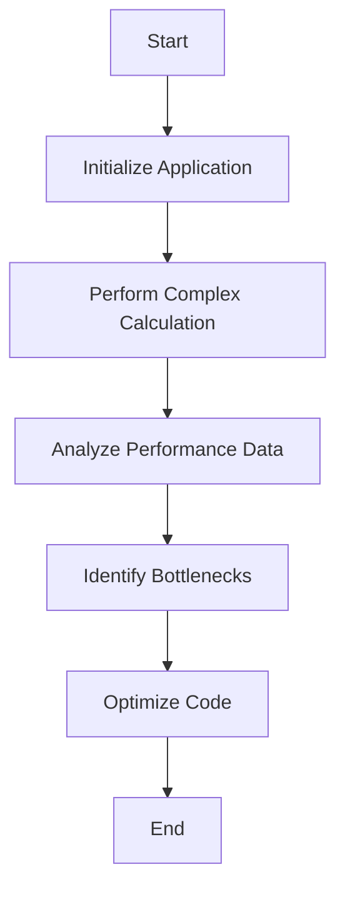

## 14.8 Profiling and Benchmarking

In the realm of software development, especially when dealing with complex systems, performance optimization is a critical aspect that can significantly impact user experience and system efficiency. Profiling and benchmarking are essential techniques in the performance optimization toolkit, allowing developers to measure, analyze, and enhance the performance of their applications. In this section, we will delve into the intricacies of profiling and benchmarking in C#, exploring the tools and methodologies that can help you identify bottlenecks and optimize your code effectively.

### Understanding Profiling and Benchmarking

Before we dive into the tools and techniques, let's clarify what profiling and benchmarking entail:

- **Profiling** is the process of collecting data about a program's execution to understand its behavior, particularly in terms of resource usage such as CPU, memory, and I/O. Profilers help identify which parts of the code are consuming the most resources and where potential bottlenecks lie.

- **Benchmarking** involves running a set of programs or operations to measure their performance under specific conditions. It is used to compare the performance of different implementations or to track performance changes over time.

Both profiling and benchmarking are crucial for performance tuning, enabling developers to make informed decisions about where to focus optimization efforts.

### Tools for Measuring Performance

To effectively profile and benchmark C# applications, several tools are available that cater to different aspects of performance analysis. Let's explore some of the most popular ones:

#### dotTrace

dotTrace is a powerful profiling tool developed by JetBrains, designed to help developers analyze the performance of .NET applications. It provides detailed insights into CPU usage, memory allocation, and I/O operations.

**Key Features of dotTrace:**

- **CPU Profiling:** Analyze how much CPU time is consumed by different parts of your application.
- **Memory Profiling:** Identify memory leaks and excessive memory usage.
- **Timeline Profiling:** Visualize the execution timeline to understand the sequence of events and their duration.
- **Integration with Visual Studio:** Seamlessly integrate with Visual Studio for a streamlined workflow.

**Using dotTrace:**

To use dotTrace, you need to install it as part of the JetBrains Rider or as a standalone tool. Once installed, you can attach it to a running application or start profiling directly from your development environment.

```csharp
// Example: Using dotTrace to profile a simple C# application
public class Program
{
    public static void Main()
    {
        for (int i = 0; i < 1000; i++)
        {
            PerformComplexCalculation(i);
        }
    }

    private static void PerformComplexCalculation(int value)
    {
        // Simulate a complex calculation
        Thread.Sleep(10);
    }
}
```

In this example, dotTrace can help identify that the `Thread.Sleep(10)` call is a significant contributor to the application's execution time.

#### ANTS Performance Profiler

ANTS Performance Profiler, developed by Redgate, is another robust tool for profiling .NET applications. It provides detailed performance data, including CPU usage, memory allocation, and I/O operations.

**Key Features of ANTS Performance Profiler:**

- **Line-Level Timing:** See how long each line of code takes to execute.
- **SQL and HTTP Requests:** Analyze the performance of database queries and web requests.
- **Memory Profiling:** Detect memory leaks and inefficient memory usage.
- **Call Graphs:** Visualize the call hierarchy and identify performance hotspots.

**Using ANTS Performance Profiler:**

To use ANTS Performance Profiler, you need to install it and then attach it to your application. It provides a user-friendly interface to navigate through the performance data.

```csharp
// Example: Using ANTS Performance Profiler to analyze database queries
public class DatabaseExample
{
    public void FetchData()
    {
        using (var connection = new SqlConnection("YourConnectionString"))
        {
            connection.Open();
            var command = new SqlCommand("SELECT * FROM LargeTable", connection);
            using (var reader = command.ExecuteReader())
            {
                while (reader.Read())
                {
                    // Process data
                }
            }
        }
    }
}
```

ANTS Performance Profiler can help identify if the `SELECT * FROM LargeTable` query is a performance bottleneck and suggest optimizations.

#### BenchmarkDotNet

BenchmarkDotNet is a popular library for benchmarking .NET code. It provides a simple and consistent way to measure the performance of different code snippets and compare their efficiency.

**Key Features of BenchmarkDotNet:**

- **Accurate Measurements:** Provides precise and reliable performance measurements.
- **Easy to Use:** Simple API for defining and running benchmarks.
- **Rich Reporting:** Generates detailed reports with charts and statistics.
- **Cross-Platform:** Supports benchmarking on Windows, Linux, and macOS.

**Using BenchmarkDotNet:**

To use BenchmarkDotNet, you need to install the NuGet package and create a benchmark class with methods you want to measure.

```csharp
using BenchmarkDotNet.Attributes;
using BenchmarkDotNet.Running;

public class BenchmarkExample
{
    [Benchmark]
    public void TestMethod1()
    {
        // Code to benchmark
    }

    [Benchmark]
    public void TestMethod2()
    {
        // Another code to benchmark
    }

    public static void Main(string[] args)
    {
        var summary = BenchmarkRunner.Run<BenchmarkExample>();
    }
}
```

In this example, BenchmarkDotNet will measure the execution time of `TestMethod1` and `TestMethod2`, providing a detailed comparison.

### Identifying Bottlenecks

Once you have the tools in place, the next step is to identify performance bottlenecks in your application. This involves analyzing the collected data to pinpoint areas that require optimization.

#### Analyzing Performance Data

When analyzing performance data, focus on the following aspects:

- **CPU Usage:** Identify methods or operations that consume excessive CPU time.
- **Memory Allocation:** Look for memory leaks or excessive memory usage that could lead to performance degradation.
- **I/O Operations:** Analyze the performance of database queries, file operations, and network requests.
- **Concurrency Issues:** Detect thread contention or deadlocks that could impact performance.

#### Focusing Optimization Efforts

Once bottlenecks are identified, prioritize optimization efforts based on their impact on overall performance. Consider the following strategies:

- **Optimize Hot Paths:** Focus on optimizing code paths that are executed frequently and consume significant resources.
- **Reduce Memory Usage:** Implement memory-efficient data structures and algorithms to minimize memory allocation.
- **Improve I/O Performance:** Optimize database queries, use caching strategies, and minimize network latency.
- **Enhance Concurrency:** Use asynchronous programming and parallel processing to improve responsiveness and throughput.

### Visualizing Performance Data

Visualizing performance data can provide valuable insights into the behavior of your application. Tools like dotTrace and ANTS Performance Profiler offer visualizations such as call graphs and execution timelines to help you understand the flow of execution and identify bottlenecks.



**Diagram Description:** This flowchart illustrates the process of profiling and optimizing a C# application, from initialization to performance analysis and code optimization.

### Best Practices for Profiling and Benchmarking

To make the most of profiling and benchmarking, consider the following best practices:

- **Profile in a Realistic Environment:** Ensure that the profiling environment closely resembles the production environment to obtain accurate results.
- **Use Representative Workloads:** Use workloads that reflect real-world usage patterns to identify performance issues that matter.
- **Iterate and Measure:** Continuously profile and benchmark your application as you make changes to track performance improvements.
- **Document Findings:** Keep a record of performance data and optimization efforts to facilitate future analysis and decision-making.

### Try It Yourself

To gain hands-on experience with profiling and benchmarking, try the following exercises:

1. **Experiment with dotTrace:** Profile a sample C# application using dotTrace and identify the top CPU-consuming methods. Try optimizing these methods and observe the impact on performance.

2. **Benchmark with BenchmarkDotNet:** Create a benchmark project using BenchmarkDotNet and compare the performance of different sorting algorithms. Experiment with different input sizes and analyze the results.

3. **Analyze with ANTS Performance Profiler:** Use ANTS Performance Profiler to analyze a database-driven application. Identify slow queries and optimize them using indexing or query optimization techniques.

### Knowledge Check

- **What is the primary purpose of profiling in software development?**
- **How does benchmarking differ from profiling?**
- **Name two popular tools for profiling .NET applications.**
- **What are some common performance bottlenecks in C# applications?**
- **Why is it important to profile in a realistic environment?**

### Embrace the Journey

Remember, mastering profiling and benchmarking is a journey that requires practice and experimentation. As you progress, you'll develop a deeper understanding of your application's performance characteristics and learn how to optimize it effectively. Keep experimenting, stay curious, and enjoy the journey!

## Quiz Time!



### What is the primary purpose of profiling in software development?

- [x] To collect data about a program's execution to understand its behavior
- [ ] To compare the performance of different implementations
- [ ] To measure the performance of hardware components
- [ ] To optimize the user interface design

> **Explanation:** Profiling is used to collect data about a program's execution to understand its behavior, particularly in terms of resource usage.

### How does benchmarking differ from profiling?

- [x] Benchmarking involves running a set of programs to measure performance under specific conditions
- [ ] Benchmarking is used to identify memory leaks
- [ ] Benchmarking is a tool for debugging code
- [ ] Benchmarking is used to visualize application architecture

> **Explanation:** Benchmarking involves running a set of programs or operations to measure their performance under specific conditions, unlike profiling which focuses on understanding resource usage.

### Name two popular tools for profiling .NET applications.

- [x] dotTrace
- [x] ANTS Performance Profiler
- [ ] Visual Studio Code
- [ ] GitHub

> **Explanation:** dotTrace and ANTS Performance Profiler are popular tools for profiling .NET applications.

### What are some common performance bottlenecks in C# applications?

- [x] CPU usage, memory allocation, I/O operations
- [ ] User interface design, color scheme, font size
- [ ] Hardware compatibility, operating system version
- [ ] Network bandwidth, internet speed

> **Explanation:** Common performance bottlenecks in C# applications include CPU usage, memory allocation, and I/O operations.

### Why is it important to profile in a realistic environment?

- [x] To obtain accurate results that reflect real-world usage
- [ ] To reduce the cost of development
- [ ] To improve the aesthetics of the application
- [ ] To ensure compatibility with all operating systems

> **Explanation:** Profiling in a realistic environment ensures that the results obtained reflect real-world usage, leading to more accurate performance analysis.

### Which tool provides line-level timing for .NET applications?

- [x] ANTS Performance Profiler
- [ ] dotTrace
- [ ] BenchmarkDotNet
- [ ] Visual Studio

> **Explanation:** ANTS Performance Profiler provides line-level timing, allowing developers to see how long each line of code takes to execute.

### What is a key feature of BenchmarkDotNet?

- [x] Accurate and reliable performance measurements
- [ ] Integration with GitHub
- [ ] Real-time collaboration
- [ ] Automated code refactoring

> **Explanation:** BenchmarkDotNet provides accurate and reliable performance measurements, making it a popular choice for benchmarking .NET code.

### Which visualization tool is used to understand the flow of execution in a C# application?

- [x] Call graphs
- [ ] Gantt charts
- [ ] Pie charts
- [ ] Bar graphs

> **Explanation:** Call graphs are used to visualize the call hierarchy and understand the flow of execution in a C# application.

### What strategy should be used to optimize frequently executed code paths?

- [x] Optimize hot paths
- [ ] Increase memory allocation
- [ ] Reduce CPU usage
- [ ] Simplify user interface

> **Explanation:** Optimizing hot paths, which are frequently executed code paths, can significantly improve application performance.

### True or False: BenchmarkDotNet supports benchmarking on Windows, Linux, and macOS.

- [x] True
- [ ] False

> **Explanation:** BenchmarkDotNet is cross-platform and supports benchmarking on Windows, Linux, and macOS.


