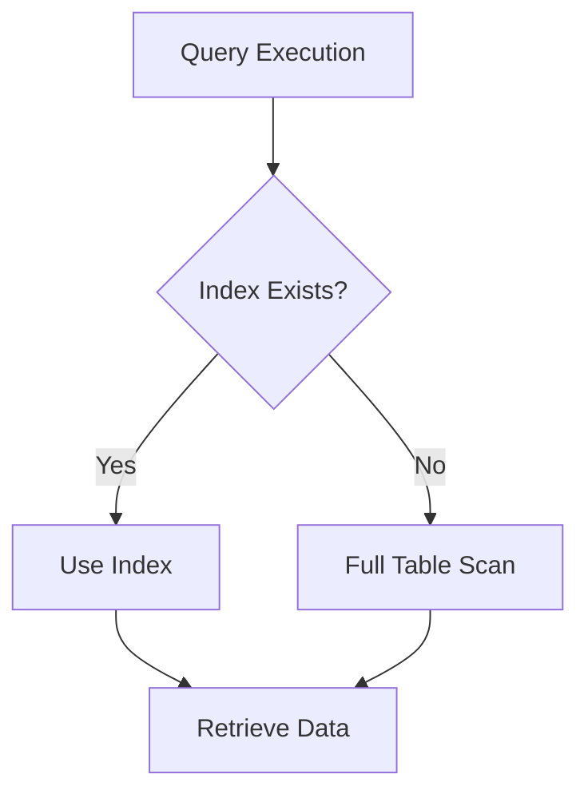

## 14.9 Optimizing Data Access

In the realm of software development, efficient data access is crucial for building high-performance applications. As expert software engineers and enterprise architects, understanding how to optimize data access in C# applications can significantly enhance the performance and scalability of your systems. This section delves into various strategies and techniques to optimize data access, focusing on reducing database calls, employing eager vs. lazy loading, batch operations, command batching, indexing, and query optimization.

### Enhancing Database Interactions for Better Performance

Optimizing data access involves a combination of strategies that aim to reduce the time and resources required to retrieve and manipulate data. Let's explore these strategies in detail.

#### Reducing Database Calls

Reducing the number of database calls is a fundamental step in optimizing data access. Each call to the database incurs overhead, including network latency and processing time. By minimizing these calls, you can significantly improve application performance.

##### Using Eager vs. Lazy Loading Appropriately

**Eager Loading**: This approach involves loading all related data at once, which can be beneficial when you know you'll need all the data upfront. It reduces the number of database calls by fetching related entities in a single query.

**Lazy Loading**: This technique delays the loading of related data until it is explicitly accessed. It can be useful when you don't need all related data immediately, thus avoiding unnecessary data retrieval.

**Example**: Consider a scenario where you have an `Order` entity with related `OrderItems`. Using Entity Framework, you can choose between eager and lazy loading.

```csharp
// Eager Loading
var orders = context.Orders.Include(o => o.OrderItems).ToList();

// Lazy Loading
var orders = context.Orders.ToList();
foreach (var order in orders)
{
    var items = order.OrderItems; // OrderItems are loaded here
}
```

**Design Considerations**: Use eager loading when you need all related data to avoid multiple round trips to the database. Opt for lazy loading when you want to defer data retrieval until necessary, especially if the related data is large or rarely accessed.

##### Batch Operations and Command Batching

Batch operations allow you to execute multiple database commands in a single round trip, reducing the overhead associated with multiple calls.

**Example**: Using Entity Framework, you can batch multiple insert operations.

```csharp
var newOrders = new List<Order>
{
    new Order { /* properties */ },
    new Order { /* properties */ },
    // Add more orders
};

context.Orders.AddRange(newOrders);
context.SaveChanges(); // Executes all inserts in a single batch
```

**Command Batching**: This technique involves grouping multiple commands into a single batch to be executed together. It is particularly useful for update and delete operations.

**Try It Yourself**: Modify the above example to include updates and deletes, and observe the performance improvements.

### Indexing and Query Optimization

Efficient indexing and query optimization are critical for enhancing data retrieval performance.

#### Designing Efficient Database Indexes

Indexes are data structures that improve the speed of data retrieval operations on a database table. However, they come with trade-offs, such as increased storage requirements and slower write operations.

**Key Considerations**:
- **Choose the Right Columns**: Index columns that are frequently used in WHERE clauses, JOIN conditions, and ORDER BY clauses.
- **Avoid Over-Indexing**: Too many indexes can degrade performance, especially for write operations.
- **Use Composite Indexes**: When queries involve multiple columns, composite indexes can be more efficient.

**Example**: Creating an index on a SQL Server database.

```sql
CREATE INDEX IX_Order_CustomerId ON Orders (CustomerId);
```

**Visualizing Index Impact**: Use the following diagram to understand how indexes affect query performance.



#### Analyzing Query Execution Plans

Query execution plans provide insights into how a database engine executes a query. Analyzing these plans can help identify performance bottlenecks and optimize queries.

**Steps to Analyze Execution Plans**:
1. **Generate the Plan**: Use tools like SQL Server Management Studio (SSMS) to view execution plans.
2. **Identify Bottlenecks**: Look for operations like table scans, which indicate missing indexes.
3. **Optimize Queries**: Rewrite queries or add indexes to improve performance.

**Example**: Viewing an execution plan in SSMS.

1. Open SSMS and execute your query.
2. Click on "Include Actual Execution Plan" before running the query.
3. Analyze the generated plan for potential optimizations.

**Try It Yourself**: Experiment with different queries and indexes, and observe how execution plans change.

### Knowledge Check

- **Question**: What is the primary advantage of using eager loading over lazy loading?
- **Question**: How can batch operations improve database performance?
- **Question**: What are the potential downsides of over-indexing a database table?

### Embrace the Journey

Optimizing data access is a continuous process that requires a deep understanding of your application's data access patterns and the underlying database technology. Remember, this is just the beginning. As you progress, you'll build more efficient and scalable applications. Keep experimenting, stay curious, and enjoy the journey!

### References and Links

- [Entity Framework Documentation](https://docs.microsoft.com/en-us/ef/)
- [SQL Server Index Design Guide](https://docs.microsoft.com/en-us/sql/relational-databases/sql-server-index-design-guide)
- [Analyzing Query Execution Plans](https://docs.microsoft.com/en-us/sql/relational-databases/performance/display-an-actual-execution-plan)

## Quiz Time!



### What is the primary advantage of using eager loading over lazy loading?

- [x] Reduces the number of database calls
- [ ] Increases the flexibility of data retrieval
- [ ] Minimizes memory usage
- [ ] Simplifies code structure

> **Explanation:** Eager loading reduces the number of database calls by fetching related entities in a single query.

### How can batch operations improve database performance?

- [x] By reducing the number of round trips to the database
- [ ] By increasing the complexity of queries
- [ ] By minimizing the use of indexes
- [ ] By simplifying transaction management

> **Explanation:** Batch operations reduce the number of round trips to the database, which decreases overhead and improves performance.

### What are the potential downsides of over-indexing a database table?

- [x] Increased storage requirements and slower write operations
- [ ] Improved read performance
- [ ] Simplified query execution plans
- [ ] Enhanced data integrity

> **Explanation:** Over-indexing can lead to increased storage requirements and slower write operations due to the overhead of maintaining multiple indexes.

### What is the purpose of analyzing query execution plans?

- [x] To identify performance bottlenecks and optimize queries
- [ ] To increase the complexity of database schemas
- [ ] To simplify data retrieval logic
- [ ] To enhance data security

> **Explanation:** Analyzing query execution plans helps identify performance bottlenecks and optimize queries for better performance.

### Which of the following is a key consideration when designing database indexes?

- [x] Index columns frequently used in WHERE clauses
- [ ] Index every column in the table
- [ ] Avoid using composite indexes
- [ ] Minimize the number of indexes

> **Explanation:** Indexing columns frequently used in WHERE clauses can significantly improve query performance.

### What is a composite index?

- [x] An index that includes multiple columns
- [ ] An index that is automatically created by the database
- [ ] An index that is used for full-text search
- [ ] An index that is only used for primary keys

> **Explanation:** A composite index includes multiple columns and is useful for queries involving multiple columns.

### How does lazy loading affect data retrieval?

- [x] Delays loading of related data until explicitly accessed
- [ ] Loads all related data at once
- [ ] Reduces the number of database calls
- [ ] Simplifies query execution plans

> **Explanation:** Lazy loading delays the loading of related data until it is explicitly accessed, which can reduce unnecessary data retrieval.

### What is the impact of a full table scan on query performance?

- [x] It can significantly degrade performance
- [ ] It improves query execution speed
- [ ] It simplifies query logic
- [ ] It enhances data integrity

> **Explanation:** A full table scan can significantly degrade performance, especially for large tables, as it involves scanning the entire table.

### Which tool can be used to view query execution plans in SQL Server?

- [x] SQL Server Management Studio (SSMS)
- [ ] Visual Studio Code
- [ ] Entity Framework Core
- [ ] LINQPad

> **Explanation:** SQL Server Management Studio (SSMS) provides tools to view and analyze query execution plans.

### True or False: Eager loading is always the best choice for data retrieval.

- [ ] True
- [x] False

> **Explanation:** Eager loading is not always the best choice; it depends on the specific use case and data access patterns.


