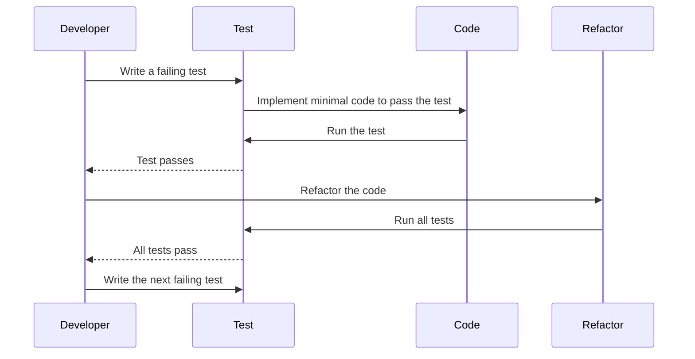

## 15.1 Test-Driven Development (TDD) with Design Patterns

Test-Driven Development (TDD) is a software development approach where tests are written before the actual code. This methodology not only ensures that the code meets its requirements but also significantly enhances the design and quality of the software. When combined with design patterns, TDD becomes a powerful tool for creating robust, maintainable, and scalable applications. In this section, we will explore the benefits of TDD, how to integrate TDD practices with design patterns, and provide practical examples to illustrate these concepts.

### Understanding Test-Driven Development (TDD)

Test-Driven Development is a disciplined software development process that follows a simple cycle:

1. **Write a Test**: Before writing any functional code, a developer writes a test for the next bit of functionality to be implemented.
2. **Run the Test**: Initially, the test will fail because the functionality is not yet implemented.
3. **Write the Code**: Write the minimal amount of code necessary to pass the test.
4. **Refactor**: Clean up the code while ensuring that all tests still pass.
5. **Repeat**: Continue the cycle with the next piece of functionality.

This cycle is often referred to as the "Red-Green-Refactor" cycle, where "Red" indicates a failing test, "Green" indicates a passing test, and "Refactor" involves improving the code.

### Benefits of TDD

#### Improving Code Quality and Design

- **Ensures Code Meets Requirements**: By writing tests first, developers ensure that the code meets the specified requirements from the outset.
- **Encourages Simple Design**: TDD encourages writing only the code necessary to pass the tests, leading to simpler and more focused designs.
- **Facilitates Refactoring**: With a comprehensive suite of tests, developers can refactor code with confidence, knowing that any regressions will be caught by the tests.

#### Fostering Better Understanding of Requirements

- **Clarifies Requirements**: Writing tests first forces developers to think through the requirements and edge cases before implementation.
- **Improves Communication**: Tests serve as documentation that can improve communication between developers and stakeholders.

### Integrating TDD Practices with Design Patterns

Design patterns provide proven solutions to common design problems. When used in conjunction with TDD, they can help ensure that the code is not only correct but also well-structured and maintainable.

#### Writing Tests Before Production Code

- **Identify the Pattern**: Determine which design pattern is appropriate for the problem at hand.
- **Write Tests for Pattern Behavior**: Write tests that define the expected behavior of the pattern.
- **Implement the Pattern**: Implement the pattern to satisfy the tests.

#### Using Design Patterns to Satisfy Test Requirements

- **Leverage Patterns for Testability**: Some patterns, such as the Strategy or Observer pattern, inherently improve testability by decoupling components.
- **Mocking and Stubbing**: Use patterns like Dependency Injection to facilitate mocking and stubbing in tests.

### Use Cases and Examples

#### Developing Robust and Maintainable Codebases

By combining TDD with design patterns, developers can create codebases that are both robust and maintainable. Let's explore some examples to illustrate this synergy.

#### Example: TDD with the Strategy Pattern

The Strategy pattern is used to define a family of algorithms, encapsulate each one, and make them interchangeable. This pattern is particularly useful when you want to select an algorithm at runtime.

**Scenario**: Suppose we are developing a payment processing system that supports multiple payment methods (e.g., credit card, PayPal, bank transfer).

**Step 1: Write a Test**

```csharp
using Xunit;

public class PaymentProcessorTests
{
    [Fact]
    public void Should_ProcessPayment_UsingCreditCard()
    {
        var paymentProcessor = new PaymentProcessor(new CreditCardPaymentStrategy());
        var result = paymentProcessor.ProcessPayment(100);

        Assert.True(result);
    }
}
```

**Step 2: Implement the Strategy Pattern**

```csharp
public interface IPaymentStrategy
{
    bool Pay(decimal amount);
}

public class CreditCardPaymentStrategy : IPaymentStrategy
{
    public bool Pay(decimal amount)
    {
        // Implement credit card payment logic
        return true;
    }
}

public class PaymentProcessor
{
    private readonly IPaymentStrategy _paymentStrategy;

    public PaymentProcessor(IPaymentStrategy paymentStrategy)
    {
        _paymentStrategy = paymentStrategy;
    }

    public bool ProcessPayment(decimal amount)
    {
        return _paymentStrategy.Pay(amount);
    }
}
```

**Step 3: Refactor**

- Ensure the code is clean and adheres to SOLID principles.
- Add additional tests for other payment methods.

**Try It Yourself**

- Add a new payment method, such as PayPal, and write tests for it.
- Experiment with different strategies and observe how the design pattern facilitates easy extension.

#### Example: TDD with the Observer Pattern

The Observer pattern is used to define a one-to-many dependency between objects so that when one object changes state, all its dependents are notified and updated automatically.

**Scenario**: We are developing a stock market application where multiple displays need to be updated when stock prices change.

**Step 1: Write a Test**

```csharp
using Xunit;

public class StockMarketTests
{
    [Fact]
    public void Should_NotifyAllDisplays_WhenStockPriceChanges()
    {
        var stock = new Stock();
        var display1 = new StockDisplay();
        var display2 = new StockDisplay();

        stock.Attach(display1);
        stock.Attach(display2);

        stock.Price = 100;

        Assert.Equal(100, display1.Price);
        Assert.Equal(100, display2.Price);
    }
}
```

**Step 2: Implement the Observer Pattern**

```csharp
using System.Collections.Generic;

public interface IObserver
{
    void Update(decimal price);
}

public class StockDisplay : IObserver
{
    public decimal Price { get; private set; }

    public void Update(decimal price)
    {
        Price = price;
    }
}

public class Stock
{
    private readonly List<IObserver> _observers = new List<IObserver>();
    private decimal _price;

    public decimal Price
    {
        get => _price;
        set
        {
            _price = value;
            NotifyObservers();
        }
    }

    public void Attach(IObserver observer)
    {
        _observers.Add(observer);
    }

    public void Detach(IObserver observer)
    {
        _observers.Remove(observer);
    }

    private void NotifyObservers()
    {
        foreach (var observer in _observers)
        {
            observer.Update(_price);
        }
    }
}
```

**Step 3: Refactor**

- Ensure the code is clean and adheres to SOLID principles.
- Add additional tests for detaching observers and handling multiple updates.

**Try It Yourself**

- Add a new type of display and write tests for it.
- Experiment with different observer implementations and observe how the design pattern facilitates easy extension.

### Visualizing TDD with Design Patterns

To better understand the interaction between TDD and design patterns, let's visualize the process using a sequence diagram.



**Diagram Description**: This sequence diagram illustrates the TDD cycle, where the developer writes a failing test, implements the minimal code to pass the test, refactors the code, and repeats the process.

### Knowledge Check

- **Question**: What are the main steps in the TDD cycle?
- **Challenge**: Implement a new design pattern using TDD and write tests for it.

### Embrace the Journey

Remember, mastering TDD with design patterns is a journey. As you progress, you'll build more robust and maintainable applications. Keep experimenting, stay curious, and enjoy the process!

### References and Links

- [Martin Fowler's Refactoring](https://martinfowler.com/books/refactoring.html)
- [xUnit Documentation](https://xunit.net/)
- [Design Patterns: Elements of Reusable Object-Oriented Software](https://www.amazon.com/Design-Patterns-Elements-Reusable-Object-Oriented/dp/0201633612)

### Quiz Time!



### What is the primary goal of Test-Driven Development (TDD)?

- [x] To write tests before production code to improve design and quality.
- [ ] To write code before tests to ensure functionality.
- [ ] To eliminate the need for refactoring.
- [ ] To increase the complexity of the codebase.

> **Explanation:** TDD focuses on writing tests before production code to ensure that the code meets requirements and is of high quality.

### Which design pattern is particularly useful for selecting an algorithm at runtime?

- [ ] Observer Pattern
- [x] Strategy Pattern
- [ ] Singleton Pattern
- [ ] Factory Pattern

> **Explanation:** The Strategy pattern allows for selecting an algorithm at runtime by encapsulating each algorithm in a separate class.

### What is the first step in the TDD cycle?

- [x] Write a test
- [ ] Write the code
- [ ] Refactor
- [ ] Run the test

> **Explanation:** The first step in the TDD cycle is to write a test that defines the expected behavior.

### How does TDD facilitate refactoring?

- [x] By providing a suite of tests that catch regressions
- [ ] By eliminating the need for tests
- [ ] By increasing code complexity
- [ ] By reducing code readability

> **Explanation:** TDD facilitates refactoring by providing a suite of tests that ensure changes do not introduce regressions.

### Which pattern improves testability by decoupling components?

- [x] Strategy Pattern
- [ ] Singleton Pattern
- [x] Observer Pattern
- [ ] Factory Pattern

> **Explanation:** Both the Strategy and Observer patterns improve testability by decoupling components and allowing for easier testing.

### What does the "Red" in the "Red-Green-Refactor" cycle signify?

- [x] A failing test
- [ ] A passing test
- [ ] Code refactoring
- [ ] Code implementation

> **Explanation:** "Red" signifies a failing test, indicating that the functionality is not yet implemented.

### What is the benefit of writing tests before production code?

- [x] Clarifies requirements and edge cases
- [ ] Increases code complexity
- [x] Encourages simple design
- [ ] Eliminates the need for documentation

> **Explanation:** Writing tests first clarifies requirements and encourages simple design by focusing on the necessary functionality.

### How does the Observer pattern notify dependents of state changes?

- [x] By calling an update method on each observer
- [ ] By directly modifying the state of dependents
- [ ] By using a singleton instance
- [ ] By creating new observer instances

> **Explanation:** The Observer pattern notifies dependents by calling an update method on each observer when the state changes.

### What is a key advantage of using design patterns with TDD?

- [x] They provide proven solutions to common design problems.
- [ ] They increase the complexity of the codebase.
- [ ] They eliminate the need for tests.
- [ ] They reduce code readability.

> **Explanation:** Design patterns provide proven solutions to common design problems, enhancing the effectiveness of TDD.

### TDD encourages writing only the code necessary to pass the tests. True or False?

- [x] True
- [ ] False

> **Explanation:** TDD encourages writing only the code necessary to pass the tests, leading to simpler and more focused designs.




