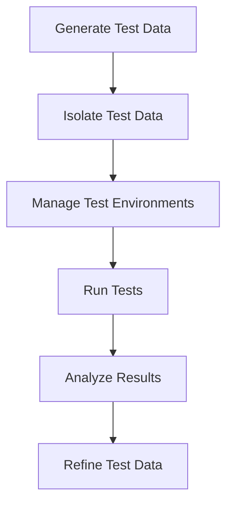

## 15.10 Test Data Management

In the realm of software development, particularly in C#, test data management is a critical component that ensures the robustness and reliability of applications. Effective test data management involves generating, managing, and maintaining data that accurately reflects real-world scenarios. This section delves into the intricacies of test data management, offering insights into generating test data, managing test environments, and exploring use cases and examples.

### Introduction to Test Data Management

Test data management (TDM) is the process of creating, managing, and maintaining data sets that are used for testing purposes. The goal is to ensure that the test data is as close to real-world data as possible, allowing developers to identify and fix issues before they reach production. TDM is crucial for achieving high-quality software and involves several key activities:

- **Data Generation**: Creating data sets that mimic real-world scenarios.
- **Data Management**: Organizing and maintaining test data to ensure consistency and accuracy.
- **Environment Management**: Setting up and maintaining environments where test data can be used effectively.

### Generating Test Data

Generating test data is a fundamental aspect of test data management. It involves creating data sets that are representative of the data the application will encounter in production. This section explores various strategies for generating test data, including the use of builders and data factories.

#### Using Builders and Data Factories

Builders and data factories are design patterns that facilitate the creation of complex objects. They are particularly useful in test data generation, allowing developers to create realistic and varied data sets.

- **Builder Pattern**: The builder pattern is used to construct a complex object step by step. It allows for the creation of different representations of an object using the same construction process. In test data generation, builders can be used to create complex data objects with various configurations.

```csharp
public class UserBuilder
{
    private User _user = new User();

    public UserBuilder WithName(string name)
    {
        _user.Name = name;
        return this;
    }

    public UserBuilder WithEmail(string email)
    {
        _user.Email = email;
        return this;
    }

    public UserBuilder WithAge(int age)
    {
        _user.Age = age;
        return this;
    }

    public User Build()
    {
        return _user;
    }
}

// Usage
var user = new UserBuilder()
    .WithName("John Doe")
    .WithEmail("john.doe@example.com")
    .WithAge(30)
    .Build();
```

- **Data Factory Pattern**: The data factory pattern is used to create objects without specifying the exact class of object that will be created. It is useful for generating test data that requires different types of objects.

```csharp
public interface IUserFactory
{
    User CreateUser();
}

public class DefaultUserFactory : IUserFactory
{
    public User CreateUser()
    {
        return new User
        {
            Name = "Default User",
            Email = "default@example.com",
            Age = 25
        };
    }
}

// Usage
IUserFactory userFactory = new DefaultUserFactory();
User user = userFactory.CreateUser();
```

#### Creating Realistic Test Scenarios

Creating realistic test scenarios is essential for effective testing. This involves generating data that accurately reflects the conditions and edge cases the application will encounter in production.

- **Data Variability**: Ensure that test data covers a wide range of scenarios, including edge cases and boundary conditions.
- **Data Volume**: Generate sufficient data to test the application's performance and scalability.
- **Data Consistency**: Maintain consistency in test data to ensure reliable test results.

### Managing Test Environments

Managing test environments is a critical aspect of test data management. It involves setting up and maintaining environments where test data can be used effectively. This section explores strategies for managing test environments, including isolating test data and using containerization.

#### Isolating Test Data

Isolating test data is crucial for ensuring that tests are repeatable and reliable. This involves separating test data from production data and ensuring that tests do not interfere with each other.

- **Data Isolation Techniques**: Use techniques such as database snapshots, data masking, and data subsetting to isolate test data.
- **Environment Segmentation**: Create separate environments for different types of testing, such as unit testing, integration testing, and performance testing.

#### Using Containerization for Consistent Environments

Containerization is a powerful tool for managing test environments. It allows developers to create consistent and reproducible environments for testing.

- **Docker**: Use Docker to create containerized environments that can be easily set up and torn down. This ensures that tests run in a consistent environment, reducing the risk of environment-related issues.

```dockerfile
FROM mcr.microsoft.com/dotnet/sdk:5.0
WORKDIR /app
COPY . .
RUN dotnet restore
RUN dotnet build
CMD ["dotnet", "test"]
```

- **Kubernetes**: Use Kubernetes to manage containerized environments at scale. This is particularly useful for managing complex test environments that require multiple services.

### Use Cases and Examples

This section explores use cases and examples of effective test data management strategies. It includes case studies of organizations that have successfully implemented test data management practices.

#### Effective Test Data Strategies

- **Automated Test Data Generation**: Implement automated test data generation to reduce the time and effort required to create test data.
- **Data Anonymization**: Use data anonymization techniques to protect sensitive data while maintaining data realism.
- **Continuous Integration**: Integrate test data management into the continuous integration pipeline to ensure that test data is always up-to-date.

#### Case Studies of Test Data Management

- **Case Study 1: E-commerce Platform**: An e-commerce platform implemented a test data management strategy that included automated test data generation and data anonymization. This allowed them to reduce testing time by 50% and improve test coverage.
- **Case Study 2: Financial Services**: A financial services company used containerization to manage their test environments. This allowed them to create consistent environments for testing, reducing environment-related issues by 70%.

### Visualizing Test Data Management

To better understand the flow and management of test data, let's visualize the process using a Mermaid.js diagram.



**Diagram Explanation**: This flowchart illustrates the process of test data management, starting with generating test data, isolating it, managing test environments, running tests, analyzing results, and refining test data based on the analysis.

### Knowledge Check

To reinforce your understanding of test data management, consider the following questions:

- What are the benefits of using builders and data factories for test data generation?
- How can containerization improve the consistency of test environments?
- What strategies can be used to isolate test data from production data?

### Try It Yourself

Experiment with the code examples provided in this section. Try modifying the builder and data factory patterns to create different types of test data. Use Docker to create a containerized test environment and run your tests within it.

### Conclusion

Test data management is a critical component of software testing that ensures the reliability and robustness of applications. By effectively generating and managing test data, developers can identify and fix issues before they reach production. Remember, this is just the beginning. As you progress, you'll build more complex and effective test data management strategies. Keep experimenting, stay curious, and enjoy the journey!

## Quiz Time!



### What is the primary goal of test data management?

- [x] To create, manage, and maintain data sets for testing purposes
- [ ] To develop new features for the application
- [ ] To optimize the application's performance
- [ ] To design the user interface

> **Explanation:** Test data management focuses on creating, managing, and maintaining data sets that are used for testing purposes to ensure software quality.

### Which pattern is used to construct a complex object step by step?

- [x] Builder Pattern
- [ ] Singleton Pattern
- [ ] Factory Pattern
- [ ] Observer Pattern

> **Explanation:** The Builder Pattern is used to construct a complex object step by step, allowing for different representations of an object.

### What is the benefit of using containerization in test environments?

- [x] Ensures consistent and reproducible environments
- [ ] Increases the application's runtime speed
- [ ] Reduces the number of bugs in the code
- [ ] Enhances the graphical user interface

> **Explanation:** Containerization ensures consistent and reproducible environments, reducing the risk of environment-related issues during testing.

### What technique can be used to protect sensitive data while maintaining data realism?

- [x] Data Anonymization
- [ ] Data Duplication
- [ ] Data Encryption
- [ ] Data Compression

> **Explanation:** Data anonymization protects sensitive data while maintaining data realism, making it suitable for testing purposes.

### Which tool is commonly used for creating containerized environments?

- [x] Docker
- [ ] Git
- [ ] Jenkins
- [ ] Visual Studio

> **Explanation:** Docker is commonly used for creating containerized environments, providing consistency and ease of setup for testing.

### What is the purpose of data isolation in test environments?

- [x] To ensure tests are repeatable and reliable
- [ ] To increase the speed of data processing
- [ ] To enhance the user experience
- [ ] To reduce the application's memory usage

> **Explanation:** Data isolation ensures that tests are repeatable and reliable by separating test data from production data.

### How can automated test data generation benefit a development team?

- [x] Reduces time and effort required to create test data
- [ ] Increases the complexity of test scenarios
- [ ] Decreases the accuracy of test results
- [ ] Limits the scope of testing

> **Explanation:** Automated test data generation reduces the time and effort required to create test data, allowing for more efficient testing processes.

### What is a key consideration when creating realistic test scenarios?

- [x] Data Variability
- [ ] Data Encryption
- [ ] Data Compression
- [ ] Data Duplication

> **Explanation:** Data variability is crucial for creating realistic test scenarios that cover a wide range of conditions and edge cases.

### Which pattern is useful for generating test data that requires different types of objects?

- [x] Data Factory Pattern
- [ ] Singleton Pattern
- [ ] Observer Pattern
- [ ] Strategy Pattern

> **Explanation:** The Data Factory Pattern is useful for generating test data that requires different types of objects without specifying the exact class.

### True or False: Test data management is only important for large-scale applications.

- [ ] True
- [x] False

> **Explanation:** Test data management is important for applications of all sizes to ensure quality and reliability, not just large-scale applications.


