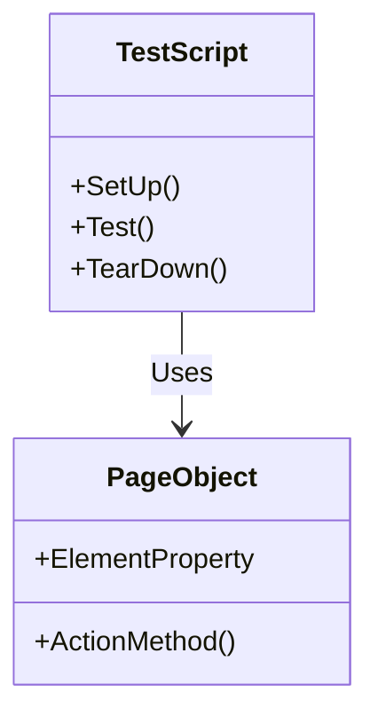

## 15.11 Page Object Pattern

In the realm of software testing, particularly when dealing with user interfaces, the Page Object Pattern emerges as a powerful design pattern. It is a pattern that helps in creating an abstraction layer over web pages, encapsulating the elements and actions that can be performed on them. This pattern is particularly useful in automated UI testing, where it enhances maintainability, readability, and reusability of test scripts. In this section, we will delve into the intricacies of the Page Object Pattern, its implementation in C#, and its application in automated UI testing with Selenium.

### Understanding the Page Object Pattern

The Page Object Pattern is a design pattern that represents the UI of your web application as a series of objects. Each page or significant component of the UI is represented by a class, and the elements on the page are represented by properties within that class. Actions that can be performed on the page, such as clicking a button or entering text into a field, are represented by methods.

#### Intent

The primary intent of the Page Object Pattern is to create a clear separation between the test code and the UI structure. By encapsulating the UI elements and actions within a class, the pattern promotes a clean and maintainable test codebase. This separation allows for changes in the UI without affecting the test scripts, as long as the interface of the Page Object remains consistent.

#### Key Participants

- **Page Object Class**: Represents a single page or component of the UI. It contains properties for each UI element and methods for actions that can be performed on the page.
- **Test Scripts**: Use the Page Object classes to interact with the UI, performing actions and verifying outcomes.

#### Applicability

The Page Object Pattern is applicable in scenarios where:

- You are automating UI tests for web applications.
- The UI is subject to frequent changes, and you want to minimize the impact on test scripts.
- You aim to improve the readability and maintainability of your test code.

### Implementing Page Objects in C#

Implementing the Page Object Pattern in C# involves creating classes that represent each web page or component. These classes encapsulate the elements and actions associated with the page. Let's explore how to implement Page Objects in C# with a focus on Selenium, a popular tool for automating web browsers.

#### Creating Classes Representing Each Web Page

To implement a Page Object in C#, you start by creating a class for each web page or significant component. This class will contain properties for each UI element and methods for actions that can be performed on the page.

Here's a basic example of a Page Object class for a login page:

```csharp
using OpenQA.Selenium;

public class LoginPage
{
    private readonly IWebDriver _driver;

    // Constructor
    public LoginPage(IWebDriver driver)
    {
        _driver = driver;
    }

    // Properties representing UI elements
    private IWebElement UsernameField => _driver.FindElement(By.Id("username"));
    private IWebElement PasswordField => _driver.FindElement(By.Id("password"));
    private IWebElement LoginButton => _driver.FindElement(By.Id("login"));

    // Methods representing actions
    public void EnterUsername(string username)
    {
        UsernameField.Clear();
        UsernameField.SendKeys(username);
    }

    public void EnterPassword(string password)
    {
        PasswordField.Clear();
        PasswordField.SendKeys(password);
    }

    public void ClickLogin()
    {
        LoginButton.Click();
    }
}
```

In this example, the `LoginPage` class encapsulates the elements and actions of a login page. The `IWebDriver` interface from Selenium is used to interact with the web browser. The properties `UsernameField`, `PasswordField`, and `LoginButton` represent the UI elements, while the methods `EnterUsername`, `EnterPassword`, and `ClickLogin` represent the actions.

#### Using Page Objects in Test Scripts

Once you have defined your Page Object classes, you can use them in your test scripts to interact with the UI. Here's an example of a test script that uses the `LoginPage` class:

```csharp
using NUnit.Framework;
using OpenQA.Selenium;
using OpenQA.Selenium.Chrome;

[TestFixture]
public class LoginTests
{
    private IWebDriver _driver;
    private LoginPage _loginPage;

    [SetUp]
    public void SetUp()
    {
        _driver = new ChromeDriver();
        _driver.Navigate().GoToUrl("https://example.com/login");
        _loginPage = new LoginPage(_driver);
    }

    [Test]
    public void TestSuccessfulLogin()
    {
        _loginPage.EnterUsername("testuser");
        _loginPage.EnterPassword("password123");
        _loginPage.ClickLogin();

        // Add assertions to verify successful login
    }

    [TearDown]
    public void TearDown()
    {
        _driver.Quit();
    }
}
```

In this test script, we use NUnit as the testing framework. The `SetUp` method initializes the `IWebDriver` and navigates to the login page. The `TestSuccessfulLogin` method uses the `LoginPage` class to perform actions on the UI. Finally, the `TearDown` method closes the browser.

### Use Cases and Examples

The Page Object Pattern is widely used in automated UI testing, particularly with Selenium. Let's explore some use cases and examples to understand its application better.

#### Automated UI Testing with Selenium

Selenium is a powerful tool for automating web browsers, and it integrates seamlessly with the Page Object Pattern. By using Page Objects, you can create robust and maintainable test scripts that are resilient to changes in the UI.

##### Example: Testing a User Registration Page

Consider a user registration page with fields for username, email, and password, and a submit button. Here's how you can implement a Page Object for this page:

```csharp
using OpenQA.Selenium;

public class RegistrationPage
{
    private readonly IWebDriver _driver;

    public RegistrationPage(IWebDriver driver)
    {
        _driver = driver;
    }

    private IWebElement UsernameField => _driver.FindElement(By.Id("username"));
    private IWebElement EmailField => _driver.FindElement(By.Id("email"));
    private IWebElement PasswordField => _driver.FindElement(By.Id("password"));
    private IWebElement SubmitButton => _driver.FindElement(By.Id("submit"));

    public void EnterUsername(string username)
    {
        UsernameField.Clear();
        UsernameField.SendKeys(username);
    }

    public void EnterEmail(string email)
    {
        EmailField.Clear();
        EmailField.SendKeys(email);
    }

    public void EnterPassword(string password)
    {
        PasswordField.Clear();
        PasswordField.SendKeys(password);
    }

    public void ClickSubmit()
    {
        SubmitButton.Click();
    }
}
```

Now, let's create a test script to verify the registration process:

```csharp
using NUnit.Framework;
using OpenQA.Selenium;
using OpenQA.Selenium.Chrome;

[TestFixture]
public class RegistrationTests
{
    private IWebDriver _driver;
    private RegistrationPage _registrationPage;

    [SetUp]
    public void SetUp()
    {
        _driver = new ChromeDriver();
        _driver.Navigate().GoToUrl("https://example.com/register");
        _registrationPage = new RegistrationPage(_driver);
    }

    [Test]
    public void TestSuccessfulRegistration()
    {
        _registrationPage.EnterUsername("newuser");
        _registrationPage.EnterEmail("newuser@example.com");
        _registrationPage.EnterPassword("securepassword");
        _registrationPage.ClickSubmit();

        // Add assertions to verify successful registration
    }

    [TearDown]
    public void TearDown()
    {
        _driver.Quit();
    }
}
```

In this example, the `RegistrationPage` class encapsulates the elements and actions of the registration page. The `RegistrationTests` class uses this Page Object to interact with the UI and verify the registration process.

### Design Considerations

When implementing the Page Object Pattern, there are several design considerations to keep in mind:

- **Consistency**: Ensure that the naming conventions for properties and methods are consistent across all Page Object classes. This improves readability and maintainability.
- **Reusability**: Design Page Objects to be reusable across multiple test scripts. Avoid hardcoding values within the Page Object classes.
- **Encapsulation**: Keep the implementation details of the UI elements and actions hidden within the Page Object classes. Expose only the necessary methods to the test scripts.
- **Error Handling**: Implement error handling within the Page Object classes to manage exceptions gracefully. This can include retry mechanisms for elements that may not be immediately available.

### Differences and Similarities with Other Patterns

The Page Object Pattern is often compared to other design patterns used in testing, such as the Screenplay Pattern and the Model-View-Controller (MVC) pattern.

- **Screenplay Pattern**: While the Page Object Pattern focuses on encapsulating the UI elements and actions, the Screenplay Pattern emphasizes the roles and interactions of actors within the system. It provides a more behavior-driven approach to testing.
- **MVC Pattern**: The MVC pattern is used in application design to separate concerns between the model, view, and controller. The Page Object Pattern, on the other hand, is specifically focused on testing and encapsulating the UI.

### Visualizing the Page Object Pattern

To better understand the Page Object Pattern, let's visualize the relationship between the test scripts and the Page Object classes using a class diagram.



In this diagram, the `TestScript` class represents the test scripts that use the `PageObject` class to interact with the UI. The `PageObject` class encapsulates the elements and actions of a web page.

### Try It Yourself

To deepen your understanding of the Page Object Pattern, try modifying the code examples provided. Here are some suggestions:

- Add additional methods to the `LoginPage` or `RegistrationPage` classes to handle more complex interactions, such as selecting from a dropdown or handling alerts.
- Implement a Page Object for a different web page in your application and create test scripts to verify its functionality.
- Experiment with different testing frameworks, such as xUnit or MSTest, to see how they integrate with the Page Object Pattern.

### Knowledge Check

Before we conclude, let's reinforce what we've learned with a few questions:

- What is the primary intent of the Page Object Pattern?
- How does the Page Object Pattern improve the maintainability of test scripts?
- What are some design considerations to keep in mind when implementing Page Objects?

### Embrace the Journey

Remember, mastering the Page Object Pattern is just one step in your journey to becoming an expert in automated UI testing. As you continue to explore and experiment with different patterns and tools, you'll gain a deeper understanding of how to create robust and maintainable test scripts. Keep experimenting, stay curious, and enjoy the journey!

## Quiz Time!



### What is the primary intent of the Page Object Pattern?

- [x] To create a clear separation between test code and UI structure.
- [ ] To automate the deployment process.
- [ ] To enhance the performance of web applications.
- [ ] To simplify database interactions.

> **Explanation:** The Page Object Pattern aims to separate test code from UI structure, promoting maintainability and readability.

### Which of the following is a key participant in the Page Object Pattern?

- [x] Page Object Class
- [ ] Database Connection
- [ ] Configuration File
- [ ] Logging Framework

> **Explanation:** The Page Object Class is a key participant, representing the UI elements and actions.

### How does the Page Object Pattern improve test script maintainability?

- [x] By encapsulating UI elements and actions within classes.
- [ ] By reducing the number of test cases.
- [ ] By increasing the execution speed of tests.
- [ ] By eliminating the need for assertions.

> **Explanation:** Encapsulation of UI elements and actions within classes makes test scripts easier to maintain.

### What is a common tool used with the Page Object Pattern for UI testing?

- [x] Selenium
- [ ] Entity Framework
- [ ] Docker
- [ ] Redis

> **Explanation:** Selenium is commonly used with the Page Object Pattern for automating web browsers.

### Which method is used to initialize the WebDriver in the test script example?

- [x] SetUp
- [ ] TearDown
- [ ] Test
- [ ] Initialize

> **Explanation:** The `SetUp` method is used to initialize the WebDriver before each test.

### What is the purpose of the `TearDown` method in the test script?

- [x] To close the browser after tests are completed.
- [ ] To initialize test data.
- [ ] To log test results.
- [ ] To configure test settings.

> **Explanation:** The `TearDown` method is used to close the browser after tests are completed.

### What is a design consideration when implementing Page Objects?

- [x] Consistency in naming conventions.
- [ ] Hardcoding values within classes.
- [ ] Avoiding encapsulation.
- [ ] Ignoring error handling.

> **Explanation:** Consistency in naming conventions improves readability and maintainability.

### How can you handle exceptions in Page Object classes?

- [x] Implement error handling mechanisms.
- [ ] Ignore exceptions.
- [ ] Log exceptions without handling.
- [ ] Use global exception handlers only.

> **Explanation:** Implementing error handling mechanisms helps manage exceptions gracefully.

### Which pattern is often compared to the Page Object Pattern?

- [x] Screenplay Pattern
- [ ] Singleton Pattern
- [ ] Factory Pattern
- [ ] Observer Pattern

> **Explanation:** The Screenplay Pattern is often compared to the Page Object Pattern, offering a behavior-driven approach.

### True or False: The Page Object Pattern is only applicable to web applications.

- [x] True
- [ ] False

> **Explanation:** The Page Object Pattern is primarily used for automating UI tests in web applications.


