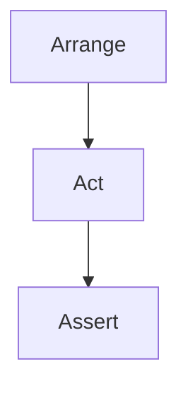

## 15.12 Arrange-Act-Assert Pattern

In the realm of software testing, clarity and consistency are paramount. The Arrange-Act-Assert (AAA) pattern is a widely adopted approach that structures tests into three distinct phases: setup, execution, and verification. This pattern not only enhances readability but also ensures that tests are easy to maintain and understand. In this section, we will delve into the intricacies of the AAA pattern, explore its implementation in C#, and examine its use cases and benefits.

### Understanding the Arrange-Act-Assert Pattern

The Arrange-Act-Assert pattern is a simple yet powerful way to structure unit tests. It divides a test into three clear sections:

1. **Arrange**: Set up the necessary preconditions and inputs.
2. **Act**: Execute the code under test.
3. **Assert**: Verify that the outcome is as expected.

This separation of concerns makes tests easier to read and understand, as each section has a distinct purpose.

#### Why Use Arrange-Act-Assert?

- **Clarity**: By clearly delineating the setup, execution, and verification phases, the AAA pattern makes tests more readable and understandable.
- **Consistency**: Using a consistent structure across tests helps maintain uniformity, making it easier for developers to write and review tests.
- **Maintainability**: Well-structured tests are easier to maintain and update as the codebase evolves.
- **Debugging**: When a test fails, the AAA structure helps quickly identify which phase is causing the issue.

### Implementing Arrange-Act-Assert in C#

Let's explore how to implement the Arrange-Act-Assert pattern in C#. We'll start with a simple example and then move on to more complex scenarios.

#### Basic Example

Consider a simple calculator class with an `Add` method. We'll write a unit test for this method using the AAA pattern.

```csharp
using System;
using Xunit;

public class Calculator
{
    public int Add(int a, int b)
    {
        return a + b;
    }
}

public class CalculatorTests
{
    [Fact]
    public void Add_ShouldReturnSumOfTwoNumbers()
    {
        // Arrange
        var calculator = new Calculator();
        int number1 = 5;
        int number2 = 10;

        // Act
        int result = calculator.Add(number1, number2);

        // Assert
        Assert.Equal(15, result);
    }
}
```

In this example, the test is divided into three sections:

- **Arrange**: We create an instance of the `Calculator` class and define the input numbers.
- **Act**: We call the `Add` method with the input numbers.
- **Assert**: We verify that the result is as expected.

#### Organizing Tests into Setup, Execution, and Verification Phases

The AAA pattern encourages organizing tests into distinct phases. Let's explore each phase in detail.

##### Arrange Phase

The Arrange phase is where you set up the necessary preconditions for the test. This includes:

- **Initializing objects**: Create instances of the classes you want to test.
- **Setting up dependencies**: Mock or stub any dependencies that the class under test relies on.
- **Defining inputs**: Specify the inputs that will be used in the test.

##### Act Phase

The Act phase is where you execute the code under test. This is typically a single line of code that calls the method or function you want to test. The Act phase should be concise and focused on the action being tested.

##### Assert Phase

The Assert phase is where you verify that the outcome of the Act phase is as expected. This involves:

- **Checking return values**: Use assertions to verify that the return value is correct.
- **Verifying state changes**: Ensure that any changes to the state of the system are as expected.
- **Checking interactions**: Verify that any interactions with dependencies occurred as expected.

### Use Cases and Examples

The AAA pattern is versatile and can be applied to a wide range of testing scenarios. Let's explore some common use cases and examples.

#### Testing Business Logic

Consider a scenario where you have a business logic class that calculates discounts based on customer loyalty. You can use the AAA pattern to test this logic.

```csharp
public class DiscountCalculator
{
    public decimal CalculateDiscount(int loyaltyPoints)
    {
        if (loyaltyPoints > 100)
        {
            return 0.1m; // 10% discount
        }
        return 0.0m; // No discount
    }
}

public class DiscountCalculatorTests
{
    [Fact]
    public void CalculateDiscount_ShouldReturn10Percent_WhenLoyaltyPointsAreAbove100()
    {
        // Arrange
        var discountCalculator = new DiscountCalculator();
        int loyaltyPoints = 150;

        // Act
        decimal discount = discountCalculator.CalculateDiscount(loyaltyPoints);

        // Assert
        Assert.Equal(0.1m, discount);
    }
}
```

#### Testing Exception Handling

The AAA pattern can also be used to test exception handling. Consider a method that throws an exception when an invalid input is provided.

```csharp
public class InputValidator
{
    public void Validate(string input)
    {
        if (string.IsNullOrEmpty(input))
        {
            throw new ArgumentException("Input cannot be null or empty");
        }
    }
}

public class InputValidatorTests
{
    [Fact]
    public void Validate_ShouldThrowArgumentException_WhenInputIsNullOrEmpty()
    {
        // Arrange
        var inputValidator = new InputValidator();
        string invalidInput = null;

        // Act & Assert
        Assert.Throws<ArgumentException>(() => inputValidator.Validate(invalidInput));
    }
}
```

In this example, the Act and Assert phases are combined using the `Assert.Throws` method, which verifies that the expected exception is thrown.

### Standardizing Test Structures for Maintainability

Standardizing test structures using the AAA pattern can significantly improve maintainability. Here are some best practices to consider:

- **Consistent Naming**: Use consistent naming conventions for test methods to clearly indicate what is being tested and the expected outcome.
- **Reusable Setup**: Extract common setup code into helper methods or test fixtures to reduce duplication.
- **Clear Assertions**: Use clear and descriptive assertions to make it obvious what is being verified.
- **Minimal Act Phase**: Keep the Act phase concise and focused on the action being tested.

### Advanced Techniques and Considerations

While the AAA pattern is straightforward, there are advanced techniques and considerations to keep in mind.

#### Testing Asynchronous Code

When testing asynchronous code, the AAA pattern can still be applied. Use the `async` and `await` keywords to handle asynchronous operations.

```csharp
public class AsyncService
{
    public async Task<string> GetDataAsync()
    {
        await Task.Delay(1000); // Simulate async operation
        return "Data";
    }
}

public class AsyncServiceTests
{
    [Fact]
    public async Task GetDataAsync_ShouldReturnData()
    {
        // Arrange
        var asyncService = new AsyncService();

        // Act
        string result = await asyncService.GetDataAsync();

        // Assert
        Assert.Equal("Data", result);
    }
}
```

#### Testing with Mocks and Stubs

When testing classes with dependencies, you can use mocks and stubs to isolate the class under test. The AAA pattern can be applied to tests that use these techniques.

```csharp
public interface IDataRepository
{
    string GetData();
}

public class DataService
{
    private readonly IDataRepository _repository;

    public DataService(IDataRepository repository)
    {
        _repository = repository;
    }

    public string GetProcessedData()
    {
        var data = _repository.GetData();
        return data.ToUpper();
    }
}

public class DataServiceTests
{
    [Fact]
    public void GetProcessedData_ShouldReturnUpperCaseData()
    {
        // Arrange
        var mockRepository = new Mock<IDataRepository>();
        mockRepository.Setup(repo => repo.GetData()).Returns("data");
        var dataService = new DataService(mockRepository.Object);

        // Act
        string result = dataService.GetProcessedData();

        // Assert
        Assert.Equal("DATA", result);
    }
}
```

### Visualizing the Arrange-Act-Assert Pattern

To better understand the flow of the Arrange-Act-Assert pattern, let's visualize it using a flowchart.



**Figure 1**: The flowchart illustrates the sequential flow of the Arrange-Act-Assert pattern, highlighting the distinct phases of setup, execution, and verification.

### Try It Yourself

To deepen your understanding of the Arrange-Act-Assert pattern, try modifying the code examples provided. Here are some suggestions:

- **Experiment with Different Inputs**: Change the input values in the tests to see how the assertions change.
- **Test Edge Cases**: Add tests for edge cases, such as boundary values or invalid inputs.
- **Combine Act and Assert**: Try combining the Act and Assert phases for exception handling tests using `Assert.Throws`.

### References and Further Reading

For more information on the Arrange-Act-Assert pattern and unit testing in C#, consider exploring the following resources:

- [xUnit Documentation](https://xunit.net/docs/getting-started/netcore/cmdline)
- [NUnit Documentation](https://nunit.org/)
- [Moq Documentation](https://github.com/moq/moq4/wiki/Quickstart)

### Knowledge Check

Before we conclude, let's reinforce what we've learned with a few questions:

1. What are the three phases of the Arrange-Act-Assert pattern?
2. Why is the Arrange-Act-Assert pattern beneficial for test readability?
3. How can you test exception handling using the AAA pattern?
4. What is the purpose of the Arrange phase in the AAA pattern?
5. How can you apply the AAA pattern to asynchronous code?

### Embrace the Journey

Remember, mastering the Arrange-Act-Assert pattern is just the beginning of writing effective and maintainable tests. As you continue to explore testing in C#, keep experimenting with different patterns and techniques. Stay curious, and enjoy the journey of becoming a proficient software tester!

## Quiz Time!



### What are the three phases of the Arrange-Act-Assert pattern?

- [x] Arrange, Act, Assert
- [ ] Setup, Execute, Verify
- [ ] Initialize, Execute, Validate
- [ ] Prepare, Perform, Check

> **Explanation:** The Arrange-Act-Assert pattern consists of three phases: Arrange (setup), Act (execution), and Assert (verification).

### Why is the Arrange-Act-Assert pattern beneficial for test readability?

- [x] It clearly separates setup, execution, and verification phases.
- [ ] It reduces the number of lines in a test.
- [ ] It allows for more complex test scenarios.
- [ ] It eliminates the need for comments in tests.

> **Explanation:** The AAA pattern enhances readability by clearly separating the setup, execution, and verification phases, making tests easier to understand.

### How can you test exception handling using the AAA pattern?

- [x] Use `Assert.Throws` in the Act phase.
- [ ] Use `Assert.Throws` in the Arrange phase.
- [ ] Use `Assert.Throws` in the Assert phase.
- [ ] Use `Assert.Throws` in the Setup phase.

> **Explanation:** In the AAA pattern, exception handling can be tested by using `Assert.Throws` in the Act phase to verify that the expected exception is thrown.

### What is the purpose of the Arrange phase in the AAA pattern?

- [x] To set up the necessary preconditions and inputs.
- [ ] To execute the code under test.
- [ ] To verify the outcome of the test.
- [ ] To clean up resources after the test.

> **Explanation:** The Arrange phase is used to set up the necessary preconditions and inputs for the test.

### How can you apply the AAA pattern to asynchronous code?

- [x] Use `async` and `await` in the Act phase.
- [ ] Use `async` and `await` in the Arrange phase.
- [ ] Use `async` and `await` in the Assert phase.
- [ ] Use `async` and `await` in the Setup phase.

> **Explanation:** When testing asynchronous code, the AAA pattern can be applied by using `async` and `await` in the Act phase to handle asynchronous operations.

### Which phase of the AAA pattern involves verifying the outcome of the test?

- [x] Assert
- [ ] Arrange
- [ ] Act
- [ ] Setup

> **Explanation:** The Assert phase involves verifying that the outcome of the Act phase is as expected.

### In the AAA pattern, which phase is typically a single line of code?

- [x] Act
- [ ] Arrange
- [ ] Assert
- [ ] Setup

> **Explanation:** The Act phase is typically a single line of code that calls the method or function being tested.

### What is a common practice to reduce duplication in the Arrange phase?

- [x] Extract common setup code into helper methods or test fixtures.
- [ ] Combine the Arrange and Act phases.
- [ ] Use inline setup code in each test.
- [ ] Skip the Arrange phase for simple tests.

> **Explanation:** To reduce duplication in the Arrange phase, it's common to extract common setup code into helper methods or test fixtures.

### How does the AAA pattern help with debugging tests?

- [x] It helps quickly identify which phase is causing the issue.
- [ ] It eliminates the need for debugging tools.
- [ ] It automatically fixes test failures.
- [ ] It provides detailed error messages.

> **Explanation:** The AAA pattern helps with debugging by clearly separating the phases, making it easier to identify which phase is causing the issue.

### True or False: The AAA pattern can only be used for unit tests.

- [ ] True
- [x] False

> **Explanation:** False. The AAA pattern can be used for various types of tests, including unit tests, integration tests, and more.


