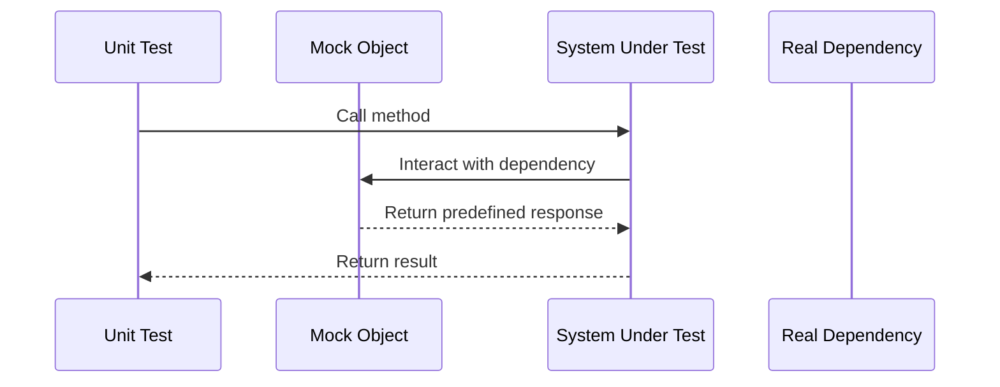

## 15.2 Mocking and Stubs in Pattern Implementation

In the realm of software development, testing is a critical component that ensures the reliability and robustness of applications. For expert software engineers and enterprise architects, mastering the art of testing is essential, especially when working with complex systems and design patterns. This section delves into the use of mocking and stubs in pattern implementation, focusing on how these techniques can be employed to isolate units for testing in C#. We will explore popular mocking frameworks such as Moq, NSubstitute, and FakeItEasy, and discuss the role of dependency injection in simplifying unit tests.

### Introduction to Mocking and Stubs

Mocking and stubs are techniques used in unit testing to simulate the behavior of complex objects. They allow developers to test a unit of code in isolation by replacing real dependencies with controlled, predictable substitutes. This isolation is crucial for identifying issues within the unit itself, without interference from external components.

#### Mocking

Mocking involves creating objects that simulate the behavior of real objects. These mock objects are used to verify interactions between the unit under test and its dependencies. Mocks can be programmed to return specific values, throw exceptions, or track how many times certain methods are called.

#### Stubs

Stubs, on the other hand, are simpler than mocks. They provide predefined responses to method calls, but unlike mocks, they do not track interactions. Stubs are primarily used to provide the necessary data for the unit under test to execute.

### Using Mocking Frameworks

Mocking frameworks simplify the process of creating mock objects. They provide a set of tools and APIs to define the behavior of mocks and verify interactions. Let's explore some popular mocking frameworks in C#.

#### Moq

Moq is a widely used mocking framework for .NET that allows developers to create mock objects quickly and easily. It uses lambda expressions to define the behavior of mocks, making it intuitive and flexible.

```csharp
using Moq;

public interface IEmailService
{
    void SendEmail(string to, string subject, string body);
}

public class NotificationService
{
    private readonly IEmailService _emailService;

    public NotificationService(IEmailService emailService)
    {
        _emailService = emailService;
    }

    public void Notify(string message)
    {
        _emailService.SendEmail("user@example.com", "Notification", message);
    }
}

public class NotificationServiceTests
{
    [Fact]
    public void Notify_ShouldCallSendEmail()
    {
        // Arrange
        var emailServiceMock = new Mock<IEmailService>();
        var notificationService = new NotificationService(emailServiceMock.Object);

        // Act
        notificationService.Notify("Hello, World!");

        // Assert
        emailServiceMock.Verify(es => es.SendEmail("user@example.com", "Notification", "Hello, World!"), Times.Once);
    }
}
```

In this example, Moq is used to create a mock of the `IEmailService` interface. The `Verify` method checks that the `SendEmail` method was called exactly once with the specified parameters.

#### NSubstitute

NSubstitute is another popular mocking framework that emphasizes simplicity and readability. It uses a syntax similar to natural language, making it easy to understand.

```csharp
using NSubstitute;

public class NotificationServiceTests
{
    [Fact]
    public void Notify_ShouldCallSendEmail()
    {
        // Arrange
        var emailService = Substitute.For<IEmailService>();
        var notificationService = new NotificationService(emailService);

        // Act
        notificationService.Notify("Hello, World!");

        // Assert
        emailService.Received(1).SendEmail("user@example.com", "Notification", "Hello, World!");
    }
}
```

Here, NSubstitute is used to create a substitute for the `IEmailService`. The `Received` method is used to verify that the `SendEmail` method was called once.

#### FakeItEasy

FakeItEasy is a flexible and easy-to-use mocking framework that focuses on creating fake objects for testing.

```csharp
using FakeItEasy;

public class NotificationServiceTests
{
    [Fact]
    public void Notify_ShouldCallSendEmail()
    {
        // Arrange
        var emailService = A.Fake<IEmailService>();
        var notificationService = new NotificationService(emailService);

        // Act
        notificationService.Notify("Hello, World!");

        // Assert
        A.CallTo(() => emailService.SendEmail("user@example.com", "Notification", "Hello, World!")).MustHaveHappenedOnceExactly();
    }
}
```

FakeItEasy allows you to create fake objects with minimal setup. The `A.CallTo` method is used to assert that the `SendEmail` method was called exactly once.

### Isolating Units for Testing

Isolating units for testing is a fundamental principle of unit testing. By replacing real dependencies with mocks or stubs, we can focus on testing the behavior of the unit itself.

#### Replacing Real Dependencies

When testing a class, it's important to replace its real dependencies with mocks or stubs. This ensures that the test is not affected by the behavior of external components.

```csharp
public class OrderService
{
    private readonly IPaymentGateway _paymentGateway;

    public OrderService(IPaymentGateway paymentGateway)
    {
        _paymentGateway = paymentGateway;
    }

    public bool ProcessOrder(Order order)
    {
        return _paymentGateway.ProcessPayment(order.Amount);
    }
}

public class OrderServiceTests
{
    [Fact]
    public void ProcessOrder_ShouldReturnTrue_WhenPaymentIsSuccessful()
    {
        // Arrange
        var paymentGatewayMock = new Mock<IPaymentGateway>();
        paymentGatewayMock.Setup(pg => pg.ProcessPayment(It.IsAny<decimal>())).Returns(true);
        var orderService = new OrderService(paymentGatewayMock.Object);

        // Act
        var result = orderService.ProcessOrder(new Order { Amount = 100 });

        // Assert
        Assert.True(result);
    }
}
```

In this example, the `OrderService` class depends on an `IPaymentGateway` to process payments. By mocking the `IPaymentGateway`, we can test the `ProcessOrder` method in isolation.

#### Testing Classes in Isolation

Testing classes in isolation allows us to verify their behavior without interference from other components. This is particularly important when working with complex systems and design patterns.

```csharp
public class InventoryService
{
    private readonly IInventoryRepository _inventoryRepository;

    public InventoryService(IInventoryRepository inventoryRepository)
    {
        _inventoryRepository = inventoryRepository;
    }

    public bool IsProductAvailable(int productId)
    {
        var product = _inventoryRepository.GetProductById(productId);
        return product != null && product.Stock > 0;
    }
}

public class InventoryServiceTests
{
    [Fact]
    public void IsProductAvailable_ShouldReturnTrue_WhenProductIsInStock()
    {
        // Arrange
        var inventoryRepositoryMock = new Mock<IInventoryRepository>();
        inventoryRepositoryMock.Setup(ir => ir.GetProductById(It.IsAny<int>())).Returns(new Product { Stock = 10 });
        var inventoryService = new InventoryService(inventoryRepositoryMock.Object);

        // Act
        var result = inventoryService.IsProductAvailable(1);

        // Assert
        Assert.True(result);
    }
}
```

In this test, the `InventoryService` is tested in isolation by mocking the `IInventoryRepository`. This allows us to control the data returned by the repository and verify the behavior of the `IsProductAvailable` method.

### Testing with Dependency Injection

Dependency Injection (DI) is a design pattern that promotes loose coupling between components. It is particularly useful in testing, as it allows us to easily replace real dependencies with mocks or stubs.

#### Simplifying Unit Tests with DI

By using DI, we can simplify unit tests by injecting mock dependencies into the class under test. This makes it easier to set up and control the behavior of dependencies.

```csharp
public class CustomerService
{
    private readonly ICustomerRepository _customerRepository;

    public CustomerService(ICustomerRepository customerRepository)
    {
        _customerRepository = customerRepository;
    }

    public Customer GetCustomer(int customerId)
    {
        return _customerRepository.GetCustomerById(customerId);
    }
}

public class CustomerServiceTests
{
    [Fact]
    public void GetCustomer_ShouldReturnCustomer_WhenCustomerExists()
    {
        // Arrange
        var customerRepositoryMock = new Mock<ICustomerRepository>();
        customerRepositoryMock.Setup(cr => cr.GetCustomerById(It.IsAny<int>())).Returns(new Customer { Id = 1, Name = "John Doe" });
        var customerService = new CustomerService(customerRepositoryMock.Object);

        // Act
        var customer = customerService.GetCustomer(1);

        // Assert
        Assert.NotNull(customer);
        Assert.Equal("John Doe", customer.Name);
    }
}
```

In this example, the `CustomerService` class uses DI to receive an `ICustomerRepository` dependency. This allows us to inject a mock repository into the service for testing purposes.

#### Benefits of Loosely Coupled Code in Testing

Loosely coupled code is easier to test because it allows us to replace dependencies with mocks or stubs. This isolation makes it possible to test each component independently, leading to more reliable and maintainable tests.

```csharp
public class PaymentProcessor
{
    private readonly IPaymentService _paymentService;

    public PaymentProcessor(IPaymentService paymentService)
    {
        _paymentService = paymentService;
    }

    public bool ProcessPayment(decimal amount)
    {
        return _paymentService.MakePayment(amount);
    }
}

public class PaymentProcessorTests
{
    [Fact]
    public void ProcessPayment_ShouldReturnTrue_WhenPaymentIsSuccessful()
    {
        // Arrange
        var paymentServiceMock = new Mock<IPaymentService>();
        paymentServiceMock.Setup(ps => ps.MakePayment(It.IsAny<decimal>())).Returns(true);
        var paymentProcessor = new PaymentProcessor(paymentServiceMock.Object);

        // Act
        var result = paymentProcessor.ProcessPayment(100);

        // Assert
        Assert.True(result);
    }
}
```

In this test, the `PaymentProcessor` class is tested in isolation by injecting a mock `IPaymentService`. This demonstrates the benefits of loosely coupled code, as it allows us to focus on testing the `ProcessPayment` method without worrying about the behavior of the `IPaymentService`.

### Visualizing Mocking and Stubs

To better understand the role of mocking and stubs in pattern implementation, let's visualize the process using a sequence diagram.



In this sequence diagram, the unit test interacts with the system under test (SUT) by calling a method. The SUT, in turn, interacts with a mock object instead of a real dependency. The mock object returns a predefined response, allowing the SUT to return a result to the test.

### Try It Yourself

To deepen your understanding of mocking and stubs, try modifying the code examples provided in this section. Experiment with different mocking frameworks, such as Moq, NSubstitute, and FakeItEasy, and observe how they affect the behavior of your tests. Consider creating additional tests for edge cases and error handling scenarios.

### Knowledge Check

Before we conclude, let's summarize the key takeaways from this section:

- Mocking and stubs are essential techniques for isolating units in testing.
- Mocking frameworks like Moq, NSubstitute, and FakeItEasy simplify the creation of mock objects.
- Dependency Injection promotes loose coupling, making it easier to replace dependencies with mocks or stubs.
- Testing in isolation allows for more reliable and maintainable tests.

### Embrace the Journey

Remember, mastering mocking and stubs in pattern implementation is just one step in your journey as a software engineer. As you continue to explore design patterns and testing techniques, you'll gain a deeper understanding of how to build robust and maintainable applications. Keep experimenting, stay curious, and enjoy the journey!

## Quiz Time!



### What is the primary purpose of mocking in unit testing?

- [x] To simulate the behavior of real objects and verify interactions
- [ ] To provide predefined responses without tracking interactions
- [ ] To replace the entire system under test
- [ ] To generate random data for testing

> **Explanation:** Mocking is used to simulate the behavior of real objects and verify interactions between the unit under test and its dependencies.

### Which of the following is a popular mocking framework for .NET?

- [x] Moq
- [ ] JUnit
- [ ] Selenium
- [ ] Postman

> **Explanation:** Moq is a widely used mocking framework for .NET that allows developers to create mock objects quickly and easily.

### What is the main difference between mocks and stubs?

- [x] Mocks track interactions, while stubs provide predefined responses
- [ ] Mocks provide predefined responses, while stubs track interactions
- [ ] Mocks and stubs are the same
- [ ] Mocks are used for integration testing, while stubs are used for unit testing

> **Explanation:** Mocks track interactions between the unit under test and its dependencies, while stubs provide predefined responses without tracking interactions.

### How does dependency injection simplify unit testing?

- [x] By allowing easy replacement of real dependencies with mocks or stubs
- [ ] By making the code more complex
- [ ] By eliminating the need for tests
- [ ] By automatically generating test cases

> **Explanation:** Dependency Injection promotes loose coupling, making it easier to replace real dependencies with mocks or stubs for testing purposes.

### Which method in Moq is used to verify that a method was called with specific parameters?

- [x] Verify
- [ ] Setup
- [ ] Received
- [ ] CallTo

> **Explanation:** The `Verify` method in Moq is used to check that a method was called with specific parameters.

### What is the benefit of testing classes in isolation?

- [x] It allows for more reliable and maintainable tests
- [ ] It eliminates the need for mocks and stubs
- [ ] It makes the tests run faster
- [ ] It reduces the number of test cases needed

> **Explanation:** Testing classes in isolation allows for more reliable and maintainable tests by focusing on the behavior of the unit itself.

### Which mocking framework uses a syntax similar to natural language?

- [x] NSubstitute
- [ ] Moq
- [ ] FakeItEasy
- [ ] NUnit

> **Explanation:** NSubstitute uses a syntax similar to natural language, making it easy to understand and use.

### What is the role of a mock object in a unit test?

- [x] To simulate the behavior of a real dependency
- [ ] To replace the system under test
- [ ] To generate random test data
- [ ] To execute the test case

> **Explanation:** A mock object simulates the behavior of a real dependency, allowing the unit under test to be isolated.

### Which method in FakeItEasy is used to assert that a method was called?

- [x] A.CallTo
- [ ] Verify
- [ ] Setup
- [ ] Received

> **Explanation:** The `A.CallTo` method in FakeItEasy is used to assert that a method was called.

### True or False: Stubs can track interactions between the unit under test and its dependencies.

- [ ] True
- [x] False

> **Explanation:** Stubs do not track interactions; they only provide predefined responses to method calls.


