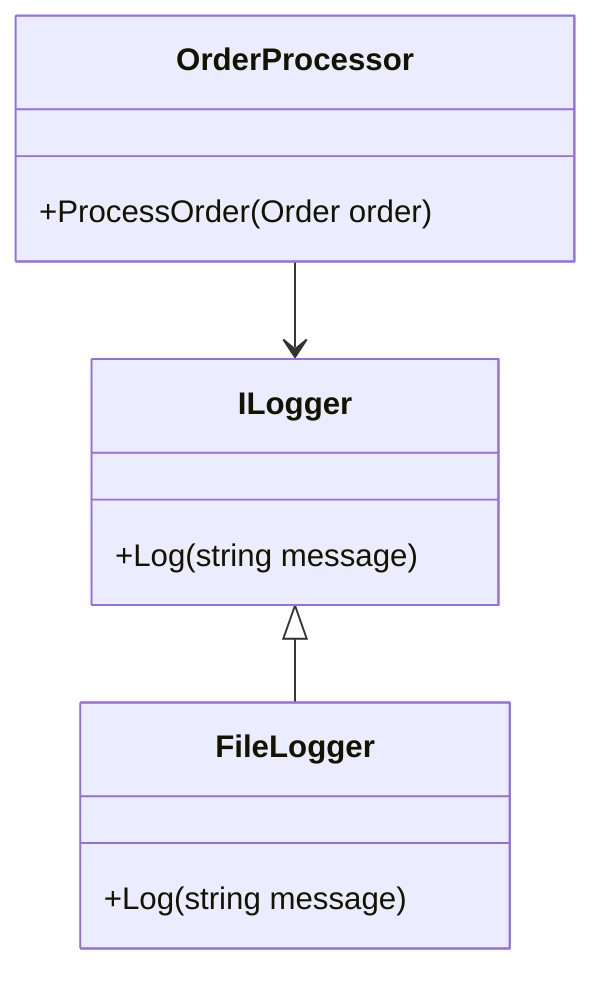

## 15.3 Design for Testability

Designing for testability is a crucial aspect of software development that ensures your code is easy to test, maintain, and extend. In this section, we will explore the principles and practices of designing testable code in C#. We will delve into the importance of decoupling components, minimizing side effects, and writing test-friendly code using interfaces and abstractions. Additionally, we will provide practical use cases and examples to illustrate how to structure applications for easy testing.

### Principles of Testable Design

Designing for testability involves several key principles that help create a codebase that is easy to test and maintain. Let's explore these principles in detail.

#### Decoupling Components

Decoupling is the process of separating components in a system to reduce dependencies and increase modularity. This principle is essential for testability because it allows you to test components in isolation without relying on other parts of the system.

- **Use Dependency Injection**: Dependency injection is a design pattern that allows you to inject dependencies into a class rather than hard-coding them. This makes it easier to replace dependencies with mock objects during testing.

```csharp
public interface ILogger
{
    void Log(string message);
}

public class FileLogger : ILogger
{
    public void Log(string message)
    {
        // Log message to a file
    }
}

public class OrderProcessor
{
    private readonly ILogger _logger;

    public OrderProcessor(ILogger logger)
    {
        _logger = logger;
    }

    public void ProcessOrder(Order order)
    {
        // Process the order
        _logger.Log("Order processed.");
    }
}
```

In the example above, the `OrderProcessor` class depends on the `ILogger` interface rather than a specific implementation. This allows you to inject a mock logger during testing.

- **Apply the Interface Segregation Principle**: This principle states that a class should not be forced to implement interfaces it does not use. By creating smaller, more focused interfaces, you can decouple components and make them easier to test.

```csharp
public interface IOrderProcessor
{
    void ProcessOrder(Order order);
}

public interface IOrderValidator
{
    bool Validate(Order order);
}

public class OrderService : IOrderProcessor, IOrderValidator
{
    public void ProcessOrder(Order order)
    {
        // Process order
    }

    public bool Validate(Order order)
    {
        // Validate order
        return true;
    }
}
```

By separating the `IOrderProcessor` and `IOrderValidator` interfaces, you can test each functionality independently.

#### Minimizing Side Effects

Side effects occur when a function or method modifies some state outside its scope or has observable interactions with outside functions or methods. Minimizing side effects is crucial for testability because it ensures that tests are predictable and repeatable.

- **Use Pure Functions**: A pure function is a function that, given the same input, will always return the same output and does not have any observable side effects. Pure functions are easier to test because they do not rely on external state.

```csharp
public int Add(int a, int b)
{
    return a + b;
}
```

The `Add` function is a pure function because it does not modify any external state and always returns the same result for the same inputs.

- **Avoid Global State**: Global state can lead to unpredictable behavior and make tests difficult to write and maintain. Instead, use dependency injection to pass state explicitly.

```csharp
public class Configuration
{
    public string ConnectionString { get; set; }
}

public class DatabaseService
{
    private readonly Configuration _configuration;

    public DatabaseService(Configuration configuration)
    {
        _configuration = configuration;
    }

    public void Connect()
    {
        // Use _configuration.ConnectionString to connect to the database
    }
}
```

By passing the `Configuration` object to the `DatabaseService` class, you avoid relying on global state and make the class easier to test.

### Writing Test-Friendly Code

Writing test-friendly code involves using techniques and patterns that make your code easier to test. Let's explore some of these techniques.

#### Using Interfaces and Abstractions

Interfaces and abstractions are powerful tools for writing test-friendly code. They allow you to define contracts for your classes and decouple implementations from their dependencies.

- **Define Interfaces for Dependencies**: By defining interfaces for your dependencies, you can easily replace them with mock implementations during testing.

```csharp
public interface IEmailService
{
    void SendEmail(string to, string subject, string body);
}

public class EmailService : IEmailService
{
    public void SendEmail(string to, string subject, string body)
    {
        // Send email
    }
}

public class NotificationService
{
    private readonly IEmailService _emailService;

    public NotificationService(IEmailService emailService)
    {
        _emailService = emailService;
    }

    public void Notify(string message)
    {
        _emailService.SendEmail("user@example.com", "Notification", message);
    }
}
```

In this example, the `NotificationService` class depends on the `IEmailService` interface, allowing you to inject a mock email service during testing.

- **Use Abstract Classes for Common Functionality**: Abstract classes can be used to define common functionality that can be shared among multiple classes. This reduces code duplication and makes your code easier to test.

```csharp
public abstract class Shape
{
    public abstract double Area();
}

public class Circle : Shape
{
    private readonly double _radius;

    public Circle(double radius)
    {
        _radius = radius;
    }

    public override double Area()
    {
        return Math.PI * _radius * _radius;
    }
}

public class Square : Shape
{
    private readonly double _side;

    public Square(double side)
    {
        _side = side;
    }

    public override double Area()
    {
        return _side * _side;
    }
}
```

In this example, the `Shape` abstract class defines a common interface for calculating the area of a shape, which is implemented by the `Circle` and `Square` classes.

#### Avoiding Static Dependencies and Singletons

Static dependencies and singletons can make your code difficult to test because they introduce hidden dependencies and global state. Let's explore how to avoid these pitfalls.

- **Avoid Static Methods for Dependencies**: Static methods can introduce hidden dependencies and make your code difficult to test. Instead, use instance methods and dependency injection.

```csharp
public class MathService
{
    public int Multiply(int a, int b)
    {
        return a * b;
    }
}

public class Calculator
{
    private readonly MathService _mathService;

    public Calculator(MathService mathService)
    {
        _mathService = mathService;
    }

    public int CalculateProduct(int a, int b)
    {
        return _mathService.Multiply(a, b);
    }
}
```

By using instance methods and dependency injection, you can easily replace the `MathService` with a mock implementation during testing.

- **Use Dependency Injection for Singletons**: Singletons can introduce global state and make your code difficult to test. Instead, use dependency injection to manage singleton instances.

```csharp
public class SingletonService
{
    private static SingletonService _instance;

    private SingletonService() { }

    public static SingletonService Instance => _instance ??= new SingletonService();
}

public class Consumer
{
    private readonly SingletonService _singletonService;

    public Consumer(SingletonService singletonService)
    {
        _singletonService = singletonService;
    }

    public void UseService()
    {
        // Use _singletonService
    }
}
```

By injecting the `SingletonService` into the `Consumer` class, you can easily replace it with a mock implementation during testing.

### Use Cases and Examples

Let's explore some practical use cases and examples of designing for testability in C#.

#### Structuring Applications for Easy Testing

Structuring your application for easy testing involves organizing your code in a way that makes it easy to test individual components. Let's explore some techniques for achieving this.

- **Use the Repository Pattern for Data Access**: The repository pattern is a design pattern that abstracts data access logic and provides a clean interface for interacting with data sources. This makes it easier to test data access logic in isolation.

```csharp
public interface IProductRepository
{
    IEnumerable<Product> GetAllProducts();
    Product GetProductById(int id);
}

public class ProductRepository : IProductRepository
{
    public IEnumerable<Product> GetAllProducts()
    {
        // Retrieve products from the database
    }

    public Product GetProductById(int id)
    {
        // Retrieve product by ID from the database
    }
}

public class ProductService
{
    private readonly IProductRepository _productRepository;

    public ProductService(IProductRepository productRepository)
    {
        _productRepository = productRepository;
    }

    public IEnumerable<Product> GetProducts()
    {
        return _productRepository.GetAllProducts();
    }
}
```

By using the repository pattern, you can easily replace the `ProductRepository` with a mock implementation during testing.

- **Apply the Command Pattern for Business Logic**: The command pattern is a design pattern that encapsulates a request as an object, allowing you to parameterize clients with queues, requests, and operations. This makes it easier to test business logic in isolation.

```csharp
public interface ICommand
{
    void Execute();
}

public class CreateOrderCommand : ICommand
{
    private readonly Order _order;

    public CreateOrderCommand(Order order)
    {
        _order = order;
    }

    public void Execute()
    {
        // Create order logic
    }
}

public class CommandInvoker
{
    private readonly List<ICommand> _commands = new List<ICommand>();

    public void AddCommand(ICommand command)
    {
        _commands.Add(command);
    }

    public void ExecuteCommands()
    {
        foreach (var command in _commands)
        {
            command.Execute();
        }
    }
}
```

By using the command pattern, you can easily test individual commands in isolation.

### Visualizing Testable Design

To better understand the concepts of designing for testability, let's visualize the relationships between components using a class diagram.



**Diagram Description**: This class diagram illustrates the relationship between the `OrderProcessor`, `ILogger`, and `FileLogger` classes. The `OrderProcessor` depends on the `ILogger` interface, allowing for easy substitution of the `FileLogger` with a mock implementation during testing.

### Knowledge Check

To reinforce your understanding of designing for testability, consider the following questions:

- What are the benefits of decoupling components in a system?
- How can dependency injection improve testability?
- Why is it important to minimize side effects in your code?
- How can interfaces and abstractions help in writing test-friendly code?
- What are the drawbacks of using static dependencies and singletons?

### Try It Yourself

To further enhance your understanding of designing for testability, try modifying the code examples provided in this section. Consider the following exercises:

1. Modify the `OrderProcessor` class to include a new dependency, such as a payment processor. Use dependency injection to inject the new dependency and write a unit test for the `ProcessOrder` method.

2. Refactor the `ProductService` class to use the command pattern for retrieving products. Implement a `GetProductsCommand` class and write a unit test for the command.

3. Create a new interface for the `SingletonService` class and use dependency injection to inject the interface into the `Consumer` class. Write a unit test for the `UseService` method.

### Embrace the Journey

Remember, designing for testability is an ongoing journey. As you continue to develop your skills, you'll discover new techniques and patterns that can help you create more testable code. Keep experimenting, stay curious, and enjoy the journey!

## Quiz Time!



### What is the primary benefit of decoupling components in a system?

- [x] It allows components to be tested in isolation.
- [ ] It increases the complexity of the system.
- [ ] It makes the system more difficult to maintain.
- [ ] It reduces the number of classes in the system.

> **Explanation:** Decoupling components allows them to be tested in isolation, making the system easier to test and maintain.

### How does dependency injection improve testability?

- [x] By allowing dependencies to be replaced with mock objects during testing.
- [ ] By increasing the number of dependencies in a class.
- [ ] By making classes more tightly coupled.
- [ ] By reducing the number of interfaces in the system.

> **Explanation:** Dependency injection allows dependencies to be replaced with mock objects during testing, improving testability.

### Why is it important to minimize side effects in your code?

- [x] To ensure tests are predictable and repeatable.
- [ ] To increase the complexity of the code.
- [ ] To make the code more difficult to understand.
- [ ] To reduce the number of functions in the code.

> **Explanation:** Minimizing side effects ensures that tests are predictable and repeatable, making the code easier to test.

### How can interfaces and abstractions help in writing test-friendly code?

- [x] By defining contracts for classes and decoupling implementations from dependencies.
- [ ] By increasing the number of classes in the system.
- [ ] By making the code more difficult to understand.
- [ ] By reducing the number of interfaces in the system.

> **Explanation:** Interfaces and abstractions define contracts for classes and decouple implementations from dependencies, making the code more test-friendly.

### What is a drawback of using static dependencies and singletons?

- [x] They introduce hidden dependencies and global state.
- [ ] They make the code easier to test.
- [ ] They reduce the number of classes in the system.
- [ ] They increase the complexity of the code.

> **Explanation:** Static dependencies and singletons introduce hidden dependencies and global state, making the code difficult to test.

### What is a pure function?

- [x] A function that always returns the same output for the same input and has no side effects.
- [ ] A function that modifies global state.
- [ ] A function that depends on external state.
- [ ] A function that has multiple return statements.

> **Explanation:** A pure function always returns the same output for the same input and has no side effects, making it easier to test.

### What is the purpose of the repository pattern?

- [x] To abstract data access logic and provide a clean interface for interacting with data sources.
- [ ] To increase the complexity of the data access layer.
- [ ] To make data access logic more difficult to test.
- [ ] To reduce the number of classes in the data access layer.

> **Explanation:** The repository pattern abstracts data access logic and provides a clean interface for interacting with data sources, making it easier to test.

### How can the command pattern improve testability?

- [x] By encapsulating requests as objects, allowing for easy testing of individual commands.
- [ ] By increasing the number of commands in the system.
- [ ] By making the code more difficult to understand.
- [ ] By reducing the number of classes in the system.

> **Explanation:** The command pattern encapsulates requests as objects, allowing for easy testing of individual commands.

### What is the interface segregation principle?

- [x] A principle that states a class should not be forced to implement interfaces it does not use.
- [ ] A principle that increases the number of interfaces in the system.
- [ ] A principle that makes the code more difficult to understand.
- [ ] A principle that reduces the number of classes in the system.

> **Explanation:** The interface segregation principle states that a class should not be forced to implement interfaces it does not use, improving testability.

### True or False: Global state can lead to unpredictable behavior and make tests difficult to write and maintain.

- [x] True
- [ ] False

> **Explanation:** Global state can lead to unpredictable behavior and make tests difficult to write and maintain, reducing testability.


