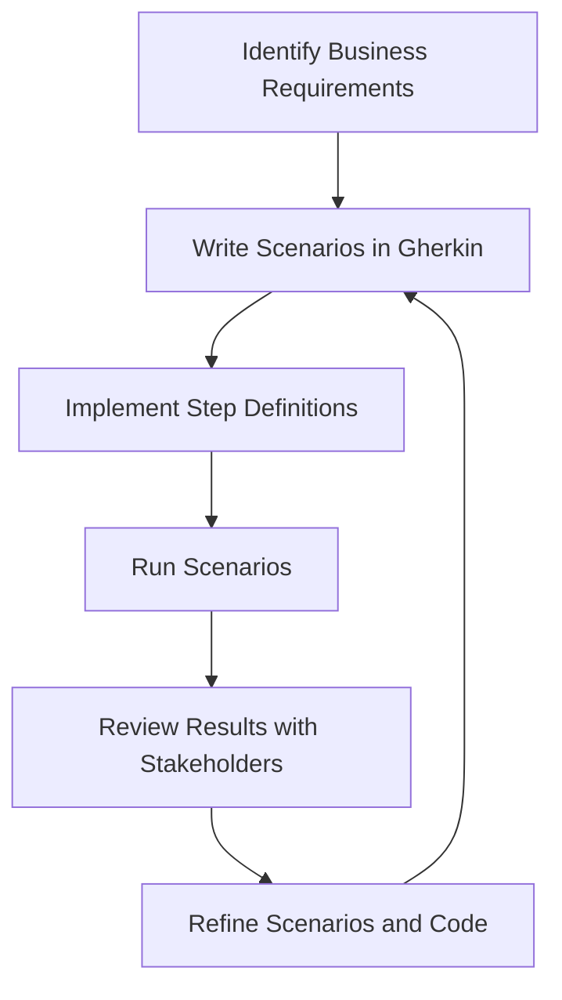

## 15.4 Behavior-Driven Development (BDD)

Behavior-Driven Development (BDD) is a software development approach that enhances collaboration between developers, testers, and business stakeholders. By focusing on the behavior of an application, BDD ensures that the software meets business requirements and user expectations. In this section, we will explore the principles of BDD, its implementation in C#, and how it aligns tests with business requirements through behavior specifications.

### Introduction to Behavior-Driven Development

BDD extends Test-Driven Development (TDD) by writing test cases in a natural language that non-programmers can read. This approach bridges the gap between technical and non-technical team members, fostering a shared understanding of the system's behavior.

#### Key Concepts of BDD

- **Ubiquitous Language**: BDD encourages the use of a common language that all stakeholders understand, reducing misunderstandings.
- **Scenarios**: BDD uses scenarios to describe the behavior of the system. Each scenario is a concrete example of how the system should behave in a given situation.
- **Collaboration**: BDD promotes collaboration between developers, testers, and business stakeholders, ensuring that everyone is on the same page.

### Using BDD Frameworks in C#

C# developers can leverage several BDD frameworks to implement BDD practices effectively. Two popular frameworks are SpecFlow and xBehave.net.

#### SpecFlow

SpecFlow is a .NET framework that brings BDD to C#. It allows you to define, manage, and execute human-readable acceptance tests in .NET projects.

- **Gherkin Language**: SpecFlow uses the Gherkin language to write scenarios in a Given-When-Then format, making them easy to understand.
- **Integration with Visual Studio**: SpecFlow integrates seamlessly with Visual Studio, providing tools for writing and running tests.
- **Support for Data-Driven Testing**: SpecFlow supports parameterized scenarios, enabling data-driven testing.

##### Example of SpecFlow Scenario

```gherkin
Feature: User Login

  Scenario: Successful login with valid credentials
    Given the user is on the login page
    When the user enters valid credentials
    Then the user should be redirected to the dashboard
```

#### xBehave.net

xBehave.net is another BDD framework for .NET that builds on top of xUnit.net. It allows you to write tests in a narrative style using C#.

- **Narrative Style**: xBehave.net uses a narrative style to describe scenarios, making tests more readable.
- **Integration with xUnit.net**: It integrates with xUnit.net, allowing you to use familiar testing tools and libraries.

##### Example of xBehave.net Scenario

```csharp
using Xunit;
using Xbehave;

public class UserLoginFeature
{
    [Scenario]
    public void SuccessfulLogin()
    {
        "Given the user is on the login page"
            .x(() => { /* Navigate to login page */ });

        "When the user enters valid credentials"
            .x(() => { /* Enter credentials */ });

        "Then the user should be redirected to the dashboard"
            .x(() => { /* Verify redirection */ });
    }
}
```

### Aligning Tests with Business Requirements

BDD aligns tests with business requirements by writing scenarios in a human-readable form and collaborating with stakeholders.

#### Writing Scenarios in Human-Readable Form

Scenarios in BDD are written in a format that is easy for non-technical stakeholders to understand. This ensures that everyone involved in the project has a clear understanding of the system's behavior.

- **Given-When-Then Format**: This format is used to describe the initial context (Given), the event (When), and the expected outcome (Then).
- **Examples and Tables**: Use examples and tables to illustrate different scenarios and edge cases.

#### Collaborating with Stakeholders

Collaboration is a key aspect of BDD. By involving stakeholders in the process of writing scenarios, you ensure that the software meets their expectations.

- **Workshops and Meetings**: Conduct workshops and meetings with stakeholders to gather requirements and write scenarios together.
- **Feedback Loops**: Establish feedback loops to continuously refine scenarios and ensure they align with business goals.

### Use Cases and Examples

BDD can be applied in various contexts to enhance collaboration and ensure alignment with business requirements.

#### Enhancing Collaboration Between Developers and Stakeholders

By using BDD, teams can improve communication and collaboration, leading to better software quality and user satisfaction.

- **Shared Understanding**: BDD fosters a shared understanding of the system's behavior among all team members.
- **Reduced Misunderstandings**: By using a common language, BDD reduces misunderstandings and misinterpretations.

#### Example: E-commerce Platform

Consider an e-commerce platform where stakeholders want to ensure that users can successfully add items to their cart.

##### SpecFlow Scenario for Adding Items to Cart

```gherkin
Feature: Shopping Cart

  Scenario: Add item to cart
    Given the user is on the product page
    When the user clicks the "Add to Cart" button
    Then the item should be added to the cart
    And the cart count should increase by one
```

##### xBehave.net Scenario for Adding Items to Cart

```csharp
using Xunit;
using Xbehave;

public class ShoppingCartFeature
{
    [Scenario]
    public void AddItemToCart()
    {
        "Given the user is on the product page"
            .x(() => { /* Navigate to product page */ });

        "When the user clicks the 'Add to Cart' button"
            .x(() => { /* Click add to cart button */ });

        "Then the item should be added to the cart"
            .x(() => { /* Verify item is in cart */ });

        "And the cart count should increase by one"
            .x(() => { /* Verify cart count */ });
    }
}
```

### Visualizing BDD Workflow

To better understand the BDD workflow, let's visualize the process using a flowchart.



**Figure 1: BDD Workflow**

### Try It Yourself

To get hands-on experience with BDD in C#, try modifying the provided code examples. For instance, add a scenario for removing an item from the cart or handling invalid login attempts. Experiment with different scenarios and see how they affect the behavior of the application.

### References and Further Reading

- [SpecFlow Documentation](https://specflow.org/documentation/)
- [xBehave.net Documentation](https://xbehave.github.io/)
- [Gherkin Language Reference](https://cucumber.io/docs/gherkin/reference/)
- [xUnit.net Documentation](https://xunit.net/)

### Knowledge Check

To reinforce your understanding of BDD, consider the following questions:

- What are the benefits of using BDD in software development?
- How does BDD enhance collaboration between developers and stakeholders?
- What is the Given-When-Then format, and how is it used in BDD?
- How can BDD frameworks like SpecFlow and xBehave.net be integrated into a C# project?

### Embrace the Journey

Remember, BDD is not just about writing tests; it's about fostering collaboration and ensuring that the software meets business requirements. As you continue your journey with BDD, keep experimenting, stay curious, and enjoy the process of building better software.

## Quiz Time!



### What is the primary goal of Behavior-Driven Development (BDD)?

- [x] To align software development with business requirements through behavior specifications.
- [ ] To replace Test-Driven Development (TDD) entirely.
- [ ] To focus solely on technical implementation details.
- [ ] To eliminate the need for stakeholder collaboration.

> **Explanation:** BDD aims to align software development with business requirements by focusing on behavior specifications and fostering collaboration among stakeholders.

### Which language does SpecFlow use to write scenarios?

- [x] Gherkin
- [ ] C#
- [ ] JavaScript
- [ ] Python

> **Explanation:** SpecFlow uses the Gherkin language to write scenarios in a human-readable format.

### What is the Given-When-Then format used for in BDD?

- [x] To describe the initial context, the event, and the expected outcome of a scenario.
- [ ] To define the technical implementation of a feature.
- [ ] To write unit tests in C#.
- [ ] To create database schemas.

> **Explanation:** The Given-When-Then format is used to describe scenarios in BDD by outlining the initial context, the event, and the expected outcome.

### How does xBehave.net integrate with existing testing tools?

- [x] It builds on top of xUnit.net, allowing the use of familiar testing tools and libraries.
- [ ] It replaces all existing testing tools with its own.
- [ ] It requires a separate testing environment.
- [ ] It only works with NUnit.

> **Explanation:** xBehave.net integrates with xUnit.net, allowing developers to use familiar testing tools and libraries.

### What is a key benefit of writing scenarios in a human-readable form?

- [x] It ensures that all stakeholders have a clear understanding of the system's behavior.
- [ ] It makes the code more complex and harder to maintain.
- [ ] It eliminates the need for technical documentation.
- [ ] It reduces the need for automated testing.

> **Explanation:** Writing scenarios in a human-readable form ensures that all stakeholders, including non-technical ones, have a clear understanding of the system's behavior.

### Which of the following is a popular BDD framework for C#?

- [x] SpecFlow
- [ ] Mocha
- [ ] Jasmine
- [ ] JUnit

> **Explanation:** SpecFlow is a popular BDD framework for C# that allows developers to write human-readable acceptance tests.

### What role do stakeholders play in BDD?

- [x] They collaborate with developers to write scenarios and ensure alignment with business goals.
- [ ] They are not involved in the BDD process.
- [ ] They only review the final product.
- [ ] They provide technical implementation details.

> **Explanation:** Stakeholders collaborate with developers in BDD to write scenarios and ensure that the software aligns with business goals.

### How can BDD improve software quality?

- [x] By fostering collaboration and ensuring that the software meets user expectations.
- [ ] By focusing solely on technical implementation details.
- [ ] By reducing the need for testing.
- [ ] By eliminating the need for stakeholder feedback.

> **Explanation:** BDD improves software quality by fostering collaboration among team members and ensuring that the software meets user expectations.

### What is a common challenge when implementing BDD?

- [x] Ensuring effective collaboration and communication among all stakeholders.
- [ ] Writing technical documentation.
- [ ] Implementing complex algorithms.
- [ ] Managing database schemas.

> **Explanation:** A common challenge in BDD is ensuring effective collaboration and communication among all stakeholders to align on business requirements.

### True or False: BDD is only suitable for large enterprise projects.

- [ ] True
- [x] False

> **Explanation:** BDD is suitable for projects of all sizes, as it focuses on aligning software development with business requirements and fostering collaboration.


