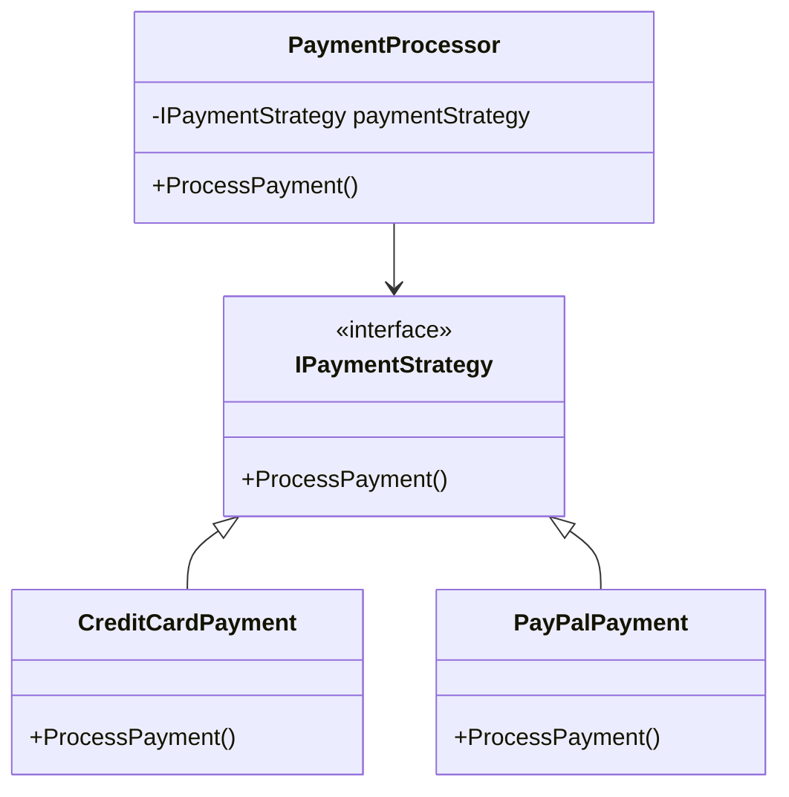

## 15.5 Refactoring with Design Patterns

Refactoring is a critical process in software development that involves restructuring existing code without changing its external behavior. The goal is to improve the code's structure, readability, and maintainability. Design patterns play a pivotal role in refactoring by providing proven solutions to common design problems. In this section, we will delve into the art of refactoring with design patterns in C#, focusing on identifying refactoring opportunities, applying patterns to improve design, and examining case studies of successful pattern-based refactoring.

### Identifying Refactoring Opportunities

Before we can refactor code, we must first identify areas that need improvement. This involves recognizing code smells and deciding when to refactor versus when to rewrite.

#### Recognizing Code Smells

Code smells are indicators of potential problems in the codebase. They do not necessarily mean the code is incorrect, but they suggest that the code could be improved. Here are some common code smells:

- **Duplicated Code**: The same code appears in multiple places. This can lead to maintenance challenges.
- **Long Method**: Methods that are too long and do too much can be difficult to understand and maintain.
- **Large Class**: Classes that have too many responsibilities violate the Single Responsibility Principle (SRP).
- **Feature Envy**: A method that seems more interested in a class other than the one it is in.
- **Inappropriate Intimacy**: Classes that have too much knowledge about each other's internal workings.
- **Switch Statements**: Frequent use of switch statements can indicate a need for polymorphism.

#### When to Refactor Versus When to Rewrite

Deciding whether to refactor or rewrite code depends on several factors:

- **Complexity**: If the code is overly complex and difficult to understand, a rewrite might be necessary.
- **Technical Debt**: High levels of technical debt may warrant a rewrite.
- **Time Constraints**: Refactoring is often preferred when time is limited, as it is generally less risky than a complete rewrite.
- **Business Value**: Consider the business value of the code. If it is critical to operations, refactoring might be safer.

### Applying Patterns to Improve Design

Once we've identified areas for improvement, we can apply design patterns to refactor the code. Refactoring towards patterns helps achieve a more robust and flexible design.

#### Refactoring Towards Patterns for Better Structure

Design patterns provide a blueprint for solving common design problems. Here are some examples of how patterns can be applied during refactoring:

- **Strategy Pattern**: Use this pattern to replace conditional logic with polymorphism. This is particularly useful for eliminating switch statements.
  
  ```csharp
  // Before refactoring
  public class PaymentProcessor {
      public void ProcessPayment(string paymentType) {
          if (paymentType == "CreditCard") {
              // Process credit card payment
          } else if (paymentType == "PayPal") {
              // Process PayPal payment
          }
      }
  }

  // After refactoring with Strategy Pattern
  public interface IPaymentStrategy {
      void ProcessPayment();
  }

  public class CreditCardPayment : IPaymentStrategy {
      public void ProcessPayment() {
          // Process credit card payment
      }
  }

  public class PayPalPayment : IPaymentStrategy {
      public void ProcessPayment() {
          // Process PayPal payment
      }
  }

  public class PaymentProcessor {
      private IPaymentStrategy _paymentStrategy;

      public PaymentProcessor(IPaymentStrategy paymentStrategy) {
          _paymentStrategy = paymentStrategy;
      }

      public void ProcessPayment() {
          _paymentStrategy.ProcessPayment();
      }
  }
  ```

- **Observer Pattern**: Apply this pattern to decouple objects and allow them to communicate without tight coupling. This is useful for reducing inappropriate intimacy.

  ```csharp
  // Before refactoring
  public class Stock {
      public void UpdatePrice(decimal newPrice) {
          // Update stock price
          // Notify investors
      }
  }

  // After refactoring with Observer Pattern
  public interface IInvestor {
      void Update(Stock stock);
  }

  public class Stock {
      private List<IInvestor> _investors = new List<IInvestor>();
      private decimal _price;

      public void Attach(IInvestor investor) {
          _investors.Add(investor);
      }

      public void Detach(IInvestor investor) {
          _investors.Remove(investor);
      }

      public void Notify() {
          foreach (var investor in _investors) {
              investor.Update(this);
          }
      }

      public decimal Price {
          get { return _price; }
          set {
              if (_price != value) {
                  _price = value;
                  Notify();
              }
          }
      }
  }

  public class ConcreteInvestor : IInvestor {
      public void Update(Stock stock) {
          // React to stock price change
      }
  }
  ```

- **Factory Method Pattern**: Use this pattern to create objects without specifying the exact class of object that will be created. This can help manage duplicated code related to object creation.

  ```csharp
  // Before refactoring
  public class DocumentManager {
      public void OpenDocument(string type) {
          if (type == "Word") {
              // Open Word document
          } else if (type == "PDF") {
              // Open PDF document
          }
      }
  }

  // After refactoring with Factory Method Pattern
  public abstract class Document {
      public abstract void Open();
  }

  public class WordDocument : Document {
      public override void Open() {
          // Open Word document
      }
  }

  public class PDFDocument : Document {
      public override void Open() {
          // Open PDF document
      }
  }

  public abstract class DocumentCreator {
      public abstract Document CreateDocument();
  }

  public class WordDocumentCreator : DocumentCreator {
      public override Document CreateDocument() {
          return new WordDocument();
      }
  }

  public class PDFDocumentCreator : DocumentCreator {
      public override Document CreateDocument() {
          return new PDFDocument();
      }
  }
  ```

### Case Studies in Refactoring

Let's explore some real-world examples of successful pattern-based refactoring.

#### Example 1: Refactoring a Legacy System

A legacy system with a monolithic architecture was suffering from high maintenance costs and slow feature delivery. The team decided to refactor the system using design patterns to improve modularity and scalability.

- **Problem**: The system had large classes with multiple responsibilities, leading to a violation of the Single Responsibility Principle.
- **Solution**: The team applied the **Facade Pattern** to simplify interactions with complex subsystems and the **Adapter Pattern** to integrate with external systems.
- **Outcome**: The refactoring resulted in a more modular system with clear boundaries, making it easier to maintain and extend.

#### Example 2: Improving a Payment Processing System

A payment processing system was experiencing issues with duplicated code and complex conditional logic. The team refactored the system using design patterns to improve code quality and flexibility.

- **Problem**: The system had duplicated code for different payment methods, leading to maintenance challenges.
- **Solution**: The team applied the **Strategy Pattern** to encapsulate payment processing algorithms and the **Factory Method Pattern** to manage object creation.
- **Outcome**: The refactoring reduced code duplication and improved the system's flexibility to support new payment methods.

#### Example 3: Enhancing a Notification System

A notification system was tightly coupled, making it difficult to add new notification channels. The team refactored the system using design patterns to improve extensibility.

- **Problem**: The system was tightly coupled, with hardcoded logic for different notification channels.
- **Solution**: The team applied the **Observer Pattern** to decouple the notification logic and the **Decorator Pattern** to add new notification channels dynamically.
- **Outcome**: The refactoring improved the system's extensibility, allowing new notification channels to be added with minimal changes.

### Visualizing Refactoring with Design Patterns

To better understand how design patterns can be applied during refactoring, let's visualize the process using a class diagram.



**Diagram Description**: This class diagram illustrates the use of the Strategy Pattern in the payment processing system. The `PaymentProcessor` class depends on the `IPaymentStrategy` interface, allowing different payment strategies to be implemented and used interchangeably.

### Try It Yourself

To deepen your understanding of refactoring with design patterns, try modifying the code examples provided:

- **Experiment with the Strategy Pattern**: Add a new payment method, such as `BitcoinPayment`, and implement the `IPaymentStrategy` interface.
- **Extend the Observer Pattern**: Add a new type of investor in the stock example and observe how the system reacts to stock price changes.
- **Implement the Factory Method Pattern**: Create a new document type, such as `ExcelDocument`, and integrate it into the document management system.

### References and Links

For further reading on refactoring and design patterns, consider the following resources:

- [Refactoring: Improving the Design of Existing Code by Martin Fowler](https://martinfowler.com/books/refactoring.html)
- [Design Patterns: Elements of Reusable Object-Oriented Software by Erich Gamma, Richard Helm, Ralph Johnson, John Vlissides](https://www.amazon.com/Design-Patterns-Elements-Reusable-Object-Oriented/dp/0201633612)
- [C# Programming Guide - Microsoft Docs](https://docs.microsoft.com/en-us/dotnet/csharp/)

### Knowledge Check

To reinforce your understanding of refactoring with design patterns, consider the following questions:

- What are some common code smells that indicate a need for refactoring?
- How can the Strategy Pattern help eliminate switch statements in your code?
- What are the benefits of using the Observer Pattern in a notification system?
- How does the Factory Method Pattern improve object creation in a system?

### Embrace the Journey

Remember, refactoring is an ongoing process that requires continuous learning and adaptation. As you gain experience with design patterns, you'll become more adept at recognizing refactoring opportunities and applying patterns to improve your code. Keep experimenting, stay curious, and enjoy the journey!

## Quiz Time!



### What is a code smell?

- [x] An indicator of potential problems in the codebase
- [ ] A syntax error in the code
- [ ] A runtime exception
- [ ] A design pattern

> **Explanation:** A code smell is an indicator of potential problems in the codebase that suggests the code could be improved.

### When should you consider rewriting code instead of refactoring?

- [x] When the code is overly complex and difficult to understand
- [ ] When the code has minor formatting issues
- [ ] When the code is well-structured
- [ ] When the code follows design patterns

> **Explanation:** Rewriting code is considered when it is overly complex and difficult to understand, as refactoring might not be sufficient.

### Which pattern is useful for replacing conditional logic with polymorphism?

- [x] Strategy Pattern
- [ ] Observer Pattern
- [ ] Factory Method Pattern
- [ ] Singleton Pattern

> **Explanation:** The Strategy Pattern is useful for replacing conditional logic with polymorphism by encapsulating algorithms.

### What is the primary benefit of using the Observer Pattern?

- [x] Decoupling objects and allowing them to communicate without tight coupling
- [ ] Simplifying object creation
- [ ] Managing object lifecycles
- [ ] Ensuring a single instance of a class

> **Explanation:** The Observer Pattern decouples objects and allows them to communicate without tight coupling, enhancing flexibility.

### How does the Factory Method Pattern help in object creation?

- [x] By creating objects without specifying the exact class of object that will be created
- [ ] By ensuring a single instance of a class
- [ ] By managing object lifecycles
- [ ] By decoupling objects

> **Explanation:** The Factory Method Pattern helps in object creation by allowing the creation of objects without specifying the exact class of object that will be created.

### What is a common code smell that indicates a violation of the Single Responsibility Principle?

- [x] Large Class
- [ ] Duplicated Code
- [ ] Long Method
- [ ] Feature Envy

> **Explanation:** A Large Class is a common code smell that indicates a violation of the Single Responsibility Principle, as it has too many responsibilities.

### Which pattern is useful for integrating with external systems?

- [x] Adapter Pattern
- [ ] Strategy Pattern
- [ ] Observer Pattern
- [ ] Singleton Pattern

> **Explanation:** The Adapter Pattern is useful for integrating with external systems by allowing incompatible interfaces to work together.

### What is the outcome of applying the Strategy Pattern in a payment processing system?

- [x] Reduced code duplication and improved flexibility
- [ ] Increased code complexity
- [ ] Tighter coupling between classes
- [ ] Decreased system performance

> **Explanation:** Applying the Strategy Pattern in a payment processing system reduces code duplication and improves flexibility by encapsulating payment processing algorithms.

### True or False: Refactoring always involves changing the external behavior of the code.

- [ ] True
- [x] False

> **Explanation:** False. Refactoring involves restructuring existing code without changing its external behavior.

### Which pattern can be used to simplify interactions with complex subsystems?

- [x] Facade Pattern
- [ ] Strategy Pattern
- [ ] Observer Pattern
- [ ] Factory Method Pattern

> **Explanation:** The Facade Pattern can be used to simplify interactions with complex subsystems by providing a unified interface.


