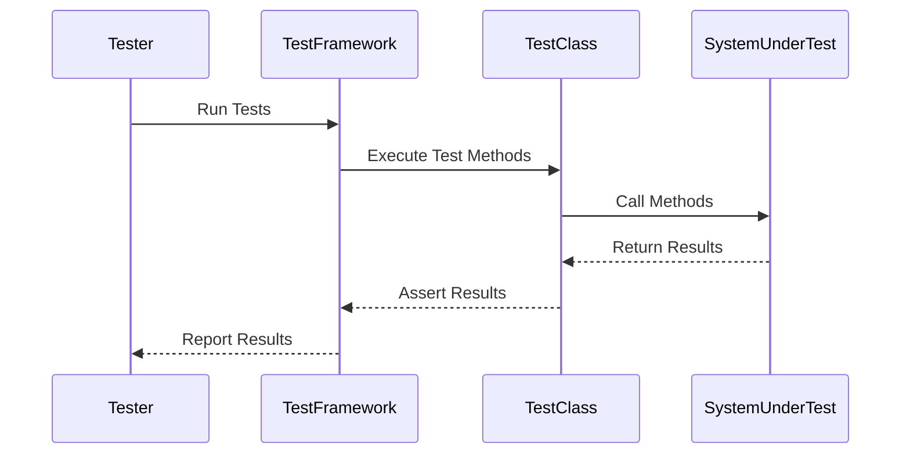

## 15.6 Unit Testing Best Practices

Unit testing is a critical aspect of software development that ensures individual components of your application work as expected. For C# developers, mastering unit testing is essential for building robust, maintainable, and scalable applications. In this section, we will explore best practices for writing effective and maintainable unit tests, structuring test projects, and provide comprehensive examples to enhance your testing skills.

### Writing Effective Unit Tests

Writing effective unit tests involves more than just checking if your code works. It requires a strategic approach to ensure that tests are reliable, maintainable, and provide meaningful feedback. Let's delve into some key practices for writing effective unit tests.

#### The AAA (Arrange, Act, Assert) Pattern

The AAA pattern is a widely adopted approach in unit testing that helps structure tests clearly and consistently. It consists of three distinct phases:

1. **Arrange**: Set up the necessary preconditions and inputs for the test.
2. **Act**: Execute the code under test.
3. **Assert**: Verify that the outcome is as expected.

Here's a simple example of the AAA pattern in C#:

```csharp
using NUnit.Framework;

[TestFixture]
public class CalculatorTests
{
    [Test]
    public void Add_TwoNumbers_ReturnsSum()
    {
        // Arrange
        var calculator = new Calculator();
        int number1 = 5;
        int number2 = 10;

        // Act
        int result = calculator.Add(number1, number2);

        // Assert
        Assert.AreEqual(15, result);
    }
}
```

In this example, the `Arrange` phase initializes the `Calculator` object and the input numbers. The `Act` phase calls the `Add` method, and the `Assert` phase checks if the result is as expected.

#### Writing Clear and Concise Tests

Clear and concise tests are easier to understand and maintain. Here are some tips to achieve this:

- **Use Descriptive Names**: Test method names should clearly describe what the test is verifying. For example, `Add_TwoNumbers_ReturnsSum` is more descriptive than `TestAdd`.
- **Keep Tests Focused**: Each test should verify a single behavior or scenario. Avoid testing multiple things in one test.
- **Avoid Hardcoding Values**: Use constants or variables for expected values to make tests easier to update and understand.
- **Minimize Dependencies**: Use mocks or stubs to isolate the unit under test from external dependencies.

### Structuring Test Projects

A well-organized test project is crucial for maintainability and scalability. Let's explore some best practices for structuring your test projects.

#### Organizing Tests for Maintainability

- **Follow a Consistent Structure**: Organize your test files and folders in a way that mirrors your production code structure. This makes it easier to find and maintain tests.
- **Group Related Tests**: Group tests by functionality or feature to keep related tests together.
- **Use Test Suites**: Use test suites to group related tests and run them together. This can be done using attributes like `[TestFixture]` in NUnit.

#### Naming Conventions and Folder Structures

- **Use Descriptive Folder Names**: Use folder names that reflect the functionality being tested. For example, `CalculatorTests` for tests related to the `Calculator` class.
- **Follow Naming Conventions**: Use consistent naming conventions for test classes and methods. For example, `ClassNameTests` for test classes and `MethodName_Scenario_ExpectedBehavior` for test methods.

### Use Cases and Examples

Let's explore some comprehensive examples of unit tests to illustrate these best practices in action.

#### Example 1: Testing a Calculator Class

Consider a simple `Calculator` class with methods for basic arithmetic operations. Here's how you might write unit tests for this class:

```csharp
public class Calculator
{
    public int Add(int a, int b) => a + b;
    public int Subtract(int a, int b) => a - b;
    public int Multiply(int a, int b) => a * b;
    public int Divide(int a, int b) => a / b;
}

[TestFixture]
public class CalculatorTests
{
    private Calculator _calculator;

    [SetUp]
    public void Setup()
    {
        _calculator = new Calculator();
    }

    [Test]
    public void Add_TwoPositiveNumbers_ReturnsSum()
    {
        // Arrange
        int number1 = 5;
        int number2 = 10;

        // Act
        int result = _calculator.Add(number1, number2);

        // Assert
        Assert.AreEqual(15, result);
    }

    [Test]
    public void Subtract_TwoNumbers_ReturnsDifference()
    {
        // Arrange
        int number1 = 10;
        int number2 = 5;

        // Act
        int result = _calculator.Subtract(number1, number2);

        // Assert
        Assert.AreEqual(5, result);
    }

    [Test]
    public void Divide_ByZero_ThrowsException()
    {
        // Arrange
        int number1 = 10;
        int number2 = 0;

        // Act & Assert
        Assert.Throws<DivideByZeroException>(() => _calculator.Divide(number1, number2));
    }
}
```

In this example, we have tests for the `Add`, `Subtract`, and `Divide` methods of the `Calculator` class. Note how each test is focused on a single behavior and uses descriptive names.

#### Example 2: Testing a Shopping Cart

Let's consider a more complex example involving a `ShoppingCart` class. This class allows adding and removing items and calculating the total price.

```csharp
public class ShoppingCart
{
    private readonly List<Item> _items = new List<Item>();

    public void AddItem(Item item) => _items.Add(item);
    public void RemoveItem(Item item) => _items.Remove(item);
    public decimal GetTotalPrice() => _items.Sum(item => item.Price);
}

public class Item
{
    public string Name { get; set; }
    public decimal Price { get; set; }
}

[TestFixture]
public class ShoppingCartTests
{
    private ShoppingCart _cart;
    private Item _item1;
    private Item _item2;

    [SetUp]
    public void Setup()
    {
        _cart = new ShoppingCart();
        _item1 = new Item { Name = "Apple", Price = 1.00m };
        _item2 = new Item { Name = "Banana", Price = 0.50m };
    }

    [Test]
    public void AddItem_ItemAddedToCart()
    {
        // Act
        _cart.AddItem(_item1);

        // Assert
        Assert.Contains(_item1, _cart.Items);
    }

    [Test]
    public void RemoveItem_ItemRemovedFromCart()
    {
        // Arrange
        _cart.AddItem(_item1);

        // Act
        _cart.RemoveItem(_item1);

        // Assert
        Assert.IsFalse(_cart.Items.Contains(_item1));
    }

    [Test]
    public void GetTotalPrice_ReturnsCorrectTotal()
    {
        // Arrange
        _cart.AddItem(_item1);
        _cart.AddItem(_item2);

        // Act
        decimal total = _cart.GetTotalPrice();

        // Assert
        Assert.AreEqual(1.50m, total);
    }
}
```

In this example, we test the `AddItem`, `RemoveItem`, and `GetTotalPrice` methods of the `ShoppingCart` class. The tests ensure that items are correctly added and removed, and that the total price is calculated accurately.

### Visualizing Unit Testing Workflow

To better understand the unit testing workflow, let's visualize the process using a sequence diagram. This diagram illustrates the interaction between the test framework, the test class, and the system under test.



**Diagram Description**: This sequence diagram shows the flow of a unit test execution. The tester initiates the test run, the test framework executes the test methods, the test class interacts with the system under test, and the results are asserted and reported back to the tester.

### Try It Yourself

To solidify your understanding of unit testing best practices, try modifying the examples provided:

- **Add More Tests**: Extend the `CalculatorTests` and `ShoppingCartTests` with additional scenarios, such as testing edge cases or invalid inputs.
- **Refactor Tests**: Refactor the tests to improve readability or reduce duplication.
- **Experiment with Mocks**: Introduce mocks or stubs to isolate the unit under test from external dependencies.

### References and Links

For further reading on unit testing and best practices, consider the following resources:

- [NUnit Documentation](https://nunit.org/)
- [xUnit Documentation](https://xunit.net/)
- [Microsoft Docs: Unit Testing in .NET](https://docs.microsoft.com/en-us/dotnet/core/testing/)

### Knowledge Check

To reinforce your learning, consider the following questions:

- What is the AAA pattern, and why is it important in unit testing?
- How can you ensure your tests are clear and concise?
- What are some best practices for structuring test projects?

### Embrace the Journey

Remember, mastering unit testing is a journey. As you progress, you'll develop a deeper understanding of how to write effective tests that enhance the quality of your software. Keep experimenting, stay curious, and enjoy the process!

## Quiz Time!



### What does the AAA pattern stand for in unit testing?

- [x] Arrange, Act, Assert
- [ ] Arrange, Analyze, Assert
- [ ] Arrange, Act, Analyze
- [ ] Act, Assert, Arrange

> **Explanation:** The AAA pattern stands for Arrange, Act, Assert, which is a common structure for writing unit tests.

### Why is it important to use descriptive names for test methods?

- [x] To clearly describe what the test is verifying
- [ ] To make the code longer
- [ ] To confuse other developers
- [ ] To make the test run faster

> **Explanation:** Descriptive names help in understanding what the test is verifying, making it easier to maintain and understand.

### What is a benefit of keeping tests focused on a single behavior?

- [x] Easier to understand and maintain
- [ ] Increases test execution time
- [ ] Makes tests more complex
- [ ] Reduces the number of tests needed

> **Explanation:** Focused tests are easier to understand and maintain because they verify a single behavior or scenario.

### How can you minimize dependencies in unit tests?

- [x] Use mocks or stubs
- [ ] Use real databases
- [ ] Avoid using interfaces
- [ ] Write longer test methods

> **Explanation:** Mocks or stubs can be used to isolate the unit under test from external dependencies, minimizing dependencies.

### What is a common naming convention for test classes?

- [x] ClassNameTests
- [ ] TestClassName
- [ ] ClassTestsName
- [ ] TestsClassName

> **Explanation:** A common naming convention is to use `ClassNameTests` for test classes, indicating the class being tested.

### What should you do if a test fails?

- [x] Investigate and fix the issue
- [ ] Ignore the failure
- [ ] Delete the test
- [ ] Run the test again without changes

> **Explanation:** If a test fails, it's important to investigate and fix the issue to ensure the code works as expected.

### What is the purpose of the `[SetUp]` attribute in NUnit?

- [x] To initialize resources before each test
- [ ] To clean up resources after each test
- [ ] To run tests in parallel
- [ ] To skip a test

> **Explanation:** The `[SetUp]` attribute is used to initialize resources before each test method is executed.

### How can you improve the readability of your tests?

- [x] Use constants or variables for expected values
- [ ] Write longer test methods
- [ ] Use complex logic in tests
- [ ] Avoid using comments

> **Explanation:** Using constants or variables for expected values can improve the readability and maintainability of tests.

### What is the role of the test framework in unit testing?

- [x] To execute test methods and report results
- [ ] To write test methods
- [ ] To deploy the application
- [ ] To manage databases

> **Explanation:** The test framework is responsible for executing test methods and reporting the results back to the tester.

### True or False: Unit tests should test multiple behaviors in one test method.

- [ ] True
- [x] False

> **Explanation:** Unit tests should focus on testing a single behavior or scenario to ensure clarity and maintainability.


