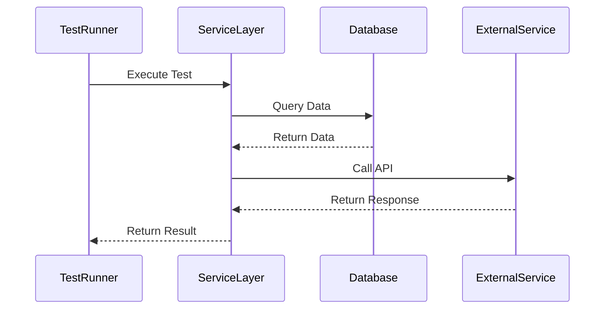

## 15.7 Integration Testing

In the realm of software development, integration testing plays a pivotal role in ensuring that individual components of an application work together harmoniously. While unit testing focuses on testing individual components in isolation, integration testing takes a broader approach by examining how these components interact with each other. This section delves into the intricacies of integration testing in C#, providing expert software engineers and enterprise architects with the knowledge and tools needed to master this critical aspect of software quality assurance.

### Testing Component Interactions

Integration testing is all about ensuring that components work together correctly. It involves testing beyond unit boundaries to verify that the interactions between different modules or services produce the desired outcomes. This type of testing is crucial for identifying issues that may not be apparent when testing components in isolation.

#### Ensuring Components Work Together Correctly

When developing complex software systems, it's common for components to depend on each other. These dependencies can be between classes, modules, or even external services. Integration testing aims to validate that these dependencies are correctly implemented and that the components interact as expected.

Consider a scenario where you have a web application with a service layer that interacts with a database. While unit tests can verify the functionality of individual methods within the service layer, integration tests are needed to ensure that the service layer correctly retrieves and manipulates data from the database.

#### Testing Beyond Unit Boundaries

Unit tests are limited to testing individual components in isolation, often using mocks or stubs to simulate dependencies. However, integration tests go beyond these boundaries by testing the actual interactions between components. This approach helps identify issues related to data flow, communication protocols, and overall system behavior.

For example, in a microservices architecture, integration tests can verify that different services communicate correctly over HTTP or messaging protocols. These tests ensure that data is correctly serialized and deserialized, and that the services handle errors gracefully.

### Mocking External Dependencies

One of the challenges of integration testing is dealing with external dependencies, such as databases, third-party APIs, or external services. These dependencies can introduce variability and complexity into the testing process. To address this, integration tests often use mocking techniques to isolate the system under test from these external dependencies.

#### Isolating Integration Tests from External Systems

Mocking allows you to simulate the behavior of external systems, enabling you to test your application in a controlled environment. By isolating integration tests from external systems, you can ensure that tests are repeatable and not affected by external factors such as network latency or service availability.

In C#, popular libraries like Moq and NSubstitute provide powerful tools for creating mock objects. These libraries allow you to define the expected behavior of external dependencies, ensuring that your tests focus on the interactions within your application.

#### Using Test Doubles for Databases and Services

Test doubles, such as mocks, stubs, and fakes, are invaluable tools for integration testing. They allow you to simulate the behavior of complex systems, such as databases and external services, without relying on the actual systems.

For example, when testing a service layer that interacts with a database, you can use a mock database to simulate database operations. This approach ensures that your tests are not dependent on the state of a real database, making them more reliable and easier to maintain.

### Use Cases and Examples

To illustrate the concepts discussed, let's explore some practical use cases and examples of integration testing in C#.

#### Testing Database Interactions

Testing database interactions is a common use case for integration testing. It involves verifying that your application correctly interacts with the database, including executing queries, handling transactions, and managing connections.

Consider a simple C# application with a service layer that retrieves data from a SQL database. An integration test for this scenario might involve setting up a test database, populating it with test data, and verifying that the service layer retrieves the correct data.

```csharp
using System;
using System.Data.SqlClient;
using Xunit;

public class DatabaseIntegrationTests
{
    private readonly string _connectionString = "YourConnectionStringHere";

    [Fact]
    public void TestRetrieveData()
    {
        using (var connection = new SqlConnection(_connectionString))
        {
            connection.Open();
            var command = new SqlCommand("SELECT * FROM Users WHERE Id = 1", connection);
            using (var reader = command.ExecuteReader())
            {
                Assert.True(reader.Read());
                Assert.Equal("John Doe", reader["Name"]);
            }
        }
    }
}
```

In this example, the integration test verifies that the service layer correctly retrieves a user with the name "John Doe" from the database. By using a test database, you can ensure that the test is isolated from the production environment.

#### Service Layer Integration Tests

Service layer integration tests focus on verifying the interactions between different services or components within your application. These tests are particularly important in distributed systems, where services communicate over networks.

Consider a microservices architecture where a service layer interacts with multiple external services. An integration test for this scenario might involve mocking the external services and verifying that the service layer correctly handles responses and errors.

```csharp
using System.Net.Http;
using System.Threading.Tasks;
using Moq;
using Xunit;

public class ServiceLayerIntegrationTests
{
    [Fact]
    public async Task TestServiceInteraction()
    {
        var httpClientMock = new Mock<HttpClient>();
        httpClientMock.Setup(client => client.GetAsync(It.IsAny<string>()))
                      .ReturnsAsync(new HttpResponseMessage
                      {
                          StatusCode = System.Net.HttpStatusCode.OK,
                          Content = new StringContent("{\"result\":\"success\"}")
                      });

        var service = new MyService(httpClientMock.Object);
        var result = await service.CallExternalService();

        Assert.Equal("success", result);
    }
}
```

In this example, the integration test verifies that the service layer correctly interacts with an external service by mocking the HTTP client. This approach ensures that the test is independent of the actual external service and can be run in a controlled environment.

### Visualizing Integration Testing

To better understand the flow of integration testing, let's visualize the process using a sequence diagram. This diagram illustrates the interactions between different components during an integration test.



This sequence diagram shows how the test runner initiates the integration test by executing the service layer. The service layer interacts with both the database and an external service, and the results are returned to the test runner. This visualization highlights the complexity of integration testing and the importance of verifying interactions between components.

### Design Considerations for Integration Testing

When designing integration tests, it's important to consider several factors to ensure that your tests are effective and maintainable.

#### When to Use Integration Testing

Integration testing is most valuable when you need to verify the interactions between components or services. It's particularly useful in scenarios where components have complex dependencies or communicate over networks.

Consider using integration testing in the following situations:

- **Complex Interactions**: When components have complex interactions that cannot be easily tested in isolation.
- **External Dependencies**: When your application relies on external services or databases.
- **Distributed Systems**: In microservices architectures, where services communicate over networks.

#### Important Considerations and Pitfalls

While integration testing is a powerful tool, it also comes with its own set of challenges and pitfalls. Here are some important considerations to keep in mind:

- **Test Environment**: Ensure that your test environment is isolated from production to prevent unintended side effects.
- **Test Data Management**: Use test data that is representative of real-world scenarios, but ensure that it does not interfere with production data.
- **Performance**: Integration tests can be slower than unit tests due to the complexity of interactions. Consider using parallel test execution to improve performance.
- **Maintenance**: Keep your tests maintainable by using clear naming conventions and organizing tests logically.

### Differences and Similarities with Other Testing Types

Integration testing is often compared to other types of testing, such as unit testing and system testing. Understanding the differences and similarities can help you choose the right testing strategy for your application.

- **Unit Testing vs. Integration Testing**: Unit testing focuses on testing individual components in isolation, while integration testing verifies the interactions between components. Both types of testing are complementary and should be used together to ensure comprehensive test coverage.
- **Integration Testing vs. System Testing**: System testing involves testing the entire system as a whole, including all components and interactions. Integration testing, on the other hand, focuses on specific interactions between components. System testing is typically performed after integration testing to ensure that the entire system functions correctly.

### Try It Yourself

To reinforce your understanding of integration testing, try modifying the code examples provided in this section. Experiment with different scenarios, such as adding new components or changing the behavior of external dependencies. This hands-on approach will help you gain a deeper understanding of integration testing and its role in software development.

### References and Further Reading

For more information on integration testing and related topics, consider exploring the following resources:

- [Microsoft Docs: Integration Testing in ASP.NET Core](https://docs.microsoft.com/en-us/aspnet/core/test/integration-tests)
- [xUnit Documentation](https://xunit.net/)
- [Moq Documentation](https://github.com/moq/moq4/wiki/Quickstart)

### Knowledge Check

Before moving on to the next section, take a moment to review the key concepts covered in this section. Consider the following questions:

- What is the primary goal of integration testing?
- How does integration testing differ from unit testing?
- What are some common challenges associated with integration testing?
- How can mocking be used to isolate integration tests from external dependencies?

### Embrace the Journey

Remember, mastering integration testing is a journey. As you continue to explore this topic, keep experimenting, stay curious, and enjoy the process of learning. Integration testing is a powerful tool that can significantly enhance the quality and reliability of your software. By understanding and applying the concepts covered in this section, you'll be well-equipped to tackle the challenges of integration testing in your own projects.

## Quiz Time!



### What is the primary goal of integration testing?

- [x] To ensure components work together correctly
- [ ] To test individual components in isolation
- [ ] To verify the entire system as a whole
- [ ] To test the user interface

> **Explanation:** Integration testing focuses on verifying that components interact correctly with each other, ensuring seamless integration within the system.

### How does integration testing differ from unit testing?

- [x] Integration testing verifies interactions between components
- [ ] Integration testing focuses on individual components
- [ ] Integration testing is performed before unit testing
- [ ] Integration testing only tests the user interface

> **Explanation:** Integration testing examines the interactions between components, while unit testing focuses on testing individual components in isolation.

### What is a common challenge associated with integration testing?

- [x] Dealing with external dependencies
- [ ] Testing individual methods
- [ ] Writing test cases
- [ ] Designing user interfaces

> **Explanation:** Integration testing often involves dealing with external dependencies, such as databases or external services, which can introduce complexity and variability.

### How can mocking be used in integration testing?

- [x] To isolate tests from external dependencies
- [ ] To test individual components
- [ ] To verify user interfaces
- [ ] To test the entire system

> **Explanation:** Mocking allows you to simulate the behavior of external dependencies, isolating integration tests from these dependencies and ensuring repeatability.

### When is integration testing most valuable?

- [x] When components have complex interactions
- [ ] When testing individual components
- [ ] When designing user interfaces
- [ ] When writing documentation

> **Explanation:** Integration testing is particularly valuable when components have complex interactions that cannot be easily tested in isolation.

### What is a test double?

- [x] A simulated object used in testing
- [ ] A real object used in testing
- [ ] A user interface component
- [ ] A database schema

> **Explanation:** A test double is a simulated object used in testing to mimic the behavior of real objects, such as databases or external services.

### What is the role of a sequence diagram in integration testing?

- [x] To visualize interactions between components
- [ ] To test individual components
- [ ] To verify user interfaces
- [ ] To design database schemas

> **Explanation:** Sequence diagrams are used to visualize the interactions between components during integration testing, helping to understand the flow of data and communication.

### What is a key consideration when designing integration tests?

- [x] Ensuring the test environment is isolated from production
- [ ] Writing test cases for individual methods
- [ ] Designing user interfaces
- [ ] Creating database schemas

> **Explanation:** It's important to ensure that the test environment is isolated from production to prevent unintended side effects during integration testing.

### What is the difference between integration testing and system testing?

- [x] Integration testing focuses on specific interactions, while system testing tests the entire system
- [ ] Integration testing tests the entire system, while system testing focuses on specific interactions
- [ ] Integration testing is performed after system testing
- [ ] Integration testing only tests the user interface

> **Explanation:** Integration testing focuses on specific interactions between components, while system testing involves testing the entire system as a whole.

### True or False: Integration testing is only necessary in microservices architectures.

- [ ] True
- [x] False

> **Explanation:** Integration testing is valuable in any architecture where components interact with each other, not just in microservices architectures.


