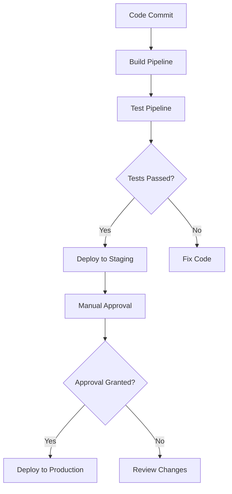

## 15.8 Continuous Integration and Delivery (CI/CD)

Continuous Integration and Delivery (CI/CD) is a cornerstone of modern software development, enabling teams to deliver high-quality software rapidly and reliably. In this section, we will delve into the principles and practices of CI/CD, focusing on automating builds, tests, and deployments in C# projects. We will explore tools like Azure DevOps and Jenkins, and discuss strategies for implementing zero-downtime deployments. By the end of this guide, you'll have a comprehensive understanding of how to enhance your development workflow with CI/CD.

### Introduction to CI/CD

Continuous Integration (CI) and Continuous Delivery (CD) are practices that aim to improve software development processes by automating the integration and deployment of code changes. CI focuses on integrating code changes frequently and automatically testing them to detect issues early. CD extends this by automating the deployment of code changes to production environments, ensuring that software can be released at any time.

#### Key Concepts

- **Continuous Integration (CI):** Automates the process of integrating code changes from multiple contributors into a shared repository. It involves automated testing to ensure that new changes do not break existing functionality.
- **Continuous Delivery (CD):** Automates the deployment of code changes to production-like environments. It ensures that the software is always in a releasable state.
- **Continuous Deployment:** An extension of CD where every change that passes automated tests is automatically deployed to production.

### Automating Builds and Tests

Automating builds and tests is a critical aspect of CI/CD. It ensures that code changes are consistently built and tested, reducing the risk of integration issues.

#### Using Tools like Azure DevOps and Jenkins

**Azure DevOps** and **Jenkins** are popular tools for implementing CI/CD pipelines. They provide robust features for automating builds, tests, and deployments.

- **Azure DevOps:** A cloud-based service that offers a comprehensive suite of tools for CI/CD, including Azure Pipelines for automating builds and deployments.
- **Jenkins:** An open-source automation server that supports building, deploying, and automating software projects.

#### Setting Up Build Pipelines

A build pipeline automates the process of compiling code, running tests, and producing build artifacts. Here's how to set up a basic build pipeline using Azure DevOps:

1. **Create a New Pipeline:**
   - Navigate to Azure DevOps and select your project.
   - Go to Pipelines > New Pipeline.
   - Choose the source repository (e.g., GitHub, Azure Repos).

2. **Define the Pipeline Configuration:**
   - Use a YAML file to define the pipeline configuration.
   - Specify the build steps, such as restoring dependencies, building the project, and running tests.

   ```yaml
   trigger:
     branches:
       include:
         - main

   pool:
     vmImage: 'windows-latest'

   steps:
   - task: UseDotNet@2
     inputs:
       packageType: 'sdk'
       version: '6.x'

   - script: dotnet restore
     displayName: 'Restore dependencies'

   - script: dotnet build --configuration Release
     displayName: 'Build project'

   - script: dotnet test --no-build --verbosity normal
     displayName: 'Run tests'
   ```

3. **Run the Pipeline:**
   - Save and run the pipeline to initiate the build process.
   - Monitor the pipeline's progress and review the results.

### Deployment Pipelines

Deployment pipelines automate the process of deploying code changes to various environments, such as staging and production.

#### Implementing Continuous Deployment

Continuous Deployment automates the release of code changes to production. It requires a robust testing strategy to ensure that only high-quality code is deployed.

- **Automated Testing:** Implement comprehensive automated tests to validate code changes.
- **Approval Gates:** Use approval gates to require manual approval before deploying to production.

#### Strategies for Zero-Downtime Deployments

Zero-downtime deployments ensure that applications remain available during updates. Here are some strategies to achieve this:

- **Blue-Green Deployment:** Maintain two identical environments (blue and green). Deploy new changes to the inactive environment and switch traffic to it once validated.
- **Canary Releases:** Gradually roll out changes to a small subset of users before a full deployment.
- **Feature Toggles:** Use feature toggles to enable or disable features without deploying new code.

### Use Cases and Examples

CI/CD enhances development workflows by automating repetitive tasks and reducing manual intervention. Let's explore some real-world examples of CI/CD pipelines.

#### Enhancing Development Workflow with CI/CD

CI/CD pipelines streamline the development process by automating builds, tests, and deployments. This leads to faster feedback, improved collaboration, and higher software quality.

- **Example 1: Web Application Development**
  - Automate the build and deployment of a web application using Azure DevOps.
  - Use automated tests to validate code changes and ensure quality.

- **Example 2: Microservices Architecture**
  - Implement CI/CD pipelines for each microservice to enable independent deployment.
  - Use Docker containers to package and deploy microservices consistently.

#### Real-World Examples of CI/CD Pipelines

Let's look at a real-world example of a CI/CD pipeline for a C# application using Jenkins:

1. **Configure Jenkins:**
   - Install Jenkins and configure it with necessary plugins (e.g., Git, MSBuild).

2. **Create a Jenkins Pipeline:**
   - Define a Jenkinsfile to specify the pipeline stages.

   ```groovy
   pipeline {
       agent any

       stages {
           stage('Checkout') {
               steps {
                   git 'https://github.com/your-repo/your-project.git'
               }
           }
           stage('Build') {
               steps {
                   bat 'dotnet build --configuration Release'
               }
           }
           stage('Test') {
               steps {
                   bat 'dotnet test --no-build --verbosity normal'
               }
           }
           stage('Deploy') {
               steps {
                   // Deployment steps here
               }
           }
       }
   }
   ```

3. **Run the Pipeline:**
   - Trigger the pipeline manually or set up webhooks for automatic triggering.
   - Monitor the pipeline's progress and review the results.

### Visualizing CI/CD Pipelines

To better understand CI/CD pipelines, let's visualize a typical CI/CD workflow using a flowchart.



**Figure 1:** A typical CI/CD workflow showing the stages from code commit to production deployment.

### Knowledge Check

To reinforce your understanding of CI/CD, consider the following questions:

- What are the key differences between Continuous Integration and Continuous Delivery?
- How do tools like Azure DevOps and Jenkins facilitate CI/CD?
- What strategies can be used to achieve zero-downtime deployments?

### Embrace the Journey

Remember, mastering CI/CD is a journey. As you progress, you'll discover new tools and techniques to enhance your development workflow. Keep experimenting, stay curious, and enjoy the journey!

### References and Links

For further reading on CI/CD, consider the following resources:

- [Azure DevOps Documentation](https://docs.microsoft.com/en-us/azure/devops/)
- [Jenkins Documentation](https://www.jenkins.io/doc/)
- [Continuous Integration and Delivery: A Quickstart Guide](https://martinfowler.com/articles/continuousIntegration.html)

## Quiz Time!



### What is the primary goal of Continuous Integration (CI)?

- [x] To automate the integration and testing of code changes
- [ ] To automate the deployment of code changes to production
- [ ] To manually test code changes
- [ ] To deploy code changes without testing

> **Explanation:** Continuous Integration focuses on automating the integration and testing of code changes to detect issues early.

### Which tool is commonly used for CI/CD in C# development?

- [x] Azure DevOps
- [ ] Microsoft Word
- [ ] Photoshop
- [ ] Excel

> **Explanation:** Azure DevOps is a popular tool for implementing CI/CD pipelines in C# development.

### What is a key benefit of using CI/CD pipelines?

- [x] Faster feedback and improved collaboration
- [ ] Increased manual intervention
- [ ] Slower deployment times
- [ ] Reduced software quality

> **Explanation:** CI/CD pipelines provide faster feedback and improve collaboration, leading to higher software quality.

### What is a zero-downtime deployment strategy?

- [x] A deployment strategy that ensures applications remain available during updates
- [ ] A deployment strategy that requires downtime during updates
- [ ] A deployment strategy that skips testing
- [ ] A deployment strategy that only works for small applications

> **Explanation:** Zero-downtime deployment strategies ensure that applications remain available during updates.

### Which of the following is a zero-downtime deployment strategy?

- [x] Blue-Green Deployment
- [ ] Manual Deployment
- [x] Canary Releases
- [ ] Downtime Deployment

> **Explanation:** Blue-Green Deployment and Canary Releases are strategies for zero-downtime deployments.

### What is the purpose of a build pipeline?

- [x] To automate the process of compiling code, running tests, and producing build artifacts
- [ ] To manually compile code
- [ ] To skip testing
- [ ] To deploy code without building

> **Explanation:** A build pipeline automates the process of compiling code, running tests, and producing build artifacts.

### What is the role of automated testing in CI/CD?

- [x] To validate code changes and ensure quality
- [ ] To skip testing
- [x] To detect issues early
- [ ] To manually test code changes

> **Explanation:** Automated testing validates code changes and ensures quality, detecting issues early in the process.

### What is the difference between Continuous Delivery and Continuous Deployment?

- [x] Continuous Delivery requires manual approval before deployment, while Continuous Deployment does not
- [ ] Continuous Deployment requires manual approval before deployment, while Continuous Delivery does not
- [ ] Both require manual approval before deployment
- [ ] Neither requires manual approval before deployment

> **Explanation:** Continuous Delivery requires manual approval before deployment, while Continuous Deployment automates the entire process.

### How can feature toggles be used in CI/CD?

- [x] To enable or disable features without deploying new code
- [ ] To manually deploy features
- [ ] To skip testing
- [ ] To require downtime during updates

> **Explanation:** Feature toggles allow enabling or disabling features without deploying new code, facilitating CI/CD.

### True or False: CI/CD pipelines can only be used for web applications.

- [x] False
- [ ] True

> **Explanation:** CI/CD pipelines can be used for various types of applications, not just web applications.


