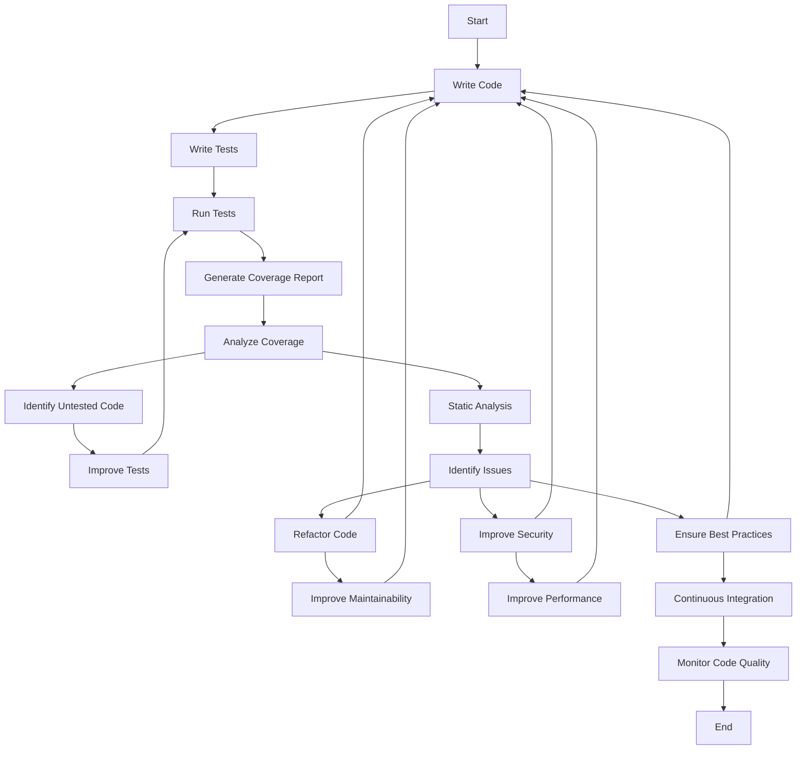

## 15.9 Code Coverage and Static Analysis

In the realm of software development, ensuring that your code is both functional and maintainable is paramount. Two critical practices that help achieve this are code coverage and static analysis. These practices are essential for expert software engineers and enterprise architects who aim to deliver high-quality C# applications. In this section, we will delve into the intricacies of measuring test coverage, utilizing static analysis tools, and understanding their impact on code quality and maintainability.

### Measuring Test Coverage

Test coverage is a metric used to determine how much of your codebase is exercised by your tests. It provides insights into the effectiveness of your test suite and helps identify untested parts of your application. Let's explore the tools and techniques for measuring test coverage in C#.

#### Tools for Measuring Test Coverage

Several tools are available for measuring test coverage in C#. Two popular ones are **Coverlet** and **OpenCover**.

1. **Coverlet**: Coverlet is a cross-platform code coverage library for .NET Core, with support for line, branch, and method coverage. It integrates seamlessly with popular testing frameworks like xUnit, NUnit, and MSTest.

   - **Installation**: You can add Coverlet to your project using the NuGet package manager:
     ```shell
     dotnet add package coverlet.msbuild
     ```

   - **Usage**: To run tests with coverage, use the following command:
     ```shell
     dotnet test /p:CollectCoverage=true
     ```

   - **Output**: Coverlet generates a coverage report in various formats, including JSON, XML, and LCOV, which can be used with CI/CD pipelines and coverage visualization tools.

2. **OpenCover**: OpenCover is another tool for measuring code coverage in .NET Framework applications. It provides detailed coverage reports and integrates with tools like ReportGenerator for visualizing results.

   - **Installation**: OpenCover can be installed via Chocolatey:
     ```shell
     choco install opencover
     ```

   - **Usage**: To collect coverage data, execute the following command:
     ```shell
     OpenCover.Console.exe -target:"C:\path\to\test\runner.exe" -targetargs:"C:\path\to\test\assembly.dll"
     ```

   - **Output**: OpenCover produces an XML report that can be processed by visualization tools to generate human-readable reports.

#### Analyzing Coverage Reports

Once you have generated coverage reports, the next step is to analyze them to gain insights into your test suite's effectiveness.

- **Coverage Metrics**: Focus on key metrics such as line coverage, branch coverage, and method coverage. These metrics help identify untested code paths and potential areas for improvement.

- **Visualization Tools**: Use tools like ReportGenerator to convert raw coverage data into interactive HTML reports. These reports provide a visual representation of coverage metrics, making it easier to identify gaps.

- **Continuous Integration**: Integrate coverage analysis into your CI/CD pipeline to ensure that coverage metrics are consistently monitored and maintained. This practice helps prevent coverage regression over time.

### Using Static Analysis Tools

Static analysis involves examining your code for potential issues without executing it. This practice helps identify code smells, potential bugs, and areas for improvement early in the development process. Let's explore some popular static analysis tools for C#.

#### Analyzing Code Quality with Static Analysis Tools

1. **SonarQube**: SonarQube is a powerful tool for continuous inspection of code quality. It provides detailed insights into code smells, bugs, vulnerabilities, and code duplications.

   - **Installation**: SonarQube can be installed on a server or used as a cloud service. It requires a database and a SonarQube scanner to analyze projects.

   - **Usage**: Configure your project with a `sonar-project.properties` file and run the analysis using the SonarQube scanner:
     ```shell
     sonar-scanner
     ```

   - **Output**: SonarQube generates a comprehensive dashboard with metrics, issues, and trends, allowing you to track code quality over time.

2. **ReSharper**: ReSharper is a popular extension for Visual Studio that provides code analysis, refactoring, and navigation features. It helps identify code smells, potential issues, and offers suggestions for improvement.

   - **Installation**: ReSharper can be installed via the Visual Studio Marketplace.

   - **Usage**: ReSharper integrates directly into Visual Studio, providing real-time feedback as you write code. It highlights issues and offers quick fixes to improve code quality.

   - **Output**: ReSharper provides a detailed analysis report with suggestions for refactoring and improving code quality.

#### Identifying Potential Issues Early

Static analysis tools help identify potential issues early in the development process, reducing the risk of bugs and improving code maintainability.

- **Code Smells**: Detect code smells such as long methods, large classes, and duplicated code. Addressing these issues improves code readability and maintainability.

- **Security Vulnerabilities**: Identify potential security vulnerabilities, such as SQL injection and cross-site scripting (XSS), and take corrective actions to secure your application.

- **Best Practices**: Ensure adherence to coding standards and best practices by configuring rules and guidelines in your static analysis tools.

### Use Cases and Examples

Let's explore some practical use cases and examples of how code coverage and static analysis can improve code quality and maintainability.

#### Improving Code Quality and Maintainability

1. **Refactoring Legacy Code**: Use static analysis tools to identify code smells and areas for improvement in legacy codebases. Refactor code to improve readability, maintainability, and performance.

2. **Ensuring Test Coverage**: Use coverage tools to ensure that critical parts of your application are tested. Aim for high coverage metrics to reduce the risk of bugs and regressions.

3. **Continuous Quality Monitoring**: Integrate static analysis and coverage tools into your CI/CD pipeline to continuously monitor code quality. This practice ensures that code quality is maintained throughout the development lifecycle.

4. **Security Audits**: Use static analysis tools to perform security audits and identify potential vulnerabilities. Address security issues early to prevent exploitation in production environments.

### Try It Yourself

To reinforce your understanding of code coverage and static analysis, try the following exercises:

1. **Experiment with Coverlet**: Set up a new C# project and add Coverlet for test coverage analysis. Write unit tests and analyze the coverage report to identify untested code paths.

2. **Explore SonarQube**: Set up a SonarQube server and analyze a C# project. Review the dashboard and address identified issues to improve code quality.

3. **Refactor with ReSharper**: Use ReSharper to analyze a C# project and refactor code based on its suggestions. Focus on improving code readability and maintainability.

### Visualizing Code Coverage and Static Analysis

To better understand the workflow of code coverage and static analysis, let's visualize the process using a flowchart.



**Diagram Description**: This flowchart illustrates the iterative process of writing code, writing tests, running tests, generating coverage reports, analyzing coverage, and using static analysis to identify and address issues. The process emphasizes continuous improvement and integration to maintain high code quality.

### References and Links

For further reading and exploration, consider the following resources:

- [Coverlet Documentation](https://github.com/coverlet-coverage/coverlet)
- [OpenCover Documentation](https://github.com/OpenCover/opencover)
- [SonarQube Documentation](https://www.sonarqube.org/documentation/)
- [ReSharper Documentation](https://www.jetbrains.com/resharper/documentation/)

### Knowledge Check

To reinforce your understanding of code coverage and static analysis, consider the following questions and challenges:

1. **What are the key metrics to focus on when analyzing coverage reports?**
2. **How can static analysis tools help improve code maintainability?**
3. **What are some common code smells that static analysis tools can detect?**
4. **How can you integrate coverage and static analysis tools into a CI/CD pipeline?**
5. **What are the benefits of using tools like SonarQube and ReSharper in C# development?**

### Embrace the Journey

Remember, mastering code coverage and static analysis is an ongoing journey. As you progress, you'll gain deeper insights into your codebase, improve code quality, and deliver more reliable applications. Keep experimenting, stay curious, and enjoy the journey!

## Quiz Time!



### What is the primary purpose of measuring test coverage?

- [x] To determine how much of the codebase is exercised by tests
- [ ] To identify security vulnerabilities
- [ ] To refactor legacy code
- [ ] To improve code readability

> **Explanation:** Test coverage measures how much of the codebase is exercised by tests, providing insights into the effectiveness of the test suite.

### Which tool is commonly used for measuring code coverage in .NET Core applications?

- [x] Coverlet
- [ ] SonarQube
- [ ] ReSharper
- [ ] OpenCover

> **Explanation:** Coverlet is a popular tool for measuring code coverage in .NET Core applications.

### What type of issues can static analysis tools help identify?

- [x] Code smells and potential bugs
- [ ] Test coverage gaps
- [ ] Performance bottlenecks
- [ ] User interface design issues

> **Explanation:** Static analysis tools help identify code smells, potential bugs, and areas for improvement in the code.

### How can SonarQube be used in a C# project?

- [x] By configuring a `sonar-project.properties` file and running the SonarQube scanner
- [ ] By installing it as a Visual Studio extension
- [ ] By integrating it with Coverlet
- [ ] By using it to generate test coverage reports

> **Explanation:** SonarQube is used by configuring a `sonar-project.properties` file and running the SonarQube scanner to analyze the project.

### What is a common benefit of integrating static analysis into a CI/CD pipeline?

- [x] Continuous monitoring of code quality
- [ ] Faster test execution
- [ ] Improved user interface design
- [ ] Enhanced database performance

> **Explanation:** Integrating static analysis into a CI/CD pipeline ensures continuous monitoring of code quality.

### Which tool provides real-time feedback as you write code in Visual Studio?

- [x] ReSharper
- [ ] Coverlet
- [ ] SonarQube
- [ ] OpenCover

> **Explanation:** ReSharper provides real-time feedback as you write code in Visual Studio, highlighting issues and offering quick fixes.

### What is a key metric to focus on when analyzing coverage reports?

- [x] Line coverage
- [ ] Code smells
- [ ] Security vulnerabilities
- [ ] User interface design

> **Explanation:** Line coverage is a key metric that indicates how much of the code is executed by tests.

### How can static analysis tools help improve security?

- [x] By identifying potential security vulnerabilities
- [ ] By increasing test coverage
- [ ] By refactoring code
- [ ] By optimizing database queries

> **Explanation:** Static analysis tools can identify potential security vulnerabilities, allowing developers to address them early.

### What is a common code smell that static analysis tools can detect?

- [x] Long methods
- [ ] High test coverage
- [ ] Fast execution time
- [ ] User-friendly interface

> **Explanation:** Long methods are a common code smell that static analysis tools can detect, indicating a need for refactoring.

### True or False: Code coverage and static analysis are only useful during the initial development phase.

- [ ] True
- [x] False

> **Explanation:** Code coverage and static analysis are useful throughout the development lifecycle, including maintenance and refactoring phases.


