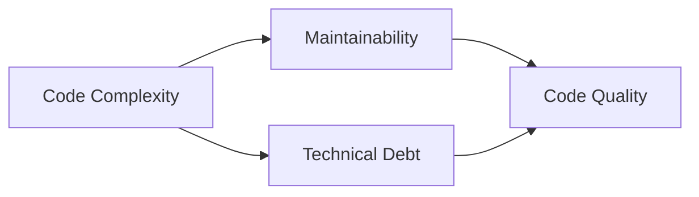

## 16.1 Definition and Impact of Anti-Patterns

In the realm of software development, the concept of design patterns is well-celebrated for providing reusable solutions to common problems. However, not all recurring solutions are beneficial. Enter anti-patterns: the proverbial wolves in sheep's clothing. Anti-patterns are solutions that initially appear to solve a problem but ultimately lead to negative consequences, such as increased complexity, reduced maintainability, and poor performance. In this section, we will delve into the definition and impact of anti-patterns, particularly in the context of C# development, and explore how to recognize and refactor them.

### What Are Anti-Patterns?

Anti-patterns are common responses to recurring problems that are ineffective and counterproductive. Unlike design patterns, which are proven and effective solutions, anti-patterns often emerge from a lack of understanding, poor design choices, or misapplication of design principles. They can manifest in various forms, such as code smells, architectural flaws, or process inefficiencies.

#### Key Characteristics of Anti-Patterns

1. **Superficial Appeal**: Anti-patterns often seem like quick fixes or easy solutions, making them attractive to developers under pressure.
2. **Negative Consequences**: Over time, anti-patterns lead to increased technical debt, making systems harder to maintain and evolve.
3. **Common Occurrence**: Anti-patterns are frequently encountered in software projects, especially those lacking rigorous design and review processes.

### Recognizing Anti-Patterns in Code

Identifying anti-patterns is crucial for maintaining high-quality code. Here are some common signs that an anti-pattern might be present:

- **Code Smells**: Indicators such as duplicated code, large classes, and long methods can signal deeper issues.
- **High Complexity**: Code that is difficult to understand or modify often harbors anti-patterns.
- **Frequent Bugs**: Persistent defects in certain areas of the codebase may point to flawed design choices.
- **Poor Performance**: Inefficient algorithms or resource management can be symptomatic of anti-patterns.

### Common Anti-Patterns in C#

Let's explore some prevalent anti-patterns in C# development, their impacts, and how to address them.

#### 1. The God Object

**Definition**: A God Object is a class that knows too much or does too much. It centralizes the responsibilities of many classes, leading to a violation of the Single Responsibility Principle (SRP).

**Impact**: This anti-pattern results in a tightly coupled system, making it difficult to modify or extend the code without affecting multiple areas.

**Solution**: Refactor the God Object by identifying distinct responsibilities and distributing them across smaller, more focused classes.

```csharp
// Before refactoring: God Object
public class GodObject
{
    public void ManageUserAccounts() { /* ... */ }
    public void ProcessPayments() { /* ... */ }
    public void GenerateReports() { /* ... */ }
}

// After refactoring: Separate classes for distinct responsibilities
public class UserAccountManager
{
    public void ManageUserAccounts() { /* ... */ }
}

public class PaymentProcessor
{
    public void ProcessPayments() { /* ... */ }
}

public class ReportGenerator
{
    public void GenerateReports() { /* ... */ }
}
```

#### 2. The Spaghetti Code

**Definition**: Spaghetti Code is a disorganized and tangled code structure, often resulting from a lack of planning or adherence to coding standards.

**Impact**: It leads to code that is difficult to follow, test, and maintain, increasing the likelihood of introducing bugs during modifications.

**Solution**: Adopt clean coding practices, such as consistent naming conventions, modular design, and comprehensive documentation.

```csharp
// Example of Spaghetti Code
public void ProcessData()
{
    // Complex logic with no clear structure
    if (condition1)
    {
        // Nested logic
        if (condition2)
        {
            // More nested logic
        }
    }
    else
    {
        // Alternative logic
    }
}

// Refactored code with clear structure
public void ProcessData()
{
    if (IsConditionMet())
    {
        HandleConditionMet();
    }
    else
    {
        HandleConditionNotMet();
    }
}

private bool IsConditionMet() { /* ... */ }
private void HandleConditionMet() { /* ... */ }
private void HandleConditionNotMet() { /* ... */ }
```

#### 3. The Golden Hammer

**Definition**: The Golden Hammer is an anti-pattern where a familiar technology or solution is applied to every problem, regardless of its suitability.

**Impact**: This leads to suboptimal solutions, as the chosen technology may not be the best fit for the problem at hand.

**Solution**: Evaluate each problem individually and choose the most appropriate technology or design pattern.

```csharp
// Example of Golden Hammer: Using a database for everything
public class DataManager
{
    public void SaveData(object data)
    {
        // Always using a database, even for simple data
        Database.Save(data);
    }
}

// Refactored: Use appropriate storage based on data type
public class DataManager
{
    public void SaveData(object data)
    {
        if (data is SimpleData)
        {
            FileStorage.Save(data);
        }
        else
        {
            Database.Save(data);
        }
    }
}
```

### Visualizing Anti-Patterns

To better understand the impact of anti-patterns, let's visualize the relationship between code complexity and maintainability.



**Diagram Explanation**: As code complexity increases, maintainability decreases, leading to higher technical debt and lower code quality. Anti-patterns exacerbate this relationship by introducing unnecessary complexity.

### The Impact of Anti-Patterns

The presence of anti-patterns in a codebase can have far-reaching consequences:

1. **Increased Maintenance Costs**: Anti-patterns make code harder to understand and modify, leading to higher maintenance costs over time.
2. **Reduced Agility**: A codebase riddled with anti-patterns is less adaptable to change, hindering the ability to respond to new requirements or market conditions.
3. **Lowered Team Morale**: Working with poorly structured code can be frustrating for developers, leading to decreased job satisfaction and productivity.
4. **Higher Risk of Bugs**: Anti-patterns often introduce hidden defects that can manifest as bugs, impacting the reliability of the software.

### Strategies for Avoiding Anti-Patterns

To prevent anti-patterns from creeping into your codebase, consider the following strategies:

- **Adopt Best Practices**: Follow established coding standards and design principles, such as SOLID and DRY (Don't Repeat Yourself).
- **Conduct Code Reviews**: Regularly review code with peers to catch potential anti-patterns early.
- **Invest in Training**: Provide ongoing education for developers to stay current with best practices and emerging technologies.
- **Encourage Refactoring**: Allocate time for refactoring to improve code quality and eliminate anti-patterns.

### Refactoring Anti-Patterns

Refactoring is the process of restructuring existing code without changing its external behavior. It is a powerful tool for eliminating anti-patterns and improving code quality.

#### Steps for Refactoring

1. **Identify the Anti-Pattern**: Use code analysis tools and peer reviews to detect anti-patterns.
2. **Plan the Refactor**: Develop a strategy for addressing the anti-pattern, considering the impact on the codebase.
3. **Implement Changes**: Make incremental changes, testing thoroughly to ensure functionality is preserved.
4. **Review and Iterate**: Continuously review the refactored code and make further improvements as needed.

### Try It Yourself

To solidify your understanding of anti-patterns, try the following exercises:

1. **Identify Anti-Patterns**: Review a piece of legacy code and identify any anti-patterns present. Document your findings and propose refactoring strategies.
2. **Refactor Code**: Take a small section of code exhibiting an anti-pattern and refactor it to improve its structure and maintainability.
3. **Create a Code Smell Checklist**: Develop a checklist of common code smells and use it to evaluate your own codebase.

### Conclusion

Understanding and addressing anti-patterns is crucial for maintaining a high-quality codebase. By recognizing the signs of anti-patterns and employing effective refactoring techniques, you can improve code maintainability, reduce technical debt, and enhance overall software quality. Remember, the journey to mastering design patterns and avoiding anti-patterns is ongoing. Stay curious, keep learning, and embrace the challenge of continuous improvement.

## Quiz Time!



### What is an anti-pattern?

- [x] A common but ineffective solution to a recurring problem
- [ ] A proven solution to a common problem
- [ ] A design pattern used in software architecture
- [ ] A type of algorithm

> **Explanation:** An anti-pattern is a common response to a recurring problem that is ineffective and counterproductive.

### Which of the following is a characteristic of anti-patterns?

- [x] They often appear as quick fixes
- [ ] They are always beneficial in the long term
- [ ] They simplify code maintenance
- [ ] They are recommended by design pattern experts

> **Explanation:** Anti-patterns often seem like quick fixes but lead to negative consequences over time.

### What is the impact of the God Object anti-pattern?

- [x] It leads to a tightly coupled system
- [ ] It improves code readability
- [ ] It enhances system performance
- [ ] It simplifies debugging

> **Explanation:** The God Object anti-pattern results in a tightly coupled system, making it difficult to modify or extend the code.

### How can the Golden Hammer anti-pattern be avoided?

- [x] By evaluating each problem individually and choosing the most appropriate solution
- [ ] By using the same technology for all problems
- [ ] By avoiding the use of design patterns
- [ ] By focusing solely on performance optimization

> **Explanation:** The Golden Hammer anti-pattern can be avoided by evaluating each problem individually and choosing the most appropriate technology or design pattern.

### What is a common sign of the Spaghetti Code anti-pattern?

- [x] Disorganized and tangled code structure
- [ ] Clear and modular code organization
- [ ] Consistent naming conventions
- [ ] Comprehensive documentation

> **Explanation:** Spaghetti Code is characterized by a disorganized and tangled code structure, making it difficult to follow and maintain.

### What is the first step in refactoring an anti-pattern?

- [x] Identify the anti-pattern
- [ ] Implement changes immediately
- [ ] Review the refactored code
- [ ] Plan the refactor

> **Explanation:** The first step in refactoring an anti-pattern is to identify it using code analysis tools and peer reviews.

### Which strategy can help prevent anti-patterns?

- [x] Conducting regular code reviews
- [ ] Avoiding the use of design principles
- [ ] Ignoring code smells
- [ ] Relying solely on automated testing

> **Explanation:** Conducting regular code reviews can help catch potential anti-patterns early and prevent them from creeping into the codebase.

### What is the impact of anti-patterns on team morale?

- [x] They can decrease job satisfaction and productivity
- [ ] They always boost team morale
- [ ] They simplify team collaboration
- [ ] They have no impact on team morale

> **Explanation:** Working with poorly structured code can be frustrating for developers, leading to decreased job satisfaction and productivity.

### What is the relationship between code complexity and maintainability?

- [x] As code complexity increases, maintainability decreases
- [ ] As code complexity increases, maintainability increases
- [ ] Code complexity has no impact on maintainability
- [ ] Maintainability is independent of code complexity

> **Explanation:** As code complexity increases, maintainability decreases, leading to higher technical debt and lower code quality.

### True or False: Refactoring changes the external behavior of the code.

- [x] False
- [ ] True

> **Explanation:** Refactoring is the process of restructuring existing code without changing its external behavior.


