## 16.2 Common Anti-Patterns in C#

In the realm of software development, anti-patterns are recurring solutions to common problems that are ineffective and counterproductive. They often emerge from well-intentioned but misguided attempts to solve problems, leading to code that is difficult to maintain, scale, or understand. In this section, we will explore some of the most common anti-patterns in C# development, understand their pitfalls, and learn how to avoid them to create robust and maintainable software.

### Spaghetti Code

**Definition:** Spaghetti code refers to a tangled web of control structures and lack of coherent structure in code. It is characterized by complex and convoluted paths through the code, making it difficult to follow and maintain.

**Symptoms:**
- Difficult to read and understand.
- High cyclomatic complexity.
- Frequent use of `goto` statements or deeply nested loops and conditionals.

**Consequences:**
- Increased likelihood of bugs.
- Difficulties in debugging and testing.
- Challenges in extending or modifying the code.

**Solution:**
- Refactor code to improve structure and readability.
- Use design patterns like the State or Strategy pattern to manage complex logic.
- Emphasize modular design and separation of concerns.

**Example:**

```csharp
// Spaghetti Code Example
public void ProcessOrder(Order order)
{
    if (order != null)
    {
        if (order.Status == "Pending")
        {
            // Process payment
            if (order.PaymentMethod == "CreditCard")
            {
                // Process credit card payment
            }
            else if (order.PaymentMethod == "PayPal")
            {
                // Process PayPal payment
            }
            // More nested conditions...
        }
    }
}
```

**Refactored Example Using Strategy Pattern:**

```csharp
// Refactored Code Using Strategy Pattern
public interface IPaymentStrategy
{
    void ProcessPayment(Order order);
}

public class CreditCardPaymentStrategy : IPaymentStrategy
{
    public void ProcessPayment(Order order)
    {
        // Process credit card payment
    }
}

public class PayPalPaymentStrategy : IPaymentStrategy
{
    public void ProcessPayment(Order order)
    {
        // Process PayPal payment
    }
}

public class OrderProcessor
{
    private readonly IPaymentStrategy _paymentStrategy;

    public OrderProcessor(IPaymentStrategy paymentStrategy)
    {
        _paymentStrategy = paymentStrategy;
    }

    public void ProcessOrder(Order order)
    {
        if (order != null && order.Status == "Pending")
        {
            _paymentStrategy.ProcessPayment(order);
        }
    }
}
```

### God Object

**Definition:** A God Object is a class that centralizes too much responsibility, often becoming a bottleneck in the system. It violates the Single Responsibility Principle (SRP) by handling multiple concerns.

**Symptoms:**
- Large classes with many methods and properties.
- High coupling with other classes.
- Frequent changes due to its central role in the system.

**Consequences:**
- Difficulties in understanding and maintaining the class.
- Increased risk of introducing bugs when modifying the class.
- Challenges in testing due to its dependencies.

**Solution:**
- Refactor the class to distribute responsibilities across multiple smaller classes.
- Apply the Single Responsibility Principle and design patterns like the Facade or Mediator pattern.

**Example:**

```csharp
// God Object Example
public class OrderManager
{
    public void CreateOrder() { /* ... */ }
    public void CancelOrder() { /* ... */ }
    public void UpdateInventory() { /* ... */ }
    public void SendNotification() { /* ... */ }
    // Many more responsibilities...
}
```

**Refactored Example Using SRP:**

```csharp
// Refactored Code Using SRP
public class OrderService
{
    public void CreateOrder() { /* ... */ }
    public void CancelOrder() { /* ... */ }
}

public class InventoryService
{
    public void UpdateInventory() { /* ... */ }
}

public class NotificationService
{
    public void SendNotification() { /* ... */ }
}
```

### Golden Hammer

**Definition:** The Golden Hammer anti-pattern occurs when a familiar technology or tool is overused inappropriately, regardless of its suitability for the task at hand.

**Symptoms:**
- Reliance on a single technology for all problems.
- Ignoring better-suited solutions or technologies.
- Resistance to adopting new tools or methodologies.

**Consequences:**
- Suboptimal solutions that may not scale or perform well.
- Increased technical debt due to inappropriate use of technology.
- Missed opportunities for innovation and improvement.

**Solution:**
- Evaluate the suitability of technologies for each specific problem.
- Encourage a culture of learning and experimentation with new tools.
- Use design patterns and principles to guide technology selection.

**Example:**

```csharp
// Golden Hammer Example: Using SQL for everything
public void ProcessData()
{
    // Using SQL for complex data processing that could be better handled by a dedicated data processing tool
    string query = "SELECT * FROM Orders WHERE ...";
    // Execute query and process data
}
```

**Alternative Solution:**

```csharp
// Alternative Solution: Using a dedicated data processing tool
public void ProcessData()
{
    // Use a tool like Apache Spark or a specialized library for complex data processing
    var processedData = DataProcessor.Process(orders);
}
```

### Lava Flow

**Definition:** Lava Flow refers to the retention of outdated or redundant code that remains in the codebase, often due to fear of removing it or lack of understanding.

**Symptoms:**
- Presence of unused or commented-out code.
- Code that is no longer relevant or necessary.
- Lack of documentation or understanding of the code's purpose.

**Consequences:**
- Increased codebase size and complexity.
- Confusion and difficulty in understanding the code.
- Potential for introducing bugs when interacting with outdated code.

**Solution:**
- Regularly review and clean up the codebase.
- Use version control to safely remove unused code.
- Document code to ensure understanding and facilitate future maintenance.

**Example:**

```csharp
// Lava Flow Example: Outdated code
public void ProcessOrder(Order order)
{
    // Old payment processing logic
    // if (order.PaymentMethod == "OldMethod") { /* ... */ }

    // Current payment processing logic
    if (order.PaymentMethod == "NewMethod")
    {
        // Process payment
    }
}
```

**Refactored Example:**

```csharp
// Refactored Code: Cleaned up outdated code
public void ProcessOrder(Order order)
{
    if (order.PaymentMethod == "NewMethod")
    {
        // Process payment
    }
}
```

### Singleton Overuse

**Definition:** Singleton Overuse occurs when the Singleton pattern is misapplied, leading to excessive use of global state and tight coupling.

**Symptoms:**
- Frequent use of singletons throughout the codebase.
- Difficulty in testing due to global state.
- Tight coupling between classes and singletons.

**Consequences:**
- Reduced flexibility and scalability.
- Challenges in testing and mocking.
- Increased risk of concurrency issues.

**Solution:**
- Use dependency injection to manage shared instances.
- Limit the use of singletons to cases where they are truly necessary.
- Consider alternative patterns like the Factory or Service Locator pattern.

**Example:**

```csharp
// Singleton Overuse Example
public class Logger
{
    private static Logger _instance;
    private Logger() { }

    public static Logger Instance
    {
        get
        {
            if (_instance == null)
            {
                _instance = new Logger();
            }
            return _instance;
        }
    }

    public void Log(string message) { /* ... */ }
}
```

**Alternative Solution Using Dependency Injection:**

```csharp
// Alternative Solution: Using Dependency Injection
public interface ILogger
{
    void Log(string message);
}

public class Logger : ILogger
{
    public void Log(string message) { /* ... */ }
}

public class Application
{
    private readonly ILogger _logger;

    public Application(ILogger logger)
    {
        _logger = logger;
    }

    public void Run()
    {
        _logger.Log("Application started.");
    }
}
```

### Copy-Paste Programming

**Definition:** Copy-Paste Programming involves duplicating code instead of reusing components, leading to code redundancy and maintenance challenges.

**Symptoms:**
- Repeated code blocks with minor variations.
- Inconsistent updates across duplicated code.
- Increased codebase size and complexity.

**Consequences:**
- Higher maintenance costs due to duplicated code.
- Increased risk of bugs due to inconsistent updates.
- Difficulty in understanding and managing the codebase.

**Solution:**
- Refactor duplicated code into reusable methods or classes.
- Use design patterns like the Template Method or Strategy pattern to manage variations.
- Emphasize code reuse and modular design.

**Example:**

```csharp
// Copy-Paste Programming Example
public void ProcessCreditCardPayment(Order order)
{
    // Process credit card payment
}

public void ProcessPayPalPayment(Order order)
{
    // Process PayPal payment
}
```

**Refactored Example Using Template Method Pattern:**

```csharp
// Refactored Code Using Template Method Pattern
public abstract class PaymentProcessor
{
    public void ProcessPayment(Order order)
    {
        // Common payment processing logic
        SpecificPaymentProcessing(order);
    }

    protected abstract void SpecificPaymentProcessing(Order order);
}

public class CreditCardPaymentProcessor : PaymentProcessor
{
    protected override void SpecificPaymentProcessing(Order order)
    {
        // Process credit card payment
    }
}

public class PayPalPaymentProcessor : PaymentProcessor
{
    protected override void SpecificPaymentProcessing(Order order)
    {
        // Process PayPal payment
    }
}
```

### Magic Numbers and Strings

**Definition:** Magic Numbers and Strings refer to the use of unexplained literals in code, making it difficult to understand their purpose or significance.

**Symptoms:**
- Presence of hard-coded values without explanation.
- Difficulty in understanding the meaning of literals.
- Challenges in updating or modifying the code.

**Consequences:**
- Increased risk of errors when modifying literals.
- Difficulty in maintaining and understanding the code.
- Lack of flexibility in adapting to changes.

**Solution:**
- Use named constants or enumerations to represent literals.
- Document the purpose and significance of literals.
- Emphasize clarity and readability in code.

**Example:**

```csharp
// Magic Numbers Example
public void ApplyDiscount(Order order)
{
    order.TotalPrice *= 0.9; // Apply 10% discount
}
```

**Refactored Example Using Constants:**

```csharp
// Refactored Code Using Constants
public class DiscountCalculator
{
    private const double DiscountRate = 0.9;

    public void ApplyDiscount(Order order)
    {
        order.TotalPrice *= DiscountRate;
    }
}
```

### Hard Coding

**Definition:** Hard Coding involves embedding configuration data directly in code, reducing flexibility and adaptability.

**Symptoms:**
- Presence of hard-coded values for configuration settings.
- Difficulty in updating or modifying configuration.
- Lack of separation between code and configuration.

**Consequences:**
- Increased maintenance costs due to hard-coded values.
- Difficulty in adapting to different environments or requirements.
- Reduced flexibility and scalability.

**Solution:**
- Use configuration files or environment variables to manage configuration settings.
- Separate code from configuration to improve flexibility.
- Use dependency injection to manage configuration dependencies.

**Example:**

```csharp
// Hard Coding Example
public class DatabaseConnection
{
    private const string ConnectionString = "Server=myServer;Database=myDB;User Id=myUser;Password=myPass;";

    public void Connect()
    {
        // Connect to database using hard-coded connection string
    }
}
```

**Refactored Example Using Configuration:**

```csharp
// Refactored Code Using Configuration
public class DatabaseConnection
{
    private readonly string _connectionString;

    public DatabaseConnection(IConfiguration configuration)
    {
        _connectionString = configuration.GetConnectionString("DefaultConnection");
    }

    public void Connect()
    {
        // Connect to database using configuration-based connection string
    }
}
```

### Premature Optimization

**Definition:** Premature Optimization involves focusing on performance improvements too early in the development process, often at the expense of design and maintainability.

**Symptoms:**
- Complex code aimed at optimizing performance without clear justification.
- Sacrificing readability and maintainability for perceived performance gains.
- Lack of evidence or metrics to support optimization efforts.

**Consequences:**
- Increased complexity and reduced maintainability.
- Potential for introducing bugs due to complex optimizations.
- Wasted effort on optimizing non-critical areas.

**Solution:**
- Focus on clear and maintainable design first.
- Use profiling and performance metrics to identify bottlenecks.
- Optimize only when necessary and based on evidence.

**Example:**

```csharp
// Premature Optimization Example
public void ProcessData(List<int> data)
{
    // Complex loop to optimize performance
    for (int i = 0; i < data.Count; i++)
    {
        // Process data
    }
}
```

**Alternative Solution:**

```csharp
// Alternative Solution: Focus on clarity and maintainability
public void ProcessData(IEnumerable<int> data)
{
    foreach (var item in data)
    {
        // Process data
    }
}
```

### Overengineering

**Definition:** Overengineering occurs when unnecessary complexity is added to solutions, often in anticipation of future needs that may never materialize.

**Symptoms:**
- Complex architectures or designs for simple problems.
- Use of advanced technologies or patterns without clear justification.
- Difficulty in understanding and maintaining the solution.

**Consequences:**
- Increased development and maintenance costs.
- Reduced agility and adaptability.
- Difficulty in onboarding new team members.

**Solution:**
- Focus on simplicity and clarity in design.
- Use the KISS (Keep It Simple, Stupid) principle to guide development.
- Avoid adding complexity without clear justification or need.

**Example:**

```csharp
// Overengineering Example
public class ComplexOrderProcessor
{
    // Complex architecture with multiple layers and components
    public void ProcessOrder(Order order)
    {
        // Process order using complex architecture
    }
}
```

**Alternative Solution:**

```csharp
// Alternative Solution: Simplified architecture
public class SimpleOrderProcessor
{
    public void ProcessOrder(Order order)
    {
        // Process order using simple and clear logic
    }
}
```

### Ignoring Exceptions

**Definition:** Ignoring Exceptions involves suppressing errors without proper handling, leading to potential issues and undetected failures.

**Symptoms:**
- Empty catch blocks or catch blocks that do nothing.
- Lack of error handling or logging.
- Difficulty in diagnosing and troubleshooting issues.

**Consequences:**
- Increased risk of undetected errors and failures.
- Difficulty in understanding and resolving issues.
- Reduced reliability and robustness of the application.

**Solution:**
- Implement proper error handling and logging.
- Use exception handling best practices to manage errors.
- Ensure that exceptions are handled appropriately and not suppressed.

**Example:**

```csharp
// Ignoring Exceptions Example
public void ProcessOrder(Order order)
{
    try
    {
        // Process order
    }
    catch (Exception)
    {
        // Ignore exception
    }
}
```

**Refactored Example:**

```csharp
// Refactored Code: Proper exception handling
public void ProcessOrder(Order order)
{
    try
    {
        // Process order
    }
    catch (Exception ex)
    {
        // Log exception and handle error
        Console.WriteLine($"Error processing order: {ex.Message}");
    }
}
```

### Visualizing Anti-Patterns

To better understand the relationships and consequences of these anti-patterns, let's visualize them using a Mermaid.js diagram.

```mermaid
graph TD;
    A[Spaghetti Code] --> B[Increased Complexity];
    A --> C[Maintenance Challenges];
    D[God Object] --> B;
    D --> E[High Coupling];
    F[Golden Hammer] --> G[Suboptimal Solutions];
    H[Lava Flow] --> I[Codebase Bloat];
    J[Singleton Overuse] --> K[Global State Issues];
    L[Copy-Paste Programming] --> M[Code Redundancy];
    N[Magic Numbers] --> O[Unclear Code];
    P[Hard Coding] --> Q[Reduced Flexibility];
    R[Premature Optimization] --> S[Complex Code];
    T[Overengineering] --> U[Unnecessary Complexity];
    V[Ignoring Exceptions] --> W[Undetected Errors];
```



### Try It Yourself

Experiment with the code examples provided in this section. Try refactoring the examples to improve their design and avoid anti-patterns. Consider the following challenges:

- Refactor the Spaghetti Code example to use a different design pattern, such as the State pattern.
- Modify the God Object example to further distribute responsibilities across additional classes.
- Experiment with different configuration management techniques to replace hard-coded values.

### Knowledge Check

- What are the key symptoms of Spaghetti Code, and how can it be refactored?
- How does the God Object anti-pattern violate the Single Responsibility Principle?
- What are the consequences of using the Golden Hammer anti-pattern?
- How can we identify and remove Lava Flow in a codebase?
- What are the risks associated with Singleton Overuse, and how can they be mitigated?
- How does Copy-Paste Programming lead to maintenance challenges?
- Why is it important to avoid Magic Numbers and Strings in code?
- What are the benefits of separating configuration from code to avoid Hard Coding?
- How can Premature Optimization negatively impact software design?
- What principles can help prevent Overengineering in software development?

Remember, understanding and avoiding these anti-patterns is crucial for creating robust, maintainable, and scalable software. Keep experimenting, stay curious, and enjoy the journey of mastering C# design patterns!

## Quiz Time!



### What is a key symptom of Spaghetti Code?

- [x] High cyclomatic complexity
- [ ] Low coupling
- [ ] High cohesion
- [ ] Simple control structures

> **Explanation:** Spaghetti Code is characterized by high cyclomatic complexity, making it difficult to follow and maintain.

### How does the God Object anti-pattern violate design principles?

- [x] It violates the Single Responsibility Principle.
- [ ] It adheres to the Open/Closed Principle.
- [ ] It promotes high cohesion.
- [ ] It ensures low coupling.

> **Explanation:** The God Object anti-pattern violates the Single Responsibility Principle by centralizing too much responsibility in one class.

### What is the consequence of using the Golden Hammer anti-pattern?

- [x] Suboptimal solutions
- [ ] Increased flexibility
- [ ] Reduced technical debt
- [ ] Improved performance

> **Explanation:** The Golden Hammer anti-pattern leads to suboptimal solutions by overusing a familiar technology inappropriately.

### How can Lava Flow be identified in a codebase?

- [x] Presence of unused or commented-out code
- [ ] High test coverage
- [ ] Consistent code style
- [ ] Frequent refactoring

> **Explanation:** Lava Flow is identified by the presence of unused or commented-out code, indicating outdated or redundant code.

### What is a risk associated with Singleton Overuse?

- [x] Global state issues
- [ ] Improved testability
- [ ] Increased modularity
- [ ] Reduced coupling

> **Explanation:** Singleton Overuse can lead to global state issues, making it difficult to test and maintain the code.

### How does Copy-Paste Programming affect code maintenance?

- [x] It leads to code redundancy and maintenance challenges.
- [ ] It improves code reuse.
- [ ] It reduces code complexity.
- [ ] It enhances code readability.

> **Explanation:** Copy-Paste Programming results in code redundancy, making maintenance more challenging due to inconsistent updates.

### Why should Magic Numbers and Strings be avoided in code?

- [x] They make the code unclear and difficult to maintain.
- [ ] They improve code performance.
- [ ] They enhance code readability.
- [ ] They reduce code size.

> **Explanation:** Magic Numbers and Strings make the code unclear and difficult to maintain, as their purpose is not immediately evident.

### What is a benefit of separating configuration from code?

- [x] Increased flexibility and adaptability
- [ ] Reduced code readability
- [ ] Increased coupling
- [ ] Decreased maintainability

> **Explanation:** Separating configuration from code increases flexibility and adaptability, allowing for easier updates and modifications.

### How can Premature Optimization negatively impact software design?

- [x] It increases complexity and reduces maintainability.
- [ ] It improves code readability.
- [ ] It enhances performance without drawbacks.
- [ ] It simplifies code structure.

> **Explanation:** Premature Optimization increases complexity and reduces maintainability by focusing on performance improvements too early.

### What principle can help prevent Overengineering?

- [x] KISS (Keep It Simple, Stupid)
- [ ] DRY (Don't Repeat Yourself)
- [ ] YAGNI (You Aren't Gonna Need It)
- [ ] SOLID

> **Explanation:** The KISS principle helps prevent Overengineering by emphasizing simplicity and clarity in design.


