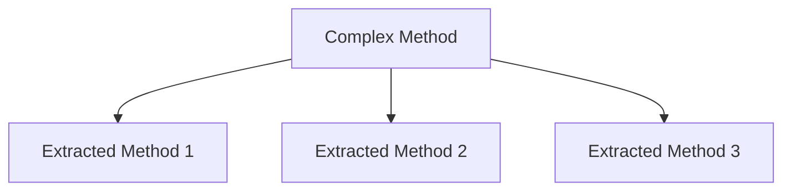

## 16.3 Refactoring Anti-Patterns

Refactoring is a critical process in software development that involves restructuring existing code without changing its external behavior. This practice is essential for maintaining code quality, improving readability, and enhancing performance. However, refactoring can sometimes introduce anti-patterns—common but ineffective solutions to recurring problems. In this section, we will explore strategies to identify and remove these anti-patterns, focusing on C# development. We will also delve into tools and techniques that can aid in the refactoring process.

### Understanding Anti-Patterns

Before we dive into refactoring strategies, let's first understand what anti-patterns are. Anti-patterns are poor solutions to design problems that can lead to inefficient, hard-to-maintain, or error-prone code. They often arise from a lack of understanding of design principles or from shortcuts taken during development.

#### Common Anti-Patterns in C#

1. **God Object**: A class that knows too much or does too much, violating the Single Responsibility Principle.
2. **Spaghetti Code**: Code with a complex and tangled control structure, making it difficult to follow.
3. **Lava Flow**: Dead code or outdated design elements that remain in the system due to fear of removing them.
4. **Copy-Paste Programming**: Reusing code by copying and pasting, leading to duplicated code and maintenance challenges.
5. **Golden Hammer**: Over-reliance on a familiar technology or pattern, applying it to every problem regardless of its suitability.

### Strategies to Remove Anti-Patterns

To effectively refactor anti-patterns, we need a structured approach. Here are some strategies to guide the process:

#### Incremental Improvements and Code Reviews

- **Incremental Refactoring**: Break down the refactoring process into small, manageable tasks. This approach minimizes risk and allows for continuous integration and testing.
- **Code Reviews**: Regular code reviews can help identify anti-patterns early. Encourage team members to provide constructive feedback and suggest improvements.

#### Refactoring Techniques

- **Extract Method**: Simplify complex methods by extracting parts of the code into separate methods. This technique improves readability and reusability.
- **Rename Variables and Methods**: Use meaningful names for variables and methods to enhance code clarity.
- **Replace Magic Numbers with Constants**: Use named constants instead of hard-coded numbers to improve code readability and maintainability.
- **Encapsulate Field**: Use properties to encapsulate fields, providing controlled access and validation.
- **Introduce Parameter Object**: When a method has too many parameters, consider encapsulating them into a single object.

### Tools and Techniques

Refactoring can be a daunting task, but with the right tools and techniques, it becomes more manageable.

#### Using Refactoring Tools and IDE Features

Modern Integrated Development Environments (IDEs) like Visual Studio offer powerful refactoring tools that can automate many refactoring tasks:

- **Rename**: Automatically rename variables, methods, and classes across the entire codebase.
- **Extract Method**: Create new methods from selected code blocks with ease.
- **Move Type to File**: Organize code by moving types to their own files.
- **Inline Variable**: Replace a variable with its value throughout the code.

#### Automation Tools for Code Cleanup

Automation tools can help maintain code quality by enforcing coding standards and detecting anti-patterns:

- **ReSharper**: A popular extension for Visual Studio that provides code analysis, refactoring, and navigation features.
- **StyleCop**: Analyzes C# source code to enforce a set of style and consistency rules.
- **SonarQube**: A platform for continuous inspection of code quality, offering static code analysis to detect bugs, vulnerabilities, and code smells.

### Visualizing Refactoring Processes

To better understand the refactoring process, let's visualize some common refactoring techniques using Mermaid.js diagrams.

#### Extract Method Example



*Description*: This diagram illustrates the process of breaking down a complex method into smaller, more manageable methods.

### Code Examples

Let's explore some code examples to illustrate these refactoring techniques.

#### Example: Refactoring a God Object

Before Refactoring:

```csharp
public class GodObject
{
    public void ProcessData()
    {
        // Complex data processing logic
    }

    public void RenderUI()
    {
        // UI rendering logic
    }

    public void ConnectToDatabase()
    {
        // Database connection logic
    }
}
```

After Refactoring:

```csharp
public class DataProcessor
{
    public void ProcessData()
    {
        // Simplified data processing logic
    }
}

public class UIManager
{
    public void RenderUI()
    {
        // Simplified UI rendering logic
    }
}

public class DatabaseConnector
{
    public void ConnectToDatabase()
    {
        // Simplified database connection logic
    }
}
```

*Explanation*: By separating responsibilities into distinct classes, we adhere to the Single Responsibility Principle, making the code more modular and easier to maintain.

#### Example: Replacing Magic Numbers with Constants

Before Refactoring:

```csharp
public class Circle
{
    public double CalculateCircumference(double radius)
    {
        return 2 * 3.14159 * radius; // Magic number for Pi
    }
}
```

After Refactoring:

```csharp
public class Circle
{
    private const double Pi = 3.14159;

    public double CalculateCircumference(double radius)
    {
        return 2 * Pi * radius;
    }
}
```

*Explanation*: By using a named constant for Pi, we improve code readability and make it easier to update the value if needed.

### Try It Yourself

Experiment with the provided code examples by making the following modifications:

1. **God Object Example**: Add a new responsibility to the `GodObject` class and refactor it into a separate class.
2. **Magic Numbers Example**: Introduce a new constant for another mathematical operation and refactor the code accordingly.

### Knowledge Check

- **Question**: What is an anti-pattern, and why is it important to refactor them?
- **Exercise**: Identify an anti-pattern in your current project and outline a plan to refactor it.

### Embrace the Journey

Refactoring is an ongoing journey that requires diligence and a keen eye for detail. By continuously improving our code, we not only enhance its quality but also our skills as developers. Remember, this is just the beginning. As you progress, you'll build more efficient and maintainable applications. Keep experimenting, stay curious, and enjoy the journey!

### References and Links

- [Refactoring Guru](https://refactoring.guru/)
- [Martin Fowler's Refactoring](https://martinfowler.com/books/refactoring.html)
- [Microsoft Docs: Refactoring in Visual Studio](https://docs.microsoft.com/en-us/visualstudio/ide/refactoring-in-visual-studio?view=vs-2019)

## Quiz Time!



### What is an anti-pattern?

- [x] A common but ineffective solution to a recurring problem
- [ ] A design pattern that solves a specific problem
- [ ] A pattern used to improve code performance
- [ ] A pattern that enhances code readability

> **Explanation:** An anti-pattern is a common but ineffective solution to a recurring problem, often leading to poor code quality.

### Which refactoring technique involves breaking down a complex method into smaller methods?

- [x] Extract Method
- [ ] Inline Variable
- [ ] Rename
- [ ] Move Type to File

> **Explanation:** The Extract Method technique involves breaking down a complex method into smaller, more manageable methods.

### What is the purpose of using constants instead of magic numbers?

- [x] To improve code readability and maintainability
- [ ] To increase code execution speed
- [ ] To reduce memory usage
- [ ] To enhance security

> **Explanation:** Using constants instead of magic numbers improves code readability and maintainability by providing meaningful names for values.

### Which tool is known for providing code analysis and refactoring features in Visual Studio?

- [x] ReSharper
- [ ] StyleCop
- [ ] SonarQube
- [ ] GitHub Copilot

> **Explanation:** ReSharper is a popular extension for Visual Studio that provides code analysis and refactoring features.

### What is the benefit of incremental refactoring?

- [x] Minimizes risk and allows for continuous integration and testing
- [ ] Increases the complexity of the codebase
- [ ] Requires less time and effort
- [ ] Eliminates the need for code reviews

> **Explanation:** Incremental refactoring minimizes risk and allows for continuous integration and testing by breaking down the process into small, manageable tasks.

### What is a God Object?

- [x] A class that knows too much or does too much
- [ ] A class that follows the Single Responsibility Principle
- [ ] A class that is highly optimized for performance
- [ ] A class that is used for testing purposes

> **Explanation:** A God Object is a class that knows too much or does too much, violating the Single Responsibility Principle.

### Which refactoring tool analyzes C# source code to enforce style and consistency rules?

- [ ] ReSharper
- [x] StyleCop
- [ ] SonarQube
- [ ] GitHub Copilot

> **Explanation:** StyleCop analyzes C# source code to enforce a set of style and consistency rules.

### What is the Golden Hammer anti-pattern?

- [x] Over-reliance on a familiar technology or pattern
- [ ] Using too many design patterns in a project
- [ ] Avoiding the use of design patterns altogether
- [ ] Using outdated technologies in a project

> **Explanation:** The Golden Hammer anti-pattern involves over-reliance on a familiar technology or pattern, applying it to every problem regardless of its suitability.

### What is the purpose of encapsulating fields with properties?

- [x] To provide controlled access and validation
- [ ] To increase code execution speed
- [ ] To reduce memory usage
- [ ] To enhance security

> **Explanation:** Encapsulating fields with properties provides controlled access and validation, improving code maintainability.

### True or False: Refactoring changes the external behavior of the code.

- [ ] True
- [x] False

> **Explanation:** Refactoring involves restructuring existing code without changing its external behavior.


