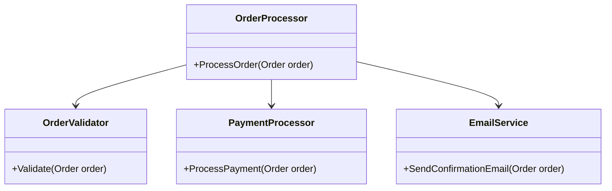

## 16.4 Avoiding Anti-Patterns

In the world of software development, anti-patterns are like the dark side of design patterns. While design patterns provide reusable solutions to common problems, anti-patterns represent poor solutions that can lead to inefficiencies, bugs, and maintenance nightmares. As expert software engineers and enterprise architects, it's crucial to recognize and avoid these pitfalls to ensure the development of robust, scalable, and maintainable applications.

### Understanding Anti-Patterns

Before we delve into strategies for avoiding anti-patterns, let's first understand what they are. An anti-pattern is a common response to a recurring problem that is usually ineffective and risks being highly counterproductive. Unlike design patterns, which are tried-and-tested solutions, anti-patterns often arise from a misunderstanding of the problem or a misapplication of a solution.

#### Common Characteristics of Anti-Patterns

- **Inefficiency**: Anti-patterns often lead to inefficient code that is difficult to maintain or scale.
- **Complexity**: They introduce unnecessary complexity, making the codebase harder to understand.
- **Fragility**: Code that follows anti-patterns is often brittle and prone to breaking with changes.
- **Poor Readability**: Anti-patterns can make code difficult to read and understand, hindering collaboration and future development.

### Best Practices to Avoid Anti-Patterns

#### 1. Following SOLID Principles

The SOLID principles are a set of five design principles intended to make software designs more understandable, flexible, and maintainable. Adhering to these principles can help prevent many common anti-patterns.

- **Single Responsibility Principle (SRP)**: Ensure that each class has only one reason to change. This prevents the "God Object" anti-pattern, where a single class takes on too many responsibilities.
  
- **Open/Closed Principle (OCP)**: Design classes to be open for extension but closed for modification. This helps avoid the "Shotgun Surgery" anti-pattern, where a single change requires multiple modifications across the codebase.
  
- **Liskov Substitution Principle (LSP)**: Subtypes should be substitutable for their base types without altering the correctness of the program. Violating this principle can lead to the "Refused Bequest" anti-pattern, where subclasses do not fully implement the behavior of their base class.
  
- **Interface Segregation Principle (ISP)**: Clients should not be forced to depend on interfaces they do not use. This prevents the "Interface Bloat" anti-pattern, where interfaces become too large and unwieldy.
  
- **Dependency Inversion Principle (DIP)**: High-level modules should not depend on low-level modules. Both should depend on abstractions. This principle helps avoid the "Spaghetti Code" anti-pattern, where dependencies are tangled and hard to manage.

#### 2. Emphasizing Simplicity and Clarity

Simplicity is the ultimate sophistication. Strive for simplicity in your code to avoid anti-patterns.

- **KISS (Keep It Simple, Stupid)**: Avoid over-engineering solutions. Simple solutions are often more robust and easier to maintain.
  
- **YAGNI (You Aren't Gonna Need It)**: Don't add functionality until it is necessary. This prevents the "Gold Plating" anti-pattern, where unnecessary features complicate the codebase.
  
- **DRY (Don't Repeat Yourself)**: Avoid code duplication. Repeated code can lead to the "Copy-Paste" anti-pattern, where changes in one place require changes in many others.

#### 3. Continuous Learning

The software development landscape is constantly evolving. Staying updated with current best practices is essential to avoid anti-patterns.

- **Participate in Code Reviews**: Code reviews are an excellent opportunity to learn from peers and identify potential anti-patterns in your code.
  
- **Engage in Peer Learning**: Collaborate with colleagues to share knowledge and experiences. This can help you recognize and avoid anti-patterns.
  
- **Stay Informed**: Follow industry blogs, attend conferences, and read books to keep up with the latest trends and best practices in software development.

### Code Examples and Visualizations

Let's explore some code examples and visualizations to better understand how to avoid anti-patterns in C#.

#### Example: Avoiding the "God Object" Anti-Pattern

The "God Object" anti-pattern occurs when a single class takes on too many responsibilities. This violates the Single Responsibility Principle.

```csharp
// Anti-pattern: God Object
public class OrderProcessor
{
    public void ProcessOrder(Order order)
    {
        // Validate order
        // Calculate total
        // Process payment
        // Send confirmation email
    }
}

// Refactored: Applying Single Responsibility Principle
public class OrderValidator
{
    public bool Validate(Order order) { /* Validation logic */ }
}

public class PaymentProcessor
{
    public void ProcessPayment(Order order) { /* Payment logic */ }
}

public class EmailService
{
    public void SendConfirmationEmail(Order order) { /* Email logic */ }
}

public class OrderProcessor
{
    private readonly OrderValidator _validator;
    private readonly PaymentProcessor _paymentProcessor;
    private readonly EmailService _emailService;

    public OrderProcessor(OrderValidator validator, PaymentProcessor paymentProcessor, EmailService emailService)
    {
        _validator = validator;
        _paymentProcessor = paymentProcessor;
        _emailService = emailService;
    }

    public void ProcessOrder(Order order)
    {
        if (_validator.Validate(order))
        {
            _paymentProcessor.ProcessPayment(order);
            _emailService.SendConfirmationEmail(order);
        }
    }
}
```

In the refactored example, we have broken down the responsibilities into separate classes, each with a single responsibility. This makes the code more modular and easier to maintain.

#### Visualizing the "God Object" Anti-Pattern



The diagram above illustrates how the `OrderProcessor` class interacts with other classes, each handling a specific responsibility, thus avoiding the "God Object" anti-pattern.

### Knowledge Check

To reinforce your understanding, consider the following questions:

- How does the Single Responsibility Principle help avoid the "God Object" anti-pattern?
- What are the potential consequences of violating the Open/Closed Principle?
- How can code reviews help in identifying anti-patterns?

### Try It Yourself

Experiment with the code examples provided. Try modifying the `OrderProcessor` class to include additional responsibilities and observe how it affects the maintainability of the code. Then, refactor it to adhere to the Single Responsibility Principle.

### Conclusion

Avoiding anti-patterns is crucial for developing high-quality software. By following best practices such as the SOLID principles, emphasizing simplicity, and engaging in continuous learning, you can prevent common design pitfalls and ensure the success of your projects. Remember, the journey to mastering design patterns is ongoing. Keep experimenting, stay curious, and enjoy the process of learning and growing as a software engineer.

## Quiz Time!



### Which principle helps prevent the "God Object" anti-pattern?

- [x] Single Responsibility Principle
- [ ] Open/Closed Principle
- [ ] Liskov Substitution Principle
- [ ] Interface Segregation Principle

> **Explanation:** The Single Responsibility Principle ensures that a class has only one reason to change, preventing it from taking on too many responsibilities.

### What is a common consequence of violating the Open/Closed Principle?

- [x] Shotgun Surgery
- [ ] God Object
- [ ] Refused Bequest
- [ ] Interface Bloat

> **Explanation:** Violating the Open/Closed Principle can lead to Shotgun Surgery, where a single change requires multiple modifications across the codebase.

### Which practice emphasizes avoiding unnecessary complexity in code?

- [x] KISS (Keep It Simple, Stupid)
- [ ] DRY (Don't Repeat Yourself)
- [ ] YAGNI (You Aren't Gonna Need It)
- [ ] SOLID Principles

> **Explanation:** KISS (Keep It Simple, Stupid) emphasizes simplicity and avoiding unnecessary complexity in code.

### How can code reviews help in avoiding anti-patterns?

- [x] By identifying potential anti-patterns in the code
- [ ] By increasing code duplication
- [ ] By enforcing rigid coding standards
- [ ] By reducing code readability

> **Explanation:** Code reviews provide an opportunity to identify potential anti-patterns and improve code quality through peer feedback.

### Which principle helps avoid the "Interface Bloat" anti-pattern?

- [x] Interface Segregation Principle
- [ ] Single Responsibility Principle
- [ ] Dependency Inversion Principle
- [ ] Open/Closed Principle

> **Explanation:** The Interface Segregation Principle ensures that clients are not forced to depend on interfaces they do not use, preventing interface bloat.

### What is the main goal of the DRY principle?

- [x] To avoid code duplication
- [ ] To simplify code
- [ ] To increase code complexity
- [ ] To enforce strict coding standards

> **Explanation:** The DRY (Don't Repeat Yourself) principle aims to avoid code duplication, ensuring that changes in one place do not require changes in many others.

### Which principle is violated when subclasses do not fully implement the behavior of their base class?

- [x] Liskov Substitution Principle
- [ ] Single Responsibility Principle
- [ ] Open/Closed Principle
- [ ] Interface Segregation Principle

> **Explanation:** The Liskov Substitution Principle is violated when subclasses do not fully implement the behavior of their base class, leading to the "Refused Bequest" anti-pattern.

### What is the main focus of the YAGNI principle?

- [x] Avoiding unnecessary features
- [ ] Simplifying code
- [ ] Increasing code complexity
- [ ] Enforcing strict coding standards

> **Explanation:** The YAGNI (You Aren't Gonna Need It) principle focuses on avoiding unnecessary features until they are needed, preventing the "Gold Plating" anti-pattern.

### How can peer learning help in avoiding anti-patterns?

- [x] By sharing knowledge and experiences
- [ ] By enforcing rigid coding standards
- [ ] By increasing code duplication
- [ ] By reducing code readability

> **Explanation:** Peer learning allows developers to share knowledge and experiences, helping them recognize and avoid anti-patterns.

### True or False: Anti-patterns are effective solutions to common problems.

- [ ] True
- [x] False

> **Explanation:** Anti-patterns are ineffective solutions to common problems and often lead to inefficiencies and maintenance issues.


