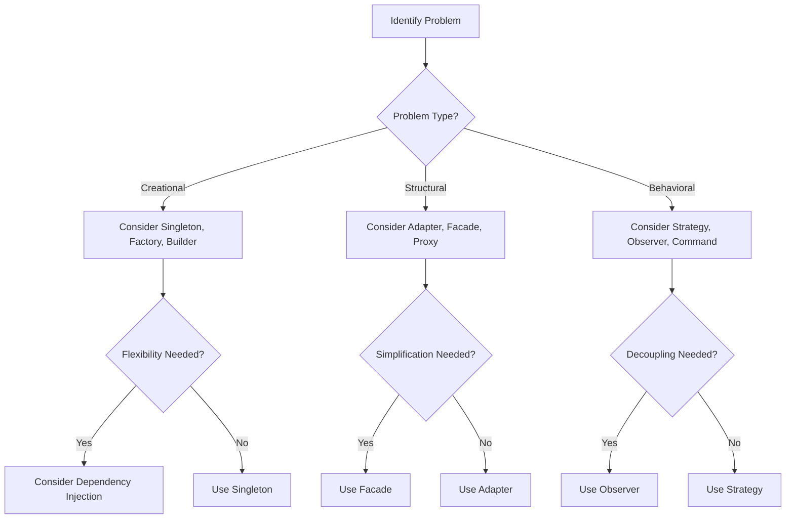

## 17.1 Selecting the Right Pattern

In the realm of software engineering, design patterns serve as invaluable tools that help us solve recurring problems with proven solutions. However, the effectiveness of a design pattern is contingent upon its appropriate application. Selecting the right pattern requires a nuanced understanding of the problem context, the requirements at hand, and the trade-offs involved. In this section, we will delve into the criteria for choosing patterns, the importance of balancing complexity and simplicity, and how to apply these principles in C#.

### Understanding the Problem Context

Before diving into pattern selection, it's crucial to thoroughly understand the problem you're trying to solve. This involves:

- **Identifying the Core Problem**: Clearly define the problem you are facing. Is it related to object creation, structure, or behavior? This will guide you towards creational, structural, or behavioral patterns, respectively.
  
- **Analyzing Requirements**: Gather and analyze the requirements. Are there specific constraints or performance considerations? Understanding these will help you choose a pattern that aligns with your needs.

- **Considering the Environment**: The environment in which your application operates can influence pattern selection. For example, a distributed system might benefit from patterns that address concurrency and communication.

### Criteria for Choosing Patterns

When selecting a design pattern, consider the following criteria:

#### 1. **Problem Context and Requirements**

- **Match Patterns to Scenarios**: Each pattern is designed to address specific scenarios. For instance, if you need to create a family of related objects, consider the Abstract Factory pattern. If you need to provide a simplified interface to a complex subsystem, the Facade pattern might be appropriate.

- **Evaluate Flexibility and Scalability**: Consider how the pattern will affect the flexibility and scalability of your application. Some patterns, like the Strategy pattern, allow for easy swapping of algorithms, enhancing flexibility.

- **Assess Maintainability**: Choose patterns that promote maintainability. Patterns like the Observer can decouple components, making the system easier to maintain and extend.

#### 2. **Balancing Complexity and Simplicity**

- **Avoid Overengineering**: It's easy to fall into the trap of overengineering by applying patterns unnecessarily. Always aim for the simplest solution that meets the requirements.

- **Keep Solutions Simple**: Simplicity is key to maintainability. Patterns should simplify the design, not complicate it. The KISS (Keep It Simple, Stupid) principle is a valuable guideline here.

### Applying Patterns in C#

Let's explore how these principles can be applied in C# with practical examples.

#### Example: Choosing Between Singleton and Dependency Injection

Suppose you need to ensure a class has only one instance and provide a global point of access to it. The Singleton pattern is a straightforward choice. However, if your application requires more flexibility, such as testing or swapping implementations, Dependency Injection (DI) might be a better fit.

**Singleton Pattern Example:**

```csharp
public class Singleton
{
    private static Singleton _instance;
    private static readonly object _lock = new object();

    private Singleton() { }

    public static Singleton Instance
    {
        get
        {
            lock (_lock)
            {
                if (_instance == null)
                {
                    _instance = new Singleton();
                }
                return _instance;
            }
        }
    }
}
```

**Dependency Injection Example:**

```csharp
public interface IService
{
    void Execute();
}

public class Service : IService
{
    public void Execute()
    {
        Console.WriteLine("Service Executed");
    }
}

public class Client
{
    private readonly IService _service;

    public Client(IService service)
    {
        _service = service;
    }

    public void Start()
    {
        _service.Execute();
    }
}

// Usage with a DI container
var serviceProvider = new ServiceCollection()
    .AddSingleton<IService, Service>()
    .BuildServiceProvider();

var client = serviceProvider.GetService<Client>();
client.Start();
```

### Visualizing Pattern Selection

To better understand how to select the right pattern, let's visualize the decision-making process using a flowchart.



### Design Considerations

When selecting a pattern, consider the following design aspects:

- **Performance**: Some patterns may introduce overhead. For instance, the Observer pattern can lead to performance issues if not managed properly.

- **Concurrency**: In a multithreaded environment, patterns like the Singleton need to be thread-safe.

- **Compatibility**: Ensure the pattern is compatible with existing code and architecture.

### Differences and Similarities

It's important to understand the differences and similarities between patterns to avoid confusion:

- **Adapter vs. Facade**: Both provide a simplified interface, but the Adapter is used to make two incompatible interfaces work together, while the Facade simplifies a complex subsystem.

- **Strategy vs. State**: Both involve changing behavior, but Strategy is about swapping algorithms, while State is about changing behavior based on state.

### Try It Yourself

Experiment with the code examples provided. Try modifying the Singleton pattern to be thread-safe using `Lazy<T>`, or implement a simple DI container to understand its workings.

### Knowledge Check

- **What is the primary goal of the Singleton pattern?**
- **How does Dependency Injection enhance flexibility?**
- **When should you avoid using the Singleton pattern?**

### Embrace the Journey

Remember, selecting the right pattern is an art that improves with experience. As you encounter different scenarios, you'll develop an intuition for choosing the most appropriate pattern. Keep experimenting, stay curious, and enjoy the journey!

### References and Links

- [Design Patterns: Elements of Reusable Object-Oriented Software](https://en.wikipedia.org/wiki/Design_Patterns)
- [Microsoft Docs: Design Patterns](https://docs.microsoft.com/en-us/dotnet/architecture/microservices/microservice-ddd-cqrs-patterns/)

## Quiz Time!



### What is the primary goal of the Singleton pattern?

- [x] Ensure a class has only one instance and provide a global point of access to it.
- [ ] Allow multiple instances of a class.
- [ ] Simplify complex subsystems.
- [ ] Swap algorithms at runtime.

> **Explanation:** The Singleton pattern ensures a class has only one instance and provides a global point of access to it.

### How does Dependency Injection enhance flexibility?

- [x] By allowing easy swapping of implementations.
- [ ] By enforcing a single instance of a class.
- [ ] By simplifying complex subsystems.
- [ ] By decoupling components.

> **Explanation:** Dependency Injection enhances flexibility by allowing easy swapping of implementations, making it easier to test and modify code.

### When should you avoid using the Singleton pattern?

- [x] When you need flexibility in testing and swapping implementations.
- [ ] When you need a single instance of a class.
- [ ] When you need to simplify complex subsystems.
- [ ] When you need to decouple components.

> **Explanation:** Avoid using the Singleton pattern when you need flexibility in testing and swapping implementations, as it can make code less flexible.

### What is the main difference between the Adapter and Facade patterns?

- [x] Adapter makes two incompatible interfaces work together, while Facade simplifies a complex subsystem.
- [ ] Adapter simplifies a complex subsystem, while Facade makes two incompatible interfaces work together.
- [ ] Both patterns are used to swap algorithms.
- [ ] Both patterns are used to ensure a single instance of a class.

> **Explanation:** The Adapter pattern makes two incompatible interfaces work together, while the Facade pattern simplifies a complex subsystem.

### Which pattern is suitable for changing behavior based on state?

- [x] State pattern
- [ ] Strategy pattern
- [ ] Singleton pattern
- [ ] Observer pattern

> **Explanation:** The State pattern is suitable for changing behavior based on state, while the Strategy pattern is used for swapping algorithms.

### What is a key consideration when using the Observer pattern?

- [x] Managing performance issues due to potential overhead.
- [ ] Ensuring a single instance of a class.
- [ ] Simplifying complex subsystems.
- [ ] Swapping algorithms at runtime.

> **Explanation:** A key consideration when using the Observer pattern is managing performance issues due to potential overhead from multiple observers.

### Why is it important to avoid overengineering when selecting patterns?

- [x] To keep solutions simple and maintainable.
- [ ] To ensure a single instance of a class.
- [ ] To simplify complex subsystems.
- [ ] To swap algorithms at runtime.

> **Explanation:** Avoiding overengineering is important to keep solutions simple and maintainable, adhering to the KISS principle.

### What is the primary use of the Strategy pattern?

- [x] To swap algorithms at runtime.
- [ ] To ensure a single instance of a class.
- [ ] To simplify complex subsystems.
- [ ] To decouple components.

> **Explanation:** The primary use of the Strategy pattern is to swap algorithms at runtime, allowing for flexible behavior changes.

### How does the Facade pattern simplify a subsystem?

- [x] By providing a simplified interface to a complex subsystem.
- [ ] By making two incompatible interfaces work together.
- [ ] By ensuring a single instance of a class.
- [ ] By swapping algorithms at runtime.

> **Explanation:** The Facade pattern simplifies a subsystem by providing a simplified interface to a complex subsystem.

### True or False: The State pattern is used to swap algorithms at runtime.

- [ ] True
- [x] False

> **Explanation:** False. The State pattern is used to change behavior based on state, not to swap algorithms at runtime.


