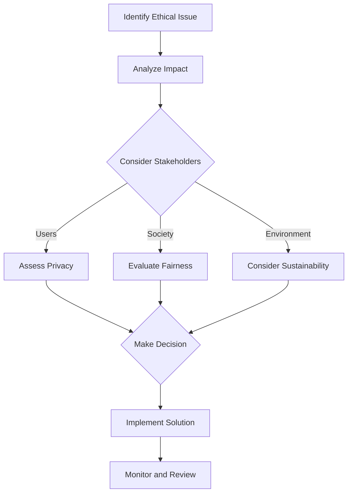

## 17.10 Ethical Considerations in Software Development

In the rapidly evolving world of software development, ethical considerations are becoming increasingly important. As expert software engineers and enterprise architects, it is crucial to understand the ethical implications of our work and strive to build software that is both responsible and inclusive. This section will delve into the key aspects of ethical software development, focusing on responsible coding and inclusive design.

### Responsible Coding

Responsible coding involves making conscious decisions that prioritize user privacy, data security, and the broader impact of software on society. Let's explore these concepts in detail.

#### Considering User Privacy and Data Security

User privacy and data security are paramount in today's digital age. As developers, we must ensure that the software we create respects user privacy and protects sensitive data from unauthorized access. Here are some key considerations:

1. **Data Minimization**: Collect only the data that is necessary for the functionality of the application. Avoid collecting excessive information that could compromise user privacy.

2. **Secure Data Storage**: Implement robust encryption techniques to protect data at rest and in transit. Use secure protocols such as HTTPS to safeguard data transmission.

3. **Access Control**: Implement strict access control measures to ensure that only authorized personnel can access sensitive data. Use role-based access control (RBAC) to manage permissions effectively.

4. **User Consent**: Obtain explicit consent from users before collecting or processing their data. Provide clear and concise information about how their data will be used.

5. **Transparency**: Be transparent about data collection practices and provide users with the ability to access, modify, or delete their data.

6. **Regular Audits**: Conduct regular security audits and vulnerability assessments to identify and mitigate potential risks.

#### Ethical Implications of Software Decisions

Every decision made during the software development process can have ethical implications. It is essential to consider the potential impact of these decisions on users and society as a whole. Here are some key points to consider:

1. **Bias and Fairness**: Ensure that algorithms and data models are free from bias and do not discriminate against any group. Regularly test and validate models to ensure fairness.

2. **Impact on Society**: Consider the broader impact of the software on society. Will it contribute positively or negatively? Strive to create software that benefits society and minimizes harm.

3. **User Autonomy**: Respect user autonomy by providing them with control over their data and how it is used. Avoid manipulative practices that undermine user agency.

4. **Environmental Impact**: Consider the environmental impact of software development and deployment. Optimize code for efficiency and reduce resource consumption.

5. **Legal Compliance**: Ensure that the software complies with relevant laws and regulations, such as data protection laws and accessibility standards.

### Inclusive Design

Inclusive design is about creating software that is accessible and usable by people with diverse abilities and needs. It involves considering the full range of human diversity, including ability, language, culture, gender, and age. Let's explore the key aspects of inclusive design.

#### Building Accessible Applications

Accessibility is a fundamental aspect of inclusive design. It ensures that people with disabilities can use and benefit from software applications. Here are some key considerations for building accessible applications:

1. **Adherence to Standards**: Follow established accessibility standards, such as the Web Content Accessibility Guidelines (WCAG), to ensure that applications are accessible to all users.

2. **Keyboard Navigation**: Ensure that all functionality is accessible via keyboard navigation. This is crucial for users who cannot use a mouse.

3. **Screen Reader Compatibility**: Ensure that applications are compatible with screen readers and other assistive technologies. Provide alternative text for images and ensure that all interactive elements are labeled appropriately.

4. **Color Contrast**: Use sufficient color contrast to ensure that text is readable for users with visual impairments. Avoid relying solely on color to convey information.

5. **Scalable Text**: Allow users to adjust text size without breaking the layout or functionality of the application.

6. **Testing with Diverse Users**: Conduct usability testing with a diverse group of users, including those with disabilities, to identify and address accessibility issues.

#### Ensuring Software Serves Diverse User Needs

Inclusive design goes beyond accessibility to consider the diverse needs of all users. Here are some key considerations:

1. **Cultural Sensitivity**: Design software that is culturally sensitive and adaptable to different languages and cultural contexts. Consider localization and internationalization from the outset.

2. **Gender Inclusivity**: Avoid gender-specific language and design elements. Provide options for users to specify their gender identity or choose not to disclose it.

3. **Age Inclusivity**: Consider the needs of users across different age groups. Ensure that the interface is intuitive and easy to use for both younger and older users.

4. **Economic Inclusivity**: Consider the economic barriers that may prevent users from accessing software. Offer flexible pricing models or free versions to accommodate users with different financial capabilities.

5. **Feedback Mechanisms**: Provide mechanisms for users to provide feedback and report issues. Use this feedback to continuously improve the inclusivity of the software.

### Code Examples

To illustrate the concepts of responsible coding and inclusive design, let's explore some code examples.

#### Example 1: Implementing Secure Data Storage

```csharp
using System;
using System.Security.Cryptography;
using System.Text;

public class SecureDataStorage
{
    // Encrypts data using AES encryption
    public static string EncryptData(string plainText, string key)
    {
        using (Aes aes = Aes.Create())
        {
            aes.Key = Encoding.UTF8.GetBytes(key);
            aes.IV = new byte[16]; // Initialize IV with zeros

            ICryptoTransform encryptor = aes.CreateEncryptor(aes.Key, aes.IV);
            byte[] encrypted = encryptor.TransformFinalBlock(Encoding.UTF8.GetBytes(plainText), 0, plainText.Length);

            return Convert.ToBase64String(encrypted);
        }
    }

    // Decrypts data using AES encryption
    public static string DecryptData(string cipherText, string key)
    {
        using (Aes aes = Aes.Create())
        {
            aes.Key = Encoding.UTF8.GetBytes(key);
            aes.IV = new byte[16]; // Initialize IV with zeros

            ICryptoTransform decryptor = aes.CreateDecryptor(aes.Key, aes.IV);
            byte[] decrypted = decryptor.TransformFinalBlock(Convert.FromBase64String(cipherText), 0, Convert.FromBase64String(cipherText).Length);

            return Encoding.UTF8.GetString(decrypted);
        }
    }
}

// Try It Yourself: Experiment with different encryption keys and observe the impact on the encrypted data.
```

#### Example 2: Implementing Keyboard Navigation

```csharp
using System;
using System.Windows.Forms;

public class AccessibleForm : Form
{
    private Button button1;
    private Button button2;

    public AccessibleForm()
    {
        button1 = new Button() { Text = "Button 1", TabIndex = 0 };
        button2 = new Button() { Text = "Button 2", TabIndex = 1 };

        Controls.Add(button1);
        Controls.Add(button2);

        // Set up keyboard navigation
        button1.KeyDown += new KeyEventHandler(OnKeyDown);
        button2.KeyDown += new KeyEventHandler(OnKeyDown);
    }

    private void OnKeyDown(object sender, KeyEventArgs e)
    {
        if (e.KeyCode == Keys.Enter)
        {
            Button button = sender as Button;
            MessageBox.Show($"{button.Text} clicked!");
        }
    }
}

// Try It Yourself: Add more buttons and implement keyboard shortcuts for each button.
```

### Visualizing Ethical Considerations

To better understand the ethical considerations in software development, let's visualize the process of ethical decision-making using a flowchart.



**Figure 1: Ethical Decision-Making Process in Software Development**

This flowchart illustrates the process of identifying ethical issues, analyzing their impact, considering stakeholders, and making informed decisions. It emphasizes the importance of continuous monitoring and review to ensure that ethical considerations are upheld throughout the software development lifecycle.

### References and Links

For further reading on ethical considerations in software development, consider exploring the following resources:

- [The ACM Code of Ethics and Professional Conduct](https://www.acm.org/code-of-ethics)
- [The IEEE Code of Ethics](https://www.ieee.org/about/corporate/governance/p7-8.html)
- [Web Content Accessibility Guidelines (WCAG)](https://www.w3.org/WAI/standards-guidelines/wcag/)
- [General Data Protection Regulation (GDPR)](https://gdpr-info.eu/)

### Knowledge Check

To reinforce your understanding of ethical considerations in software development, consider the following questions:

1. What are the key principles of responsible coding?
2. How can developers ensure that their software is accessible to users with disabilities?
3. What are the potential ethical implications of biased algorithms?
4. How can developers balance user privacy with the need for data collection?
5. What role does transparency play in ethical software development?

### Embrace the Journey

Remember, ethical considerations are an integral part of software development. As you continue to build and design software, keep these principles in mind and strive to create applications that are both responsible and inclusive. Stay curious, keep learning, and enjoy the journey of ethical software development!

### Quiz Time!



### What is the primary goal of responsible coding?

- [x] To prioritize user privacy and data security
- [ ] To maximize software performance
- [ ] To reduce development costs
- [ ] To increase software complexity

> **Explanation:** Responsible coding aims to prioritize user privacy and data security, ensuring that software is developed with ethical considerations in mind.

### Which of the following is a key aspect of inclusive design?

- [x] Building accessible applications
- [ ] Maximizing software profitability
- [ ] Reducing code complexity
- [ ] Increasing software size

> **Explanation:** Inclusive design focuses on building accessible applications that serve diverse user needs, ensuring that software is usable by people with different abilities and backgrounds.

### What is data minimization?

- [x] Collecting only the data necessary for the application's functionality
- [ ] Collecting as much data as possible for analysis
- [ ] Storing data in multiple locations
- [ ] Encrypting all user data

> **Explanation:** Data minimization involves collecting only the data necessary for the application's functionality, reducing the risk of compromising user privacy.

### How can developers ensure fairness in algorithms?

- [x] Regularly test and validate models to ensure they are free from bias
- [ ] Increase the complexity of algorithms
- [ ] Use proprietary data sets
- [ ] Focus solely on performance metrics

> **Explanation:** Developers can ensure fairness in algorithms by regularly testing and validating models to ensure they are free from bias and do not discriminate against any group.

### What is the purpose of obtaining user consent?

- [x] To provide clear information about how user data will be used
- [ ] To increase software complexity
- [ ] To reduce development costs
- [ ] To maximize software performance

> **Explanation:** Obtaining user consent is crucial for providing clear information about how user data will be used, ensuring transparency and respecting user autonomy.

### Which of the following is a benefit of adhering to accessibility standards?

- [x] Ensuring applications are usable by people with disabilities
- [ ] Increasing software complexity
- [ ] Reducing development time
- [ ] Maximizing software profitability

> **Explanation:** Adhering to accessibility standards ensures that applications are usable by people with disabilities, promoting inclusivity and equal access.

### What is the role of transparency in ethical software development?

- [x] To provide users with clear information about data collection practices
- [ ] To increase software complexity
- [ ] To reduce development costs
- [ ] To maximize software performance

> **Explanation:** Transparency in ethical software development involves providing users with clear information about data collection practices, ensuring that users are informed and can make informed decisions.

### How can developers address the environmental impact of software?

- [x] Optimize code for efficiency and reduce resource consumption
- [ ] Increase software complexity
- [ ] Focus solely on performance metrics
- [ ] Use proprietary data sets

> **Explanation:** Developers can address the environmental impact of software by optimizing code for efficiency and reducing resource consumption, minimizing the software's ecological footprint.

### What is the significance of cultural sensitivity in inclusive design?

- [x] Designing software that is adaptable to different languages and cultural contexts
- [ ] Maximizing software profitability
- [ ] Reducing code complexity
- [ ] Increasing software size

> **Explanation:** Cultural sensitivity in inclusive design involves designing software that is adaptable to different languages and cultural contexts, ensuring that it is usable and relevant to a diverse user base.

### True or False: Ethical considerations are only relevant during the initial stages of software development.

- [ ] True
- [x] False

> **Explanation:** Ethical considerations are relevant throughout the entire software development lifecycle, from initial design to deployment and maintenance, ensuring that software remains responsible and inclusive.


