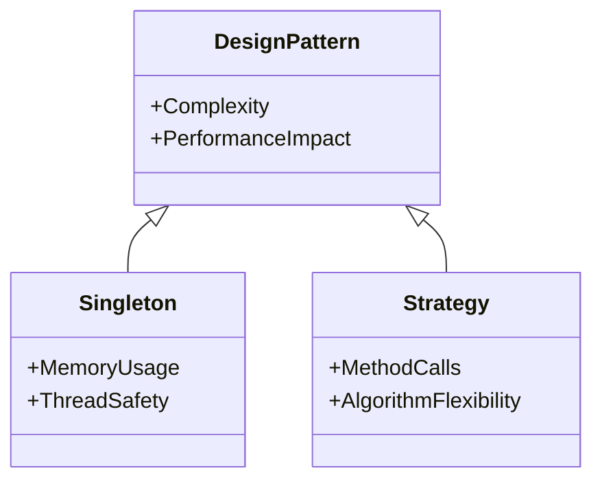

## 17.2 Patterns and Performance

In the realm of software engineering, design patterns serve as invaluable tools for crafting robust and maintainable code. However, their impact on performance is a crucial consideration that often goes overlooked. In this section, we will delve into the intricate relationship between design patterns and performance in C# applications. We will explore how patterns can both enhance and hinder performance, and provide strategies for profiling and optimization to ensure your applications run efficiently.

### Understanding the Impact of Patterns on Performance

Design patterns encapsulate best practices and solutions to common problems in software design. While they offer numerous benefits, such as improved code readability and reusability, they can also introduce performance overhead if not used judiciously. Understanding the impact of patterns on performance is essential for making informed decisions in your software architecture.

#### Assessing Pattern Impact

To effectively assess the impact of design patterns on performance, we must consider several factors:

1. **Complexity and Overhead**: Some patterns, like the Decorator or Proxy, introduce additional layers of abstraction, which can lead to increased complexity and overhead. It's important to weigh the benefits of these patterns against their potential performance costs.

2. **Memory Usage**: Patterns such as Singleton or Flyweight can help manage memory usage by controlling the instantiation of objects. However, improper implementation can lead to memory leaks or excessive memory consumption.

3. **Execution Time**: Patterns like the Strategy or Template Method can affect execution time by introducing additional method calls or decision-making processes. Profiling tools can help identify bottlenecks introduced by these patterns.

4. **Concurrency and Scalability**: Patterns such as the Observer or Publisher-Subscriber can impact concurrency and scalability. Understanding how these patterns handle events and notifications is crucial for building scalable applications.

#### Profiling and Optimization Strategies

Profiling is a critical step in understanding the performance characteristics of your application. By identifying bottlenecks and areas for improvement, you can make informed decisions about which patterns to use and how to optimize them.

1. **Use Profiling Tools**: Tools like Visual Studio Profiler, JetBrains dotTrace, and ANTS Performance Profiler can help you analyze CPU usage, memory consumption, and execution time. These tools provide insights into which parts of your code are consuming the most resources.

2. **Measure Before Optimizing**: Always measure the performance of your application before making optimizations. This ensures that you are addressing actual performance issues rather than perceived ones.

3. **Focus on Hotspots**: Identify the "hotspots" in your application—areas where performance bottlenecks are most pronounced. These are often the best candidates for optimization.

4. **Iterative Optimization**: Optimization should be an iterative process. Make small, incremental changes and measure their impact on performance. This approach helps prevent unintended side effects and ensures that optimizations are effective.

### Optimization Techniques

Once you've identified performance bottlenecks, it's time to apply optimization techniques. Here, we will explore strategies for optimizing design patterns and improving the overall performance of your C# applications.

#### Identifying Bottlenecks

Identifying bottlenecks is the first step in the optimization process. Bottlenecks can occur at various levels of your application, from algorithmic inefficiencies to resource contention. Here are some common sources of bottlenecks:

1. **Algorithmic Inefficiencies**: Inefficient algorithms can significantly impact performance. Use efficient algorithms and data structures to minimize computational overhead.

2. **Resource Contention**: Contention for shared resources, such as locks or database connections, can lead to performance degradation. Consider using patterns like the Producer-Consumer or Reader-Writer Lock to manage resource access.

3. **Network Latency**: In distributed systems, network latency can be a major bottleneck. Patterns like the Circuit Breaker or Retry can help mitigate the impact of network issues.

4. **I/O Operations**: Input/output operations, such as file access or database queries, can be slow. Use asynchronous programming patterns to improve the responsiveness of your application.

#### Using Efficient Algorithms and Data Structures

Choosing the right algorithms and data structures is crucial for optimizing performance. Here are some guidelines to consider:

1. **Algorithm Selection**: Choose algorithms that are appropriate for your use case. For example, use quicksort for sorting large datasets, or binary search for searching sorted arrays.

2. **Data Structure Choice**: Select data structures that offer efficient access and manipulation. For example, use dictionaries for fast key-value lookups, or linked lists for efficient insertions and deletions.

3. **Avoid Premature Optimization**: While it's important to consider performance, avoid premature optimization. Focus on writing clear and maintainable code first, and optimize only when necessary.

4. **Leverage C# Features**: Take advantage of C# features like LINQ, async/await, and parallel processing to improve performance. These features can help you write efficient and scalable code.

### Code Examples

Let's explore some code examples to illustrate how design patterns can impact performance and how to optimize them.

#### Example 1: Singleton Pattern

The Singleton pattern ensures that a class has only one instance and provides a global point of access to it. While useful, it can introduce performance issues if not implemented correctly.

```csharp
public class Singleton
{
    private static Singleton _instance;
    private static readonly object _lock = new object();

    private Singleton() { }

    public static Singleton Instance
    {
        get
        {
            lock (_lock)
            {
                if (_instance == null)
                {
                    _instance = new Singleton();
                }
                return _instance;
            }
        }
    }
}
```

**Optimization Tip**: Use the `Lazy<T>` type in C# to implement a thread-safe Singleton without the need for explicit locking.

```csharp
public class Singleton
{
    private static readonly Lazy<Singleton> _instance = new Lazy<Singleton>(() => new Singleton());

    private Singleton() { }

    public static Singleton Instance => _instance.Value;
}
```

#### Example 2: Strategy Pattern

The Strategy pattern defines a family of algorithms, encapsulates each one, and makes them interchangeable. It can introduce performance overhead due to additional method calls.

```csharp
public interface IStrategy
{
    void Execute();
}

public class ConcreteStrategyA : IStrategy
{
    public void Execute()
    {
        // Implementation of algorithm A
    }
}

public class Context
{
    private IStrategy _strategy;

    public Context(IStrategy strategy)
    {
        _strategy = strategy;
    }

    public void ExecuteStrategy()
    {
        _strategy.Execute();
    }
}
```

**Optimization Tip**: Use delegates or function pointers in C# to reduce the overhead of method calls in the Strategy pattern.

```csharp
public class Context
{
    private readonly Action _executeStrategy;

    public Context(Action executeStrategy)
    {
        _executeStrategy = executeStrategy;
    }

    public void ExecuteStrategy()
    {
        _executeStrategy();
    }
}
```

### Visualizing Pattern Impact

To better understand the impact of design patterns on performance, let's visualize the relationship between patterns, complexity, and performance using a class diagram.



**Diagram Description**: This class diagram illustrates the relationship between design patterns and their impact on complexity and performance. The Singleton pattern affects memory usage and thread safety, while the Strategy pattern impacts method calls and algorithm flexibility.

### References and Links

For further reading on design patterns and performance optimization, consider the following resources:

- [Design Patterns: Elements of Reusable Object-Oriented Software](https://en.wikipedia.org/wiki/Design_Patterns) by Erich Gamma, Richard Helm, Ralph Johnson, and John Vlissides.
- [C# Performance Optimization](https://docs.microsoft.com/en-us/dotnet/standard/performance/) on Microsoft Docs.
- [Profiling and Performance Tools](https://visualstudio.microsoft.com/vs/features/profiling/) in Visual Studio.

### Knowledge Check

To reinforce your understanding of patterns and performance, consider the following questions:

1. How can the Singleton pattern impact memory usage?
2. What are some common sources of performance bottlenecks in software applications?
3. How can profiling tools help identify performance issues?
4. What is the benefit of using delegates in the Strategy pattern?
5. How does the choice of data structures affect application performance?

### Embrace the Journey

Remember, mastering design patterns and performance optimization is a journey. As you continue to explore and experiment with these concepts, you'll gain a deeper understanding of how to build efficient and scalable applications. Keep learning, stay curious, and enjoy the process!

### Quiz Time!



### How can the Singleton pattern impact memory usage?

- [x] By controlling the instantiation of objects
- [ ] By increasing the number of instances
- [ ] By reducing the number of method calls
- [ ] By increasing algorithm flexibility

> **Explanation:** The Singleton pattern controls the instantiation of objects, which can help manage memory usage.

### What is a common source of performance bottlenecks in software applications?

- [x] Algorithmic inefficiencies
- [ ] Excessive method calls
- [ ] Lack of design patterns
- [ ] Overuse of comments

> **Explanation:** Algorithmic inefficiencies are a common source of performance bottlenecks in software applications.

### How can profiling tools help identify performance issues?

- [x] By analyzing CPU usage and memory consumption
- [ ] By increasing code readability
- [ ] By reducing the number of design patterns
- [ ] By improving code maintainability

> **Explanation:** Profiling tools analyze CPU usage and memory consumption to help identify performance issues.

### What is the benefit of using delegates in the Strategy pattern?

- [x] Reducing the overhead of method calls
- [ ] Increasing the number of algorithms
- [ ] Improving memory usage
- [ ] Enhancing thread safety

> **Explanation:** Using delegates in the Strategy pattern reduces the overhead of method calls.

### How does the choice of data structures affect application performance?

- [x] By offering efficient access and manipulation
- [ ] By increasing the number of design patterns
- [ ] By reducing code readability
- [ ] By enhancing algorithm flexibility

> **Explanation:** The choice of data structures affects application performance by offering efficient access and manipulation.

### What should be the first step in the optimization process?

- [x] Identifying bottlenecks
- [ ] Implementing design patterns
- [ ] Writing unit tests
- [ ] Increasing code comments

> **Explanation:** Identifying bottlenecks is the first step in the optimization process.

### Why is it important to measure performance before optimizing?

- [x] To address actual performance issues
- [ ] To increase the number of design patterns
- [ ] To improve code readability
- [ ] To enhance algorithm flexibility

> **Explanation:** Measuring performance before optimizing ensures that you address actual performance issues.

### What is the impact of network latency in distributed systems?

- [x] It can be a major bottleneck
- [ ] It improves memory usage
- [ ] It reduces algorithm flexibility
- [ ] It enhances thread safety

> **Explanation:** Network latency can be a major bottleneck in distributed systems.

### How can asynchronous programming patterns improve performance?

- [x] By improving the responsiveness of applications
- [ ] By increasing the number of design patterns
- [ ] By reducing code readability
- [ ] By enhancing algorithm flexibility

> **Explanation:** Asynchronous programming patterns improve the responsiveness of applications.

### True or False: Premature optimization should be avoided.

- [x] True
- [ ] False

> **Explanation:** Premature optimization should be avoided to focus on writing clear and maintainable code first.


