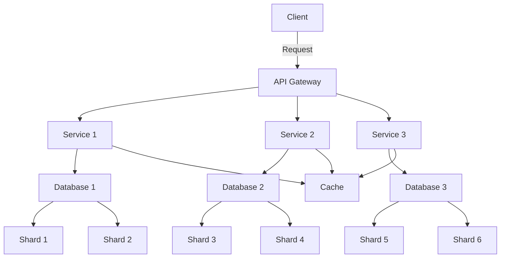

## 17.3 Scalability Considerations

In the ever-evolving landscape of software development, scalability is a critical factor that can determine the success or failure of an application. As systems grow in complexity and user base, they must be designed to handle increased loads and data volumes efficiently. This section delves into the scalability considerations that expert software engineers and enterprise architects must keep in mind when working with C# design patterns. We will explore strategies for designing systems that can grow seamlessly, address the challenges of distributed systems, and employ patterns that enhance reliability and fault tolerance.

### Designing for Growth

Scalability is the ability of a system to handle increased load without compromising performance. Designing for growth involves anticipating future demands and ensuring that the system can accommodate them. Let's explore some key strategies for achieving scalability in C# applications.

#### Using Patterns that Support Scalability

Design patterns play a crucial role in building scalable systems. They provide proven solutions to common problems and help maintain code quality and manageability. Here are some patterns that are particularly useful for scalability:

1. **Microservices Architecture**: This architectural style structures an application as a collection of loosely coupled services. Each service is independently deployable and scalable, allowing for fine-grained scaling based on demand.

2. **Event-Driven Architecture**: This pattern decouples components through events, enabling asynchronous communication and reducing dependencies. It allows systems to scale by processing events in parallel.

3. **CQRS (Command Query Responsibility Segregation)**: This pattern separates read and write operations, allowing each to be scaled independently. It is particularly useful in systems with high read or write loads.

4. **Load Balancing**: Distributing incoming requests across multiple servers ensures that no single server becomes a bottleneck. This pattern enhances both availability and scalability.

5. **Caching**: Implementing caching strategies can significantly reduce the load on databases and improve response times. Patterns like Cache-Aside and Write-Through are commonly used.

6. **Database Sharding**: This technique involves partitioning a database into smaller, more manageable pieces, or shards, which can be distributed across multiple servers.

#### Planning for Increased Load and Data

To effectively plan for increased load and data, consider the following:

- **Capacity Planning**: Estimate future resource requirements based on expected growth. This includes CPU, memory, storage, and network bandwidth.

- **Horizontal Scaling**: Add more servers to handle increased load. This is often more cost-effective and flexible than vertical scaling (upgrading existing servers).

- **Elasticity**: Implement mechanisms to automatically scale resources up or down based on demand. Cloud platforms like Azure and AWS provide services for elastic scaling.

- **Monitoring and Metrics**: Continuously monitor system performance and collect metrics to identify bottlenecks and optimize resource allocation.

### Distributed Systems

Distributed systems are inherently complex, with components spread across multiple networked computers. They offer scalability and fault tolerance but come with their own set of challenges. Let's explore how to address these challenges and employ patterns that enhance reliability.

#### Addressing Challenges in Distributed Environments

Distributed systems face several challenges, including:

- **Network Latency**: Communication between distributed components can introduce latency. Minimize latency by optimizing network paths and using efficient communication protocols.

- **Data Consistency**: Ensuring data consistency across distributed components can be challenging. Use patterns like Eventual Consistency and Saga to manage consistency.

- **Fault Tolerance**: Distributed systems must be resilient to failures. Implement redundancy and failover mechanisms to ensure high availability.

- **Security**: Protect data and communication channels in distributed systems. Use encryption, authentication, and authorization to secure interactions.

#### Patterns for Reliability and Fault Tolerance

1. **Circuit Breaker Pattern**: This pattern prevents a system from repeatedly trying to execute an operation that's likely to fail, allowing it to recover gracefully.

2. **Bulkhead Pattern**: Isolate different parts of a system to prevent a failure in one component from cascading to others.

3. **Retry Pattern**: Automatically retry failed operations with exponential backoff to handle transient failures.

4. **Service Discovery**: Automatically detect and connect to services in a distributed system, ensuring that components can communicate even as the system scales.

5. **Health Check Pattern**: Regularly monitor the health of system components and take corrective actions if any component is unhealthy.

6. **Distributed Caching**: Use distributed caching solutions like Redis or Memcached to share cached data across multiple servers, reducing load and improving performance.

### Code Examples

Let's explore some code examples to illustrate these concepts.

#### Example: Implementing a Circuit Breaker in C#

```csharp
using System;
using System.Threading;

public class CircuitBreaker
{
    private int failureCount = 0;
    private readonly int failureThreshold;
    private readonly TimeSpan openTimeout;
    private DateTime lastFailureTime;
    private CircuitState state = CircuitState.Closed;

    public CircuitBreaker(int failureThreshold, TimeSpan openTimeout)
    {
        this.failureThreshold = failureThreshold;
        this.openTimeout = openTimeout;
    }

    public void Execute(Action action)
    {
        if (state == CircuitState.Open && DateTime.UtcNow - lastFailureTime < openTimeout)
        {
            throw new CircuitBreakerOpenException();
        }

        try
        {
            action();
            Reset();
        }
        catch (Exception)
        {
            failureCount++;
            lastFailureTime = DateTime.UtcNow;

            if (failureCount >= failureThreshold)
            {
                state = CircuitState.Open;
            }

            throw;
        }
    }

    private void Reset()
    {
        failureCount = 0;
        state = CircuitState.Closed;
    }
}

public enum CircuitState
{
    Closed,
    Open
}

public class CircuitBreakerOpenException : Exception { }

// Usage
public class Program
{
    public static void Main()
    {
        var circuitBreaker = new CircuitBreaker(3, TimeSpan.FromSeconds(10));

        for (int i = 0; i < 5; i++)
        {
            try
            {
                circuitBreaker.Execute(() =>
                {
                    Console.WriteLine("Attempting operation...");
                    throw new Exception("Operation failed");
                });
            }
            catch (CircuitBreakerOpenException)
            {
                Console.WriteLine("Circuit breaker is open. Skipping operation.");
            }
            catch (Exception ex)
            {
                Console.WriteLine(ex.Message);
            }

            Thread.Sleep(2000);
        }
    }
}
```

In this example, we implement a simple circuit breaker that opens after three consecutive failures and remains open for 10 seconds before allowing further attempts.

#### Example: Implementing a Retry Pattern in C#

```csharp
using System;
using System.Threading.Tasks;

public class RetryPolicy
{
    private readonly int maxRetries;
    private readonly TimeSpan delay;

    public RetryPolicy(int maxRetries, TimeSpan delay)
    {
        this.maxRetries = maxRetries;
        this.delay = delay;
    }

    public async Task ExecuteAsync(Func<Task> action)
    {
        int attempt = 0;
        while (attempt < maxRetries)
        {
            try
            {
                await action();
                return;
            }
            catch (Exception)
            {
                attempt++;
                if (attempt >= maxRetries)
                {
                    throw;
                }
                await Task.Delay(delay);
            }
        }
    }
}

// Usage
public class Program
{
    public static async Task Main()
    {
        var retryPolicy = new RetryPolicy(3, TimeSpan.FromSeconds(2));

        try
        {
            await retryPolicy.ExecuteAsync(async () =>
            {
                Console.WriteLine("Attempting operation...");
                throw new Exception("Operation failed");
            });
        }
        catch (Exception ex)
        {
            Console.WriteLine($"Operation failed after retries: {ex.Message}");
        }
    }
}
```

This example demonstrates a retry policy that attempts an operation up to three times with a two-second delay between attempts.

### Visualizing Scalability Patterns

To better understand how these patterns work together in a scalable system, let's visualize a typical microservices architecture using Mermaid.js.



**Diagram Description**: This diagram illustrates a microservices architecture where an API Gateway routes client requests to different services. Each service interacts with its own database, which may be sharded for scalability. A shared cache is used to improve performance.

### References and Links

For further reading on scalability and design patterns, consider the following resources:

- [Microsoft Docs: Scalability Patterns](https://docs.microsoft.com/en-us/azure/architecture/patterns/category/scalability)
- [Martin Fowler: Microservices](https://martinfowler.com/articles/microservices.html)
- [AWS Well-Architected Framework](https://aws.amazon.com/architecture/well-architected/)

### Knowledge Check

To reinforce your understanding of scalability considerations, let's pose some questions and challenges:

1. **Question**: What are the key differences between horizontal and vertical scaling?
2. **Challenge**: Implement a simple load balancer in C# that distributes requests across multiple servers.
3. **Question**: How does the Circuit Breaker pattern enhance fault tolerance in distributed systems?
4. **Challenge**: Modify the retry pattern example to include exponential backoff.

### Embrace the Journey

Remember, scalability is not a one-time effort but an ongoing process. As your system grows, continue to monitor, optimize, and adapt your architecture to meet new challenges. Keep experimenting, stay curious, and enjoy the journey of building scalable and resilient applications.

## Quiz Time!



### What is the primary goal of scalability in software systems?

- [x] To handle increased load without compromising performance
- [ ] To reduce the number of servers required
- [ ] To simplify the codebase
- [ ] To eliminate all network latency

> **Explanation:** Scalability aims to ensure that a system can handle increased load efficiently, maintaining performance as demand grows.

### Which pattern is particularly useful for separating read and write operations in a system?

- [ ] Circuit Breaker
- [x] CQRS
- [ ] Bulkhead
- [ ] Retry

> **Explanation:** CQRS (Command Query Responsibility Segregation) separates read and write operations, allowing each to be scaled independently.

### What is a common challenge in distributed systems?

- [ ] Simplifying code
- [x] Network latency
- [ ] Reducing server count
- [ ] Eliminating caching

> **Explanation:** Network latency is a common challenge in distributed systems due to communication between components over a network.

### Which pattern helps prevent a system from repeatedly trying to execute an operation that's likely to fail?

- [x] Circuit Breaker
- [ ] Load Balancing
- [ ] Sharding
- [ ] Event Sourcing

> **Explanation:** The Circuit Breaker pattern prevents repeated execution of operations likely to fail, allowing the system to recover gracefully.

### What is the benefit of using a shared cache in a microservices architecture?

- [x] Reduces load and improves performance
- [ ] Increases network latency
- [ ] Simplifies code
- [ ] Eliminates the need for databases

> **Explanation:** A shared cache reduces load on databases and improves performance by storing frequently accessed data.

### What is the primary advantage of horizontal scaling?

- [x] Adding more servers to handle increased load
- [ ] Upgrading existing servers
- [ ] Reducing the number of servers
- [ ] Simplifying the codebase

> **Explanation:** Horizontal scaling involves adding more servers to handle increased load, offering flexibility and cost-effectiveness.

### Which pattern automatically detects and connects to services in a distributed system?

- [x] Service Discovery
- [ ] Circuit Breaker
- [ ] Bulkhead
- [ ] Retry

> **Explanation:** Service Discovery automatically detects and connects to services, ensuring communication in a distributed system.

### What is a key consideration when implementing elasticity in a system?

- [ ] Simplifying code
- [x] Automatically scaling resources based on demand
- [ ] Reducing server count
- [ ] Eliminating caching

> **Explanation:** Elasticity involves automatically scaling resources up or down based on demand, ensuring efficient resource use.

### Which pattern isolates different parts of a system to prevent cascading failures?

- [x] Bulkhead
- [ ] Circuit Breaker
- [ ] Retry
- [ ] Load Balancing

> **Explanation:** The Bulkhead pattern isolates system parts to prevent failures in one component from affecting others.

### True or False: Distributed systems do not require security measures.

- [ ] True
- [x] False

> **Explanation:** Distributed systems require robust security measures, including encryption, authentication, and authorization, to protect data and communication channels.


