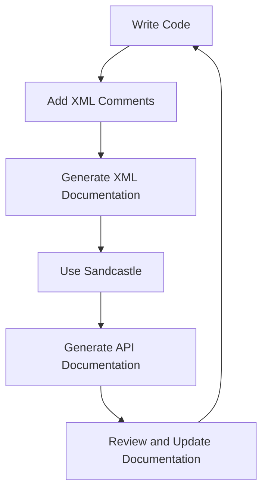

## 17.4 Documentation and Maintainability

In the realm of software development, particularly when dealing with C# design patterns, documentation and maintainability are critical components that ensure the longevity and adaptability of your codebase. As expert software engineers and enterprise architects, it is essential to master these aspects to build robust, scalable, and maintainable applications. This section delves into the best practices for documenting and maintaining C# code, focusing on commenting, code style, and utilizing documentation tools effectively.

### Introduction to Documentation and Maintainability

Documentation and maintainability are often seen as the backbone of successful software projects. They ensure that code is not only understandable by its original authors but also by other developers who may work on it in the future. This is particularly important in large-scale enterprise applications where multiple teams may be involved over the lifecycle of the software.

#### Why Documentation Matters

Documentation serves as a guide for developers, providing insights into the code's functionality, design decisions, and usage. It helps in:

- **Understanding Code**: Well-documented code is easier to understand and modify.
- **Onboarding New Developers**: New team members can quickly get up to speed with the project.
- **Reducing Errors**: Clear documentation can help prevent misunderstandings that lead to bugs.
- **Facilitating Maintenance**: Documentation makes it easier to update and maintain the code over time.

#### The Role of Maintainability

Maintainability refers to the ease with which a software system can be modified to correct defects, improve performance, or adapt to a changed environment. Key factors influencing maintainability include:

- **Code Clarity**: Clear and concise code is easier to maintain.
- **Consistent Style**: A consistent coding style across the project aids in readability.
- **Modular Design**: Breaking down code into smaller, reusable components enhances maintainability.

### Commenting and Code Style

Commenting and code style are fundamental to writing clear, maintainable code. They ensure that code is not only functional but also understandable and consistent.

#### Writing Clear, Maintainable Code

Clear and maintainable code is characterized by:

- **Descriptive Naming**: Use meaningful names for variables, methods, and classes. Avoid abbreviations and ensure that names convey the purpose of the code element.
- **Consistent Formatting**: Adhere to a consistent code formatting style. This includes indentation, spacing, and line length.
- **Logical Structure**: Organize code logically, grouping related functionality together and separating concerns.

#### Consistent Naming Conventions

Consistent naming conventions are crucial for readability and maintainability. In C#, follow these guidelines:

- **PascalCase**: Use for class names, method names, and properties.
- **camelCase**: Use for local variables and method parameters.
- **ALL_CAPS**: Use for constants.

#### Commenting Best Practices

Comments should enhance understanding without cluttering the code. Follow these best practices:

- **Use Comments Sparingly**: Only comment on complex logic or non-obvious code. Avoid stating the obvious.
- **Keep Comments Up-to-Date**: Ensure comments reflect the current state of the code.
- **Use XML Comments**: In C#, XML comments can be used to generate documentation. They provide a structured way to describe code elements.

```csharp
/// <summary>
/// Calculates the sum of two integers.
/// </summary>
/// <param name="a">The first integer.</param>
/// <param name="b">The second integer.</param>
/// <returns>The sum of the two integers.</returns>
public int Add(int a, int b)
{
    return a + b;
}
```

### Documentation Tools

Documentation tools play a vital role in generating and maintaining comprehensive documentation for your codebase. In the C# ecosystem, several tools can help automate and streamline this process.

#### Using XML Comments

XML comments are a powerful feature in C# that allows developers to document their code directly within the source files. These comments can be used to generate API documentation and provide insights into the code's functionality.

- **Benefits of XML Comments**: They integrate seamlessly with Visual Studio, providing IntelliSense support and enabling the generation of documentation files.
- **Structure of XML Comments**: XML comments use specific tags such as `<summary>`, `<param>`, and `<returns>` to describe code elements.

#### Generating API Documentation with Sandcastle

Sandcastle is a popular tool for generating API documentation from XML comments in C#. It produces documentation in various formats, including HTML and CHM.

- **Setting Up Sandcastle**: Install Sandcastle and configure it to read XML documentation files generated by your C# project.
- **Customizing Output**: Customize the appearance and content of the generated documentation to suit your needs.

### Visualizing Documentation and Maintainability

To better understand the relationship between documentation and maintainability, let's visualize the process using a Mermaid.js diagram. This diagram illustrates the flow of creating and maintaining documentation in a C# project.



**Diagram Description**: This flowchart represents the iterative process of writing code, adding XML comments, generating XML documentation, using Sandcastle to create API documentation, and reviewing and updating the documentation as needed.

### Practical Tips for Documentation and Maintainability

Here are some practical tips to enhance documentation and maintainability in your C# projects:

- **Automate Documentation Generation**: Use build scripts to automate the generation of documentation, ensuring it is always up-to-date.
- **Incorporate Documentation Reviews**: Include documentation reviews as part of your code review process.
- **Encourage Team Collaboration**: Foster a culture of collaboration where team members contribute to and maintain documentation.
- **Leverage Version Control**: Use version control systems to track changes in documentation alongside code changes.

### Try It Yourself

To reinforce your understanding of documentation and maintainability, try the following exercises:

1. **Add XML Comments**: Take a piece of code from your project and add XML comments to describe its functionality.
2. **Generate Documentation**: Use Sandcastle or another tool to generate API documentation from your XML comments.
3. **Review and Update**: Review the generated documentation and update any outdated or incorrect information.

### Knowledge Check

Let's summarize the key takeaways from this section:

- Documentation and maintainability are crucial for the success of software projects.
- Clear, maintainable code is characterized by descriptive naming, consistent formatting, and logical structure.
- XML comments and tools like Sandcastle are essential for generating comprehensive documentation.
- Regularly review and update documentation to ensure it remains accurate and useful.

### Embrace the Journey

Remember, mastering documentation and maintainability is an ongoing journey. As you continue to develop your skills, you'll find that well-documented and maintainable code not only benefits your current projects but also enhances your overall effectiveness as a software engineer. Keep experimenting, stay curious, and enjoy the journey!

## Quiz Time!



### What is the primary purpose of documentation in software development?

- [x] To provide insights into the code's functionality and design decisions.
- [ ] To increase the file size of the project.
- [ ] To make the code run faster.
- [ ] To confuse new developers.

> **Explanation:** Documentation serves as a guide for developers, providing insights into the code's functionality, design decisions, and usage.

### Which of the following is NOT a benefit of maintainability?

- [ ] Easier code updates.
- [ ] Improved performance.
- [x] Increased code complexity.
- [ ] Reduced errors.

> **Explanation:** Maintainability aims to make code easier to update and modify, not to increase complexity.

### What is the recommended naming convention for class names in C#?

- [x] PascalCase
- [ ] camelCase
- [ ] snake_case
- [ ] kebab-case

> **Explanation:** In C#, class names should follow the PascalCase naming convention.

### Which tool is commonly used to generate API documentation from XML comments in C#?

- [x] Sandcastle
- [ ] Javadoc
- [ ] Doxygen
- [ ] Swagger

> **Explanation:** Sandcastle is a popular tool for generating API documentation from XML comments in C#.

### What is the purpose of XML comments in C#?

- [x] To document code elements and generate API documentation.
- [ ] To increase code execution speed.
- [ ] To obfuscate code.
- [ ] To reduce file size.

> **Explanation:** XML comments are used to document code elements and generate API documentation.

### Which of the following is a best practice for commenting code?

- [x] Use comments sparingly and only for complex logic.
- [ ] Comment every line of code.
- [ ] Use comments to restate the obvious.
- [ ] Avoid comments altogether.

> **Explanation:** Comments should be used sparingly and only for complex logic or non-obvious code.

### What should be included in a code review process to enhance documentation?

- [x] Documentation reviews
- [ ] Code obfuscation
- [ ] Performance testing
- [ ] Security audits

> **Explanation:** Including documentation reviews in the code review process helps ensure that documentation is accurate and up-to-date.

### What is a key factor influencing maintainability?

- [x] Code clarity
- [ ] Code obfuscation
- [ ] Code duplication
- [ ] Code complexity

> **Explanation:** Code clarity is a key factor influencing maintainability, as clear code is easier to understand and modify.

### Which of the following is a benefit of using version control for documentation?

- [x] Tracking changes in documentation alongside code changes.
- [ ] Increasing the size of documentation files.
- [ ] Making documentation harder to read.
- [ ] Obfuscating documentation content.

> **Explanation:** Version control systems help track changes in documentation alongside code changes, ensuring consistency.

### True or False: Consistent naming conventions are not important for maintainability.

- [ ] True
- [x] False

> **Explanation:** Consistent naming conventions are crucial for readability and maintainability, making code easier to understand and modify.


