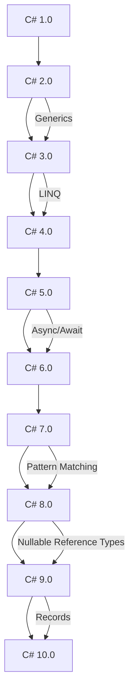

## 17.5 Keeping Up with Language Features

In the fast-evolving world of software development, staying current with the latest language features is crucial for maintaining a competitive edge. This section will guide you through leveraging new C# features and adopting continuous learning strategies to enhance your skills as an expert software engineer or enterprise architect.

### Leveraging New C# Features

#### Adopting Features from the Latest C# Versions

C# is a language that continuously evolves, introducing new features and enhancements with each version. As a developer, it's essential to adopt these features to write more efficient, readable, and maintainable code. Let's explore some of the recent advancements in C# and how you can integrate them into your projects.

##### Records and Immutability

C# 9.0 introduced records, a reference type that provides built-in functionality for encapsulating data. Records are immutable by default, making them ideal for scenarios where you need to ensure data consistency and thread safety.

```csharp
public record Person(string FirstName, string LastName);

var person1 = new Person("John", "Doe");
var person2 = person1 with { LastName = "Smith" };

// person1 remains unchanged, while person2 is a new instance with an updated LastName
```

**Key Benefits:**
- Simplifies the creation of data-carrying classes.
- Enhances code readability and maintainability.
- Provides built-in value-based equality.

##### Pattern Matching Enhancements

Pattern matching has been significantly enhanced in recent C# versions, allowing for more expressive and concise code. These enhancements include switch expressions, relational patterns, and logical patterns.

```csharp
int number = 42;
string description = number switch
{
    < 0 => "Negative",
    0 => "Zero",
    > 0 => "Positive",
    _ => "Unknown"
};

// Output: "Positive"
```

**Key Benefits:**
- Reduces boilerplate code.
- Increases code clarity and expressiveness.
- Facilitates complex conditional logic.

##### Asynchronous Streams

Asynchronous streams, introduced in C# 8.0, allow you to work with streams of data asynchronously using the `IAsyncEnumerable<T>` interface. This feature is particularly useful for processing large datasets or handling real-time data.

```csharp
public async IAsyncEnumerable<int> GenerateNumbersAsync()
{
    for (int i = 0; i < 10; i++)
    {
        await Task.Delay(1000); // Simulate asynchronous work
        yield return i;
    }
}

await foreach (var number in GenerateNumbersAsync())
{
    Console.WriteLine(number);
}
```

**Key Benefits:**
- Efficiently handles asynchronous data streams.
- Reduces memory usage by processing data on-the-fly.
- Simplifies asynchronous programming patterns.

##### Nullable Reference Types

Nullable reference types, introduced in C# 8.0, help you avoid null reference exceptions by making nullability explicit in your code. This feature encourages better design practices and improves code safety.

```csharp
#nullable enable
public class Example
{
    public string? Name { get; set; } // Nullable reference type
    public string Description { get; set; } = string.Empty; // Non-nullable reference type
}
```

**Key Benefits:**
- Reduces runtime errors related to null references.
- Encourages explicit handling of nullability.
- Improves code reliability and robustness.

##### Try It Yourself

To fully grasp these new features, try modifying the code examples above. Experiment with creating your own records, utilizing pattern matching in different scenarios, and implementing asynchronous streams in a sample project. This hands-on approach will solidify your understanding and help you integrate these features into your workflow.

#### Utilizing Language Enhancements to Improve Code

In addition to adopting new features, leveraging language enhancements can significantly improve your codebase. Let's explore some strategies for utilizing these enhancements effectively.

##### Embrace Expression-Bodied Members

Expression-bodied members allow you to write concise and readable code by using expressions instead of statements. This feature can be applied to methods, properties, and even constructors.

```csharp
public class Circle
{
    public double Radius { get; }
    public Circle(double radius) => Radius = radius;

    public double Area => Math.PI * Radius * Radius; // Expression-bodied property
}
```

**Key Benefits:**
- Reduces code verbosity.
- Enhances code readability.
- Encourages functional programming practices.

##### Leverage LINQ for Data Manipulation

Language Integrated Query (LINQ) is a powerful feature in C# that allows you to query and manipulate data in a declarative manner. By leveraging LINQ, you can write more concise and expressive code for data operations.

```csharp
var numbers = new[] { 1, 2, 3, 4, 5 };
var evenNumbers = numbers.Where(n => n % 2 == 0).ToList();

// Output: [2, 4]
```

**Key Benefits:**
- Simplifies data querying and manipulation.
- Promotes functional programming paradigms.
- Enhances code readability and maintainability.

##### Utilize Async/Await for Asynchronous Programming

Asynchronous programming is essential for building responsive and scalable applications. The async/await pattern in C# simplifies asynchronous code, making it easier to read and maintain.

```csharp
public async Task<string> FetchDataAsync(string url)
{
    using var client = new HttpClient();
    var response = await client.GetStringAsync(url);
    return response;
}
```

**Key Benefits:**
- Improves application responsiveness.
- Simplifies asynchronous code structure.
- Enhances scalability and performance.

##### Implement Extension Methods for Code Reusability

Extension methods allow you to add new functionality to existing types without modifying their source code. This feature promotes code reusability and separation of concerns.

```csharp
public static class StringExtensions
{
    public static bool IsNullOrEmpty(this string? value) => string.IsNullOrEmpty(value);
}

string? text = null;
bool isEmpty = text.IsNullOrEmpty(); // Extension method usage
```

**Key Benefits:**
- Enhances code modularity and reusability.
- Promotes separation of concerns.
- Simplifies code maintenance and testing.

### Continuous Learning

#### Engaging with Community Resources

To keep up with the latest C# features and best practices, it's essential to engage with the developer community. Here are some ways to stay connected and informed.

##### Follow Influential Blogs and Websites

There are numerous blogs and websites dedicated to C# and .NET development. Following these resources can provide you with valuable insights, tutorials, and updates on the latest language features.

- [Microsoft .NET Blog](https://devblogs.microsoft.com/dotnet/)
- [C# Corner](https://www.c-sharpcorner.com/)
- [CodeProject](https://www.codeproject.com/)

##### Participate in Online Forums and Communities

Online forums and communities are excellent platforms for discussing C# topics, sharing knowledge, and seeking advice from fellow developers.

- [Stack Overflow](https://stackoverflow.com/)
- [Reddit's r/csharp](https://www.reddit.com/r/csharp/)
- [GitHub Discussions](https://github.com/)

##### Explore Open Source Projects

Contributing to open source projects is a great way to learn from experienced developers and gain practical experience with the latest C# features.

- [Awesome .NET](https://github.com/quozd/awesome-dotnet)
- [dotnet/runtime](https://github.com/dotnet/runtime)

#### Attending Meetups and Conferences

Meetups and conferences provide opportunities to network with other developers, learn from industry experts, and stay updated on the latest trends and technologies.

##### Attend Local Meetups

Local meetups are informal gatherings where developers can share knowledge, discuss projects, and collaborate on new ideas. Platforms like [Meetup](https://www.meetup.com/) can help you find C# and .NET meetups in your area.

##### Participate in Conferences

Conferences offer a wealth of knowledge through keynote speeches, workshops, and panel discussions. Some popular C# and .NET conferences include:

- [Microsoft Build](https://www.microsoft.com/en-us/build)
- [.NET Conf](https://www.dotnetconf.net/)
- [NDC Conferences](https://ndcconferences.com/)

##### Engage in Online Webinars and Workshops

Online webinars and workshops provide flexible learning opportunities, allowing you to gain insights from experts without leaving your home. Keep an eye on platforms like [Pluralsight](https://www.pluralsight.com/) and [Udemy](https://www.udemy.com/) for upcoming events.

### Visualizing the Evolution of C# Features

To better understand the evolution of C# features, let's visualize the progression of key language enhancements over the years.



**Diagram Description:** This diagram illustrates the evolution of C# features from version 1.0 to 10.0, highlighting key enhancements such as generics, LINQ, async/await, pattern matching, nullable reference types, and records.

### Knowledge Check

To reinforce your understanding of the latest C# features and continuous learning strategies, consider the following questions:

- How can records improve data consistency and thread safety in your applications?
- What are the benefits of using pattern matching in your code?
- How can asynchronous streams enhance the performance of your applications?
- Why is it important to engage with the developer community and attend conferences?

### Embrace the Journey

Remember, keeping up with language features is an ongoing journey. As you explore new C# advancements and engage with the developer community, you'll continue to grow as a software engineer or enterprise architect. Stay curious, keep experimenting, and enjoy the process of learning and adapting to the ever-evolving world of C# development.

## Quiz Time!



### What is a key benefit of using records in C#?

- [x] Simplifies the creation of data-carrying classes
- [ ] Increases code verbosity
- [ ] Reduces code readability
- [ ] Decreases code maintainability

> **Explanation:** Records simplify the creation of data-carrying classes by providing built-in functionality for encapsulating data, enhancing code readability and maintainability.

### How does pattern matching enhance C# code?

- [x] Reduces boilerplate code
- [ ] Increases code complexity
- [ ] Decreases code clarity
- [ ] Limits conditional logic

> **Explanation:** Pattern matching reduces boilerplate code and increases code clarity by allowing for more expressive and concise conditional logic.

### What is the primary advantage of asynchronous streams?

- [x] Efficiently handles asynchronous data streams
- [ ] Increases memory usage
- [ ] Complicates asynchronous programming
- [ ] Reduces data processing speed

> **Explanation:** Asynchronous streams efficiently handle asynchronous data streams, reducing memory usage by processing data on-the-fly and simplifying asynchronous programming patterns.

### Why are nullable reference types important in C#?

- [x] Reduces runtime errors related to null references
- [ ] Increases the likelihood of null reference exceptions
- [ ] Decreases code reliability
- [ ] Limits explicit handling of nullability

> **Explanation:** Nullable reference types reduce runtime errors related to null references by making nullability explicit in your code, improving code reliability and robustness.

### What is a benefit of using expression-bodied members?

- [x] Reduces code verbosity
- [ ] Increases code complexity
- [ ] Decreases code readability
- [ ] Limits functional programming practices

> **Explanation:** Expression-bodied members reduce code verbosity and enhance code readability by allowing you to write concise and readable code using expressions instead of statements.

### How does LINQ improve data manipulation in C#?

- [x] Simplifies data querying and manipulation
- [ ] Increases code verbosity
- [ ] Limits functional programming paradigms
- [ ] Decreases code readability

> **Explanation:** LINQ simplifies data querying and manipulation by allowing you to write more concise and expressive code, promoting functional programming paradigms and enhancing code readability.

### What is the advantage of using async/await in C#?

- [x] Improves application responsiveness
- [ ] Increases code complexity
- [ ] Decreases scalability
- [ ] Limits asynchronous code structure

> **Explanation:** The async/await pattern improves application responsiveness and scalability by simplifying asynchronous code structure, making it easier to read and maintain.

### How do extension methods promote code reusability?

- [x] Enhances code modularity and reusability
- [ ] Increases code coupling
- [ ] Decreases separation of concerns
- [ ] Limits code maintenance

> **Explanation:** Extension methods enhance code modularity and reusability by allowing you to add new functionality to existing types without modifying their source code, promoting separation of concerns.

### Why is engaging with the developer community important?

- [x] Provides valuable insights and updates on the latest language features
- [ ] Limits knowledge sharing
- [ ] Decreases opportunities for collaboration
- [ ] Increases isolation from industry trends

> **Explanation:** Engaging with the developer community provides valuable insights, tutorials, and updates on the latest language features, facilitating knowledge sharing and collaboration.

### True or False: Attending conferences is a valuable way to stay updated on C# trends.

- [x] True
- [ ] False

> **Explanation:** Attending conferences is a valuable way to stay updated on C# trends, as they offer a wealth of knowledge through keynote speeches, workshops, and panel discussions.


