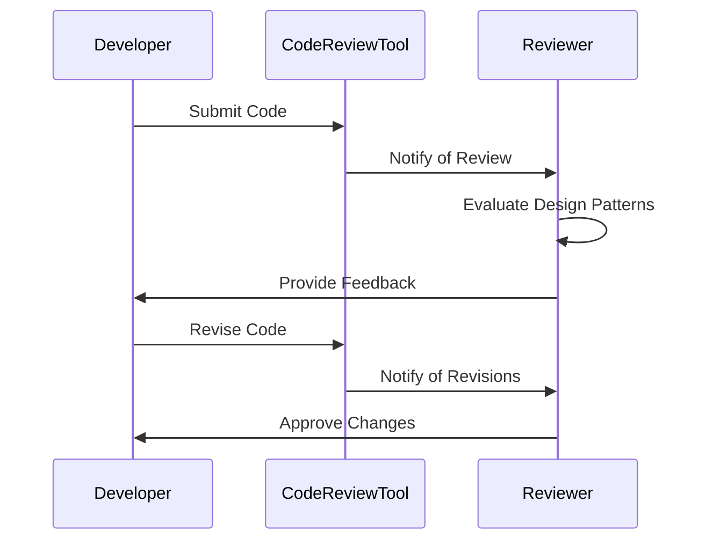

## 17.6 Code Reviews and Design Patterns

In the realm of software development, code reviews serve as a critical checkpoint for ensuring code quality, maintainability, and adherence to best practices. When design patterns are integrated into this process, they can significantly enhance the robustness and scalability of the software. This section delves into the nuances of incorporating design patterns into code reviews, offering strategies for evaluating their use, providing constructive feedback, and fostering a culture of collaborative improvement.

### Incorporating Patterns into Reviews

#### Evaluating the Use of Patterns in Code

Design patterns are proven solutions to recurring problems in software design. During code reviews, it's essential to evaluate whether the chosen patterns are appropriate for the context and are implemented correctly. Here are some key considerations:

1. **Pattern Appropriateness**: Assess whether the design pattern used is suitable for the problem it aims to solve. For instance, using a Singleton pattern for managing a shared resource is appropriate, but it might not be the best choice for a class that requires multiple instances.

2. **Correct Implementation**: Verify that the pattern is implemented according to its intended structure and behavior. Misimplementation can lead to anti-patterns, which can degrade code quality.

3. **Code Readability and Maintainability**: Ensure that the use of design patterns enhances the readability and maintainability of the code. Patterns should simplify understanding, not complicate it.

4. **Performance Considerations**: Evaluate the performance implications of the pattern. Some patterns, like the Decorator, can introduce additional overhead, which might be a concern in performance-critical applications.

5. **Adherence to SOLID Principles**: Check if the pattern implementation adheres to the SOLID principles, which are fundamental to object-oriented design and help in creating scalable and maintainable systems.

#### Providing Constructive Feedback

Providing feedback during code reviews is an art that requires a balance between being critical and supportive. Here are some strategies:

- **Be Specific**: Point out specific areas where the pattern could be improved or where an alternative pattern might be more effective.
  
- **Offer Alternatives**: Suggest alternative patterns or approaches that might better suit the problem at hand.

- **Encourage Best Practices**: Reinforce the importance of adhering to best practices in pattern implementation, such as using interfaces for flexibility or ensuring thread safety in Singleton patterns.

- **Highlight Strengths**: Acknowledge the correct and effective use of patterns, which can reinforce positive behavior and encourage further learning.

### Collaborative Improvement

#### Encouraging Team Discussions on Design

Code reviews should be more than just a checklist exercise; they should be a platform for collaborative learning and improvement. Encouraging team discussions around design patterns can lead to better design decisions and a more cohesive team understanding.

- **Design Pattern Workshops**: Organize workshops where team members can present different design patterns, their use cases, and implementation strategies. This can help in building a shared vocabulary and understanding.

- **Pattern Catalogs**: Maintain a catalog of design patterns used within the organization, along with examples and best practices. This can serve as a reference for developers during code reviews.

- **Design Review Meetings**: Conduct regular design review meetings where complex design decisions and pattern choices are discussed. This can help in aligning the team on design strategies and identifying potential pitfalls early.

#### Sharing Knowledge and Best Practices

Knowledge sharing is a cornerstone of effective teams. By sharing insights and experiences related to design patterns, teams can collectively improve their design skills.

- **Code Review Feedback Sessions**: After code reviews, hold feedback sessions where reviewers and authors can discuss the feedback in detail. This can lead to a deeper understanding of design patterns and their application.

- **Documentation and Guides**: Create comprehensive documentation and guides on design patterns, including when and how to use them. This can be an invaluable resource for both new and experienced developers.

- **Mentorship Programs**: Establish mentorship programs where experienced developers can guide less experienced ones in understanding and applying design patterns effectively.

### Code Example: Evaluating a Singleton Pattern

Let's consider a simple example of a Singleton pattern in C#. We'll evaluate its implementation and provide feedback.

```csharp
public sealed class ConfigurationManager
{
    private static ConfigurationManager _instance = null;
    private static readonly object _lock = new object();

    private ConfigurationManager() { }

    public static ConfigurationManager Instance
    {
        get
        {
            lock (_lock)
            {
                if (_instance == null)
                {
                    _instance = new ConfigurationManager();
                }
                return _instance;
            }
        }
    }

    public string GetConfiguration(string key)
    {
        // Retrieve configuration value based on the key
        return "SampleValue";
    }
}
```

**Feedback and Evaluation:**

- **Thread Safety**: The use of `lock` ensures thread safety, which is crucial for Singleton patterns in multi-threaded environments.
  
- **Lazy Initialization**: The instance is created only when needed, which is a good practice for resource management.

- **Sealed Class**: The class is sealed, preventing inheritance, which is appropriate for Singleton patterns.

- **Improvement Suggestion**: Consider using `Lazy<T>` for a more concise and potentially more efficient implementation.

### Try It Yourself

Encourage experimentation by modifying the Singleton pattern to use `Lazy<T>`:

```csharp
public sealed class ConfigurationManager
{
    private static readonly Lazy<ConfigurationManager> _instance = 
        new Lazy<ConfigurationManager>(() => new ConfigurationManager());

    private ConfigurationManager() { }

    public static ConfigurationManager Instance => _instance.Value;

    public string GetConfiguration(string key)
    {
        // Retrieve configuration value based on the key
        return "SampleValue";
    }
}
```

### Visualizing Design Patterns in Code Reviews

To better understand how design patterns fit into the code review process, let's visualize the workflow using a sequence diagram.



**Diagram Description**: This sequence diagram illustrates the typical workflow of a code review process, highlighting the evaluation of design patterns and the feedback loop between the developer and the reviewer.

### Knowledge Check

To reinforce your understanding, consider the following questions:

- What are the key considerations when evaluating the use of design patterns in code reviews?
- How can constructive feedback be provided effectively during code reviews?
- What are some strategies for encouraging team discussions on design patterns?

### Embrace the Journey

Remember, mastering design patterns and incorporating them into code reviews is a journey. As you progress, you'll develop a deeper understanding of software design principles and improve your ability to create scalable and maintainable applications. Keep experimenting, stay curious, and enjoy the journey!

### References and Links

For further reading on design patterns and code reviews, consider the following resources:

- [Design Patterns: Elements of Reusable Object-Oriented Software](https://en.wikipedia.org/wiki/Design_Patterns) by Erich Gamma, Richard Helm, Ralph Johnson, and John Vlissides.
- [Code Complete: A Practical Handbook of Software Construction](https://en.wikipedia.org/wiki/Code_Complete) by Steve McConnell.
- [Refactoring: Improving the Design of Existing Code](https://martinfowler.com/books/refactoring.html) by Martin Fowler.

## Quiz Time!



### What is a key consideration when evaluating the use of design patterns in code reviews?

- [x] Pattern Appropriateness
- [ ] Code Complexity
- [ ] Language Syntax
- [ ] Developer Experience

> **Explanation:** Pattern appropriateness ensures that the chosen design pattern is suitable for the problem it aims to solve.

### How can constructive feedback be provided during code reviews?

- [x] Be Specific
- [ ] Be Vague
- [ ] Focus on Syntax
- [ ] Ignore Design Patterns

> **Explanation:** Being specific helps in pointing out exact areas of improvement, making feedback actionable.

### What is a benefit of encouraging team discussions on design patterns?

- [x] Improved Design Decisions
- [ ] Increased Code Complexity
- [ ] Faster Code Reviews
- [ ] Reduced Collaboration

> **Explanation:** Team discussions lead to improved design decisions and a shared understanding of best practices.

### Which of the following is a strategy for sharing knowledge and best practices?

- [x] Documentation and Guides
- [ ] Keeping Information Private
- [ ] Avoiding Feedback Sessions
- [ ] Ignoring Best Practices

> **Explanation:** Documentation and guides serve as valuable resources for developers to learn and apply best practices.

### What is an improvement suggestion for the Singleton pattern example provided?

- [x] Use Lazy<T>
- [ ] Remove Thread Safety
- [ ] Allow Inheritance
- [ ] Use Static Constructor

> **Explanation:** Using `Lazy<T>` can provide a more concise and efficient implementation of the Singleton pattern.

### What is the role of a code review tool in the review process?

- [x] Notify of Review
- [ ] Write Code
- [ ] Fix Bugs
- [ ] Design Patterns

> **Explanation:** The code review tool notifies reviewers of the code that needs to be reviewed.

### What is the purpose of a feedback session after code reviews?

- [x] Discuss Feedback in Detail
- [ ] Write New Code
- [ ] Ignore Feedback
- [ ] Increase Complexity

> **Explanation:** Feedback sessions allow for detailed discussions, leading to a better understanding of design patterns.

### What is a key benefit of using design patterns in code?

- [x] Enhanced Maintainability
- [ ] Increased Complexity
- [ ] Reduced Performance
- [ ] Limited Flexibility

> **Explanation:** Design patterns enhance maintainability by providing proven solutions to common design problems.

### What is the significance of the SOLID principles in design patterns?

- [x] They ensure scalable and maintainable systems.
- [ ] They increase code complexity.
- [ ] They limit design choices.
- [ ] They focus on syntax.

> **Explanation:** The SOLID principles are fundamental to creating scalable and maintainable systems, which is essential in design pattern implementation.

### True or False: Code reviews should be a platform for collaborative learning and improvement.

- [x] True
- [ ] False

> **Explanation:** Code reviews should encourage collaboration and learning, leading to better design decisions and team cohesion.


