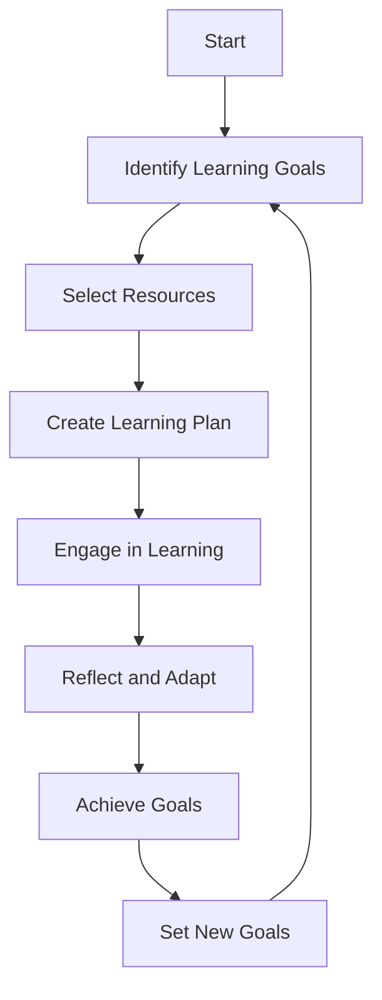

## 17.7 Continual Learning and Adaptation

In the rapidly evolving world of software development, continual learning and adaptation are not just beneficial—they are essential. As expert software engineers and enterprise architects, staying abreast of the latest trends, tools, and techniques is crucial for maintaining a competitive edge and ensuring the success of your projects. This section delves into the importance of embracing change, provides resources for learning, and offers strategies for adapting to new technologies and methodologies.

### Embracing Change

#### Being Open to New Ideas and Methodologies

In the realm of software engineering, change is the only constant. New programming paradigms, frameworks, and tools emerge regularly, challenging established norms and offering new possibilities. As experts, we must cultivate an openness to new ideas and methodologies. This involves:

- **Continuous Curiosity**: Cultivate a mindset of curiosity. Ask questions, explore new technologies, and seek to understand the underlying principles of emerging trends.
- **Critical Evaluation**: Not every new idea will be applicable or beneficial. Develop the ability to critically evaluate new methodologies and determine their relevance to your work.
- **Experimentation**: Don't be afraid to experiment with new tools and techniques. Create small projects or prototypes to test their viability and potential impact on your work.

#### Adapting to Evolving Technologies

The technology landscape is in a state of perpetual evolution. Adapting to these changes requires:

- **Staying Informed**: Regularly read industry publications, blogs, and research papers to stay informed about the latest developments.
- **Networking**: Engage with peers and industry experts through conferences, meetups, and online forums. Networking provides insights into how others are adapting to changes and can offer valuable advice.
- **Skill Development**: Continuously update your skill set. This might involve learning a new programming language, mastering a new framework, or understanding a new architectural pattern.

### Resources for Learning

#### Books, Online Courses, and Tutorials

A wealth of resources is available to aid in continual learning. Here are some recommended avenues:

- **Books**: Books provide in-depth knowledge and are often written by industry experts. Some recommended titles include:
  - "Design Patterns: Elements of Reusable Object-Oriented Software" by Erich Gamma et al.
  - "C# in Depth" by Jon Skeet
  - "Clean Code: A Handbook of Agile Software Craftsmanship" by Robert C. Martin

- **Online Courses**: Platforms like Pluralsight, Coursera, and Udemy offer courses on a wide range of topics, including C# design patterns. These courses often include video lectures, quizzes, and hands-on projects.

- **Tutorials and Blogs**: Websites like Medium, Dev.to, and personal blogs of industry experts provide tutorials and insights into specific topics. These resources are often more current than books and can offer practical, real-world examples.

#### Leveraging Platforms like Pluralsight and Coursera

Online learning platforms are invaluable for structured learning. Here's how to make the most of them:

- **Curated Learning Paths**: Many platforms offer curated learning paths that guide you through a series of courses designed to build your skills progressively.
- **Hands-On Projects**: Look for courses that include hands-on projects or labs. These provide practical experience and help reinforce learning.
- **Community Engagement**: Engage with the community features of these platforms. Participate in discussions, ask questions, and share your insights.

### Strategies for Continual Learning

#### Setting Learning Goals

Establish clear learning goals to guide your educational journey. Consider the following:

- **Short-Term Goals**: Identify specific skills or knowledge areas you want to acquire in the near future. These could be related to a current project or an emerging technology.
- **Long-Term Goals**: Consider your career aspirations and set long-term goals that align with them. This might involve mastering a particular domain or achieving a certification.

#### Creating a Learning Plan

A structured learning plan can help you stay focused and organized. Here’s how to create one:

- **Identify Resources**: List the books, courses, and other resources you plan to use.
- **Schedule Time**: Dedicate regular time slots for learning. Consistency is key to making progress.
- **Track Progress**: Keep track of your progress and adjust your plan as needed. Celebrate milestones to stay motivated.

#### Embracing Lifelong Learning

Lifelong learning is a mindset that goes beyond formal education. It involves:

- **Curiosity and Exploration**: Stay curious and explore topics beyond your immediate needs. This broadens your perspective and can lead to unexpected insights.
- **Reflection and Adaptation**: Regularly reflect on what you’ve learned and how it applies to your work. Be willing to adapt your approach based on new insights.

### Adapting to New Technologies

#### Understanding the Impact of Emerging Technologies

Emerging technologies can have a profound impact on software development. To adapt effectively:

- **Analyze Trends**: Identify trends that are relevant to your domain. Consider their potential impact on your projects and organization.
- **Evaluate Tools**: Assess new tools and frameworks for their applicability and benefits. Consider factors like ease of integration, community support, and long-term viability.

#### Integrating New Technologies into Your Workflow

Successfully integrating new technologies requires careful planning:

- **Pilot Projects**: Start with small pilot projects to test new technologies. This minimizes risk and provides valuable insights.
- **Collaboration**: Work with your team to integrate new technologies. Collaboration fosters knowledge sharing and ensures a smoother transition.
- **Documentation and Training**: Provide documentation and training to support the adoption of new technologies. This helps ensure that everyone is on the same page and can use the new tools effectively.

### Visualizing the Learning Journey

To better understand the process of continual learning and adaptation, let's visualize it using a flowchart:

**Figure 1: Visualizing the Continual Learning Journey**

This flowchart illustrates the cyclical nature of continual learning. It begins with identifying learning goals, selecting resources, and creating a learning plan. Engaging in learning leads to reflection and adaptation, ultimately resulting in achieving goals and setting new ones.

### Knowledge Check

To reinforce your understanding of continual learning and adaptation, consider the following questions:

1. Why is continual learning important for software engineers and enterprise architects?
2. How can you critically evaluate new methodologies and technologies?
3. What are some effective strategies for setting and achieving learning goals?
4. How can online learning platforms be leveraged for continual learning?
5. What steps can you take to integrate new technologies into your workflow?

### Embrace the Journey

Remember, continual learning and adaptation are ongoing processes. As you progress, you'll encounter new challenges and opportunities. Stay curious, be open to change, and enjoy the journey of growth and discovery. By embracing continual learning, you'll not only enhance your skills but also contribute to the success of your projects and organization.

### Quiz Time!



### Why is continual learning important for software engineers?

- [x] To stay updated with evolving technologies
- [ ] To avoid learning new skills
- [ ] To maintain the status quo
- [ ] To reduce workload

> **Explanation:** Continual learning is crucial for staying updated with evolving technologies and maintaining a competitive edge in the industry.

### What is a key benefit of experimenting with new tools and techniques?

- [x] It helps test their viability and potential impact
- [ ] It guarantees success in all projects
- [ ] It eliminates the need for critical evaluation
- [ ] It reduces the need for documentation

> **Explanation:** Experimentation allows you to test the viability and potential impact of new tools and techniques, providing valuable insights.

### How can online learning platforms be leveraged effectively?

- [x] By engaging with community features and participating in discussions
- [ ] By avoiding hands-on projects
- [ ] By only watching video lectures
- [ ] By ignoring curated learning paths

> **Explanation:** Engaging with community features and participating in discussions enhances the learning experience on online platforms.

### What is a recommended strategy for setting learning goals?

- [x] Establish both short-term and long-term goals
- [ ] Focus only on immediate project needs
- [ ] Avoid setting specific goals
- [ ] Set goals without considering career aspirations

> **Explanation:** Establishing both short-term and long-term goals helps guide your educational journey and align with career aspirations.

### How can you integrate new technologies into your workflow?

- [x] Start with small pilot projects
- [ ] Implement them immediately in all projects
- [ ] Avoid collaboration with the team
- [ ] Skip documentation and training

> **Explanation:** Starting with small pilot projects minimizes risk and provides valuable insights for integrating new technologies.

### What is the first step in the continual learning journey?

- [x] Identify Learning Goals
- [ ] Engage in Learning
- [ ] Reflect and Adapt
- [ ] Achieve Goals

> **Explanation:** The first step in the continual learning journey is to identify learning goals, which guide the subsequent steps.

### What role does reflection play in continual learning?

- [x] It helps adapt your approach based on new insights
- [ ] It eliminates the need for further learning
- [ ] It guarantees success in all projects
- [ ] It reduces the need for experimentation

> **Explanation:** Reflection helps you adapt your approach based on new insights, contributing to ongoing growth and improvement.

### What is a key component of a structured learning plan?

- [x] Schedule regular time slots for learning
- [ ] Avoid tracking progress
- [ ] Ignore resource identification
- [ ] Set goals without a timeline

> **Explanation:** Scheduling regular time slots for learning ensures consistency and progress in your educational journey.

### What is the impact of networking on continual learning?

- [x] It provides insights and valuable advice from peers and experts
- [ ] It eliminates the need for formal education
- [ ] It guarantees immediate success
- [ ] It reduces the need for self-study

> **Explanation:** Networking provides insights and valuable advice from peers and experts, enhancing your learning experience.

### True or False: Continual learning is a one-time process.

- [ ] True
- [x] False

> **Explanation:** Continual learning is an ongoing process that involves regular updates and adaptation to new technologies and methodologies.



By embracing continual learning and adaptation, you'll not only enhance your skills but also contribute to the success of your projects and organization. Keep experimenting, stay curious, and enjoy the journey of growth and discovery!
