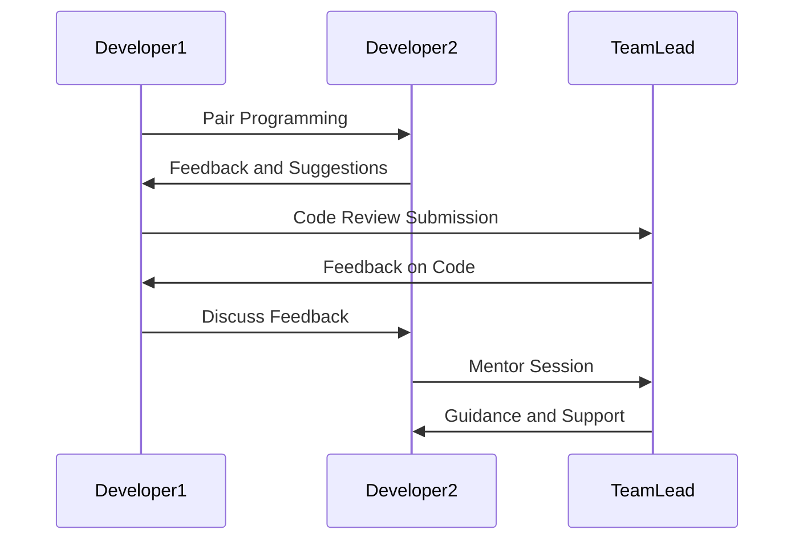

## 17.8 Collaboration and Team Dynamics

In the realm of software development, collaboration and team dynamics are pivotal to the success of any project. As expert software engineers and enterprise architects, understanding and implementing effective teamwork strategies can significantly enhance productivity, innovation, and job satisfaction. This section delves into the intricacies of fostering effective teamwork and communication, with a focus on knowledge sharing and effective communication.

### Fostering Effective Teamwork and Communication

Effective teamwork and communication are the cornerstones of successful software development. They ensure that all team members are aligned with the project's goals and standards, leading to a more cohesive and efficient workflow.

#### Knowledge Sharing

Knowledge sharing is a critical component of team dynamics. It involves the dissemination of information, skills, and expertise among team members to foster a collaborative learning environment. Let's explore some key practices for effective knowledge sharing:

##### Pair Programming

Pair programming is a collaborative approach where two developers work together at one workstation. One developer, the "driver," writes code while the other, the "observer" or "navigator," reviews each line of code as it is typed. The roles are frequently switched to ensure both developers are engaged.

**Benefits of Pair Programming:**

- **Improved Code Quality:** With two sets of eyes on the code, errors are caught early, leading to higher quality code.
- **Knowledge Transfer:** Junior developers can learn from their more experienced counterparts, accelerating their learning curve.
- **Enhanced Problem Solving:** Collaborative problem-solving often leads to more innovative solutions.

**Example of Pair Programming:**

```csharp
// Driver writes the initial implementation
public class Calculator
{
    public int Add(int a, int b)
    {
        return a + b; // Simple addition
    }
}

// Navigator suggests improvements
// Consider edge cases, like overflow
```

**Try It Yourself:** Pair up with a colleague and tackle a small coding task together. Switch roles frequently to experience both perspectives.

##### Code Reviews

Code reviews are a systematic examination of software source code. They are intended to find and fix mistakes overlooked in the initial development phase, improving the overall quality of software.

**Benefits of Code Reviews:**

- **Error Detection:** Identifies bugs and potential issues before they reach production.
- **Knowledge Sharing:** Provides an opportunity for team members to learn from each other.
- **Consistency:** Ensures adherence to coding standards and best practices.

**Code Review Process:**

1. **Preparation:** The author prepares the code for review.
2. **Review:** Peers examine the code and provide feedback.
3. **Rework:** The author addresses the feedback.
4. **Follow-up:** The reviewer checks the changes.

**Example of Code Review Feedback:**

```csharp
// Original Code
public int Divide(int a, int b)
{
    return a / b; // Potential division by zero
}

// Feedback: Add error handling for division by zero
public int Divide(int a, int b)
{
    if (b == 0)
        throw new ArgumentException("Denominator cannot be zero.");
    return a / b;
}
```

**Try It Yourself:** Conduct a code review session with your team. Focus on constructive feedback and learning opportunities.

##### Mentoring and Teaching Within the Team

Mentoring involves experienced developers guiding less experienced team members. This relationship fosters a culture of continuous learning and development.

**Benefits of Mentoring:**

- **Skill Development:** Accelerates the learning process for mentees.
- **Career Growth:** Provides guidance on career development and growth.
- **Team Cohesion:** Strengthens relationships and trust within the team.

**Mentoring Activities:**

- **Regular Check-ins:** Schedule regular meetings to discuss progress and challenges.
- **Goal Setting:** Help mentees set and achieve professional goals.
- **Knowledge Sharing:** Share insights and experiences to broaden mentees' perspectives.

**Example Mentoring Session:**

- **Topic:** Best practices in C# design patterns.
- **Activity:** Review a design pattern implementation and discuss its applicability.

**Try It Yourself:** Identify a potential mentee in your team and offer to mentor them. Focus on a specific area of expertise.

#### Effective Communication

Effective communication is vital for aligning team members with project goals and ensuring a smooth workflow. It involves clear, respectful dialogue and a shared understanding of objectives.

##### Clear and Respectful Dialogue

Clear and respectful dialogue is essential for maintaining a positive team environment. It involves active listening, empathy, and constructive feedback.

**Strategies for Clear Communication:**

- **Active Listening:** Pay attention to what others are saying without interrupting.
- **Empathy:** Understand and respect different perspectives.
- **Constructive Feedback:** Provide feedback that is specific, actionable, and respectful.

**Example of Constructive Feedback:**

- **Situation:** A team member's code is not adhering to coding standards.
- **Feedback:** "I noticed that the code doesn't follow our naming conventions. Let's review the standards together to ensure consistency."

**Try It Yourself:** Practice active listening in your next team meeting. Focus on understanding others' perspectives before responding.

##### Aligning on Project Goals and Standards

Aligning on project goals and standards ensures that all team members are working towards the same objectives. It involves setting clear expectations and maintaining open communication.

**Strategies for Alignment:**

- **Regular Meetings:** Schedule regular team meetings to discuss progress and challenges.
- **Documentation:** Maintain clear and accessible documentation of project goals and standards.
- **Feedback Loops:** Establish feedback loops to ensure continuous alignment.

**Example of Project Alignment:**

- **Goal:** Deliver a high-quality software product.
- **Standards:** Adhere to coding standards, conduct regular code reviews, and prioritize testing.

**Try It Yourself:** Organize a team meeting to review project goals and standards. Encourage open discussion and feedback.

### Visualizing Team Dynamics

To better understand team dynamics, let's visualize the flow of communication and collaboration within a team using a sequence diagram.



**Diagram Description:** This sequence diagram illustrates the interaction between two developers and a team lead during pair programming, code review, and mentoring sessions.

### References and Links

For further reading on collaboration and team dynamics, consider the following resources:

- [Atlassian's Guide to Team Collaboration](https://www.atlassian.com/team-playbook/plays)
- [Scrum Alliance: Effective Communication in Teams](https://www.scrumalliance.org/community/articles/2016/august/effective-communication-in-teams)
- [Harvard Business Review: The Secrets of Great Teamwork](https://hbr.org/2016/06/the-secrets-of-great-teamwork)

### Knowledge Check

To reinforce your understanding of collaboration and team dynamics, consider the following questions:

1. What are the benefits of pair programming?
2. How can code reviews improve software quality?
3. What are some strategies for effective communication within a team?
4. How does mentoring contribute to team cohesion?

### Embrace the Journey

Remember, fostering effective collaboration and team dynamics is an ongoing journey. As you continue to develop your skills, you'll find new ways to enhance teamwork and communication within your team. Keep experimenting, stay curious, and enjoy the journey!

### Formatting and Structure

This section has been organized with clear headings and subheadings to facilitate easy navigation. Bullet points have been used to break down complex information, and important terms have been highlighted for emphasis.

### Writing Style

Throughout this section, we have used first-person plural to create a collaborative feel. Gender-specific pronouns have been avoided to ensure inclusivity, and acronyms have been defined upon first use.

## Quiz Time!



### What is one of the main benefits of pair programming?

- [x] Improved code quality
- [ ] Increased individual productivity
- [ ] Reduced need for documentation
- [ ] Less need for testing

> **Explanation:** Pair programming involves two developers working together, which leads to improved code quality through continuous review and collaboration.

### How does code review contribute to knowledge sharing?

- [x] By providing an opportunity for team members to learn from each other
- [ ] By reducing the amount of code written
- [ ] By eliminating the need for documentation
- [ ] By increasing the speed of development

> **Explanation:** Code reviews allow team members to share knowledge and learn from each other's experiences and expertise.

### What is a key strategy for clear communication?

- [x] Active listening
- [ ] Interrupting frequently
- [ ] Avoiding feedback
- [ ] Using technical jargon

> **Explanation:** Active listening involves paying attention to what others are saying and understanding their perspectives, which is crucial for clear communication.

### What is the role of mentoring in a team?

- [x] To guide less experienced team members and foster a culture of learning
- [ ] To increase competition among team members
- [ ] To reduce the need for documentation
- [ ] To eliminate the need for code reviews

> **Explanation:** Mentoring involves guiding less experienced team members, which fosters a culture of continuous learning and development.

### How can regular meetings help in aligning project goals?

- [x] By discussing progress and challenges
- [ ] By reducing the need for documentation
- [ ] By increasing individual productivity
- [ ] By eliminating the need for testing

> **Explanation:** Regular meetings provide a platform for discussing progress and challenges, ensuring that all team members are aligned with project goals.

### What is a benefit of clear and respectful dialogue?

- [x] Maintaining a positive team environment
- [ ] Increasing individual productivity
- [ ] Reducing the need for documentation
- [ ] Eliminating the need for testing

> **Explanation:** Clear and respectful dialogue helps maintain a positive team environment, which is essential for effective collaboration.

### How does mentoring contribute to career growth?

- [x] By providing guidance on career development and growth
- [ ] By reducing the need for documentation
- [ ] By increasing competition among team members
- [ ] By eliminating the need for code reviews

> **Explanation:** Mentoring provides guidance on career development, helping mentees set and achieve professional goals.

### What is a key component of effective teamwork?

- [x] Knowledge sharing
- [ ] Individual productivity
- [ ] Avoiding feedback
- [ ] Using technical jargon

> **Explanation:** Knowledge sharing is essential for effective teamwork, as it fosters a collaborative learning environment.

### How can feedback loops help in project alignment?

- [x] By ensuring continuous alignment with project goals
- [ ] By reducing the need for documentation
- [ ] By increasing individual productivity
- [ ] By eliminating the need for testing

> **Explanation:** Feedback loops provide a mechanism for continuous alignment with project goals, ensuring that all team members are on the same page.

### True or False: Effective communication is only important for team leads.

- [ ] True
- [x] False

> **Explanation:** Effective communication is important for all team members, not just team leads, as it ensures a smooth workflow and alignment with project goals.


