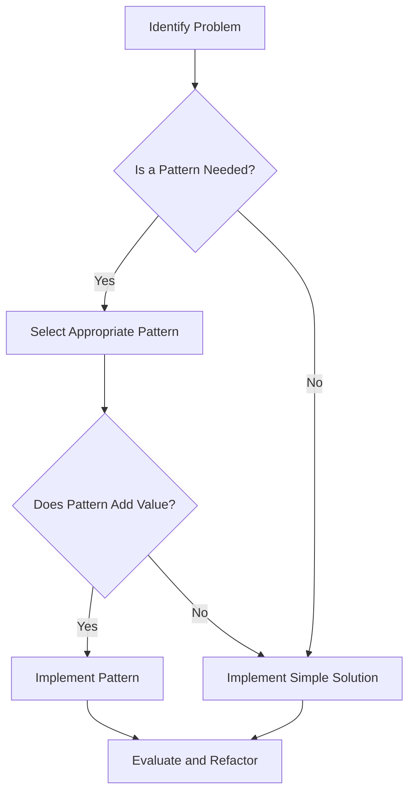

## 17.9 Balancing Theory and Practice

In the realm of software development, design patterns serve as a foundational toolset for solving recurring problems. However, the key to mastering these patterns lies not only in understanding their theoretical underpinnings but also in knowing how to apply them pragmatically to real-world scenarios. This section delves into the art of balancing theory and practice, ensuring that design patterns are used effectively to address actual challenges without falling into the trap of over-engineering.

### Pragmatic Application of Patterns

#### Knowing When to Apply or Skip a Pattern

Design patterns are not a one-size-fits-all solution. The decision to apply a pattern should be driven by the specific needs of the problem at hand. Here are some guidelines to help determine when a pattern is appropriate:

- **Assess the Problem Domain**: Before jumping into pattern selection, thoroughly understand the problem you are trying to solve. Patterns should address specific issues such as flexibility, scalability, or maintainability.
  
- **Evaluate Complexity vs. Benefit**: Consider the complexity that a pattern introduces against the benefits it provides. If a simple solution suffices, avoid unnecessary complexity.

- **Prototype and Iterate**: Start with a simple implementation and iterate. If a pattern becomes necessary as the solution evolves, integrate it at that point.

- **Consider Future Requirements**: While it's important not to over-engineer, consider potential future requirements that might make a pattern beneficial.

#### Focusing on Solving the Problem at Hand

The ultimate goal of using design patterns is to solve problems effectively. Here are some strategies to maintain focus:

- **Define Clear Objectives**: Clearly define what you aim to achieve with your solution. This will guide your pattern selection and implementation.

- **Prioritize Readability and Maintainability**: Ensure that the code remains readable and maintainable. Patterns should enhance, not hinder, these aspects.

- **Leverage C# Features**: Utilize C# language features that complement design patterns, such as LINQ for data manipulation or async/await for concurrency.

- **Integrate with Existing Architecture**: Ensure that the pattern integrates seamlessly with the existing architecture and design principles of your application.

### Avoiding Pattern Addiction

#### Not Forcing Patterns Where They Aren't Needed

Pattern addiction occurs when developers feel compelled to use patterns even when they aren't necessary. To avoid this:

- **Recognize Over-Engineering**: Be vigilant about over-engineering solutions. Patterns should simplify, not complicate, the design.

- **Stay Flexible**: Be open to changing your approach if a pattern doesn't fit well with the problem.

- **Educate and Collaborate**: Foster a team culture that values practical solutions over theoretical purity. Encourage discussions about when and why to use patterns.

#### Keeping Solutions Straightforward

Simplicity is key to effective software design. Here are some tips to keep solutions straightforward:

- **Adopt the KISS Principle**: Keep It Simple, Stupid (KISS) is a guiding principle that encourages simplicity in design.

- **Refactor Regularly**: Regularly refactor code to remove unnecessary complexity and ensure that patterns are still serving their intended purpose.

- **Document Decisions**: Document the rationale behind pattern choices to provide context for future developers.

- **Focus on Core Functionality**: Ensure that the core functionality of the application is not overshadowed by the complexity of patterns.

### Code Examples

Let's explore some code examples to illustrate the pragmatic application of design patterns in C#.

#### Example: Singleton Pattern

The Singleton pattern is often used to ensure a class has only one instance. However, it's crucial to apply it only when necessary.

```csharp
public class ConfigurationManager
{
    private static ConfigurationManager _instance;
    private static readonly object _lock = new object();

    private ConfigurationManager() { }

    public static ConfigurationManager Instance
    {
        get
        {
            lock (_lock)
            {
                if (_instance == null)
                {
                    _instance = new ConfigurationManager();
                }
                return _instance;
            }
        }
    }

    public string GetConfiguration(string key)
    {
        // Retrieve configuration value
        return "value";
    }
}
```

**Key Points:**
- **Thread Safety**: The use of a lock ensures thread safety when creating the instance.
- **Lazy Initialization**: The instance is created only when needed.

**Try It Yourself**: Modify the `ConfigurationManager` to include a method that updates configuration values and observe how the Singleton pattern maintains a consistent state across the application.

#### Example: Strategy Pattern

The Strategy pattern is useful for defining a family of algorithms and making them interchangeable.

```csharp
public interface ICompressionStrategy
{
    void Compress(string filePath);
}

public class ZipCompressionStrategy : ICompressionStrategy
{
    public void Compress(string filePath)
    {
        Console.WriteLine("Compressing using ZIP strategy");
    }
}

public class RarCompressionStrategy : ICompressionStrategy
{
    public void Compress(string filePath)
    {
        Console.WriteLine("Compressing using RAR strategy");
    }
}

public class CompressionContext
{
    private ICompressionStrategy _strategy;

    public void SetStrategy(ICompressionStrategy strategy)
    {
        _strategy = strategy;
    }

    public void CompressFile(string filePath)
    {
        _strategy.Compress(filePath);
    }
}
```

**Key Points:**
- **Interchangeability**: Strategies can be changed at runtime.
- **Open/Closed Principle**: New strategies can be added without modifying existing code.

**Try It Yourself**: Implement a new compression strategy, such as `GzipCompressionStrategy`, and integrate it into the `CompressionContext`.

### Visualizing Pattern Application

To better understand the application of design patterns, let's visualize the decision-making process using a flowchart.



**Diagram Description**: This flowchart illustrates the decision-making process for applying design patterns. It emphasizes evaluating the necessity and value of a pattern before implementation.

### References and Links

For further reading on design patterns and their application, consider the following resources:

- [Design Patterns: Elements of Reusable Object-Oriented Software](https://www.amazon.com/Design-Patterns-Elements-Reusable-Object-Oriented/dp/0201633612) by Erich Gamma, Richard Helm, Ralph Johnson, and John Vlissides.
- [Refactoring: Improving the Design of Existing Code](https://www.amazon.com/Refactoring-Improving-Design-Existing-Code/dp/0134757599) by Martin Fowler.
- [C# Programming Guide](https://docs.microsoft.com/en-us/dotnet/csharp/programming-guide/) on Microsoft Docs.

### Knowledge Check

To reinforce your understanding, consider the following questions:

- What are the key factors to consider when deciding whether to apply a design pattern?
- How can you avoid over-engineering solutions with design patterns?
- What are the benefits of maintaining simplicity in software design?

### Embrace the Journey

Remember, mastering design patterns is a journey. As you continue to apply these patterns in real-world scenarios, you'll gain a deeper understanding of their nuances and benefits. Keep experimenting, stay curious, and enjoy the process of creating elegant and effective software solutions.

### Quiz Time!



### When should you consider applying a design pattern?

- [x] When it addresses a specific problem in your application
- [ ] When you want to make your code more complex
- [ ] When you are unsure of how to solve a problem
- [ ] When you want to use as many patterns as possible

> **Explanation:** Design patterns should be applied when they address specific problems and add value to the solution.

### What is a key benefit of the Strategy pattern?

- [x] It allows algorithms to be interchangeable
- [ ] It ensures a class has only one instance
- [ ] It simplifies complex code
- [ ] It makes code less readable

> **Explanation:** The Strategy pattern allows different algorithms to be interchangeable, promoting flexibility and adherence to the Open/Closed Principle.

### How can you avoid pattern addiction?

- [x] By recognizing when a pattern is unnecessary
- [ ] By using as many patterns as possible
- [ ] By avoiding patterns altogether
- [ ] By implementing patterns without consideration

> **Explanation:** Avoiding pattern addiction involves recognizing when a pattern is unnecessary and focusing on practical solutions.

### What principle encourages simplicity in design?

- [x] KISS (Keep It Simple, Stupid)
- [ ] DRY (Don't Repeat Yourself)
- [ ] YAGNI (You Aren't Gonna Need It)
- [ ] SOLID

> **Explanation:** The KISS principle encourages simplicity in design, ensuring that solutions remain straightforward and maintainable.

### What should you do if a pattern doesn't fit well with the problem?

- [x] Stay flexible and consider changing your approach
- [ ] Force the pattern to fit
- [ ] Abandon the project
- [ ] Ignore the issue

> **Explanation:** If a pattern doesn't fit well, it's important to stay flexible and consider alternative approaches that better address the problem.

### Why is it important to document pattern choices?

- [x] To provide context for future developers
- [ ] To make the code more complex
- [ ] To confuse other developers
- [ ] To avoid using the pattern again

> **Explanation:** Documenting pattern choices provides context and rationale for future developers, aiding in understanding and maintenance.

### How can you ensure that a pattern integrates well with existing architecture?

- [x] By ensuring it aligns with design principles
- [ ] By forcing it into the architecture
- [ ] By ignoring existing architecture
- [ ] By using it without consideration

> **Explanation:** Ensuring that a pattern aligns with existing design principles and architecture is crucial for seamless integration.

### What is the primary goal of using design patterns?

- [x] To solve problems effectively
- [ ] To make code more complex
- [ ] To use as many patterns as possible
- [ ] To confuse other developers

> **Explanation:** The primary goal of using design patterns is to solve problems effectively, enhancing the design and functionality of the application.

### What should you consider when selecting a design pattern?

- [x] The specific needs of the problem
- [ ] The number of patterns you can use
- [ ] The complexity of the pattern
- [ ] The popularity of the pattern

> **Explanation:** When selecting a design pattern, consider the specific needs of the problem and how the pattern addresses those needs.

### True or False: Design patterns should always be used in software development.

- [ ] True
- [x] False

> **Explanation:** Design patterns should be used when they add value and address specific problems, not as a mandatory requirement in all situations.


